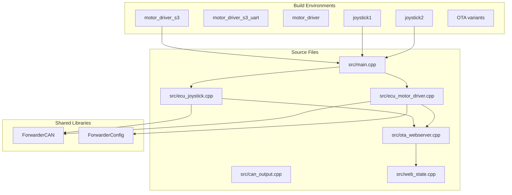
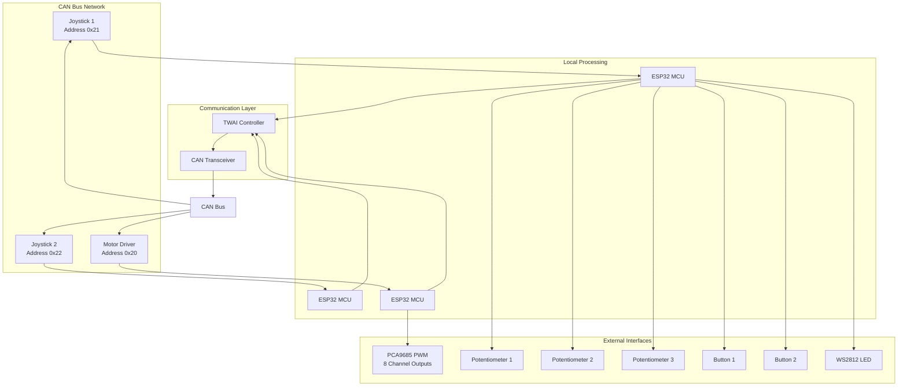
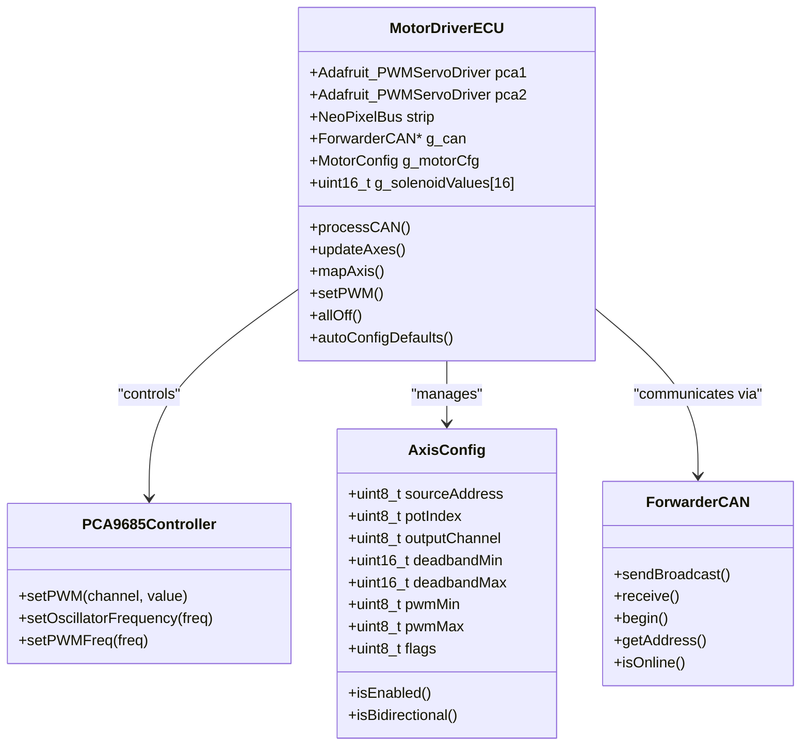
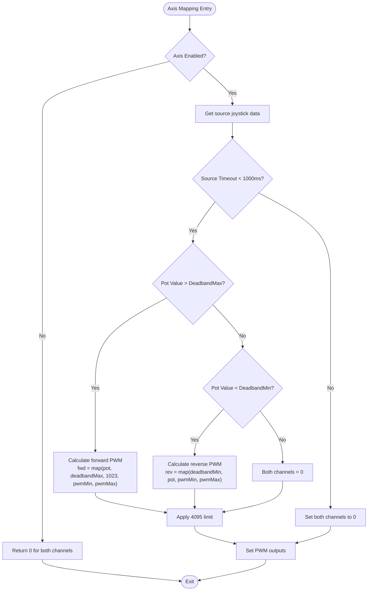
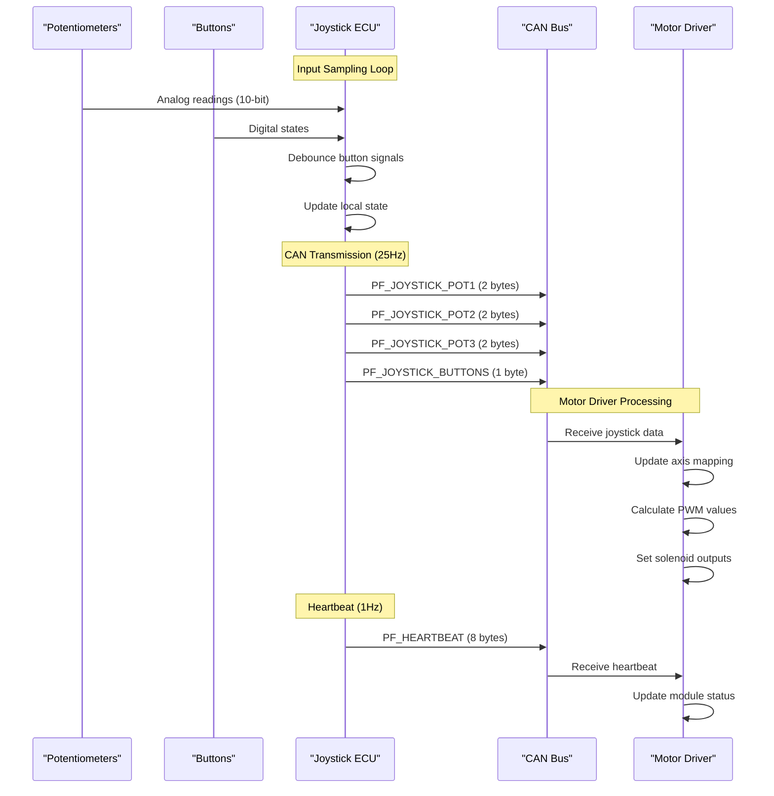
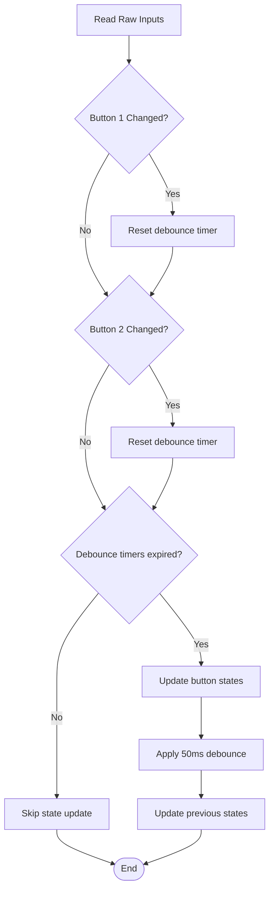
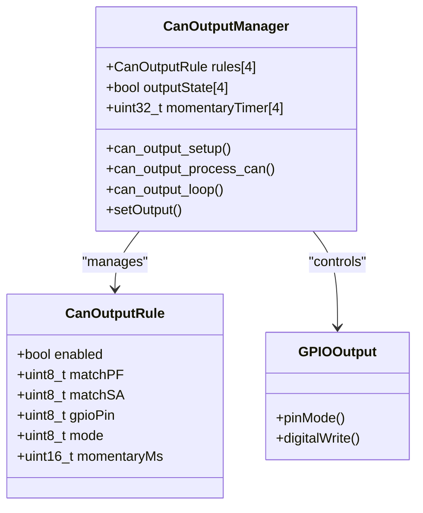
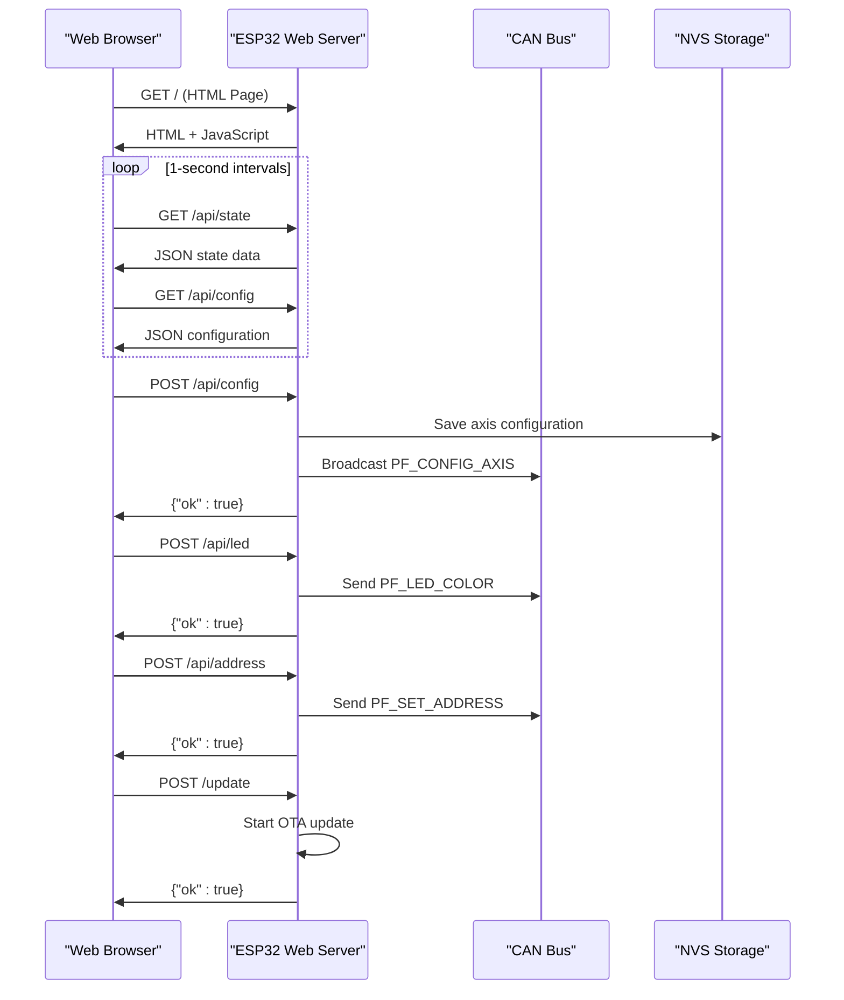
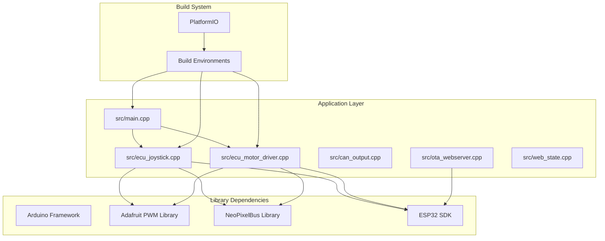

# Hardware Validation System

<cite>
**Referenced Files in This Document**
- [README.md](file://README.md)
- [platformio.ini](file://platformio.ini)
- [main.cpp](file://src/main.cpp)
- [ecu_joystick.cpp](file://src/ecu_joystick.cpp)
- [ecu_motor_driver.cpp](file://src/ecu_motor_driver.cpp)
- [can_output.cpp](file://src/can_output.cpp)
- [ota_webserver.cpp](file://src/ota_webserver.cpp)
- [web_state.cpp](file://src/web_state.cpp)
- [ecu_joystick.h](file://src/ecu_joystick.h)
- [ecu_motor_driver.h](file://src/ecu_motor_driver.h)
- [can_output.h](file://src/can_output.h)
- [ota_webserver.h](file://src/ota_webserver.h)
- [web_state.h](file://src/web_state.h)
</cite>

## Table of Contents
1. [Introduction](#introduction)
2. [Project Structure](#project-structure)
3. [Core Components](#core-components)
4. [Architecture Overview](#architecture-overview)
5. [Detailed Component Analysis](#detailed-component-analysis)
6. [Dependency Analysis](#dependency-analysis)
7. [Performance Considerations](#performance-considerations)
8. [Troubleshooting Guide](#troubleshooting-guide)
9. [Conclusion](#conclusion)

## Introduction
This Hardware Validation System is an ESP32-based CAN bus control solution designed for agricultural forwarder (logging machine) hydraulic valve blocks. It replaces a factory controller with an open-source, J1939-like addressing system operating at 250 kbps over a 250 kbps CAN bus. The system consists of three ECUs:
- Motor Driver ECU (address 0x20): Controls 8 solenoids via PCA9685 PWM driver
- Joystick 1 ECU (address 0x21): Reads 3 potentiometers and 2 buttons, publishes on CAN
- Joystick 2 ECU (address 0x22): Reads 3 potentiometers and 2 buttons, publishes on CAN

The system implements safety features including address claiming, solenoid timeout protection, bus-off recovery, and heartbeat monitoring. It supports Over-The-Air (OTA) updates via Wi-Fi access point and web interface.

## Project Structure
The project follows a modular architecture with separate ECUs and shared libraries:

**Diagram sources**
- [platformio.ini:1-142](file://platformio.ini#L1-L142)
- [main.cpp:1-39](file://src/main.cpp#L1-L39)

**Section sources**
- [platformio.ini:1-142](file://platformio.ini#L1-L142)
- [README.md:175-189](file://README.md#L175-L189)

## Core Components
The system comprises several key components working together to validate hardware functionality:

### CAN Protocol Implementation
The system implements J1939-like addressing with 29-bit extended IDs. The ID structure includes priority bits, PDU format, PDU specific fields, and source/destination addresses. This provides deterministic message routing and collision avoidance.

### ECU Types and Responsibilities
- **Motor Driver ECU**: Manages solenoid outputs through PCA9685 PWM controllers, implements axis mapping with deadband and PWM scaling, and provides safety timeout protection
- **Joystick ECUs**: Read analog inputs from potentiometers and digital inputs from buttons, implement debouncing, and broadcast status information
- **OTA Web Server**: Provides web-based configuration interface with real-time monitoring and remote updates

### Hardware Validation Features
The system includes comprehensive hardware validation through:
- GPIO loopback testing for CAN transceiver verification
- PCA9685 detection and initialization
- LED status indication with different patterns for various states
- Real-time bus monitoring and error reporting

**Section sources**
- [README.md:31-125](file://README.md#L31-L125)
- [ecu_motor_driver.cpp:378-394](file://src/ecu_motor_driver.cpp#L378-L394)
- [ecu_joystick.cpp:89-116](file://src/ecu_joystick.cpp#L89-L116)

## Architecture Overview
The system architecture implements a distributed ECU network with centralized monitoring and control capabilities:

**Diagram sources**
- [README.md:8-14](file://README.md#L8-L14)
- [platformio.ini:18-87](file://platformio.ini#L18-L87)

## Detailed Component Analysis

### Motor Driver ECU Analysis
The Motor Driver ECU serves as the central controller for hydraulic solenoid actuation:

**Diagram sources**
- [ecu_motor_driver.cpp:39-67](file://src/ecu_motor_driver.cpp#L39-L67)
- [ecu_motor_driver.cpp:104-139](file://src/ecu_motor_driver.cpp#L104-L139)

#### Axis Mapping Algorithm
The Motor Driver implements sophisticated axis mapping with deadband handling and bidirectional support:

**Diagram sources**
- [ecu_motor_driver.cpp:104-139](file://src/ecu_motor_driver.cpp#L104-L139)
- [ecu_motor_driver.cpp:143-184](file://src/ecu_motor_driver.cpp#L143-L184)

**Section sources**
- [ecu_motor_driver.cpp:1-479](file://src/ecu_motor_driver.cpp#L1-L479)

### Joystick ECU Analysis
The Joystick ECUs handle input acquisition and status reporting:

**Diagram sources**
- [ecu_joystick.cpp:74-87](file://src/ecu_joystick.cpp#L74-L87)
- [ecu_joystick.cpp:227-278](file://src/ecu_joystick.cpp#L227-L278)

#### Input Processing and Debouncing
The Joystick ECU implements robust input processing with debouncing to handle mechanical switch bounce:

**Diagram sources**
- [ecu_joystick.cpp:79-86](file://src/ecu_joystick.cpp#L79-L86)

**Section sources**
- [ecu_joystick.cpp:1-281](file://src/ecu_joystick.cpp#L1-L281)

### CAN Output Control Analysis
The CAN Output module provides flexible GPIO control based on CAN message patterns:

**Diagram sources**
- [can_output.cpp:3-6](file://src/can_output.cpp#L3-L6)
- [can_output.cpp:29-48](file://src/can_output.cpp#L29-L48)

**Section sources**
- [can_output.cpp:1-66](file://src/can_output.cpp#L1-L66)

### OTA Web Server Analysis
The OTA Web Server provides comprehensive remote management capabilities:

**Diagram sources**
- [ota_webserver.cpp:600-659](file://src/ota_webserver.cpp#L600-L659)
- [ota_webserver.cpp:787-800](file://src/ota_webserver.cpp#L787-L800)

**Section sources**
- [ota_webserver.cpp:1-933](file://src/ota_webserver.cpp#L1-L933)

## Dependency Analysis
The system exhibits clean separation of concerns with well-defined dependencies:

**Diagram sources**
- [platformio.ini:9-11](file://platformio.ini#L9-L11)
- [platformio.ini:18-142](file://platformio.ini#L18-L142)

**Section sources**
- [platformio.ini:1-142](file://platformio.ini#L1-L142)

## Performance Considerations
The system implements several performance optimizations:

### Timing Constraints
- **Joystick sampling rate**: 25 Hz (40ms interval) for potentiometer and button data
- **Heartbeat transmission**: 1 Hz for status reporting
- **Safety timeout**: 500 ms for solenoid shutdown
- **Bus status reporting**: 5 seconds for diagnostic information

### Memory Management
- Static allocation for CAN buffers and state arrays
- Fixed-size configuration structures to minimize heap usage
- Chunked JSON responses to avoid large memory allocations

### CAN Bus Optimization
- Priority-based message scheduling with J1939-like addressing
- Efficient message filtering and processing
- Built-in TWAI status monitoring for bus health

## Troubleshooting Guide

### Common Issues and Solutions

#### CAN Bus Communication Problems
**Symptoms**: No joystick data reaching motor driver, frequent bus errors
**Diagnosis Steps**:
1. Check CAN termination resistors (220Ω) at both ends of the bus
2. Verify CAN transceiver power (ME2107_EN pin)
3. Monitor TWAI status counters for bus errors
4. Test GPIO loopback for physical layer verification

**Section sources**
- [ecu_motor_driver.cpp:378-394](file://src/ecu_motor_driver.cpp#L378-L394)
- [ecu_motor_driver.cpp:450-455](file://src/ecu_motor_driver.cpp#L450-L455)

#### LED Status Indicators
The system uses different LED patterns to indicate various states:
- **Solid green**: System ready and operational
- **Flashing red**: CAN initialization failure
- **Pulsing amber**: Bus offline condition
- **Blinking white**: Identify/blink command active
- **Fast blinking**: Active joystick data reception

**Section sources**
- [ecu_joystick.cpp:107-113](file://src/ecu_joystick.cpp#L107-L113)
- [ecu_motor_driver.cpp:200-212](file://src/ecu_motor_driver.cpp#L200-L212)

#### Address Claiming Conflicts
**Symptoms**: Multiple ECUs claiming the same address
**Resolution**:
1. Use address claiming procedure during startup
2. Manually set forced addresses via web interface
3. Verify address uniqueness on the bus
4. Check for stuck bus conditions requiring restart

**Section sources**
- [ecu_joystick.cpp:154-164](file://src/ecu_joystick.cpp#L154-L164)
- [ecu_motor_driver.cpp:268-278](file://src/ecu_motor_driver.cpp#L268-L278)

#### OTA Update Failures
**Symptoms**: OTA updates failing or timing out
**Troubleshooting**:
1. Ensure proper Wi-Fi credentials and network connectivity
2. Verify sufficient free flash space
3. Check firmware compatibility with target ECU
4. Monitor update progress through web interface

**Section sources**
- [ota_webserver.cpp:567-586](file://src/ota_webserver.cpp#L567-L586)

## Conclusion
The Hardware Validation System provides a robust, open-source solution for agricultural vehicle hydraulic control systems. Its modular architecture, comprehensive safety features, and remote management capabilities make it suitable for industrial applications. The system's J1939-like addressing scheme ensures reliable communication, while the OTA capabilities facilitate maintenance and updates without physical access to field equipment.

Key strengths include:
- Deterministic CAN message routing with priority-based scheduling
- Comprehensive hardware validation through GPIO and bus testing
- Flexible configuration management with persistent storage
- Remote monitoring and control via web interface
- Safety mechanisms including timeout protection and bus-off recovery

The system's design allows for easy expansion and customization for different vehicle configurations while maintaining reliability and safety standards essential for agricultural machinery operation.