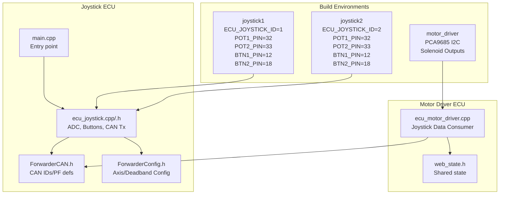
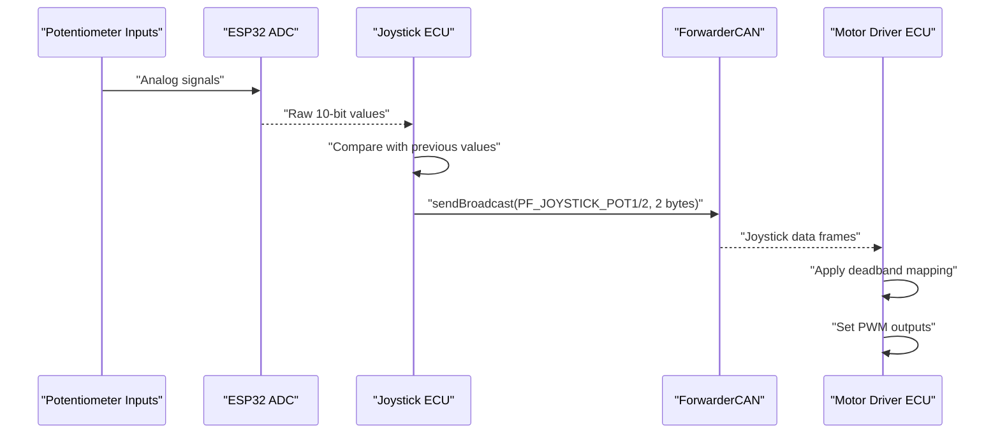
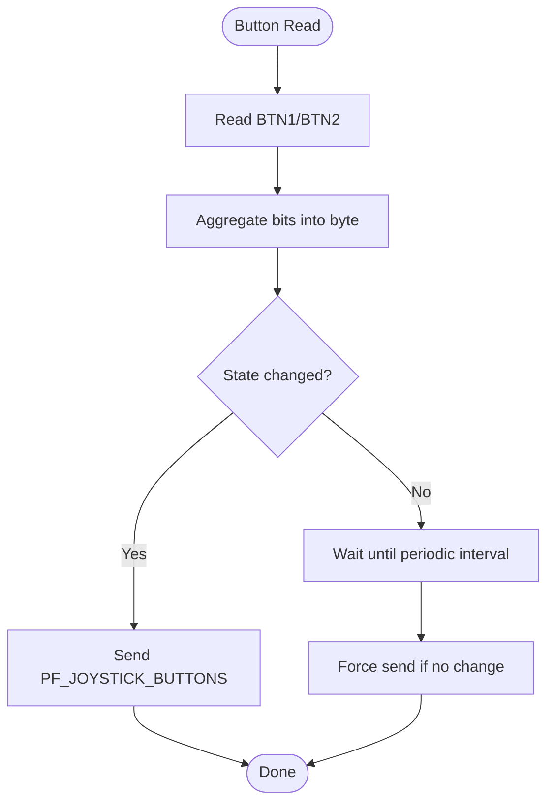
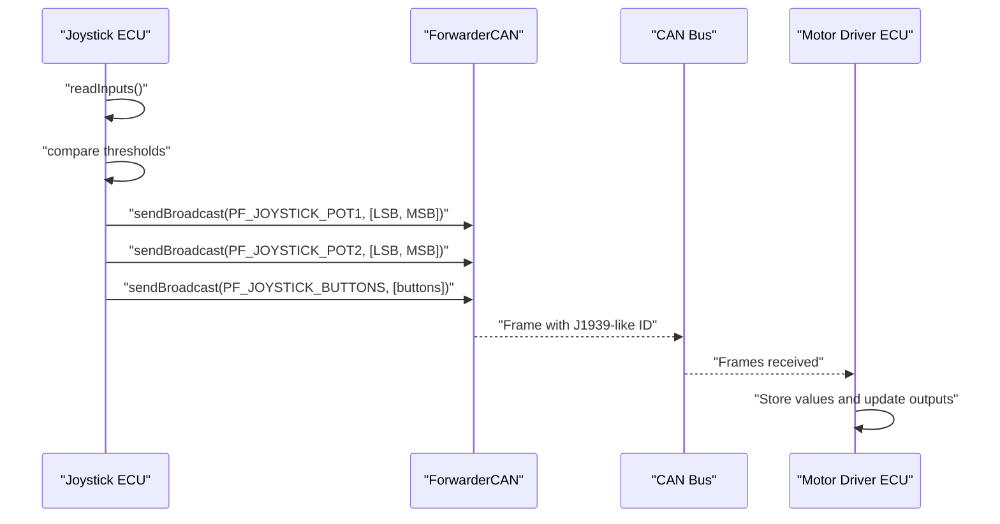
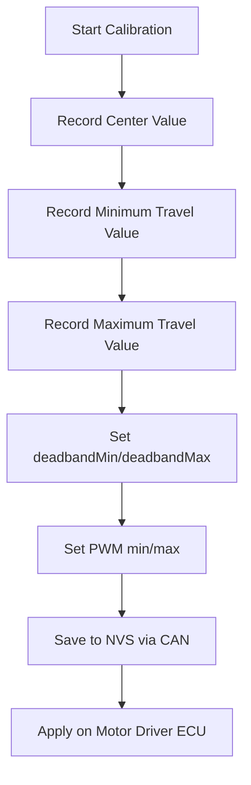
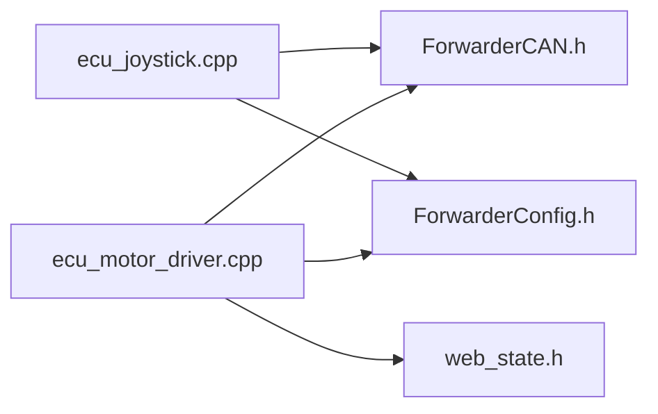

# Joystick Input Circuits

<cite>
**Referenced Files in This Document**
- [README.md](file://README.md)
- [platformio.ini](file://platformio.ini)
- [src/main.cpp](file://src/main.cpp)
- [src/ecu_joystick.h](file://src/ecu_joystick.h)
- [src/ecu_joystick.cpp](file://src/ecu_joystick.cpp)
- [lib/ForwarderCAN/ForwarderCAN.h](file://lib/ForwarderCAN/ForwarderCAN.h)
- [lib/ForwarderConfig/ForwarderConfig.h](file://lib/ForwarderConfig/ForwarderConfig.h)
- [src/ecu_motor_driver.cpp](file://src/ecu_motor_driver.cpp)
- [src/web_state.h](file://src/web_state.h)
</cite>

## Table of Contents
1. [Introduction](#introduction)
2. [Project Structure](#project-structure)
3. [Core Components](#core-components)
4. [Architecture Overview](#architecture-overview)
5. [Detailed Component Analysis](#detailed-component-analysis)
6. [Dependency Analysis](#dependency-analysis)
7. [Performance Considerations](#performance-considerations)
8. [Troubleshooting Guide](#troubleshooting-guide)
9. [Conclusion](#conclusion)
10. [Appendices](#appendices)

## Introduction
This document describes the joystick input circuitry and firmware implementation for the Forwarder CAN Controller. It covers:
- Three potentiometer channels and two button inputs per controller
- ESP32 ADC configuration for 10-bit resolution and reference attenuation
- Signal conditioning considerations for potentiometer inputs
- Button configuration with active-low logic and internal pull-ups
- Software debouncing behavior and thresholds
- Calibration procedures for zero positions and travel limits
- CAN message format for joystick data, including 10-bit value encoding and button state reporting
- Input sensitivity and deadband configuration for operator feedback

## Project Structure
The joystick ECU is implemented as a PlatformIO environment with build flags selecting the ECU type. The joystick firmware reads analog inputs, processes button states, and broadcasts CAN messages. The motor driver ECU consumes joystick data to drive solenoids.

**Diagram sources**
- [platformio.ini:31-61](file://platformio.ini#L31-L61)
- [src/main.cpp:11-17](file://src/main.cpp#L11-L17)
- [src/ecu_joystick.cpp:159-192](file://src/ecu_joystick.cpp#L159-L192)
- [lib/ForwarderCAN/ForwarderCAN.h:38-50](file://lib/ForwarderCAN/ForwarderCAN.h#L38-L50)
- [lib/ForwarderConfig/ForwarderConfig.h:41-57](file://lib/ForwarderConfig/ForwarderConfig.h#L41-L57)
- [src/ecu_motor_driver.cpp:184-275](file://src/ecu_motor_driver.cpp#L184-L275)
- [src/web_state.h:10-22](file://src/web_state.h#L10-L22)

**Section sources**
- [platformio.ini:1-80](file://platformio.ini#L1-L80)
- [src/main.cpp:1-32](file://src/main.cpp#L1-L32)

## Core Components
- Joystick ECU: Reads two analog channels (POT1, POT2) and two buttons (BTN1, BTN2), configures ADC and CAN, and sends periodic joystick data.
- CAN Library: Defines J1939-like IDs and PF values for joystick messages.
- Motor Driver ECU: Receives joystick data, applies deadband mapping, and controls solenoids.
- Configuration Manager: Stores axis mapping and deadband settings for operator feedback tuning.

Key responsibilities:
- ADC sampling and threshold-based transmission
- Button state aggregation and broadcast
- CAN framing and broadcasting
- Deadband mapping and PWM scaling

**Section sources**
- [src/ecu_joystick.cpp:63-68](file://src/ecu_joystick.cpp#L63-L68)
- [src/ecu_joystick.cpp:106-112](file://src/ecu_joystick.cpp#L106-L112)
- [lib/ForwarderCAN/ForwarderCAN.h:38-50](file://lib/ForwarderCAN/ForwarderCAN.h#L38-L50)
- [src/ecu_motor_driver.cpp:101-135](file://src/ecu_motor_driver.cpp#L101-L135)
- [lib/ForwarderConfig/ForwarderConfig.h:41-57](file://lib/ForwarderConfig/ForwarderConfig.h#L41-L57)

## Architecture Overview
The joystick ECU samples analog inputs and broadcasts them as 10-bit values over CAN. The motor driver ECU receives these values, applies deadband mapping, and sets PWM outputs to solenoids. The system uses J1939-like 29-bit IDs with PF values dedicated to joystick data.

**Diagram sources**
- [src/ecu_joystick.cpp:63-68](file://src/ecu_joystick.cpp#L63-L68)
- [src/ecu_joystick.cpp:194-236](file://src/ecu_joystick.cpp#L194-L236)
- [lib/ForwarderCAN/ForwarderCAN.h:38-50](file://lib/ForwarderCAN/ForwarderCAN.h#L38-L50)
- [src/ecu_motor_driver.cpp:191-204](file://src/ecu_motor_driver.cpp#L191-L204)

## Detailed Component Analysis

### Analog Input Configuration (ESP32 ADC)
- Resolution: 10-bit ADC configured via the MCU’s ADC resolution setting.
- Attenuation: 11 dB attenuation selected to extend input range suitable for typical 3.3 V supply and potentiometer rails.
- Sampling pins: POT1_PIN and POT2_PIN are sampled in the joystick ECU.
- Reference considerations: The ADC reference is internally referenced to 3.3 V; the 10-bit range maps to approximately 0–1023 counts.

Operational behavior:
- ADC resolution and attenuation are set during initialization.
- Values are read synchronously in the loop and compared against previous values with a small hysteresis threshold before transmission.

**Section sources**
- [src/ecu_joystick.cpp:163-164](file://src/ecu_joystick.cpp#L163-L164)
- [src/ecu_joystick.cpp:63-68](file://src/ecu_joystick.cpp#L63-L68)
- [README.md:57-61](file://README.md#L57-L61)

### Signal Conditioning for Potentiometer Inputs
- Filtering and noise reduction: The joystick firmware does not implement explicit analog filtering. Noise immunity relies on:
  - MCU ADC characteristics and sampling timing
  - Mechanical stability of potentiometer wafers
  - CAN-level filtering and error handling in the receiving ECU
- Threshold-based transmission: Values are sent only when they change beyond a small threshold, reducing CAN traffic and mitigating transient noise effects.

**Section sources**
- [src/ecu_joystick.cpp:200-209](file://src/ecu_joystick.cpp#L200-L209)
- [src/ecu_joystick.cpp:218-225](file://src/ecu_joystick.cpp#L218-L225)

### Button Input Configuration (Active-Low Logic)
- Pins: BTN1_PIN and BTN2_PIN are configured as inputs with internal pull-up resistors.
- Logic: Buttons are active-low; the firmware reads the pin state and treats LOW as pressed.
- Debounce: Software debounce is implemented via a threshold-based approach:
  - Button state is aggregated into a single byte.
  - A change in the aggregated state triggers immediate transmission.
  - A periodic broadcast occurs at intervals to ensure liveness even when idle.

**Diagram sources**
- [src/ecu_joystick.cpp:66-67](file://src/ecu_joystick.cpp#L66-L67)
- [src/ecu_joystick.cpp:210-217](file://src/ecu_joystick.cpp#L210-L217)
- [src/ecu_joystick.cpp:220-224](file://src/ecu_joystick.cpp#L220-L224)

**Section sources**
- [src/ecu_joystick.cpp:165-166](file://src/ecu_joystick.cpp#L165-L166)
- [src/ecu_joystick.cpp:66-67](file://src/ecu_joystick.cpp#L66-L67)
- [src/ecu_joystick.cpp:210-217](file://src/ecu_joystick.cpp#L210-L217)

### CAN Message Transmission Format for Joystick Data
- Potentiometer values:
  - PF values: PF_JOYSTICK_POT1, PF_JOYSTICK_POT2
  - Payload: Two bytes, LSB then MSB of the 10-bit value
- Button states:
  - PF value: PF_JOYSTICK_BUTTONS
  - Payload: One byte with bit 0 for BTN1 and bit 1 for BTN2
- Broadcasting:
  - Messages are broadcast to all ECUs (destination address 0xFF)
  - Priority and rate limiting are handled by the CAN library and loop scheduling

**Diagram sources**
- [src/ecu_joystick.cpp:99-112](file://src/ecu_joystick.cpp#L99-L112)
- [lib/ForwarderCAN/ForwarderCAN.h:38-50](file://lib/ForwarderCAN/ForwarderCAN.h#L38-L50)
- [src/ecu_motor_driver.cpp:191-204](file://src/ecu_motor_driver.cpp#L191-L204)

**Section sources**
- [src/ecu_joystick.cpp:99-112](file://src/ecu_joystick.cpp#L99-L112)
- [lib/ForwarderCAN/ForwarderCAN.h:38-50](file://lib/ForwarderCAN/ForwarderCAN.h#L38-L50)
- [README.md:35-41](file://README.md#L35-L41)

### Calibration Procedures
Calibration is performed at the receiving end (motor driver ECU) using deadband configuration:
- Zero position: Set deadbandMin equal to the expected center value for the axis.
- Travel limits: Set deadbandMax to define the end-stop region.
- Bidirectional operation: Enable bidirectional mapping to reverse direction below deadbandMin.
- PWM scaling: Configure min/max PWM values to adjust actuator response.

The configuration is stored persistently and transported over CAN for distribution.

**Diagram sources**
- [lib/ForwarderConfig/ForwarderConfig.h:41-57](file://lib/ForwarderConfig/ForwarderConfig.h#L41-L57)
- [src/ecu_motor_driver.cpp:101-135](file://src/ecu_motor_driver.cpp#L101-L135)

**Section sources**
- [lib/ForwarderConfig/ForwarderConfig.h:41-57](file://lib/ForwarderConfig/ForwarderConfig.h#L41-L57)
- [src/ecu_motor_driver.cpp:101-135](file://src/ecu_motor_driver.cpp#L101-L135)

### Input Sensitivity Adjustment and Deadband Configuration
- Deadband concept: A region around the center where no output is produced to reduce chatter.
- Bidirectional mapping: Allows reverse operation below deadbandMin and forward above deadbandMax.
- PWM scaling: Converts mapped values to 12-bit PWM for PCA9685 outputs.
- Tuning: Adjust deadbandMin/deadbandMax and PWM min/max to optimize operator feel.

**Section sources**
- [lib/ForwarderConfig/ForwarderConfig.h:41-57](file://lib/ForwarderConfig/ForwarderConfig.h#L41-L57)
- [src/ecu_motor_driver.cpp:101-135](file://src/ecu_motor_driver.cpp#L101-L135)

## Dependency Analysis
- Joystick ECU depends on:
  - ForwarderCAN for CAN messaging
  - ForwarderConfig for persistent configuration storage
  - ESP32 ADC and GPIO APIs for input sampling
- Motor Driver ECU depends on:
  - ForwarderCAN for receiving joystick data
  - ForwarderConfig for axis mapping and deadband settings
  - PCA9685 drivers for PWM output control

**Diagram sources**
- [src/ecu_joystick.cpp:5-9](file://src/ecu_joystick.cpp#L5-L9)
- [lib/ForwarderCAN/ForwarderCAN.h:38-50](file://lib/ForwarderCAN/ForwarderCAN.h#L38-L50)
- [lib/ForwarderConfig/ForwarderConfig.h:64-91](file://lib/ForwarderConfig/ForwarderConfig.h#L64-L91)
- [src/ecu_motor_driver.cpp:8-12](file://src/ecu_motor_driver.cpp#L8-L12)
- [src/web_state.h:10-17](file://src/web_state.h#L10-L17)

**Section sources**
- [src/ecu_joystick.cpp:5-9](file://src/ecu_joystick.cpp#L5-L9)
- [src/ecu_motor_driver.cpp:8-12](file://src/ecu_motor_driver.cpp#L8-L12)

## Performance Considerations
- ADC sampling and CAN throughput:
  - 10-bit resolution provides sufficient granularity for joystick control.
  - Threshold-based transmission reduces CAN load.
  - Periodic re-broadcast ensures liveness without continuous traffic.
- Button debounce:
  - Software threshold prevents spurious transmissions.
- Deadband mapping:
  - Reduces noise sensitivity near center.
  - Bidirectional mapping improves operator feedback.

[No sources needed since this section provides general guidance]

## Troubleshooting Guide
- No CAN messages received:
  - Verify CAN wiring and transceiver enable pin configuration.
  - Confirm address claiming succeeded and ECU is online.
- Buttons not responding:
  - Ensure pins are configured with internal pull-up and wired to ground when pressed.
  - Check for short circuits or floating inputs.
- Potentiometer jitter:
  - Increase the threshold delta for potentiometer values.
  - Verify power supply stability and minimal cable length.
- Deadband not behaving as expected:
  - Recalibrate deadbandMin/deadbandMax on the motor driver ECU.
  - Confirm bidirectional flag is set appropriately.

**Section sources**
- [src/ecu_joystick.cpp:167-170](file://src/ecu_joystick.cpp#L167-L170)
- [src/ecu_joystick.cpp:165-166](file://src/ecu_joystick.cpp#L165-L166)
- [src/ecu_motor_driver.cpp:101-135](file://src/ecu_motor_driver.cpp#L101-L135)

## Conclusion
The joystick ECU provides reliable analog and digital input handling for a dual-controller system. It leverages ESP32 ADC capabilities, efficient CAN messaging, and configurable deadband mapping on the motor driver side to deliver precise operator feedback. Proper calibration and attention to hardware connections ensure robust operation in field conditions.

[No sources needed since this section summarizes without analyzing specific files]

## Appendices

### Pin Assignments and Build Flags
- Joystick 1 environment defines POT1_PIN, POT2_PIN, BTN1_PIN, BTN2_PIN, and CAN pin assignments.
- Joystick 2 environment mirrors the same pins and logic for a second controller.

**Section sources**
- [platformio.ini:31-61](file://platformio.ini#L31-L61)
- [README.md:57-61](file://README.md#L57-L61)

### CAN ID Layout and PF Definitions
- J1939-like 29-bit ID with Priority, DP, PF, PS/DA, and SA.
- PF values for joystick: PF_JOYSTICK_POT1, PF_JOYSTICK_POT2, PF_JOYSTICK_BUTTONS.

**Section sources**
- [lib/ForwarderCAN/ForwarderCAN.h:22-34](file://lib/ForwarderCAN/ForwarderCAN.h#L22-L34)
- [lib/ForwarderCAN/ForwarderCAN.h:38-50](file://lib/ForwarderCAN/ForwarderCAN.h#L38-L50)