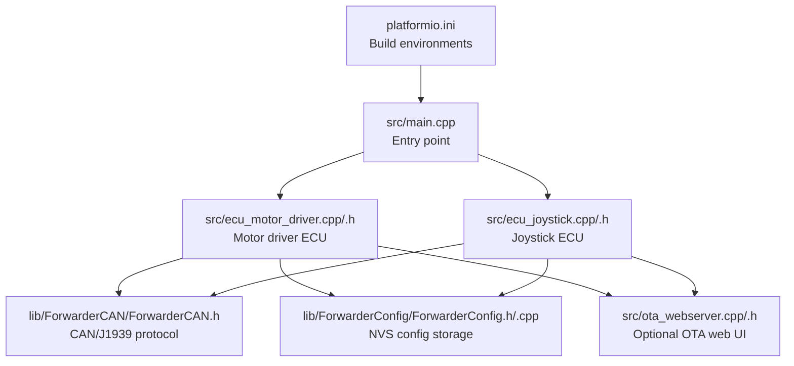
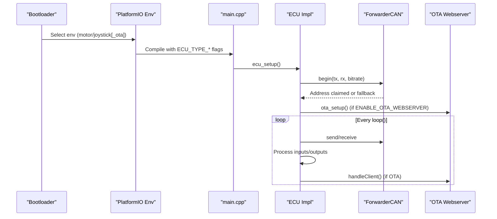
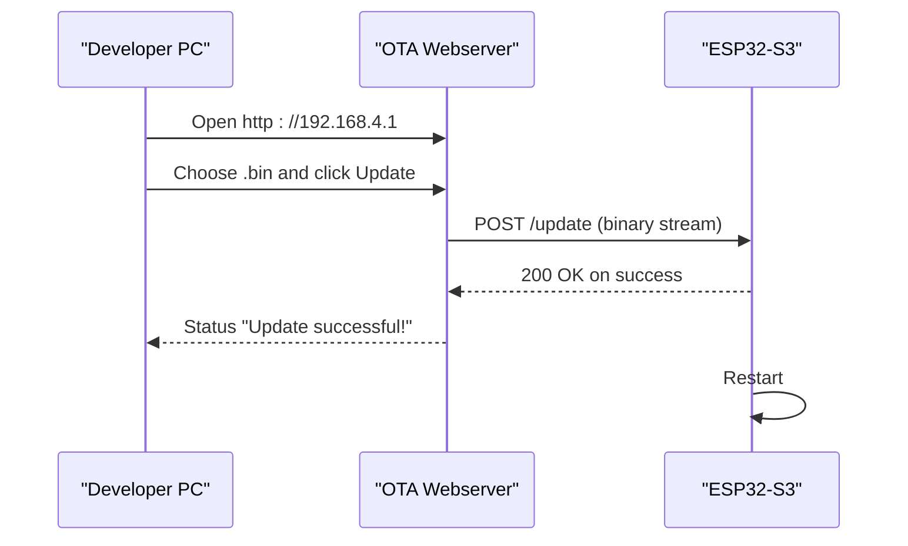
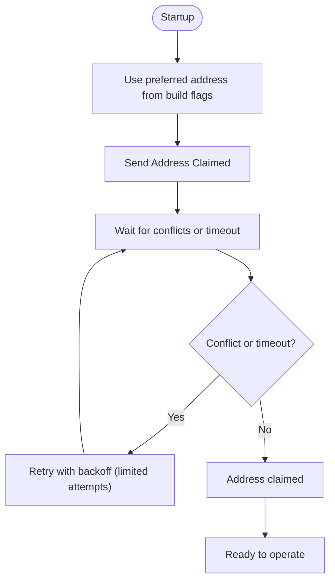
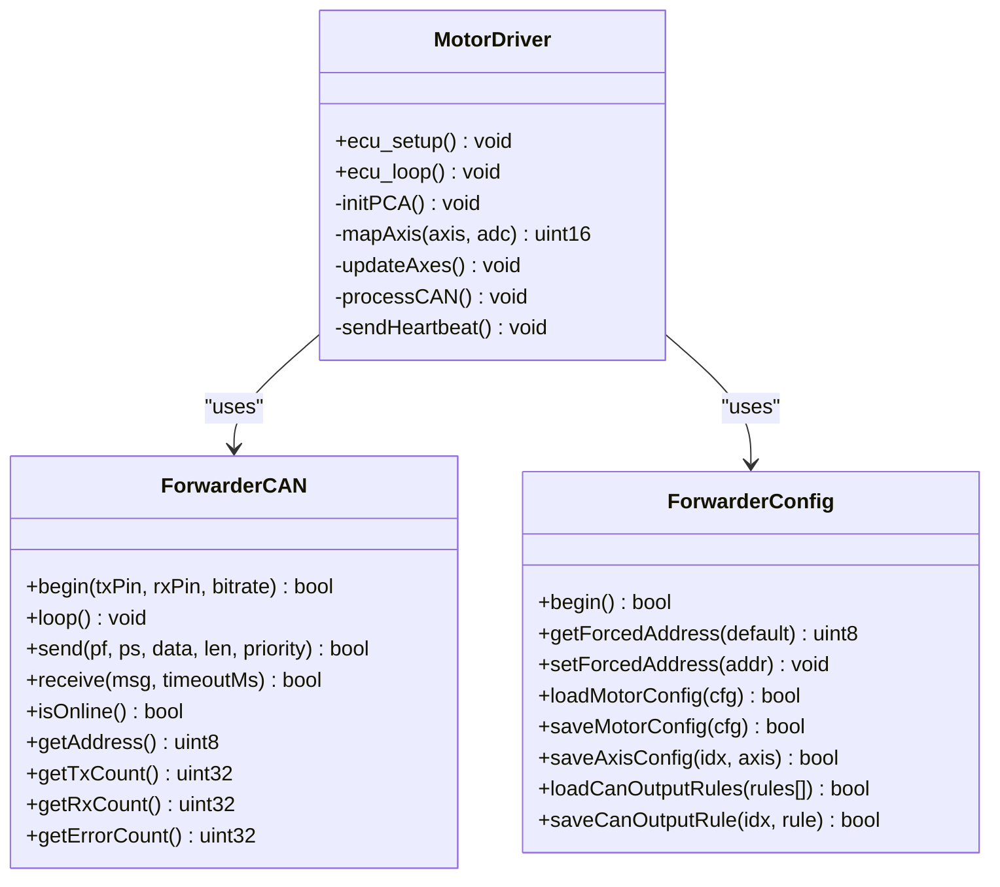
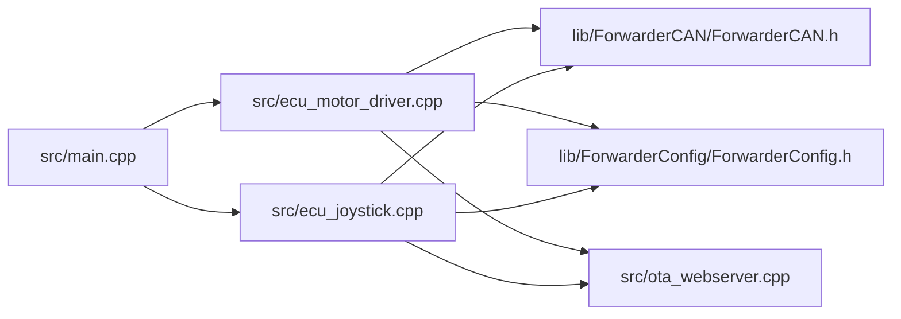

# MCU Board Setup

<cite>
**Referenced Files in This Document**
- [README.md](file://README.md)
- [platformio.ini](file://platformio.ini)
- [src/main.cpp](file://src/main.cpp)
- [src/ecu_motor_driver.h](file://src/ecu_motor_driver.h)
- [src/ecu_motor_driver.cpp](file://src/ecu_motor_driver.cpp)
- [src/ecu_joystick.h](file://src/ecu_joystick.h)
- [src/ecu_joystick.cpp](file://src/ecu_joystick.cpp)
- [src/ota_webserver.h](file://src/ota_webserver.h)
- [src/ota_webserver.cpp](file://src/ota_webserver.cpp)
- [src/can_output.h](file://src/can_output.h)
- [lib/ForwarderCAN/ForwarderCAN.h](file://lib/ForwarderCAN/ForwarderCAN.h)
- [lib/ForwarderConfig/ForwarderConfig.h](file://lib/ForwarderConfig/ForwarderConfig.h)
- [lib/ForwarderConfig/ForwarderConfig.cpp](file://lib/ForwarderConfig/ForwarderConfig.cpp)
</cite>

## Table of Contents
1. [Introduction](#introduction)
2. [Project Structure](#project-structure)
3. [Core Components](#core-components)
4. [Architecture Overview](#architecture-overview)
5. [Detailed Component Analysis](#detailed-component-analysis)
6. [Dependency Analysis](#dependency-analysis)
7. [Performance Considerations](#performance-considerations)
8. [Troubleshooting Guide](#troubleshooting-guide)
9. [Conclusion](#conclusion)
10. [Appendices](#appendices)

## Introduction
This document explains how to set up and configure the ESP32-S3 LilyGO T-CAN board for the Forwarder CAN Controller project. It covers board specifications, default pin assignments, PlatformIO build environments, flashing procedures for different ECU variants, OTA update capabilities, and practical considerations for power and current handling.

## Project Structure
The project is organized around a shared CAN protocol library, ECU-specific logic, and optional OTA web server. PlatformIO manages build environments and compile-time selection of ECU type.

**Diagram sources**
- [platformio.ini:1-80](file://platformio.ini#L1-L80)
- [src/main.cpp:1-32](file://src/main.cpp#L1-L32)
- [src/ecu_motor_driver.cpp:1-355](file://src/ecu_motor_driver.cpp#L1-L355)
- [src/ecu_joystick.cpp:1-239](file://src/ecu_joystick.cpp#L1-L239)
- [lib/ForwarderCAN/ForwarderCAN.h:1-120](file://lib/ForwarderCAN/ForwarderCAN.h#L1-L120)
- [lib/ForwarderConfig/ForwarderConfig.h:35-76](file://lib/ForwarderConfig/ForwarderConfig.h#L35-L76)
- [lib/ForwarderConfig/ForwarderConfig.cpp:54-154](file://lib/ForwarderConfig/ForwarderConfig.cpp#L54-L154)
- [src/ota_webserver.cpp:1-809](file://src/ota_webserver.cpp#L1-L809)

**Section sources**
- [README.md:112-126](file://README.md#L112-L126)
- [platformio.ini:1-80](file://platformio.ini#L1-L80)

## Core Components
- ESP32-S3 LilyGO T-CAN board with integrated CAN transceiver
- CAN bus running at 250 kbps using J1939-like 29-bit extended IDs
- Three ECUs on the bus: Motor Driver (0x20), Joystick 1 (0x21), Joystick 2 (0x22)
- Optional onboard WS2812 status LED
- PCA9685 I2C PWM controller for motor driver variant
- OTA Wi-Fi AP and web UI for firmware updates

**Section sources**
- [README.md:3-21](file://README.md#L3-L21)
- [README.md:48-62](file://README.md#L48-L62)
- [lib/ForwarderCAN/ForwarderCAN.h:22-51](file://lib/ForwarderCAN/ForwarderCAN.h#L22-L51)

## Architecture Overview
The system boots into either the motor driver or joystick ECU depending on the selected PlatformIO environment. Both variants use the shared CAN library for address claiming, message framing, and bus statistics. The motor driver controls solenoids via PCA9685 and exposes configuration via CAN and NVS. The joystick variant reads analog pots/buttons and broadcasts joystick data. An optional OTA web server enables wireless firmware updates.

**Diagram sources**
- [platformio.ini:17-80](file://platformio.ini#L17-L80)
- [src/main.cpp:11-31](file://src/main.cpp#L11-L31)
- [src/ecu_motor_driver.cpp:290-352](file://src/ecu_motor_driver.cpp#L290-L352)
- [src/ecu_joystick.cpp:159-236](file://src/ecu_joystick.cpp#L159-L236)
- [src/ota_webserver.cpp:766-791](file://src/ota_webserver.cpp#L766-L791)
- [lib/ForwarderCAN/ForwarderCAN.h:66-91](file://lib/ForwarderCAN/ForwarderCAN.h#L66-L91)

## Detailed Component Analysis

### Board Specifications and Pin Assignments
- Built-in CAN transceiver on GPIO pins:
  - TX: 5 (motor driver), 27 (joystick)
  - RX: 4 (motor driver), 26 (joystick)
  - SE (standby enable): 23 (joystick only)
- Onboard WS2812 status LED:
  - GPIO 48 (motor driver)
  - GPIO 18 (joystick)
- I2C for PCA9685 (motor driver only):
  - SDA: 21
  - SCL: 22
  - Addresses: 0x40 primary, 0x41 secondary (detected automatically)
- Joystick inputs:
  - Pot 1: 6
  - Pot 2: 7
  - Pot 3: 15
  - Button 1: 16 (active low, internal pullup)
  - Button 2: 17 (active low, internal pullup)

Notes:
- The motor driver environment defines default pins for CAN, WS2812, and PCA9685 I2C.
- The joystick environments define separate CAN pins and enable transceiver SE, plus joystick pins.

**Section sources**
- [README.md:48-62](file://README.md#L48-L62)
- [platformio.ini:17-62](file://platformio.ini#L17-L62)
- [src/ecu_motor_driver.cpp:14-37](file://src/ecu_motor_driver.cpp#L14-L37)
- [src/ecu_joystick.cpp:11-37](file://src/ecu_joystick.cpp#L11-L37)

### PlatformIO Build Environments and ECU Selection
- Default environments: motor_driver, joystick1, joystick2
- Build flags select ECU type and preferred address:
  - motor_driver: ECU_TYPE_MOTOR_DRIVER, preferred address 0x20, onboard WS2812 on 48, PCA9685 I2C on 21/22
  - joystick1: ECU_TYPE_JOYSTICK, preferred address 0x21, joystick pins 6/7/15, buttons 16/17, CAN SE on 23
  - joystick2: ECU_TYPE_JOYSTICK, preferred address 0x22, joystick pins 6/7/15, buttons 16/17, CAN SE on 23
- OTA-enabled environments inherit from base environments and add ENABLE_OTA_WEBSERVER

Build and flash commands are provided in the repository’s README.

**Section sources**
- [platformio.ini:1-80](file://platformio.ini#L1-L80)
- [README.md:63-82](file://README.md#L63-L82)

### Step-by-Step Flashing Procedures
- Install PlatformIO (VS Code extension or CLI)
- Build and flash each variant:
  - Motor driver: pio run -e motor_driver --target upload
  - Joystick 1: pio run -e joystick1 --target upload
  - Joystick 2: pio run -e joystick2 --target upload
- OTA builds:
  - motor_driver_ota: pio run -e motor_driver_ota --target upload
  - joystick1_ota: pio run -e joystick1_ota --target upload
  - joystick2_ota: pio run -e joystick2_ota --target upload
- To produce a .bin for OTA uploads, build without upload and locate the firmware image in the build directory

**Section sources**
- [README.md:63-103](file://README.md#L63-L103)

### OTA Build Process and Wireless Updates
- OTA environments enable a soft AP and web server:
  - AP SSID: forwarder-motor, forwarder-joy1, or forwarder-joy2 (derived from ECU type and address)
  - Password: 12345678 (as configured)
  - Web UI reachable at 192.168.4.1 or hostname.local
- Firmware upload:
  - Select a .bin file and click “Update Firmware”
  - Progress bar indicates upload status
  - Device reboots after successful update
- Hostname and mDNS:
  - OTA sets up mDNS service for http/tcp on port 80

**Diagram sources**
- [src/ota_webserver.cpp:705-733](file://src/ota_webserver.cpp#L705-L733)
- [src/ota_webserver.cpp:766-791](file://src/ota_webserver.cpp#L766-L791)

**Section sources**
- [README.md:84-103](file://README.md#L84-L103)
- [src/ota_webserver.cpp:766-791](file://src/ota_webserver.cpp#L766-L791)

### CAN Protocol and Addressing
- 29-bit extended IDs with J1939-like layout:
  - Priority(3) | DP(1) | PF(8) | PS/DA(8) | SA(8)
- Address claiming:
  - Preferred address per environment
  - Startup arbitration with retries and fallback to special addresses if needed
- Messages:
  - Joystick pots and buttons broadcast by joysticks
  - Solenoid commands and LED color set by motor driver
  - Heartbeat/status broadcast by all ECUs

**Diagram sources**
- [lib/ForwarderCAN/ForwarderCAN.h:74-112](file://lib/ForwarderCAN/ForwarderCAN.h#L74-L112)
- [lib/ForwarderCAN/ForwarderCAN.h:99-101](file://lib/ForwarderCAN/ForwarderCAN.h#L99-L101)

**Section sources**
- [README.md:22-46](file://README.md#L22-L46)
- [lib/ForwarderCAN/ForwarderCAN.h:22-51](file://lib/ForwarderCAN/ForwarderCAN.h#L22-L51)
- [lib/ForwarderCAN/ForwarderCAN.h:66-91](file://lib/ForwarderCAN/ForwarderCAN.h#L66-L91)

### Motor Driver ECU Details
- PCA9685 initialization and dual-controller detection
- 10-bit ADC mapped to 12-bit PWM scale for solenoids
- Deadband and PWM range configurable via CAN messages and stored in NVS
- Safety timeout disables solenoids if no command received within the configured interval
- Onboard LED indicates online/offline/idle/identify states

**Diagram sources**
- [src/ecu_motor_driver.cpp:290-352](file://src/ecu_motor_driver.cpp#L290-L352)
- [lib/ForwarderCAN/ForwarderCAN.h:66-97](file://lib/ForwarderCAN/ForwarderCAN.h#L66-L97)
- [lib/ForwarderConfig/ForwarderConfig.h:64-76](file://lib/ForwarderConfig/ForwarderConfig.h#L64-L76)

**Section sources**
- [src/ecu_motor_driver.cpp:85-99](file://src/ecu_motor_driver.cpp#L85-L99)
- [src/ecu_motor_driver.cpp:101-135](file://src/ecu_motor_driver.cpp#L101-L135)
- [src/ecu_motor_driver.cpp:332-337](file://src/ecu_motor_driver.cpp#L332-L337)
- [lib/ForwarderConfig/ForwarderConfig.cpp:76-104](file://lib/ForwarderConfig/ForwarderConfig.cpp#L76-L104)

### Joystick ECU Details
- Reads two pots and two buttons with internal pullups
- Sends joystick data and buttons periodically and on change
- LED indicates online/offline/identify states
- CAN SE pin enabled for external transceiver if present

**Section sources**
- [src/ecu_joystick.cpp:63-68](file://src/ecu_joystick.cpp#L63-L68)
- [src/ecu_joystick.cpp:159-192](file://src/ecu_joystick.cpp#L159-L192)
- [src/ecu_joystick.cpp:194-236](file://src/ecu_joystick.cpp#L194-L236)

### Configuration Management (NVS)
- Stores forced address and motor mapping rules
- AxisConfig and CanOutputRule serialized to 8-byte buffers
- Defaults loaded if no NVS entries exist

**Section sources**
- [lib/ForwarderConfig/ForwarderConfig.h:41-57](file://lib/ForwarderConfig/ForwarderConfig.h#L41-L57)
- [lib/ForwarderConfig/ForwarderConfig.h:64-76](file://lib/ForwarderConfig/ForwarderConfig.h#L64-L76)
- [lib/ForwarderConfig/ForwarderConfig.cpp:6-26](file://lib/ForwarderConfig/ForwarderConfig.cpp#L6-L26)
- [lib/ForwarderConfig/ForwarderConfig.cpp:129-154](file://lib/ForwarderConfig/ForwarderConfig.cpp#L129-L154)

## Dependency Analysis
The ECU implementations depend on the shared CAN library and configuration manager. The OTA web server depends on WiFi, WebServer, Update, and mDNS libraries.

**Diagram sources**
- [src/main.cpp:11-17](file://src/main.cpp#L11-L17)
- [src/ecu_motor_driver.cpp:1-12](file://src/ecu_motor_driver.cpp#L1-L12)
- [src/ecu_joystick.cpp:1-9](file://src/ecu_joystick.cpp#L1-L9)
- [lib/ForwarderCAN/ForwarderCAN.h:1-120](file://lib/ForwarderCAN/ForwarderCAN.h#L1-L120)
- [lib/ForwarderConfig/ForwarderConfig.h:35-76](file://lib/ForwarderConfig/ForwarderConfig.h#L35-L76)
- [src/ota_webserver.cpp:1-11](file://src/ota_webserver.cpp#L1-L11)

**Section sources**
- [platformio.ini:9-11](file://platformio.ini#L9-L11)
- [src/ota_webserver.cpp:5-11](file://src/ota_webserver.cpp#L5-L11)

## Performance Considerations
- CAN bitrate is set to 250 kbps via build flags
- Watchdog timeout and heartbeat intervals are defined in build flags
- Motor driver safety timeout prevents stale solenoid commands
- Joystick sends data on change and periodically to maintain bus presence

[No sources needed since this section provides general guidance]

## Troubleshooting Guide
- Address claiming fails:
  - Verify no conflicting devices on the bus
  - Check preferred address flags and forced address NVS setting
- CAN init fails:
  - Confirm correct TX/RX pin assignments for the selected ECU
  - Ensure external transceiver SE pin is configured for joystick variant
- OTA upload fails:
  - Confirm device is connected to the correct AP and hostname
  - Check browser console for upload progress and error messages
- PCA9685 not detected:
  - Verify I2C wiring and pull-ups
  - Confirm address jumpers for primary/secondary controller

**Section sources**
- [lib/ForwarderCAN/ForwarderCAN.h:74-112](file://lib/ForwarderCAN/ForwarderCAN.h#L74-L112)
- [src/ecu_motor_driver.cpp:305-316](file://src/ecu_motor_driver.cpp#L305-L316)
- [src/ota_webserver.cpp:705-733](file://src/ota_webserver.cpp#L705-L733)
- [src/ecu_motor_driver.cpp:85-99](file://src/ecu_motor_driver.cpp#L85-L99)

## Conclusion
The Forwarder CAN Controller provides a flexible, open-source solution for controlling forwarder hydraulics via a CAN bus. The ESP32-S3 LilyGO T-CAN board integrates a built-in CAN transceiver and supports both motor driver and joystick ECUs. PlatformIO environments simplify building and flashing, while OTA capabilities streamline firmware updates. Proper pin assignment, address claiming, and configuration management ensure reliable operation across variants.

## Appendices

### Power Supply and Current Considerations
- The ESP32-S3 operates on 3.3 V logic levels.
- Ensure adequate current capacity for the onboard CAN transceiver and any external peripherals.
- When using the onboard WS2812 LED, limit brightness to avoid excessive current draw.
- For motor driver applications, ensure the PCA9685 and solenoid loads are within recommended current limits; use external power supplies where necessary.

[No sources needed since this section provides general guidance]