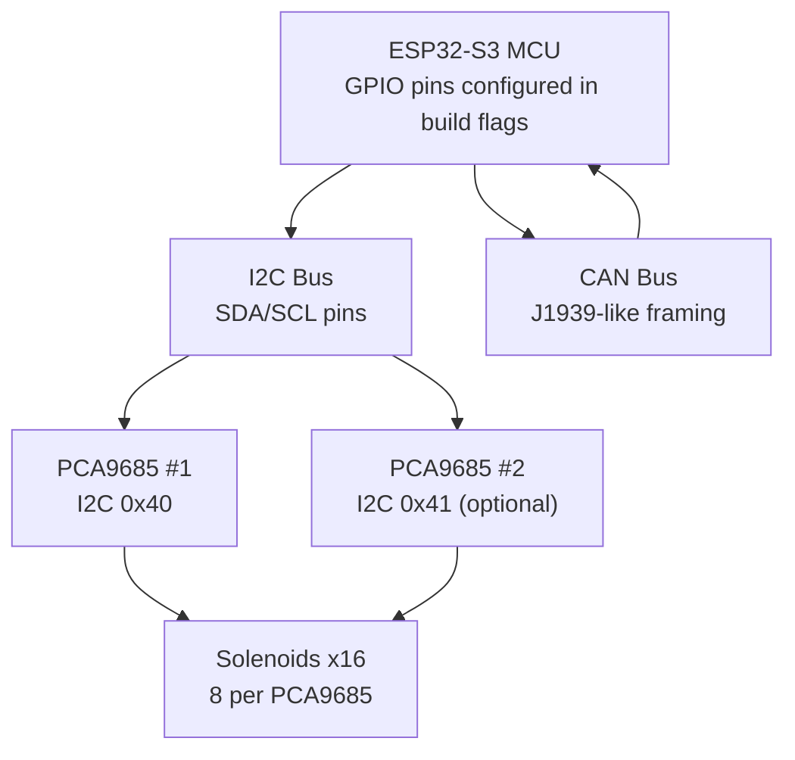
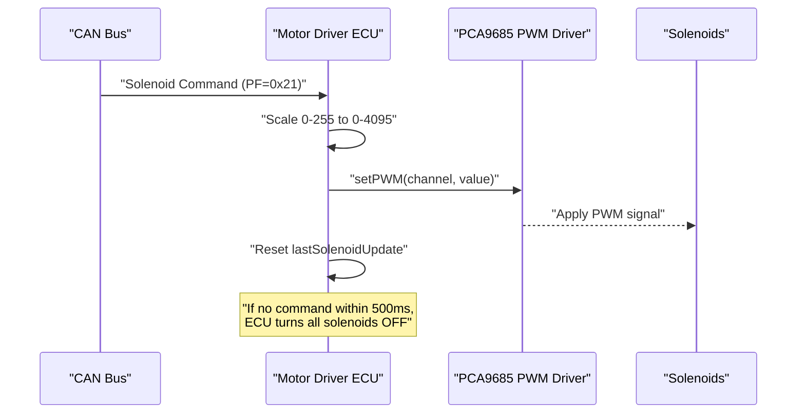
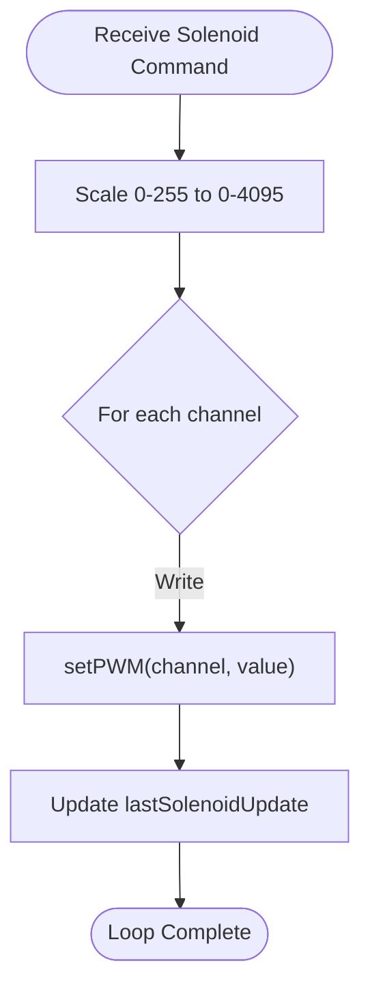
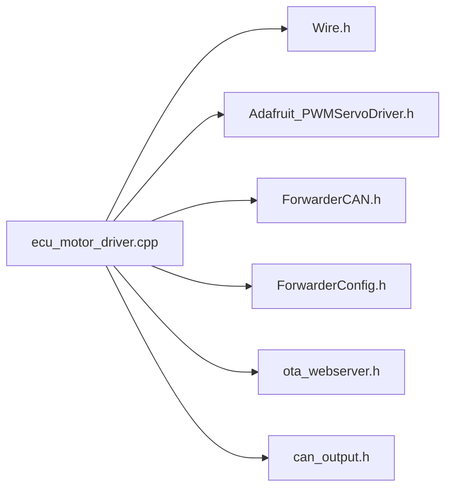

# PWM Driver System

<cite>
**Referenced Files in This Document**
- [README.md](file://README.md)
- [platformio.ini](file://platformio.ini)
- [main.cpp](file://src/main.cpp)
- [ecu_motor_driver.h](file://src/ecu_motor_driver.h)
- [ecu_motor_driver.cpp](file://src/ecu_motor_driver.cpp)
- [ForwarderConfig.h](file://lib/ForwarderConfig/ForwarderConfig.h)
- [ForwarderConfig.cpp](file://lib/ForwarderConfig/ForwarderConfig.cpp)
- [can_output.h](file://src/can_output.h)
- [can_output.cpp](file://src/can_output.cpp)
- [ota_webserver.cpp](file://src/ota_webserver.cpp)
</cite>

## Table of Contents
1. [Introduction](#introduction)
2. [Project Structure](#project-structure)
3. [Core Components](#core-components)
4. [Architecture Overview](#architecture-overview)
5. [Detailed Component Analysis](#detailed-component-analysis)
6. [Dependency Analysis](#dependency-analysis)
7. [Performance Considerations](#performance-considerations)
8. [Troubleshooting Guide](#troubleshooting-guide)
9. [Conclusion](#conclusion)
10. [Appendices](#appendices)

## Introduction
This document describes the PCA9685 PWM driver system used to control agricultural solenoids in an ESP32-based CAN ECU. It covers I2C communication setup, 8-channel MOSFET output configuration, PWM scaling from 0–255 to 12-bit resolution, solenoid actuation timing, safety timeout behavior, and practical wiring considerations. The system targets reliable, deterministic control of up to 16 solenoids via a dual PCA9685 configuration.

## Project Structure
The motor driver ECU is implemented as part of a larger CAN-based control system. The motor driver component initializes PCA9685 drivers, receives solenoid commands over CAN, applies mapping and deadband logic, and enforces a safety timeout to shut off outputs.

**Diagram sources**
- [platformio.ini:26-29](file://platformio.ini#L26-L29)
- [ecu_motor_driver.cpp:39-41](file://src/ecu_motor_driver.cpp#L39-L41)
- [ecu_motor_driver.cpp:85-99](file://src/ecu_motor_driver.cpp#L85-L99)

**Section sources**
- [README.md:105-111](file://README.md#L105-L111)
- [platformio.ini:17-29](file://platformio.ini#L17-L29)
- [main.cpp:11-17](file://src/main.cpp#L11-L17)

## Core Components
- PCA9685 I2C PWM controllers: Two PCA9685 chips provide 16 channels of 12-bit PWM output for solenoid control.
- I2C configuration: SDA/SCL pins are defined via build flags and initialized at runtime.
- CAN protocol: Receives solenoid commands and broadcasts heartbeat/status.
- Deadband mapping: Joystick-to-solenoid mapping with configurable deadbands and PWM limits.
- Safety timeout: Automatically disables all solenoids after 500 ms of inactivity.

**Section sources**
- [ecu_motor_driver.cpp:39-41](file://src/ecu_motor_driver.cpp#L39-L41)
- [ecu_motor_driver.cpp:85-99](file://src/ecu_motor_driver.cpp#L85-L99)
- [ecu_motor_driver.cpp:101-135](file://src/ecu_motor_driver.cpp#L101-L135)
- [ecu_motor_driver.cpp:332-337](file://src/ecu_motor_driver.cpp#L332-L337)

## Architecture Overview
The motor driver runs on the ESP32 and controls solenoids through PCA9685 PWM outputs. It listens for CAN messages containing solenoid duty cycles (0–255), scales them to 12-bit values, and updates the appropriate PCA9685 channels. A watchdog timer ensures solenoids are turned off after 500 ms without a valid command.

**Diagram sources**
- [ecu_motor_driver.cpp:206-218](file://src/ecu_motor_driver.cpp#L206-L218)
- [ecu_motor_driver.cpp:69-76](file://src/ecu_motor_driver.cpp#L69-L76)
- [ecu_motor_driver.cpp:332-337](file://src/ecu_motor_driver.cpp#L332-L337)

## Detailed Component Analysis

### I2C Communication Setup (ESP32 ↔ PCA9685)
- SDA/SCL pins are defined via build flags and applied at runtime.
- PCA9685 oscillator frequency is set to 25 MHz and PWM frequency to 200 Hz.
- The system probes for a second PCA9685 at address 0x41 and enables dual-PCA operation if present.

Key behaviors:
- Runtime pin assignment via Wire.setPins().
- Initialization sequence sets oscillator frequency and PWM frequency.
- Optional second PCA9685 detection and initialization.

**Section sources**
- [platformio.ini:26-29](file://platformio.ini#L26-L29)
- [ecu_motor_driver.cpp:85-99](file://src/ecu_motor_driver.cpp#L85-L99)

### 8-Channel MOSFET Output Configuration
- Each PCA9685 drives 8 channels; up to two PCA9685s provide 16 channels total.
- PWM resolution is 12 bits (0–4095), derived from 8-bit input scaling.
- Deadband mapping allows precise control around neutral positions for bidirectional operation.

Important constants and scaling:
- 12-bit PWM range: 0–4095.
- Input scaling: value_in_0_255 mapped to 0–4095.
- Deadband thresholds and PWM limits are stored per-axis.

**Section sources**
- [ecu_motor_driver.cpp:69-76](file://src/ecu_motor_driver.cpp#L69-L76)
- [ecu_motor_driver.cpp:101-135](file://src/ecu_motor_driver.cpp#L101-L135)
- [ForwarderConfig.h:41-57](file://lib/ForwarderConfig/ForwarderConfig.h#L41-L57)

### PWM Duty Cycle Scaling and Actuation Timing
- Input: 8-byte payload carrying 8 solenoid values (0–255).
- Scaling: Each byte is scaled to 12-bit using integer arithmetic.
- Update: setPWM(channel, value) writes the 12-bit value to the PCA9685 channel.
- Timing: PCA9685 PWM frequency is 200 Hz; switching occurs at this rate.

**Diagram sources**
- [ecu_motor_driver.cpp:206-218](file://src/ecu_motor_driver.cpp#L206-L218)
- [ecu_motor_driver.cpp:69-76](file://src/ecu_motor_driver.cpp#L69-L76)

**Section sources**
- [ecu_motor_driver.cpp:206-218](file://src/ecu_motor_driver.cpp#L206-L218)
- [ecu_motor_driver.cpp:89-90](file://src/ecu_motor_driver.cpp#L89-L90)

### Safety Timeout Mechanism
- If no solenoid command is received within 500 ms, the system turns off all solenoids and resets the watchdog.
- The timeout is enforced in the main loop and only triggers after the first command has been processed.

Operational details:
- lastSolenoidUpdate tracks the last time a solenoid command was received.
- Timeout threshold is defined via build flag and used in the loop condition.

**Section sources**
- [platformio.ini:29](file://platformio.ini#L29)
- [ecu_motor_driver.cpp:332-337](file://src/ecu_motor_driver.cpp#L332-L337)
- [README.md:108](file://README.md#L108)

### CAN Protocol and Data Flow
- Solenoid commands are sent as a broadcast message with PF=0x21 and payload length ≥ 8.
- The payload carries 8 solenoid values; the driver scales and applies them to the first 8 channels.
- Heartbeat messages broadcast operational status periodically.

**Section sources**
- [README.md:40](file://README.md#L40)
- [ecu_motor_driver.cpp:206-218](file://src/ecu_motor_driver.cpp#L206-L218)
- [ecu_motor_driver.cpp:277-288](file://src/ecu_motor_driver.cpp#L277-L288)

### Deadband Mapping and Axis Configuration
- Each of up to 16 axes can map a joystick pot to a solenoid channel with configurable deadband and PWM limits.
- Bidirectional mode supports forward/reverse regions around a neutral zone.
- Configuration is persisted and transported over CAN in 8-byte records.

**Section sources**
- [ecu_motor_driver.cpp:101-135](file://src/ecu_motor_driver.cpp#L101-L135)
- [ForwarderConfig.h:41-57](file://lib/ForwarderConfig/ForwarderConfig.h#L41-L57)
- [ForwarderConfig.cpp:6-26](file://lib/ForwarderConfig/ForwarderConfig.cpp#L6-L26)

### Web Monitoring and Diagnostics
- The OTA web server exposes live solenoid values and joystick data for diagnostics.
- Live bars show current 12-bit PWM values per channel.

**Section sources**
- [ota_webserver.cpp:297-313](file://src/ota_webserver.cpp#L297-L313)
- [ota_webserver.cpp:540-546](file://src/ota_webserver.cpp#L540-L546)

## Dependency Analysis
The motor driver module depends on:
- Arduino Wire library for I2C communication.
- Adafruit_PWMServoDriver library for PCA9685 control.
- ForwarderCAN for CAN messaging.
- ForwarderConfig for persistent configuration storage.
- Optional OTA web server for remote diagnostics.

**Diagram sources**
- [ecu_motor_driver.cpp:5-12](file://src/ecu_motor_driver.cpp#L5-L12)
- [platformio.ini:10-11](file://platformio.ini#L10-L11)

**Section sources**
- [ecu_motor_driver.cpp:5-12](file://src/ecu_motor_driver.cpp#L5-L12)
- [platformio.ini:10-11](file://platformio.ini#L10-L11)

## Performance Considerations
- PWM frequency: 200 Hz. This is suitable for solenoid applications where audible noise and switching losses are concerns.
- Resolution: 12-bit PWM provides fine granularity for proportional control.
- Deadband mapping reduces chatter near neutral positions.
- Watchdog timeout prevents unintended actuation after communication loss.

[No sources needed since this section provides general guidance]

## Troubleshooting Guide
Common issues and checks:
- PCA9685 not responding:
  - Verify SDA/SCL pin assignments in build flags.
  - Confirm PCA9685 addresses (0x40 and 0x41) and wiring continuity.
- No solenoid response:
  - Ensure CAN messages are received and PF=0x21.
  - Check watchdog timeout resetting outputs after 500 ms.
- Incorrect PWM scaling:
  - Confirm 0–255 input scaling to 0–4095.
  - Review deadband and PWM limits in configuration.

**Section sources**
- [platformio.ini:26-29](file://platformio.ini#L26-L29)
- [ecu_motor_driver.cpp:206-218](file://src/ecu_motor_driver.cpp#L206-L218)
- [ecu_motor_driver.cpp:332-337](file://src/ecu_motor_driver.cpp#L332-L337)

## Conclusion
The PCA9685-based PWM driver provides robust, scalable control for agricultural solenoids. With 12-bit resolution, configurable deadband mapping, and a 500 ms safety timeout, the system balances precision and safety. Proper I2C setup and attention to wiring and load characteristics ensure reliable operation.

[No sources needed since this section summarizes without analyzing specific files]

## Appendices

### Wiring and Safety Considerations
- I2C wiring:
  - SDA and SCL are connected to the PCA9685 per build flags.
  - Pull-up resistors are typically required on SDA/SCL lines.
- Solenoid wiring:
  - Each PCA9685 channel drives one solenoid through a MOSFET switch.
  - Flyback diode protection is essential across each solenoid coil to suppress inductive kickback.
- Power distribution:
  - Separate power supplies for logic (3.3 V) and solenoids are recommended.
  - Ensure adequate current capacity for all solenoids combined.
- Thermal management:
  - Continuous operation generates heat in the PCA9685 and MOSFETs.
  - Consider heatsinking or derating for sustained loads; monitor junction temperature.

[No sources needed since this section provides general guidance]