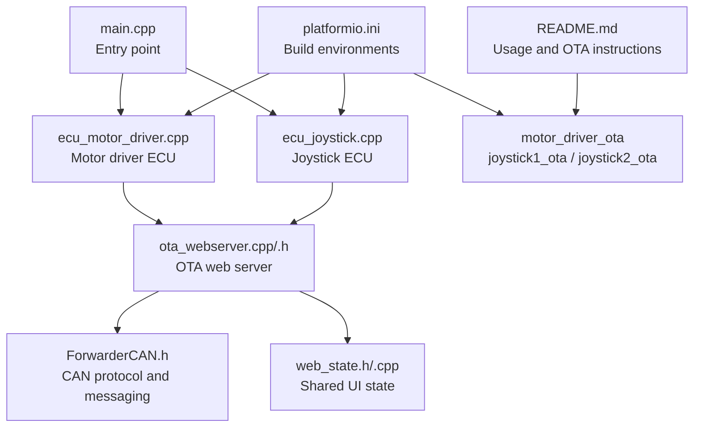
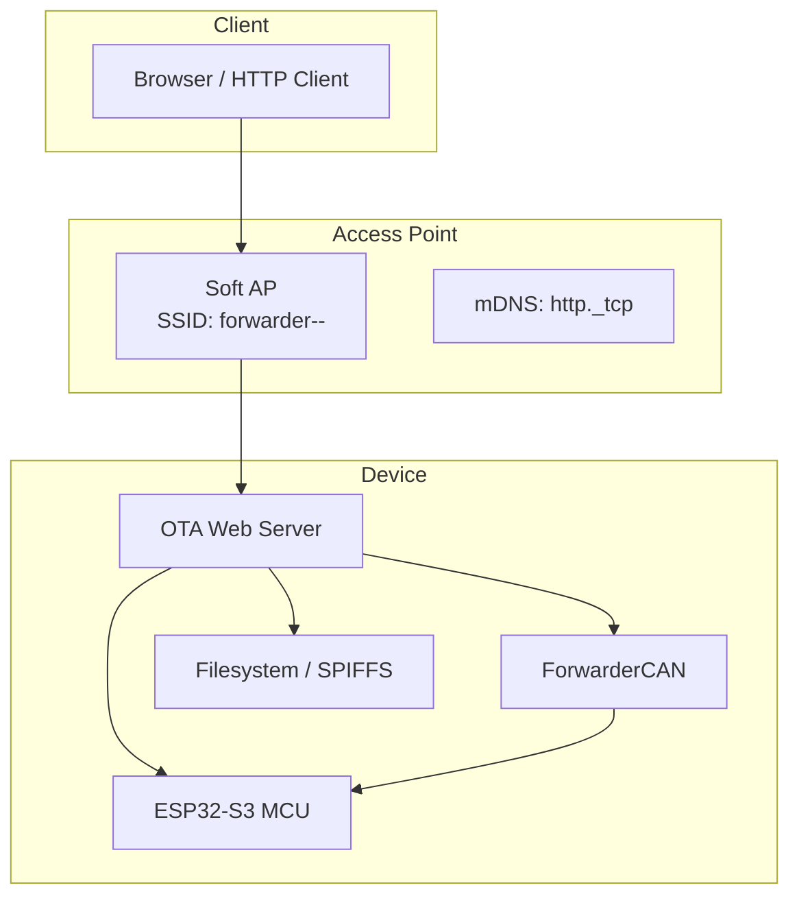
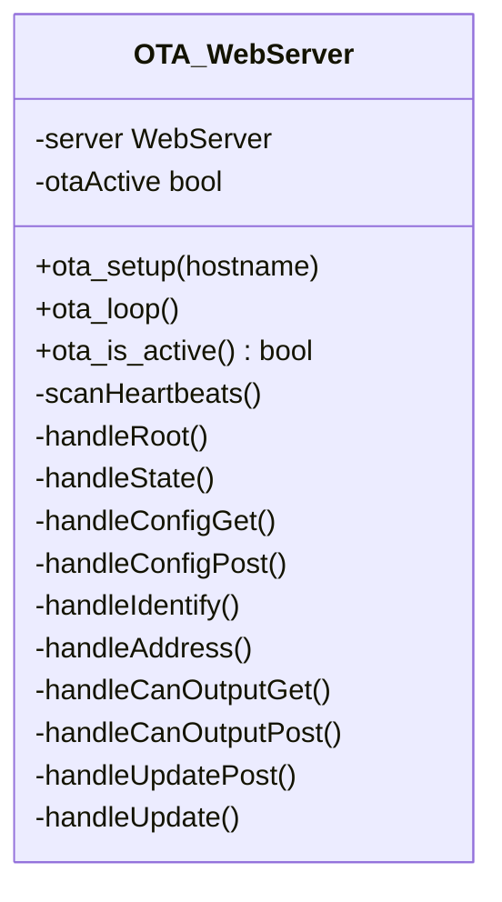
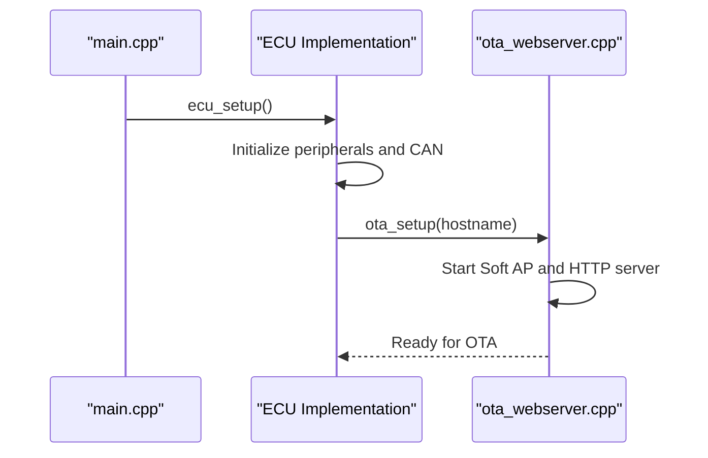
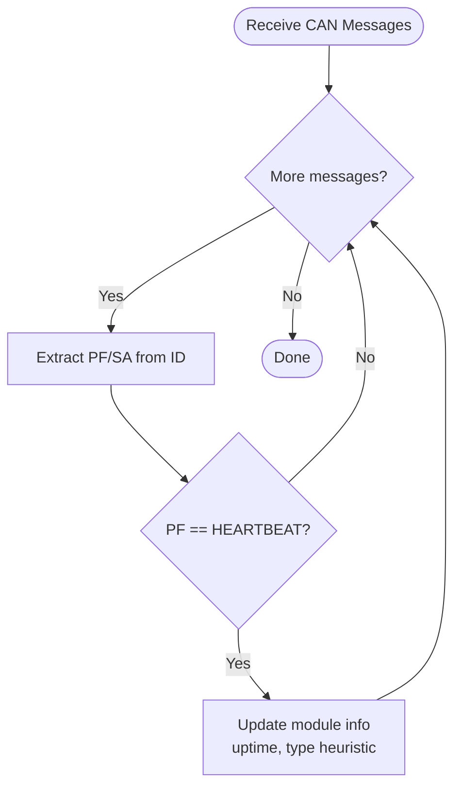
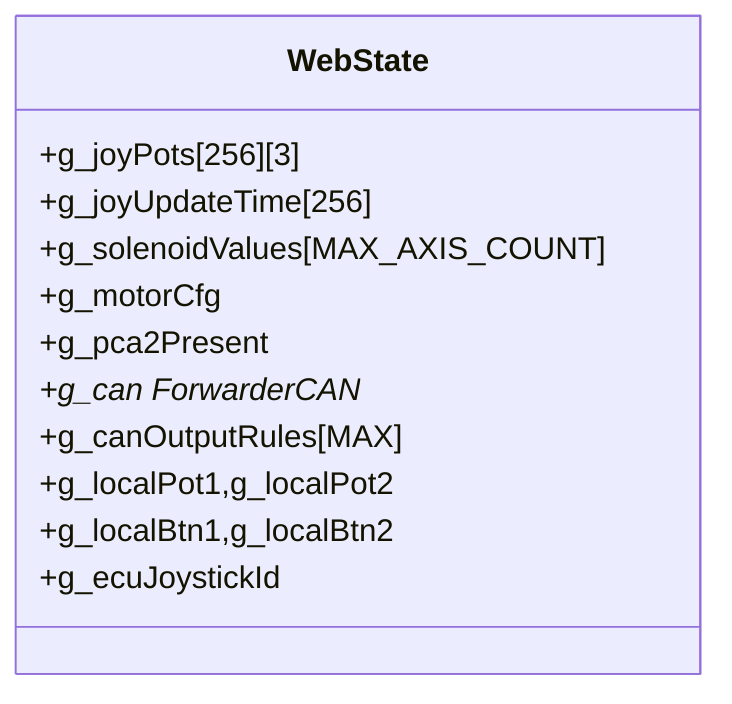
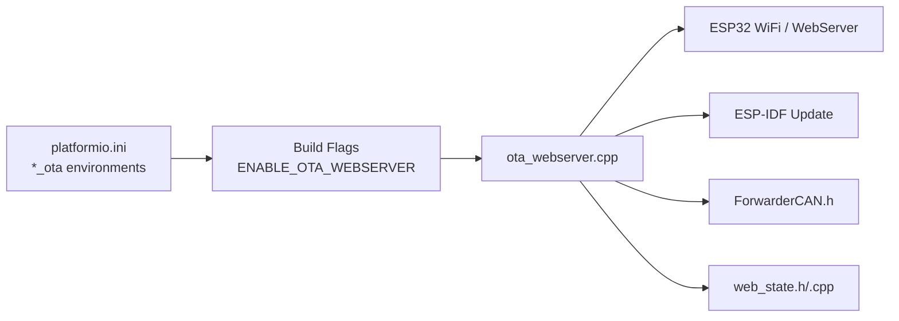
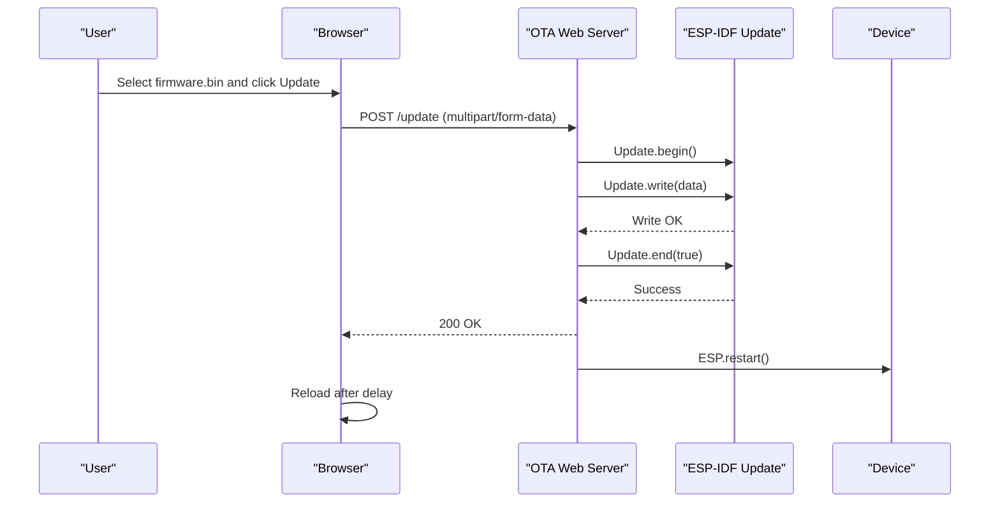

# OTA Firmware Updates

<cite>
**Referenced Files in This Document**
- [README.md](file://README.md)
- [platformio.ini](file://platformio.ini)
- [main.cpp](file://src/main.cpp)
- [ota_webserver.h](file://src/ota_webserver.h)
- [ota_webserver.cpp](file://src/ota_webserver.cpp)
- [ecu_motor_driver.cpp](file://src/ecu_motor_driver.cpp)
- [ecu_joystick.cpp](file://src/ecu_joystick.cpp)
- [ForwarderCAN.h](file://lib/ForwarderCAN/ForwarderCAN.h)
- [web_state.h](file://src/web_state.h)
- [web_state.cpp](file://src/web_state.cpp)
</cite>

## Table of Contents
1. [Introduction](#introduction)
2. [Project Structure](#project-structure)
3. [Core Components](#core-components)
4. [Architecture Overview](#architecture-overview)
5. [Detailed Component Analysis](#detailed-component-analysis)
6. [Dependency Analysis](#dependency-analysis)
7. [Performance Considerations](#performance-considerations)
8. [Security Considerations](#security-considerations)
9. [Firmware Generation and Update Preparation](#firmware-generation-and-update-preparation)
10. [Deployment Workflows](#deployment-workflows)
11. [Update Process Flow](#update-process-flow)
12. [Troubleshooting Guide](#troubleshooting-guide)
13. [Field Deployment and Maintenance](#field-deployment-and-maintenance)
14. [Conclusion](#conclusion)

## Introduction
This document explains the Over-The-Air (OTA) firmware update system for ForwarderKE, focusing on the wireless firmware upgrade mechanism, web-based firmware upload interface, and automatic firmware installation process. It covers how the device creates a Wi-Fi access point during OTA mode, how the web interface enables firmware uploads, and how the update is applied and verified. It also documents security considerations, update validation, rollback mechanisms, and operational procedures for field deployments.

## Project Structure
The OTA functionality is implemented as part of the embedded application and controlled via build environments. The repository organizes the code by feature and hardware role, with separate environments for standard and OTA builds.

**Diagram sources**
- [main.cpp:19-31](file://src/main.cpp#L19-L31)
- [ecu_motor_driver.cpp:1-355](file://src/ecu_motor_driver.cpp#L1-L355)
- [ecu_joystick.cpp:1-239](file://src/ecu_joystick.cpp#L1-L239)
- [ota_webserver.cpp:1-809](file://src/ota_webserver.cpp#L1-L809)
- [ForwarderCAN.h:1-120](file://lib/ForwarderCAN/ForwarderCAN.h#L1-L120)
- [web_state.h:1-23](file://src/web_state.h#L1-L23)
- [web_state.cpp:1-20](file://src/web_state.cpp#L1-L20)
- [platformio.ini:1-80](file://platformio.ini#L1-L80)
- [README.md:84-103](file://README.md#L84-L103)

**Section sources**
- [README.md:112-126](file://README.md#L112-L126)
- [platformio.ini:1-80](file://platformio.ini#L1-L80)
- [main.cpp:19-31](file://src/main.cpp#L19-L31)

## Core Components
- OTA Web Server: Provides a Wi-Fi access point, HTTP server, and firmware upload endpoint.
- CAN Protocol Layer: Defines J1939-like addressing and PF/PS/SA fields used for heartbeat scanning and module discovery.
- ECU Implementations: Separate entry points for motor driver and joystick ECUs, each enabling OTA when built with OTA environments.
- Web State: Exposes runtime state to the web UI for dashboard, module discovery, and configuration.

Key responsibilities:
- Create Wi-Fi AP and mDNS service during OTA mode.
- Serve HTML and JSON APIs for dashboard and configuration.
- Accept firmware uploads and apply updates via the ESP-IDF Update framework.
- Reboot after successful update application.

**Section sources**
- [ota_webserver.h:3-6](file://src/ota_webserver.h#L3-L6)
- [ota_webserver.cpp:705-733](file://src/ota_webserver.cpp#L705-L733)
- [ForwarderCAN.h:38-51](file://lib/ForwarderCAN/ForwarderCAN.h#L38-L51)
- [ecu_motor_driver.cpp:1-355](file://src/ecu_motor_driver.cpp#L1-L355)
- [ecu_joystick.cpp:1-239](file://src/ecu_joystick.cpp#L1-L239)
- [web_state.h:1-23](file://src/web_state.h#L1-L23)

## Architecture Overview
The OTA architecture centers on the OTA web server that runs when enabled by build flags. It initializes Wi-Fi AP mode, starts an HTTP server, registers routes for UI and API, and exposes an upload handler that delegates to the ESP-IDF Update engine.

**Diagram sources**
- [ota_webserver.cpp:766-791](file://src/ota_webserver.cpp#L766-L791)
- [ecu_motor_driver.cpp:187-191](file://src/ecu_motor_driver.cpp#L187-L191)
- [ecu_joystick.cpp:187-191](file://src/ecu_joystick.cpp#L187-L191)
- [ForwarderCAN.h:66-120](file://lib/ForwarderCAN/ForwarderCAN.h#L66-L120)

## Detailed Component Analysis

### OTA Web Server
The OTA web server sets up Wi-Fi AP mode, registers endpoints, and handles firmware updates.

**Diagram sources**
- [ota_webserver.h:3-6](file://src/ota_webserver.h#L3-L6)
- [ota_webserver.cpp:13-25](file://src/ota_webserver.cpp#L13-L25)
- [ota_webserver.cpp:506-733](file://src/ota_webserver.cpp#L506-L733)

Key behaviors:
- Creates Soft AP with SSID derived from hostname and a fixed password.
- Starts mDNS service for http/tcp on port 80.
- Registers handlers for root page, state JSON, configuration, identify, address change, CAN output rules, and firmware update.
- Firmware upload handler delegates to ESP-IDF Update and reboots on success.

**Section sources**
- [ota_webserver.cpp:766-791](file://src/ota_webserver.cpp#L766-L791)
- [ota_webserver.cpp:705-733](file://src/ota_webserver.cpp#L705-L733)

### ECU Implementations and OTA Activation
Both ECU implementations conditionally enable OTA when built with OTA environments.

**Diagram sources**
- [main.cpp:19-31](file://src/main.cpp#L19-L31)
- [ecu_motor_driver.cpp:187-191](file://src/ecu_motor_driver.cpp#L187-L191)
- [ecu_joystick.cpp:187-191](file://src/ecu_joystick.cpp#L187-L191)
- [ota_webserver.cpp:766-791](file://src/ota_webserver.cpp#L766-L791)

**Section sources**
- [ecu_motor_driver.cpp:187-191](file://src/ecu_motor_driver.cpp#L187-L191)
- [ecu_joystick.cpp:187-191](file://src/ecu_joystick.cpp#L187-L191)

### CAN Heartbeat Scanning and Module Discovery
The OTA web server scans CAN heartbeats to discover connected modules and infer their types.

**Diagram sources**
- [ota_webserver.cpp:742-761](file://src/ota_webserver.cpp#L742-L761)
- [ForwarderCAN.h:38-51](file://lib/ForwarderCAN/ForwarderCAN.h#L38-L51)

**Section sources**
- [ota_webserver.cpp:742-761](file://src/ota_webserver.cpp#L742-L761)

### Web State and Dashboard Exposure
The web state exposes runtime data consumed by the UI, including joystick values, solenoid outputs, and module discovery.

**Diagram sources**
- [web_state.h:10-23](file://src/web_state.h#L10-L23)
- [web_state.cpp:6-19](file://src/web_state.cpp#L6-L19)

**Section sources**
- [web_state.h:10-23](file://src/web_state.h#L10-L23)
- [web_state.cpp:6-19](file://src/web_state.cpp#L6-L19)

## Dependency Analysis
OTA relies on several libraries and build-time flags to enable the web server and firmware update capability.

**Diagram sources**
- [platformio.ini:63-80](file://platformio.ini#L63-L80)
- [ota_webserver.cpp:3-11](file://src/ota_webserver.cpp#L3-L11)
- [ForwarderCAN.h:1-120](file://lib/ForwarderCAN/ForwarderCAN.h#L1-L120)
- [web_state.h:1-23](file://src/web_state.h#L1-L23)

**Section sources**
- [platformio.ini:63-80](file://platformio.ini#L63-L80)
- [ota_webserver.cpp:3-11](file://src/ota_webserver.cpp#L3-L11)

## Performance Considerations
- Upload throughput depends on client network conditions and the ESP32’s processing capacity. Large firmware.bin files increase risk of timeouts.
- The web server runs on the main thread; heavy processing in other tasks can delay HTTP response handling.
- Frequent heartbeat scanning is lightweight but still consumes CPU cycles; keep polling intervals reasonable.

## Security Considerations
- Access point credentials:
  - The access point password is set to a fixed value during OTA mode initialization.
  - Clients connect to the AP using the device’s hostname-derived SSID and the fixed password.
- Update validation:
  - The firmware upload handler delegates to the ESP-IDF Update engine, which performs basic integrity checks during flashing.
  - There is no cryptographic signature verification or pre-checksum validation in the upload handler.
- Rollback:
  - The implementation does not include a dual-bank flash rollback mechanism. On failure, the device remains in the partially flashed state until corrected.
- Recommendations:
  - Change the AP password in production builds by modifying the password constant in the OTA setup routine.
  - Add checksum verification or signed images before applying updates.
  - Implement a watchdog to recover from failed updates and restore a known-good image.

**Section sources**
- [ota_webserver.cpp:766-791](file://src/ota_webserver.cpp#L766-L791)
- [ota_webserver.cpp:705-733](file://src/ota_webserver.cpp#L705-L733)

## Firmware Generation and Update Preparation
- Generating firmware.bin:
  - Build the standard environment for the target ECU type to produce a .bin file.
  - The .bin is placed in the build output directory for OTA use.
- Update file preparation:
  - Ensure the .bin matches the device’s MCU and memory layout.
  - Keep the .bin filename consistent and avoid renaming to prevent confusion.
- OTA build environments:
  - Use *_ota environments to enable the web server and OTA capabilities.
  - The *_ota environments inherit base flags and add ENABLE_OTA_WEBSERVER.

**Section sources**
- [README.md:99-103](file://README.md#L99-L103)
- [platformio.ini:63-80](file://platformio.ini#L63-L80)

## Deployment Workflows
- Standard vs OTA environments:
  - Standard environments omit the web server and OTA features.
  - OTA environments include ENABLE_OTA_WEBSERVER and expose the web UI and update endpoint.
- ECU-specific workflows:
  - Motor driver: Build and flash the motor driver environment; OTA mode allows firmware upload via the web UI.
  - Joystick: Build and flash the joystick environment; OTA mode allows firmware upload via the web UI.
- Update scheduling:
  - Prefer off-hours or maintenance windows to minimize downtime.
  - Ensure the device remains powered during the update to avoid partial flashes.

**Section sources**
- [platformio.ini:17-30](file://platformio.ini#L17-L30)
- [platformio.ini:31-62](file://platformio.ini#L31-L62)
- [platformio.ini:63-80](file://platformio.ini#L63-L80)

## Update Process Flow
This sequence illustrates the end-to-end update flow from browser interaction to device reboot.

**Diagram sources**
- [ota_webserver.cpp:705-733](file://src/ota_webserver.cpp#L705-L733)

**Section sources**
- [ota_webserver.cpp:705-733](file://src/ota_webserver.cpp#L705-L733)

## Troubleshooting Guide
Common issues and remedies:
- Cannot connect to AP:
  - Verify the device booted in OTA mode and the AP SSID matches the hostname-derived pattern.
  - Confirm the AP password is correct.
- Upload fails:
  - Check network stability and reduce file size if possible.
  - Review serial logs for error messages printed by the Update engine.
- Device does not reboot after update:
  - Ensure the update handler reaches Update.end(true) and ESP.restart().
  - Confirm the device remains powered during the process.
- Partial flash or bricked device:
  - If the device fails to boot after an update, power cycle and check for serial output.
  - If the device remains partially flashed, reflash using a known-good .bin via the standard build environment.

Preventive measures:
- Back up the current firmware before OTA updates.
- Validate .bin compatibility with the target ECU type.
- Schedule updates during planned maintenance windows.

**Section sources**
- [ota_webserver.cpp:705-733](file://src/ota_webserver.cpp#L705-L733)
- [README.md:84-103](file://README.md#L84-L103)

## Field Deployment and Maintenance
- Field-deployed maintenance:
  - Use OTA mode for remote updates when feasible.
  - Maintain a secure inventory of .bin files and track versions per device.
- Recovery procedures:
  - If OTA fails, revert to a previously known-good .bin using the standard build environment.
  - Keep a small supply of recovery .bin files on-site for critical units.
- Best practices:
  - Test updates on a subset of devices before fleet-wide deployment.
  - Monitor device health post-update using the dashboard and heartbeat data.

[No sources needed since this section provides general guidance]

## Conclusion
The ForwarderKE OTA system provides a straightforward mechanism to update firmware wirelessly via a web interface. By leveraging build environments and the ESP-IDF Update framework, it enables efficient field maintenance. However, security and reliability can be strengthened through cryptographic validation, watchdog-assisted rollbacks, and stricter access controls. Following the documented workflows and troubleshooting steps will help ensure reliable updates across motor driver and joystick ECUs.