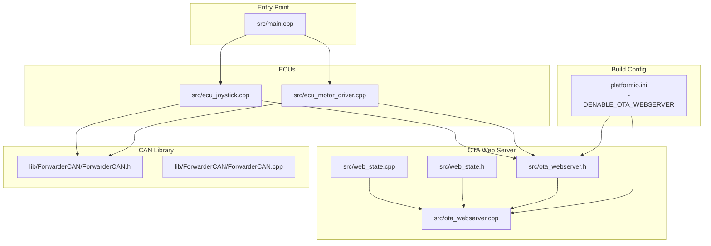
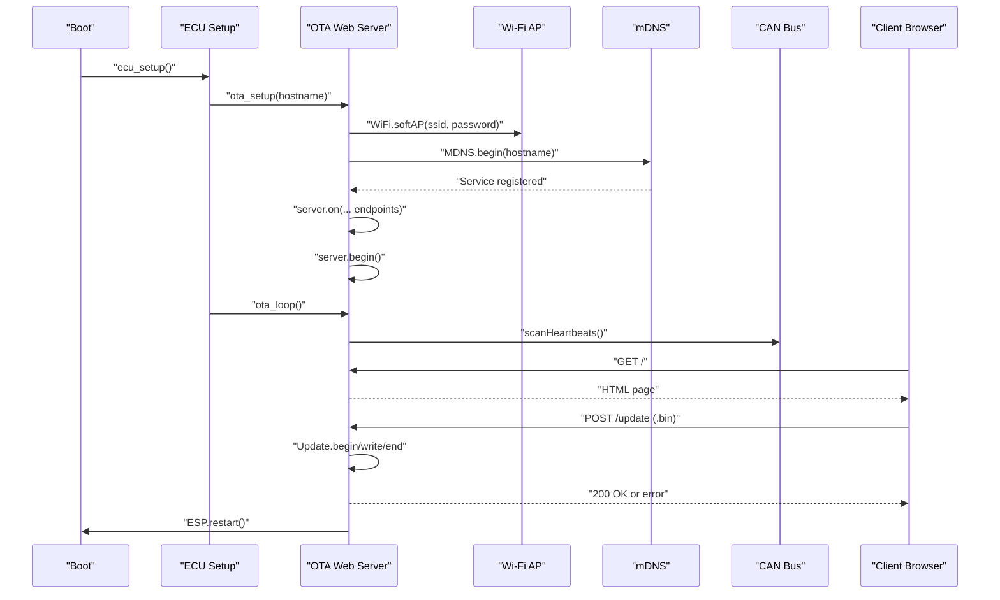
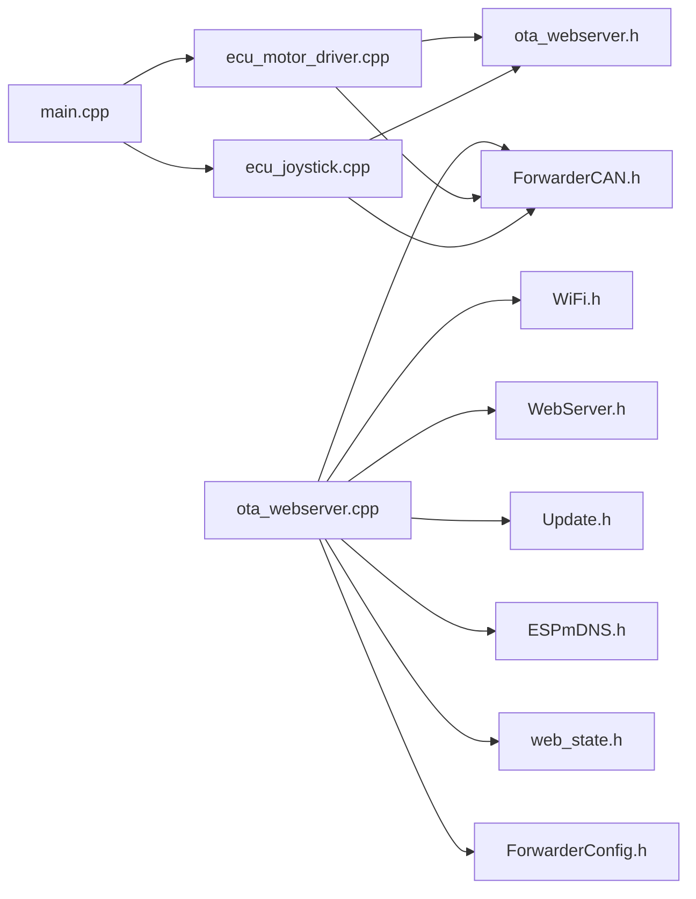

# OTA System Architecture

<cite>
**Referenced Files in This Document**
- [ota_webserver.cpp](file://src/ota_webserver.cpp)
- [ota_webserver.h](file://src/ota_webserver.h)
- [web_state.cpp](file://src/web_state.cpp)
- [web_state.h](file://src/web_state.h)
- [main.cpp](file://src/main.cpp)
- [ecu_motor_driver.cpp](file://src/ecu_motor_driver.cpp)
- [ecu_joystick.cpp](file://src/ecu_joystick.cpp)
- [ForwarderCAN.h](file://lib/ForwarderCAN/ForwarderCAN.h)
- [ForwarderCAN.cpp](file://lib/ForwarderCAN/ForwarderCAN.cpp)
- [platformio.ini](file://platformio.ini)
- [README.md](file://README.md)
</cite>

## Table of Contents
1. [Introduction](#introduction)
2. [Project Structure](#project-structure)
3. [Core Components](#core-components)
4. [Architecture Overview](#architecture-overview)
5. [Detailed Component Analysis](#detailed-component-analysis)
6. [Dependency Analysis](#dependency-analysis)
7. [Performance Considerations](#performance-considerations)
8. [Troubleshooting Guide](#troubleshooting-guide)
9. [Conclusion](#conclusion)
10. [Appendices](#appendices)

## Introduction
This document describes the OTA (Over-The-Air) system architecture for ForwarderKE, focusing on the wireless firmware update infrastructure and deployment mechanisms. It explains how the ESP32 creates a Wi-Fi access point during OTA mode, how the built-in HTTP server serves both static and dynamic content, how mDNS enables automatic hostname resolution, and how OTA integrates with the broader CAN ecosystem including heartbeat scanning and module detection. It also documents the conditional compilation aspects using the ENABLE_OTA_WEBSERVER flag and provides practical examples of OTA startup sequences, network configuration, and system state management during firmware updates.

## Project Structure
The OTA subsystem is implemented as an optional component that is conditionally compiled into builds via the ENABLE_OTA_WEBSERVER flag. The key files involved are:
- OTA web server implementation and public API
- ECU integration points for motor driver and joystick ECUs
- CAN library definitions and runtime behavior
- Build configuration that toggles OTA functionality

**Diagram sources**
- [platformio.ini:63-79](file://platformio.ini#L63-L79)
- [ota_webserver.h:1-6](file://src/ota_webserver.h#L1-L6)
- [ota_webserver.cpp:1-12](file://src/ota_webserver.cpp#L1-L12)
- [web_state.h:1-23](file://src/web_state.h#L1-L23)
- [web_state.cpp:1-20](file://src/web_state.cpp#L1-L20)
- [ecu_motor_driver.cpp:10-12](file://src/ecu_motor_driver.cpp#L10-L12)
- [ecu_joystick.cpp:8-9](file://src/ecu_joystick.cpp#L8-L9)
- [ForwarderCAN.h:32-108](file://lib/ForwarderCAN/ForwarderCAN.h#L32-L108)
- [main.cpp:11-17](file://src/main.cpp#L11-L17)

**Section sources**
- [platformio.ini:1-80](file://platformio.ini#L1-L80)
- [ota_webserver.h:1-6](file://src/ota_webserver.h#L1-L6)
- [ota_webserver.cpp:1-12](file://src/ota_webserver.cpp#L1-L12)
- [web_state.h:1-23](file://src/web_state.h#L1-L23)
- [web_state.cpp:1-20](file://src/web_state.cpp#L1-L20)
- [ecu_motor_driver.cpp:10-12](file://src/ecu_motor_driver.cpp#L10-L12)
- [ecu_joystick.cpp:8-9](file://src/ecu_joystick.cpp#L8-L9)
- [ForwarderCAN.h:32-108](file://lib/ForwarderCAN/ForwarderCAN.h#L32-L108)
- [main.cpp:11-17](file://src/main.cpp#L11-L17)

## Core Components
- OTA Web Server: Provides Wi-Fi AP mode, HTTP endpoints, static HTML page, and firmware update handler.
- mDNS Discovery: Announces HTTP service for automatic hostname resolution.
- Heartbeat Scanner: Monitors CAN bus for heartbeat messages to detect modules and maintain module state.
- Conditional Compilation: ENABLE_OTA_WEBSERVER controls whether OTA code is included in the build.
- ECU Integration: OTA is initialized by ECU setup routines when OTA builds are used.

Key responsibilities:
- Create Wi-Fi AP with configurable SSID and default password.
- Serve a dashboard UI and REST-like API for device state, configuration, and CAN operations.
- Handle multipart firmware uploads and trigger ESP restart upon success.
- Integrate with CAN ecosystem for module detection and status reporting.
- Provide compile-time toggle to include/exclude OTA functionality.

**Section sources**
- [ota_webserver.cpp:766-791](file://src/ota_webserver.cpp#L766-L791)
- [ota_webserver.cpp:506-737](file://src/ota_webserver.cpp#L506-L737)
- [ota_webserver.cpp:742-761](file://src/ota_webserver.cpp#L742-L761)
- [platformio.ini:63-79](file://platformio.ini#L63-L79)
- [ecu_motor_driver.cpp:320-324](file://src/ecu_motor_driver.cpp#L320-L324)
- [ecu_joystick.cpp:187-191](file://src/ecu_joystick.cpp#L187-L191)

## Architecture Overview
The OTA system is layered on top of the ECU runtime and CAN stack. When ENABLE_OTA_WEBSERVER is defined, the ECU initializes the OTA subsystem with a unique hostname derived from the device’s CAN address. The OTA subsystem starts a Wi-Fi AP, registers an mDNS service, and exposes HTTP endpoints. The CAN bus is scanned continuously for heartbeat messages to populate the UI and enable remote management.

**Diagram sources**
- [ecu_motor_driver.cpp:320-324](file://src/ecu_motor_driver.cpp#L320-L324)
- [ecu_joystick.cpp:187-191](file://src/ecu_joystick.cpp#L187-L191)
- [ota_webserver.cpp:766-791](file://src/ota_webserver.cpp#L766-L791)
- [ota_webserver.cpp:705-733](file://src/ota_webserver.cpp#L705-L733)

## Detailed Component Analysis

### Wi-Fi Access Point Creation and Network Isolation
- Wi-Fi mode is set to AP-only.
- SSID is constructed from the provided hostname.
- Default password is set to a fixed value suitable for local updates.
- The AP IP is 192.168.4.1, enabling clients to connect directly without external router.
- No client isolation is configured; the AP shares the same subnet as the device for simplicity.

Operational behavior:
- On successful AP start, the system logs the AP SSID and IP.
- The HTTP server binds to port 80 on the AP interface.

Security note:
- The default password is intended for controlled environments and should be changed in production deployments.

**Section sources**
- [ota_webserver.cpp:766-778](file://src/ota_webserver.cpp#L766-L778)
- [README.md:94-96](file://README.md#L94-L96)

### HTTP Server Implementation and Endpoint Routing
Endpoints:
- GET /: Serves the main HTML page containing the dashboard and OTA panel.
- GET /api/state: Returns live device state including local address, bus status, counts, joystick data, solenoid values, and detected modules.
- GET /api/config: Returns axis configuration.
- POST /api/config: Accepts updated axis configuration and persists it.
- POST /api/identify: Sends an identify command to a target module.
- POST /api/address: Requests a module to change its address.
- GET /api/canoutput: Returns CAN-triggered GPIO output rules.
- POST /api/canoutput: Saves CAN-triggered GPIO output rules.
- POST /update: Handles multipart firmware upload and triggers update.

Static file serving:
- The main HTML is embedded as a raw literal string and served as text/html.

Dynamic content generation:
- JSON responses are assembled from shared global state and CAN bus activity.
- The heartbeat scanner populates module information used by the UI.

Error handling:
- Upload handler reports errors via Update.errorString() and sets appropriate HTTP status codes.
- Upload abortion resets state and logs.

**Section sources**
- [ota_webserver.cpp:506-508](file://src/ota_webserver.cpp#L506-L508)
- [ota_webserver.cpp:510-563](file://src/ota_webserver.cpp#L510-L563)
- [ota_webserver.cpp:565-626](file://src/ota_webserver.cpp#L565-L626)
- [ota_webserver.cpp:639-657](file://src/ota_webserver.cpp#L639-L657)
- [ota_webserver.cpp:648-657](file://src/ota_webserver.cpp#L648-L657)
- [ota_webserver.cpp:659-703](file://src/ota_webserver.cpp#L659-L703)
- [ota_webserver.cpp:705-733](file://src/ota_webserver.cpp#L705-L733)

### mDNS Service Discovery and Hostname Resolution
- mDNS is initialized with the same hostname used for the AP.
- An HTTP service is registered under TCP port 80.
- Clients can resolve the device using the .local hostname, simplifying connection without manual IP configuration.

Behavior:
- If mDNS fails to start, the system logs an error but continues.
- The service registration occurs after AP initialization.

**Section sources**
- [ota_webserver.cpp:771-775](file://src/ota_webserver.cpp#L771-L775)
- [README.md:96](file://README.md#L96)

### Integration with CAN Ecosystem and Heartbeat Scanning
- The OTA loop continuously scans the CAN bus for heartbeat messages.
- Detected modules are tracked with address, type, uptime, and last-seen timestamp.
- The UI displays detected modules and allows sending identify/address commands.

Heartbeat scanning logic:
- Receives messages and checks for PF_HEARTBEAT.
- Updates module entries with uptime and inferred type based on payload fields.
- Maintains a sliding window to keep only recent detections.

**Section sources**
- [ota_webserver.cpp:742-761](file://src/ota_webserver.cpp#L742-L761)
- [ForwarderCAN.h:32-108](file://lib/ForwarderCAN/ForwarderCAN.h#L32-L108)

### Conditional Compilation and Build Configurations
- ENABLE_OTA_WEBSERVER is defined in dedicated OTA environments.
- When undefined, OTA functions become no-ops, minimizing footprint on non-OTA builds.
- OTA environments inherit base ECU settings and add the OTA flag.

Build flags and environments:
- motor_driver_ota, joystick1_ota, joystick2_ota define ENABLE_OTA_WEBSERVER.
- Base environments motor_driver, joystick1, joystick2 do not include OTA.

**Section sources**
- [platformio.ini:63-79](file://platformio.ini#L63-L79)
- [ota_webserver.cpp:3](file://src/ota_webserver.cpp#L3)
- [ota_webserver.cpp:802-807](file://src/ota_webserver.cpp#L802-L807)

### Practical OTA Startup Sequences and System State Management
Typical OTA startup:
1. ECU initialization derives a unique hostname from the device’s CAN address.
2. OTA setup switches the ESP32 to AP mode, starts the HTTP server, and registers mDNS.
3. The OTA loop handles HTTP requests and periodically scans CAN for module status.
4. During firmware upload, the system sets an active flag, streams chunks, validates, and restarts on success.

System state during updates:
- otaActive indicates whether an upload is in progress.
- The UI reflects upload progress via a progress bar.
- On success, the device restarts automatically.

**Section sources**
- [ecu_motor_driver.cpp:320-324](file://src/ecu_motor_driver.cpp#L320-L324)
- [ecu_joystick.cpp:187-191](file://src/ecu_joystick.cpp#L187-L191)
- [ota_webserver.cpp:766-791](file://src/ota_webserver.cpp#L766-L791)
- [ota_webserver.cpp:705-733](file://src/ota_webserver.cpp#L705-L733)
- [ota_webserver.cpp:798-800](file://src/ota_webserver.cpp#L798-L800)

## Dependency Analysis
The OTA subsystem depends on:
- ESP32 Wi-Fi and HTTP libraries for AP and server functionality.
- ESP32 mDNS for service discovery.
- ForwarderCAN for bus operations and heartbeat scanning.
- ForwarderConfig for persistent storage of configuration (when applicable).
- ECU integration for initialization and loop scheduling.

**Diagram sources**
- [ota_webserver.cpp:5-11](file://src/ota_webserver.cpp#L5-L11)
- [ecu_motor_driver.cpp:10-12](file://src/ecu_motor_driver.cpp#L10-L12)
- [ecu_joystick.cpp:8-9](file://src/ecu_joystick.cpp#L8-L9)
- [ForwarderCAN.h:32-108](file://lib/ForwarderCAN/ForwarderCAN.h#L32-L108)
- [main.cpp:11-17](file://src/main.cpp#L11-L17)

**Section sources**
- [ota_webserver.cpp:5-11](file://src/ota_webserver.cpp#L5-L11)
- [ecu_motor_driver.cpp:10-12](file://src/ecu_motor_driver.cpp#L10-L12)
- [ecu_joystick.cpp:8-9](file://src/ecu_joystick.cpp#L8-L9)
- [ForwarderCAN.h:32-108](file://lib/ForwarderCAN/ForwarderCAN.h#L32-L108)
- [main.cpp:11-17](file://src/main.cpp#L11-L17)

## Performance Considerations
- HTTP server runs on the main thread; ensure minimal blocking in handlers to maintain responsiveness.
- Firmware upload uses streaming writes; large binaries may take several seconds; provide feedback via the progress bar.
- Heartbeat scanning is lightweight but runs continuously; keep processing minimal to avoid impacting CAN throughput.
- mDNS registration overhead is small; failures are logged but do not prevent OTA operation.

[No sources needed since this section provides general guidance]

## Troubleshooting Guide
Common issues and resolutions:
- AP does not start: Verify Wi-Fi mode and credentials; confirm platform and board settings.
- mDNS registration fails: Check hostname validity and network availability; the system logs a failure but continues.
- Upload fails: Inspect Update.errorString() output; ensure the uploaded file is a valid .bin; verify sufficient free flash space.
- UI shows no modules: Confirm CAN bus connectivity and that target modules are broadcasting heartbeats.
- OTA disabled in build: Ensure the OTA environment is selected so ENABLE_OTA_WEBSERVER is defined.

**Section sources**
- [ota_webserver.cpp:771-775](file://src/ota_webserver.cpp#L771-L775)
- [ota_webserver.cpp:710-712](file://src/ota_webserver.cpp#L710-L712)
- [ota_webserver.cpp:724-725](file://src/ota_webserver.cpp#L724-L725)
- [platformio.ini:63-79](file://platformio.ini#L63-L79)

## Conclusion
The OTA system in ForwarderKE provides a streamlined, self-contained mechanism for updating firmware over Wi-Fi. By leveraging ESP32’s built-in Wi-Fi and HTTP capabilities, it delivers a simple AP-based interface with mDNS discovery and a responsive dashboard. Its integration with the CAN ecosystem enhances manageability by exposing module status and enabling remote control actions. Conditional compilation ensures OTA functionality is only present where needed, keeping non-OTA builds lean.

[No sources needed since this section summarizes without analyzing specific files]

## Appendices

### Endpoint Reference
- GET /: Main dashboard page
- GET /api/state: Live device state (address, bus status, counts, joystick, solenoids, modules)
- GET /api/config: Axis configuration
- POST /api/config: Update axis configuration
- POST /api/identify: Identify a module
- POST /api/address: Change module address
- GET /api/canoutput: CAN output rules
- POST /api/canoutput: Save CAN output rules
- POST /update: Upload firmware binary

**Section sources**
- [ota_webserver.cpp:506-508](file://src/ota_webserver.cpp#L506-L508)
- [ota_webserver.cpp:510-563](file://src/ota_webserver.cpp#L510-L563)
- [ota_webserver.cpp:565-626](file://src/ota_webserver.cpp#L565-L626)
- [ota_webserver.cpp:639-657](file://src/ota_webserver.cpp#L639-L657)
- [ota_webserver.cpp:648-657](file://src/ota_webserver.cpp#L648-L657)
- [ota_webserver.cpp:659-703](file://src/ota_webserver.cpp#L659-L703)
- [ota_webserver.cpp:705-733](file://src/ota_webserver.cpp#L705-L733)

### Build Environments and Flags
- OTA-enabled environments: motor_driver_ota, joystick1_ota, joystick2_ota
- Non-OTA environments: motor_driver, joystick1, joystick2
- Flag: ENABLE_OTA_WEBSERVER

**Section sources**
- [platformio.ini:63-79](file://platformio.ini#L63-L79)