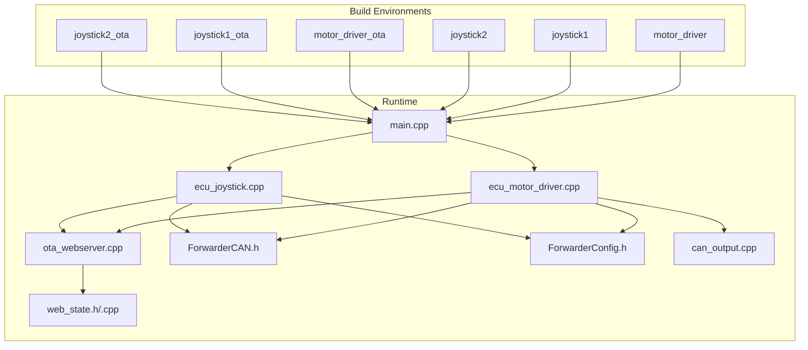
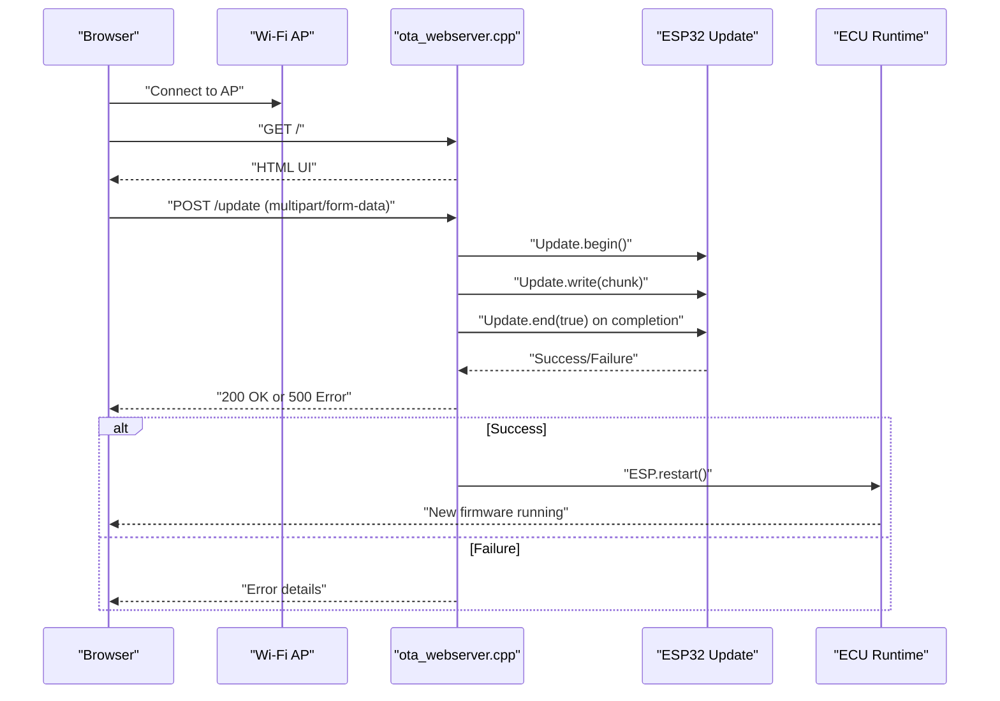
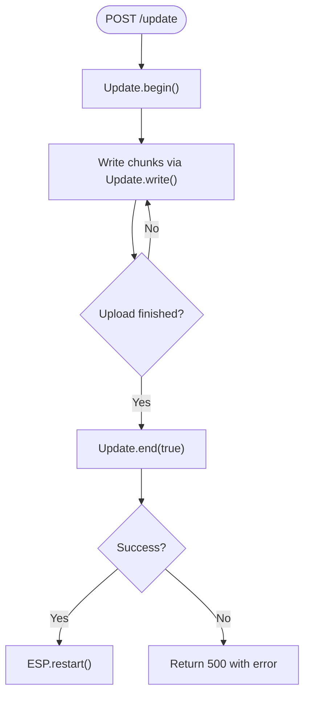
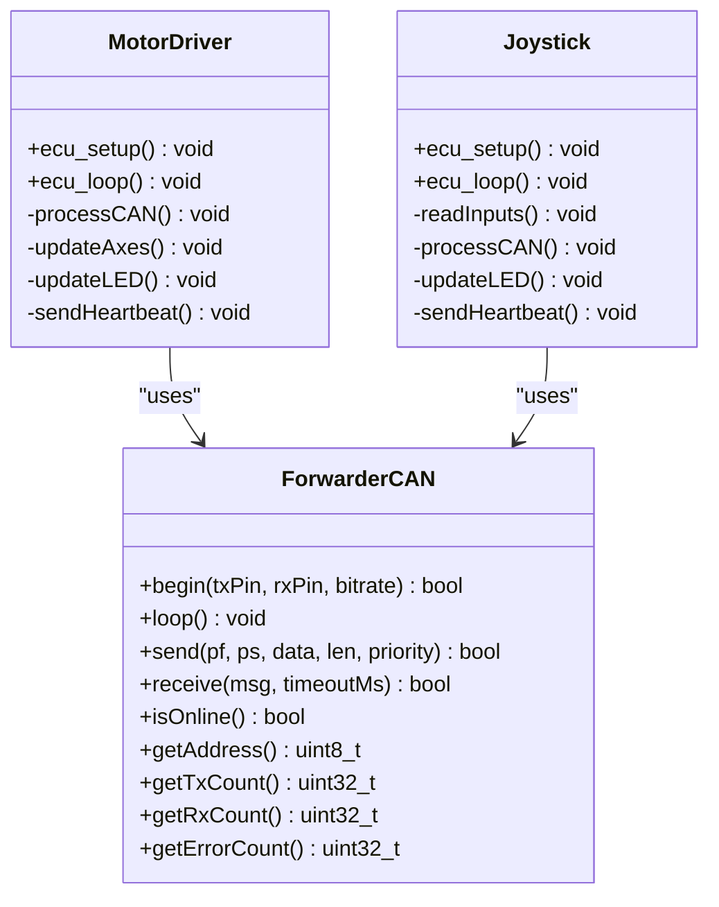
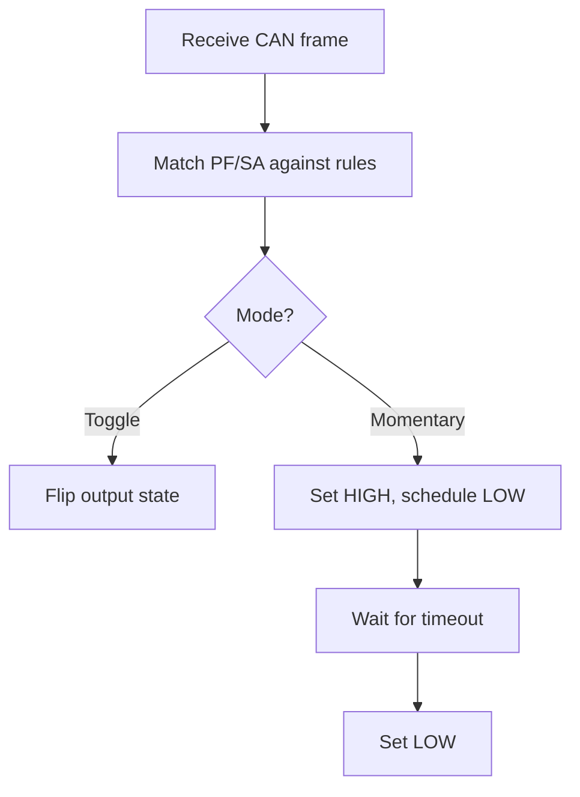
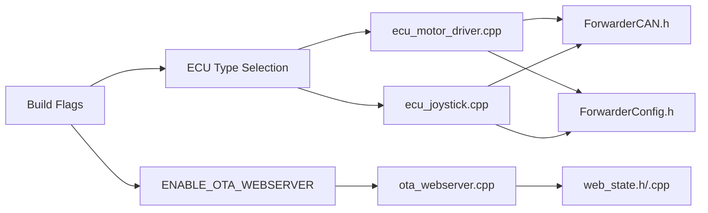

# Troubleshooting and Recovery

<cite>
**Referenced Files in This Document**
- [README.md](file://README.md)
- [platformio.ini](file://platformio.ini)
- [src/main.cpp](file://src/main.cpp)
- [src/ota_webserver.cpp](file://src/ota_webserver.cpp)
- [src/ota_webserver.h](file://src/ota_webserver.h)
- [src/ecu_motor_driver.cpp](file://src/ecu_motor_driver.cpp)
- [src/ecu_joystick.cpp](file://src/ecu_joystick.cpp)
- [src/can_output.cpp](file://src/can_output.cpp)
- [src/web_state.h](file://src/web_state.h)
- [src/web_state.cpp](file://src/web_state.cpp)
- [lib/ForwarderCAN/ForwarderCAN.h](file://lib/ForwarderCAN/ForwarderCAN.h)
- [lib/ForwarderConfig/ForwarderConfig.h](file://lib/ForwarderConfig/ForwarderConfig.h)
</cite>

## Table of Contents
1. [Introduction](#introduction)
2. [Project Structure](#project-structure)
3. [Core Components](#core-components)
4. [Architecture Overview](#architecture-overview)
5. [Detailed Component Analysis](#detailed-component-analysis)
6. [Dependency Analysis](#dependency-analysis)
7. [Performance Considerations](#performance-considerations)
8. [Troubleshooting Guide](#troubleshooting-guide)
9. [Conclusion](#conclusion)
10. [Appendices](#appendices)

## Introduction
This document provides comprehensive troubleshooting and recovery guidance for ForwarderKE OTA firmware updates. It covers common failure scenarios (network connectivity, storage, corrupted firmware, interrupted transfers), diagnostic procedures (serial monitor logs, LED indicators, web interface feedback), recovery mechanisms (manual serial programming, safe mode, factory reset), rollback procedures, field-deployed maintenance (remote diagnostics, batch updates, emergency recovery), and preventive practices.

## Project Structure
The system is an ESP32-S3-based CAN controller with two ECU roles:
- Motor Driver ECU (controls solenoids via PCA9685)
- Joystick ECU (reads pots/buttons and publishes CAN)

OTA support is provided via a Wi-Fi AP and embedded web server for firmware uploads. Build environments differentiate between standard and OTA-enabled builds.

**Diagram sources**
- [platformio.ini:1-80](file://platformio.ini#L1-L80)
- [src/main.cpp:1-32](file://src/main.cpp#L1-L32)
- [src/ota_webserver.cpp:1-809](file://src/ota_webserver.cpp#L1-L809)
- [src/ecu_motor_driver.cpp:1-355](file://src/ecu_motor_driver.cpp#L1-L355)
- [src/ecu_joystick.cpp:1-239](file://src/ecu_joystick.cpp#L1-L239)
- [lib/ForwarderCAN/ForwarderCAN.h:1-120](file://lib/ForwarderCAN/ForwarderCAN.h#L1-L120)
- [lib/ForwarderConfig/ForwarderConfig.h:1-92](file://lib/ForwarderConfig/ForwarderConfig.h#L1-L92)
- [src/can_output.cpp:1-66](file://src/can_output.cpp#L1-L66)
- [src/web_state.h:1-23](file://src/web_state.h#L1-L23)
- [src/web_state.cpp:1-20](file://src/web_state.cpp#L1-L20)

**Section sources**
- [platformio.ini:1-80](file://platformio.ini#L1-L80)
- [README.md:1-131](file://README.md#L1-L131)
- [src/main.cpp:1-32](file://src/main.cpp#L1-L32)

## Core Components
- OTA Web Server: Provides Wi-Fi AP, mDNS, HTTP endpoints, and firmware upload handler.
- ECU Implementations: Motor Driver and Joystick ECUs implement CAN logic, LEDs, and heartbeat.
- CAN Library: Implements J1939-like addressing, address claiming, and message handling.
- Configuration Library: Stores persistent settings (address overrides, axis configs, CAN output rules).
- CAN Output: Translates matched CAN frames into GPIO actions.

Key runtime behaviors for OTA:
- On OTA-enabled builds, the device starts a Wi-Fi AP and HTTP server.
- Firmware upload endpoint streams binary data and triggers ESP32 update.
- Successful update triggers a restart; failures return error details.

**Section sources**
- [src/ota_webserver.cpp:705-737](file://src/ota_webserver.cpp#L705-L737)
- [src/ota_webserver.cpp:766-791](file://src/ota_webserver.cpp#L766-L791)
- [src/ecu_motor_driver.cpp:320-324](file://src/ecu_motor_driver.cpp#L320-L324)
- [src/ecu_joystick.cpp:187-191](file://src/ecu_joystick.cpp#L187-L191)
- [lib/ForwarderCAN/ForwarderCAN.h:66-120](file://lib/ForwarderCAN/ForwarderCAN.h#L66-L120)
- [lib/ForwarderConfig/ForwarderConfig.h:64-92](file://lib/ForwarderConfig/ForwarderConfig.h#L64-L92)
- [src/can_output.cpp:7-19](file://src/can_output.cpp#L7-L19)

## Architecture Overview
OTA update flow uses the embedded web server to stream firmware binaries to the ESP32’s Update service. The flow is initiated from the web UI and processed by the HTTP handlers.

**Diagram sources**
- [src/ota_webserver.cpp:705-737](file://src/ota_webserver.cpp#L705-L737)
- [src/ota_webserver.cpp:766-791](file://src/ota_webserver.cpp#L766-L791)
- [src/ecu_motor_driver.cpp:349-351](file://src/ecu_motor_driver.cpp#L349-L351)
- [src/ecu_joystick.cpp:233-235](file://src/ecu_joystick.cpp#L233-L235)

## Detailed Component Analysis

### OTA Web Server
- HTTP endpoints:
  - GET /: Serves the dashboard UI.
  - GET /api/state: Exposes runtime stats and module data.
  - POST /api/config: Saves axis mapping.
  - POST /api/identify: Sends identify command to a module.
  - POST /api/address: Requests a module to change address.
  - GET/POST /api/canoutput: Manages CAN-triggered GPIO rules.
  - POST /update: Handles multipart firmware upload and delegates to Update.
- Upload handler:
  - Tracks upload state transitions and prints errors via Update.printError.
  - On success, sends 200 and triggers ESP.restart.
  - On failure, returns 500 with error string.

**Diagram sources**
- [src/ota_webserver.cpp:705-737](file://src/ota_webserver.cpp#L705-L737)

**Section sources**
- [src/ota_webserver.cpp:506-737](file://src/ota_webserver.cpp#L506-L737)
- [src/ota_webserver.h:3-6](file://src/ota_webserver.h#L3-L6)

### ECU Implementations and Diagnostics
- Motor Driver ECU:
  - Initializes PCA9685, sets up CAN, loads config, and starts OTA if enabled.
  - LED behavior indicates online/offline, fast blink on activity, identify mode.
  - Safety: shuts off solenoids after a configured timeout if no commands arrive.
- Joystick ECU:
  - Reads analog pots and buttons, publishes CAN, and handles identify/address change.
  - LED behavior mirrors online/offline and identify mode.

**Diagram sources**
- [lib/ForwarderCAN/ForwarderCAN.h:66-120](file://lib/ForwarderCAN/ForwarderCAN.h#L66-L120)
- [src/ecu_motor_driver.cpp:290-352](file://src/ecu_motor_driver.cpp#L290-L352)
- [src/ecu_joystick.cpp:159-236](file://src/ecu_joystick.cpp#L159-L236)

**Section sources**
- [src/ecu_motor_driver.cpp:320-324](file://src/ecu_motor_driver.cpp#L320-L324)
- [src/ecu_motor_driver.cpp:332-337](file://src/ecu_motor_driver.cpp#L332-L337)
- [src/ecu_motor_driver.cpp:153-182](file://src/ecu_motor_driver.cpp#L153-L182)
- [src/ecu_joystick.cpp:187-191](file://src/ecu_joystick.cpp#L187-L191)
- [src/ecu_joystick.cpp:89-97](file://src/ecu_joystick.cpp#L89-L97)

### CAN Output and Configuration
- CAN Output:
  - Matches PF/SA against configured rules and toggles or pulses GPIO pins.
  - Supports momentary mode with configurable timeout.
- Configuration:
  - Stores axis mapping and CAN output rules in NVS.
  - Provides defaults and helpers for persistent storage.

**Diagram sources**
- [src/can_output.cpp:29-61](file://src/can_output.cpp#L29-L61)
- [lib/ForwarderConfig/ForwarderConfig.h:28-57](file://lib/ForwarderConfig/ForwarderConfig.h#L28-L57)

**Section sources**
- [src/can_output.cpp:7-19](file://src/can_output.cpp#L7-L19)
- [src/can_output.cpp:29-61](file://src/can_output.cpp#L29-L61)
- [lib/ForwarderConfig/ForwarderConfig.h:64-92](file://lib/ForwarderConfig/ForwarderConfig.h#L64-L92)

## Dependency Analysis
- Build flags control ECU type and OTA enablement.
- OTA depends on ESP32 Arduino Update and WebServer libraries.
- ECU implementations depend on ForwarderCAN and ForwarderConfig.
- Web UI state is shared via web_state.h/.cpp.

**Diagram sources**
- [platformio.ini:63-80](file://platformio.ini#L63-L80)
- [src/main.cpp:11-17](file://src/main.cpp#L11-L17)
- [src/ota_webserver.cpp:1-12](file://src/ota_webserver.cpp#L1-L12)
- [src/ecu_motor_driver.cpp:10-12](file://src/ecu_motor_driver.cpp#L10-L12)
- [src/ecu_joystick.cpp:8](file://src/ecu_joystick.cpp#L8)

**Section sources**
- [platformio.ini:12-16](file://platformio.ini#L12-L16)
- [platformio.ini:63-80](file://platformio.ini#L63-L80)
- [src/main.cpp:11-17](file://src/main.cpp#L11-L17)

## Performance Considerations
- OTA throughput depends on Wi-Fi signal strength and upload chunk sizes handled by the Update service.
- Frequent CAN traffic can impact CPU availability; ensure periodic tasks (LED, heartbeat, CAN output) are lightweight.
- Persistent writes occur during configuration saves; batch updates to reduce wear.

## Troubleshooting Guide

### Common Failure Scenarios and Diagnostics

- Network Connectivity Issues
  - Symptoms: Upload fails immediately or stalls at 0%.
  - Diagnostics:
    - Verify the device AP is visible and password is correct.
    - Confirm the browser can reach the device IP or mDNS name.
    - Check serial monitor for AP start and server start logs.
  - Actions:
    - Move closer to the AP or improve RF conditions.
    - Retry upload with a different browser/device.
    - Ensure the firmware .bin matches the device role.

- Insufficient Storage Space
  - Symptoms: Upload completes but device does not restart or returns an error.
  - Diagnostics:
    - Review serial logs around Update.begin/Update.end for error messages.
    - Confirm the firmware size is reasonable for the device flash.
  - Actions:
    - Use a smaller firmware build (disable OTA if not needed).
    - Ensure no large debug logs are retained.

- Corrupted Firmware Files
  - Symptoms: Immediate restart after upload or repeated reboots.
  - Diagnostics:
    - Check serial logs for error strings printed by Update.printError.
    - Verify the .bin checksum and integrity.
  - Actions:
    - Recreate the .bin using the correct environment.
    - Use the serial recovery procedure below.

- Interrupted Transfers
  - Symptoms: Partially written firmware causing boot loops.
  - Diagnostics:
    - Look for partial progress in the UI and serial logs.
    - Device may show LED patterns indicating boot failure.
  - Actions:
    - Retry the OTA upload.
    - If stuck, recover via serial programming.

### Diagnostic Procedures

- Serial Monitor Interpretation
  - Look for:
    - OTA AP start and IP address.
    - Upload begin/end and error strings.
    - Restart after successful update.
  - Example log markers:
    - OTA AP started and web server started.
    - Update.begin/Update.write/Update.end and error strings.
    - ESP.restart triggered on success.

- LED Status Indicators
  - Motor Driver:
    - Solid blue: ready.
    - Fast blinking: recent activity.
    - Red blinking: offline or error.
    - White flash: identify command received.
  - Joystick:
    - Solid green: ready.
    - Red/orange blinking: offline or error.
    - White flash: identify command received.

- Web Interface Error Messages
  - Upload page shows progress bar and error text on failure.
  - Error text originates from Update.errorString and is returned to the client.

**Section sources**
- [src/ota_webserver.cpp:705-737](file://src/ota_webserver.cpp#L705-L737)
- [src/ota_webserver.cpp:766-791](file://src/ota_webserver.cpp#L766-L791)
- [src/ecu_motor_driver.cpp:153-182](file://src/ecu_motor_driver.cpp#L153-L182)
- [src/ecu_joystick.cpp:89-97](file://src/ecu_joystick.cpp#L89-L97)

### Recovery Mechanisms

- Manual Firmware Recovery via Serial Programming
  - Steps:
    - Install PlatformIO and connect the device via USB.
    - Build the appropriate environment (standard, not OTA).
    - Upload the firmware using the selected environment target.
  - Notes:
    - OTA builds include the web server; use standard builds for serial flashing.

- Safe Mode Operation
  - The device does not implement a dedicated “safe mode”.
  - If stuck in a boot loop after OTA, power cycle and rely on serial recovery.

- Factory Reset Procedures
  - Address Override Reset:
    - The address override stored in NVS can be cleared programmatically.
    - After clearing, the device uses its preferred address on next boot.
  - Axis and CAN Output Config Reset:
    - Defaults are provided by the configuration library; re-save defaults after clearing overrides.

- Rollback Procedures
  - Maintain a backup copy of the previously known-good .bin.
  - Use serial programming to restore the prior version if OTA fails.
  - Version management:
    - Track firmware versions and build timestamps.
    - Store .bin artifacts alongside release notes.

- Field-Deployed Maintenance

  - Remote Diagnostics
    - Use the web UI to inspect state, modules, and CAN statistics.
    - Identify offline devices via heartbeat and module table.

  - Update Scheduling for Multiple Units
    - Build separate environments for each unit (joystick1 vs joystick2).
    - Schedule updates during maintenance windows; stagger uploads to avoid contention.

  - Emergency Recovery Protocols
    - If OTA fails on-site, use serial programming to restore a known-good image.
    - Keep a USB-to-TTL adapter and a prebuilt .bin ready.

- Preventive Maintenance Practices
  - Regular Firmware Updates
    - Apply updates periodically to benefit from stability and security fixes.
  - Storage Optimization
    - Avoid unnecessary debug logging to conserve flash.
  - Environmental Considerations
    - Ensure adequate cooling and stable power to prevent intermittent failures.
    - Minimize RF interference near the AP.

**Section sources**
- [README.md:84-103](file://README.md#L84-L103)
- [platformio.ini:63-80](file://platformio.ini#L63-L80)
- [lib/ForwarderConfig/ForwarderConfig.h:70-86](file://lib/ForwarderConfig/ForwarderConfig.h#L70-L86)
- [src/ecu_motor_driver.cpp:234-244](file://src/ecu_motor_driver.cpp#L234-L244)
- [src/ecu_joystick.cpp:132-142](file://src/ecu_joystick.cpp#L132-L142)

## Conclusion
This guide consolidates OTA troubleshooting and recovery for ForwarderKE devices. By leveraging serial logs, LED indicators, and the web UI, most OTA issues can be diagnosed quickly. When OTA fails, serial recovery remains the reliable fallback. Adopting preventive practices and maintaining version backups ensures resilient field operations.

## Appendices

### Quick Reference: OTA Endpoints
- GET /: Dashboard UI
- GET /api/state: Runtime stats and module data
- POST /api/config: Save axis mapping
- POST /api/identify: Identify a module
- POST /api/address: Change module address
- GET/POST /api/canoutput: Manage CAN output rules
- POST /update: Upload firmware

**Section sources**
- [src/ota_webserver.cpp:506-703](file://src/ota_webserver.cpp#L506-L703)