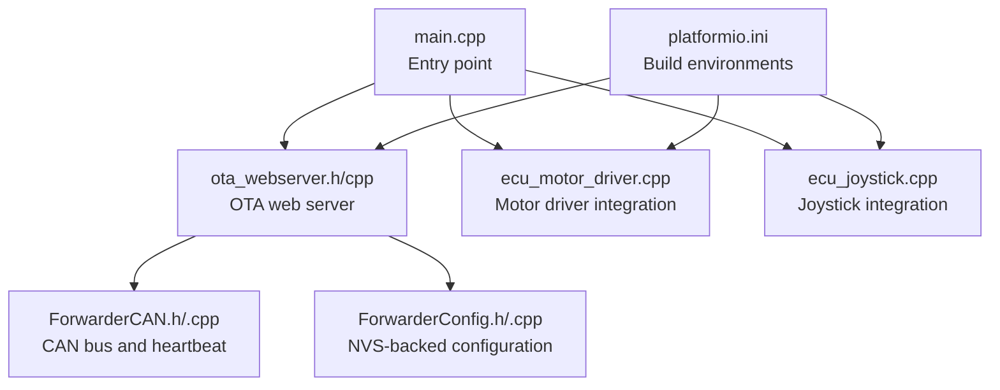
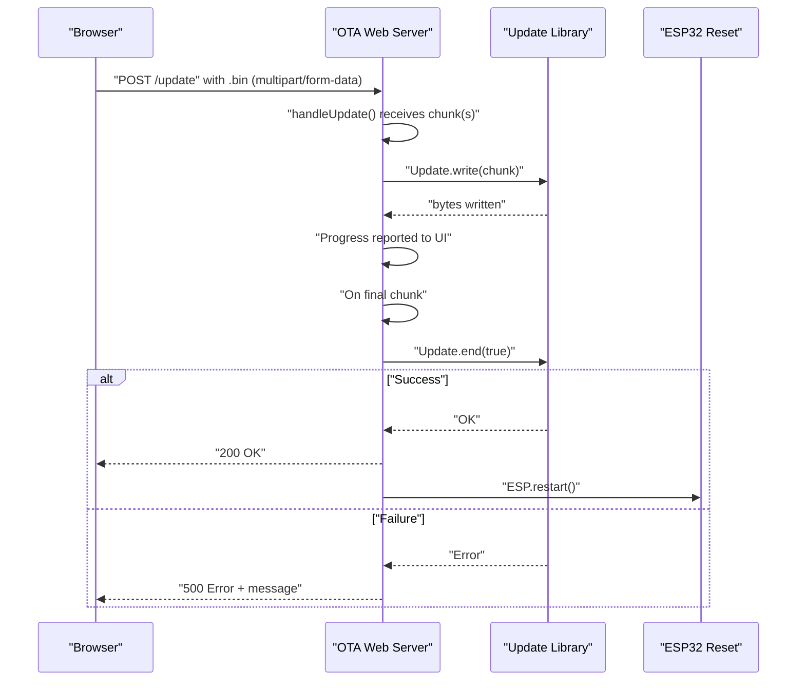
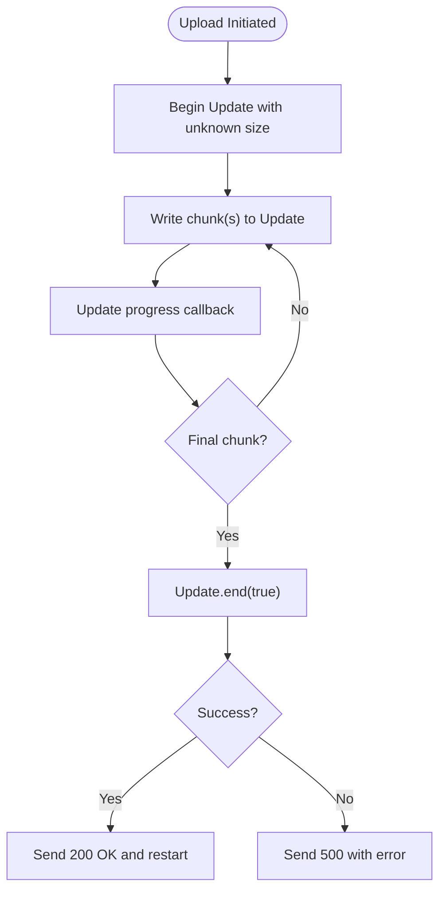
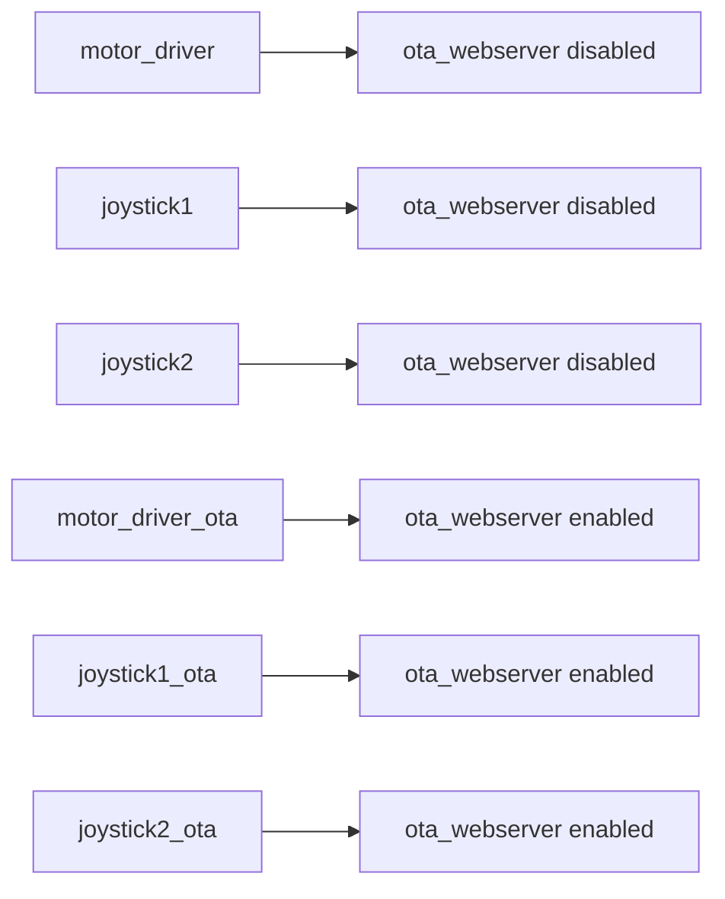
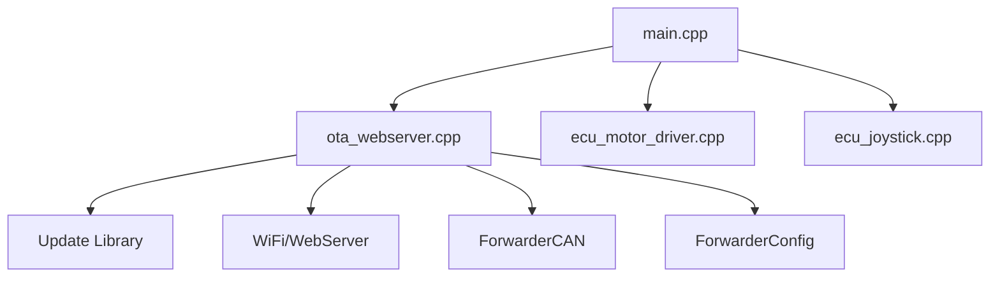

# Update Procedures and Validation

<cite>
**Referenced Files in This Document**
- [README.md](file://README.md)
- [platformio.ini](file://platformio.ini)
- [main.cpp](file://src/main.cpp)
- [ota_webserver.h](file://src/ota_webserver.h)
- [ota_webserver.cpp](file://src/ota_webserver.cpp)
- [ecu_motor_driver.cpp](file://src/ecu_motor_driver.cpp)
- [ecu_joystick.cpp](file://src/ecu_joystick.cpp)
- [ForwarderCAN.h](file://lib/ForwarderCAN/ForwarderCAN.h)
- [ForwarderCAN.cpp](file://lib/ForwarderCAN/ForwarderCAN.cpp)
- [ForwarderConfig.h](file://lib/ForwarderConfig/ForwarderConfig.h)
- [ForwarderConfig.cpp](file://lib/ForwarderConfig/ForwarderConfig.cpp)
</cite>

## Table of Contents
1. [Introduction](#introduction)
2. [Project Structure](#project-structure)
3. [Core Components](#core-components)
4. [Architecture Overview](#architecture-overview)
5. [Detailed Component Analysis](#detailed-component-analysis)
6. [Dependency Analysis](#dependency-analysis)
7. [Performance Considerations](#performance-considerations)
8. [Troubleshooting Guide](#troubleshooting-guide)
9. [Conclusion](#conclusion)
10. [Appendices](#appendices)

## Introduction
This document provides comprehensive update procedures and validation guidance for ForwarderKE OTA firmware updates. It covers the complete workflow from selecting a firmware image to verifying successful installation, including file format requirements, environment-specific build flags, chunked transfer handling, progress reporting, and system reboot behavior. It also documents compatibility checks, validation procedures, and operational differences between standard and OTA-enabled builds.

## Project Structure
The OTA update capability is implemented as an optional web server that runs only when OTA environments are selected. The repository organizes the update logic under the OTA web server module and integrates with the main application entry point and ECU-specific modules.

**Diagram sources**
- [main.cpp:19-31](file://src/main.cpp#L19-L31)
- [ota_webserver.h:3-5](file://src/ota_webserver.h#L3-L5)
- [ota_webserver.cpp:766-791](file://src/ota_webserver.cpp#L766-L791)
- [ecu_motor_driver.cpp:322-349](file://src/ecu_motor_driver.cpp#L322-L349)
- [ecu_joystick.cpp:189-233](file://src/ecu_joystick.cpp#L189-L233)
- [platformio.ini:63-79](file://platformio.ini#L63-L79)

**Section sources**
- [README.md:112-126](file://README.md#L112-L126)
- [platformio.ini:1-80](file://platformio.ini#L1-L80)
- [main.cpp:19-31](file://src/main.cpp#L19-L31)

## Core Components
- OTA Web Server: Provides Wi-Fi AP, HTTP endpoints, and chunked firmware upload handling.
- Update Library Integration: Uses the platform’s Update library for streaming writes and reboot on success.
- CAN Bus and Heartbeat: Supplies module discovery and status used by the OTA UI.
- Configuration Storage: NVS-backed storage for persistent settings and safe fallbacks.

Key responsibilities:
- Accept .bin firmware images via HTTP POST to /update.
- Stream chunks to the Update library and report progress.
- Reboot automatically after successful flash.
- Expose status and diagnostics via /api endpoints.

**Section sources**
- [ota_webserver.cpp:705-733](file://src/ota_webserver.cpp#L705-L733)
- [ota_webserver.cpp:473-492](file://src/ota_webserver.cpp#L473-L492)
- [ota_webserver.cpp:766-791](file://src/ota_webserver.cpp#L766-L791)
- [ForwarderCAN.h:38-57](file://lib/ForwarderCAN/ForwarderCAN.h#L38-L57)
- [ForwarderConfig.h:64-91](file://lib/ForwarderConfig/ForwarderConfig.h#L64-L91)

## Architecture Overview
The OTA update flow is initiated from the web UI, processed by the OTA web server, streamed to the Update library, and finalized by a controlled reboot. The CAN bus and configuration modules support diagnostics and persistence.

**Diagram sources**
- [ota_webserver.cpp:705-733](file://src/ota_webserver.cpp#L705-L733)
- [ota_webserver.cpp:473-492](file://src/ota_webserver.cpp#L473-L492)

## Detailed Component Analysis

### OTA Web Server and Update Flow
- Endpoint registration: The server registers GET / and POST /update with a multipart handler.
- Chunked transfer handling: The multipart upload handler streams chunks to Update.write and tracks progress.
- Progress reporting: The UI polls /api/state and displays upload progress.
- Success and failure: On success, the server replies 200 and triggers a restart; on failure, it returns 500 with an error message.

**Diagram sources**
- [ota_webserver.cpp:705-733](file://src/ota_webserver.cpp#L705-L733)

**Section sources**
- [ota_webserver.cpp:705-733](file://src/ota_webserver.cpp#L705-L733)
- [ota_webserver.cpp:473-492](file://src/ota_webserver.cpp#L473-L492)
- [ota_webserver.cpp:506-563](file://src/ota_webserver.cpp#L506-L563)

### Build Environments and OTA Activation
- OTA-enabled environments: motor_driver_ota, joystick1_ota, joystick2_ota include -DENABLE_OTA_WEBSERVER.
- Standard environments: motor_driver, joystick1, joystick2 do not enable the OTA web server.
- OTA builds start a Wi-Fi AP, mDNS service, and HTTP server on port 80.

**Diagram sources**
- [platformio.ini:63-79](file://platformio.ini#L63-L79)

**Section sources**
- [platformio.ini:63-79](file://platformio.ini#L63-L79)
- [ota_webserver.cpp:766-791](file://src/ota_webserver.cpp#L766-L791)

### Integration with ECU Modules
- Both motor driver and joystick modules call ota_setup() and ota_loop() when OTA is enabled.
- The OTA web server is conditionally compiled; when disabled, these calls become no-ops.

**Section sources**
- [ecu_motor_driver.cpp:322-349](file://src/ecu_motor_driver.cpp#L322-L349)
- [ecu_joystick.cpp:189-233](file://src/ecu_joystick.cpp#L189-L233)
- [ota_webserver.h:3-5](file://src/ota_webserver.h#L3-L5)
- [ota_webserver.cpp:803-804](file://src/ota_webserver.cpp#L803-L804)

### CAN Bus and Heartbeat for Diagnostics
- The OTA UI periodically requests /api/state, which includes bus statistics and detected modules.
- Heartbeat scanning correlates with module type detection, aiding pre-update diagnostics.

**Section sources**
- [ota_webserver.cpp:510-563](file://src/ota_webserver.cpp#L510-L563)
- [ota_webserver.cpp:742-761](file://src/ota_webserver.cpp#L742-L761)
- [ForwarderCAN.h:38-57](file://lib/ForwarderCAN/ForwarderCAN.h#L38-L57)

### Configuration Persistence
- NVS-backed storage persists device settings and overrides (e.g., forced address).
- While not directly part of OTA validation, persisted settings influence post-update behavior.

**Section sources**
- [ForwarderConfig.h:64-91](file://lib/ForwarderConfig/ForwarderConfig.h#L64-L91)
- [ForwarderConfig.cpp:56-74](file://lib/ForwarderConfig/ForwarderConfig.cpp#L56-L74)

## Dependency Analysis
The OTA update flow depends on:
- Platform OTA stack (Update library) for streaming firmware writes.
- Wi-Fi and HTTP stack for serving the web UI and handling uploads.
- CAN bus for runtime diagnostics and module status.
- NVS for configuration persistence.

**Diagram sources**
- [ota_webserver.cpp:1-11](file://src/ota_webserver.cpp#L1-L11)
- [main.cpp:19-31](file://src/main.cpp#L19-L31)
- [ecu_motor_driver.cpp:322-349](file://src/ecu_motor_driver.cpp#L322-L349)
- [ecu_joystick.cpp:189-233](file://src/ecu_joystick.cpp#L189-L233)

**Section sources**
- [ota_webserver.cpp:1-11](file://src/ota_webserver.cpp#L1-L11)
- [main.cpp:19-31](file://src/main.cpp#L19-L31)

## Performance Considerations
- Chunked transfer: The Update library handles streaming writes; ensure stable connectivity to avoid aborted transfers.
- Upload progress: The UI reports percentage based on XMLHttpRequest progress events; large images may take several minutes.
- Reboot timing: After successful flash, the server sends 200 and restarts; allow time for the AP to reappear.

[No sources needed since this section provides general guidance]

## Troubleshooting Guide
Common failure scenarios and causes:
- Network interruptions during upload: The multipart handler aborts the transfer; retry after reconnecting.
- Insufficient power or unstable Wi-Fi: The device may drop the connection mid-transfer; ensure reliable power and signal.
- Incorrect file format: Only .bin firmware produced by the build system is supported.
- Build mismatch: Using a non-OTA environment or incompatible binary can lead to failures.

Preventive measures:
- Use .bin files generated from the appropriate environment.
- Verify the device is reachable on the OTA AP and mDNS service.
- Ensure adequate battery or power supply during the update.

Operational notes:
- The OTA web server is compiled only when -DENABLE_OTA_WEBSERVER is present.
- On success, the device reboots automatically; on failure, the server returns an error message.

**Section sources**
- [ota_webserver.cpp:705-733](file://src/ota_webserver.cpp#L705-L733)
- [platformio.ini:63-79](file://platformio.ini#L63-L79)

## Conclusion
The ForwarderKE OTA update system provides a straightforward, browser-based workflow for updating firmware. By leveraging the Update library for streaming writes and a simple web UI for progress feedback, it enables reliable over-the-air updates when configured via OTA-enabled environments. Adhering to the documented build and update procedures, validating file formats, and ensuring stable connectivity will maximize update success rates.

[No sources needed since this section summarizes without analyzing specific files]

## Appendices

### Step-by-Step Update Procedure
1. Prepare the firmware:
   - Build the standard environment for your ECU type.
   - Locate the .bin artifact produced by the build system.
2. Enable OTA:
   - Select an OTA environment (e.g., motor_driver_ota) and flash it to the device.
3. Connect and upload:
   - Connect to the OTA Wi-Fi AP advertised by the device.
   - Open the device’s IP or mDNS address in a browser.
   - Choose the .bin file and click Update Firmware.
4. Monitor progress:
   - Observe the upload progress bar in the UI.
   - Do not disconnect until completion.
5. Complete:
   - On success, the device reboots automatically; the UI indicates rebooting and reloads after a short delay.
   - On failure, the server returns an error message; review logs and retry.

**Section sources**
- [README.md:84-103](file://README.md#L84-L103)
- [platformio.ini:63-79](file://platformio.ini#L63-L79)
- [ota_webserver.cpp:473-492](file://src/ota_webserver.cpp#L473-L492)
- [ota_webserver.cpp:717-727](file://src/ota_webserver.cpp#L717-L727)

### File Format and Size Requirements
- Supported format: .bin firmware produced by the build system.
- Size handling: The update handler accepts unknown size; the Update library manages streaming writes.
- Compatibility: Use .bin artifacts from the same environment as the target device.

**Section sources**
- [README.md:99-103](file://README.md#L99-L103)
- [ota_webserver.cpp:709-712](file://src/ota_webserver.cpp#L709-L712)

### Validation and Integrity Checks
- Checksum verification: Not implemented in the OTA handler; rely on correct .bin selection and stable transfer.
- Rollback protection: Not implemented in the OTA handler; ensure a successful reboot and verify operation.
- Post-update verification: Use the OTA UI to confirm bus status, module presence, and operational indicators.

**Section sources**
- [ota_webserver.cpp:717-727](file://src/ota_webserver.cpp#L717-L727)
- [ota_webserver.cpp:510-563](file://src/ota_webserver.cpp#L510-L563)

### Environment-Specific Compilation Flags and Deployment
- OTA environments add -DENABLE_OTA_WEBSERVER and start the web server.
- Standard environments omit OTA; OTA functions are no-ops.
- Build and flash commands are documented in the project README.

**Section sources**
- [platformio.ini:63-79](file://platformio.ini#L63-L79)
- [README.md:63-82](file://README.md#L63-L82)

### Update Scheduling, Backup, and Recovery
- Scheduling: Perform updates during maintenance windows with stable power and network conditions.
- Backup: Persisted configuration is stored in NVS; it remains intact across OTA updates.
- Recovery: If an update fails, reconnect to the OTA AP, retry with the correct .bin, and monitor logs for error details.

**Section sources**
- [ForwarderConfig.cpp:56-74](file://lib/ForwarderConfig/ForwarderConfig.cpp#L56-L74)
- [ota_webserver.cpp:728-732](file://src/ota_webserver.cpp#L728-L732)