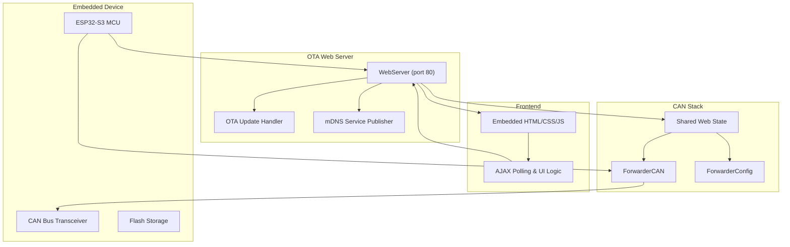
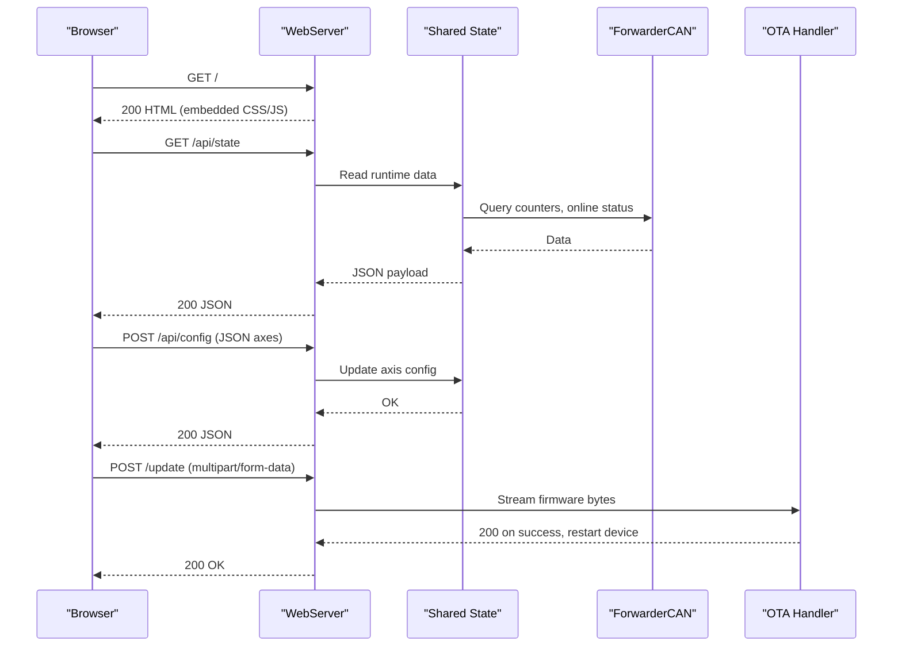
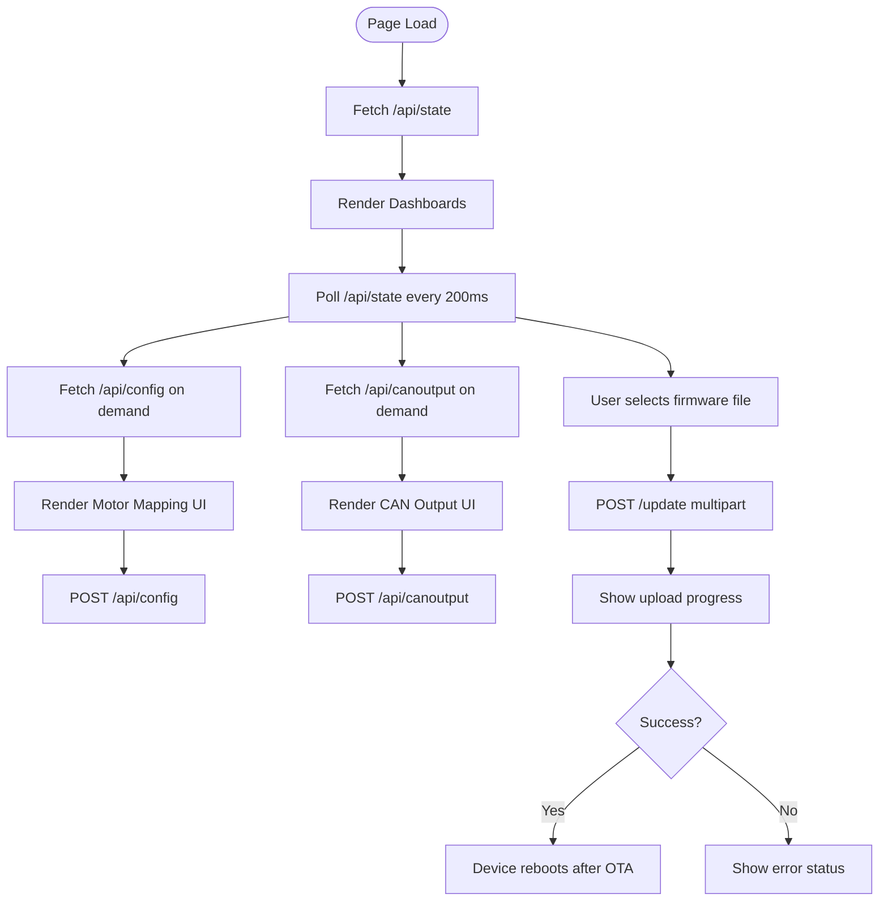
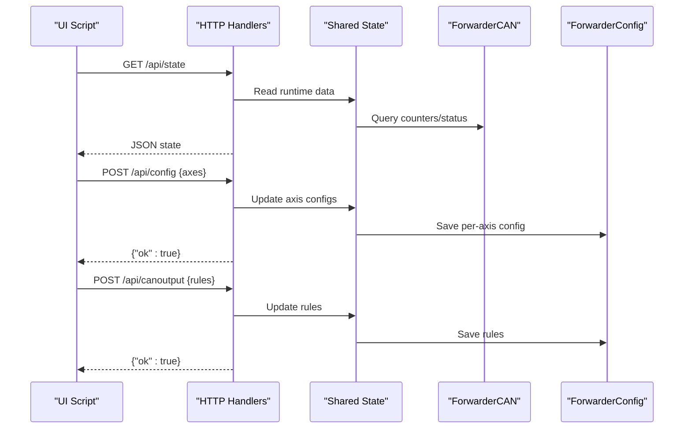
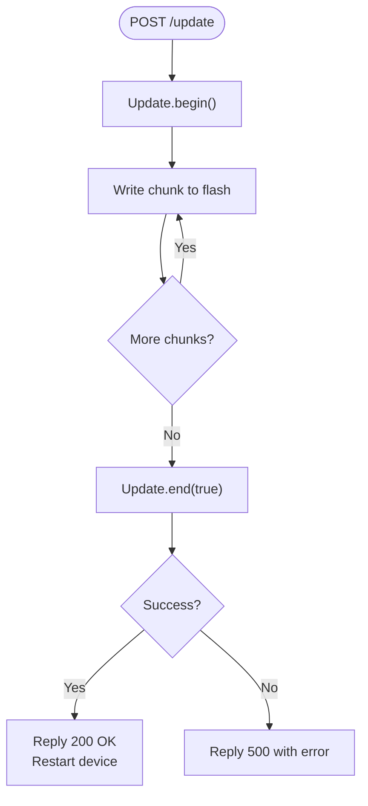
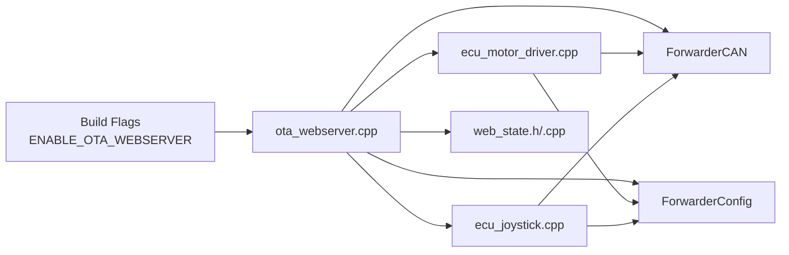

# Web Interface and Security

<cite>
**Referenced Files in This Document**
- [README.md](file://README.md)
- [platformio.ini](file://platformio.ini)
- [main.cpp](file://src/main.cpp)
- [ota_webserver.h](file://src/ota_webserver.h)
- [ota_webserver.cpp](file://src/ota_webserver.cpp)
- [web_state.h](file://src/web_state.h)
- [web_state.cpp](file://src/web_state.cpp)
- [ecu_motor_driver.cpp](file://src/ecu_motor_driver.cpp)
- [ecu_joystick.cpp](file://src/ecu_joystick.cpp)
</cite>

## Table of Contents
1. [Introduction](#introduction)
2. [Project Structure](#project-structure)
3. [Core Components](#core-components)
4. [Architecture Overview](#architecture-overview)
5. [Detailed Component Analysis](#detailed-component-analysis)
6. [Dependency Analysis](#dependency-analysis)
7. [Performance Considerations](#performance-considerations)
8. [Security Model](#security-model)
9. [Troubleshooting Guide](#troubleshooting-guide)
10. [Conclusion](#conclusion)

## Introduction
This document explains the OTA web interface and security implementation in ForwarderKE. It covers the HTML/CSS/JavaScript frontend architecture (tabbed interface, real-time dashboard, interactive controls), the embedded web server’s endpoints and OTA update mechanism, and the security model including default credentials, access point isolation, and the limited attack surface. It also documents the client-side JavaScript behavior (AJAX polling, form validation, progress tracking, and error handling), operational security considerations for field deployments, and troubleshooting guidance.

## Project Structure
ForwarderKE organizes the OTA web UI and server within the ESP32-S3 firmware. The web server is conditionally compiled via a build flag and runs only when enabled. The UI is embedded as a self-contained HTML page with inline CSS and JavaScript, served by an embedded HTTP server. The server exposes REST-like endpoints for state, configuration, CAN output rules, and firmware updates.

**Diagram sources**
- [ota_webserver.cpp:766-791](file://src/ota_webserver.cpp#L766-L791)
- [ecu_motor_driver.cpp:320-324](file://src/ecu_motor_driver.cpp#L320-L324)
- [ecu_joystick.cpp:187-191](file://src/ecu_joystick.cpp#L187-L191)

**Section sources**
- [platformio.ini:63-79](file://platformio.ini#L63-L79)
- [README.md:84-103](file://README.md#L84-L103)

## Core Components
- Embedded web server and router: Provides the UI and API endpoints under HTTP/80.
- Frontend HTML/CSS/JavaScript: Tabbed interface, real-time dashboards, and interactive controls.
- REST-like API handlers: Serve state, configuration, CAN output rules, and accept OTA uploads.
- OTA update handler: Streams firmware binary to the device flash and reboots after success.
- Shared state and CAN integration: Exposes runtime data (joystick values, solenoid outputs, module discovery) to the UI.

Key implementation references:
- Web server setup and routing: [ota_webserver.cpp:766-791](file://src/ota_webserver.cpp#L766-L791)
- Embedded HTML/CSS/JS: [ota_webserver.cpp:32-501](file://src/ota_webserver.cpp#L32-L501)
- API handlers: [ota_webserver.cpp:506-703](file://src/ota_webserver.cpp#L506-L703)
- OTA handler: [ota_webserver.cpp:705-737](file://src/ota_webserver.cpp#L705-L737)
- Shared state declarations: [web_state.h:10-23](file://src/web_state.h#L10-L23)
- Shared state defaults: [web_state.cpp:6-20](file://src/web_state.cpp#L6-L20)

**Section sources**
- [ota_webserver.cpp:32-501](file://src/ota_webserver.cpp#L32-L501)
- [ota_webserver.cpp:506-703](file://src/ota_webserver.cpp#L506-L703)
- [ota_webserver.cpp:705-737](file://src/ota_webserver.cpp#L705-L737)
- [web_state.h:10-23](file://src/web_state.h#L10-L23)
- [web_state.cpp:6-20](file://src/web_state.cpp#L6-L20)

## Architecture Overview
The OTA web server runs in access point mode, advertising an SSID and serving a static HTML page with embedded CSS and JavaScript. The JavaScript polls the backend endpoints at short intervals to render live dashboards and sends configuration updates and OTA requests.

**Diagram sources**
- [ota_webserver.cpp:506-703](file://src/ota_webserver.cpp#L506-L703)
- [ota_webserver.cpp:705-737](file://src/ota_webserver.cpp#L705-L737)
- [web_state.h:10-23](file://src/web_state.h#L10-L23)

## Detailed Component Analysis

### Embedded HTML/CSS/JavaScript Frontend
- Tabbed interface: Dashboard, Modules, Motor Mapping, CAN Output, OTA Update.
- Real-time dashboards: Joystick channels, button states, solenoid outputs, CAN stats, and module inventory.
- Interactive controls: Sliders, number inputs, checkboxes, and action buttons for saving configuration and triggering OTA.
- AJAX polling: Periodic fetches to /api/state, /api/config, and /api/canoutput; immediate POSTs for identify/address changes and CAN output rules.
- Progress tracking: Upload progress bar during OTA.
- Error handling: Status toast notifications for info/success/error.

Implementation references:
- HTML template and embedded CSS: [ota_webserver.cpp:32-173](file://src/ota_webserver.cpp#L32-L173)
- Tab switching and status notifications: [ota_webserver.cpp:273-278](file://src/ota_webserver.cpp#L273-L278), [ota_webserver.cpp:266-271](file://src/ota_webserver.cpp#L266-L271)
- Dashboard rendering (joysticks, solenoids, modules): [ota_webserver.cpp:286-374](file://src/ota_webserver.cpp#L286-L374)
- Mapping UI and save: [ota_webserver.cpp:337-421](file://src/ota_webserver.cpp#L337-L421)
- CAN output UI and save: [ota_webserver.cpp:425-471](file://src/ota_webserver.cpp#L425-L471)
- OTA upload flow: [ota_webserver.cpp:473-492](file://src/ota_webserver.cpp#L473-L492)
- Polling intervals: [ota_webserver.cpp:494-497](file://src/ota_webserver.cpp#L494-L497)

**Diagram sources**
- [ota_webserver.cpp:360-382](file://src/ota_webserver.cpp#L360-L382)
- [ota_webserver.cpp:376-382](file://src/ota_webserver.cpp#L376-L382)
- [ota_webserver.cpp:425-471](file://src/ota_webserver.cpp#L425-L471)
- [ota_webserver.cpp:473-492](file://src/ota_webserver.cpp#L473-L492)

**Section sources**
- [ota_webserver.cpp:32-173](file://src/ota_webserver.cpp#L32-L173)
- [ota_webserver.cpp:266-271](file://src/ota_webserver.cpp#L266-L271)
- [ota_webserver.cpp:286-374](file://src/ota_webserver.cpp#L286-L374)
- [ota_webserver.cpp:337-421](file://src/ota_webserver.cpp#L337-L421)
- [ota_webserver.cpp:425-471](file://src/ota_webserver.cpp#L425-L471)
- [ota_webserver.cpp:473-492](file://src/ota_webserver.cpp#L473-L492)
- [ota_webserver.cpp:494-497](file://src/ota_webserver.cpp#L494-L497)

### REST-like API Handlers
Endpoints and responsibilities:
- GET /: Serve the embedded HTML page.
- GET /api/state: Return device state (address, online status, counters, joystick data, solenoid values, module inventory).
- GET /api/config: Return motor mapping configuration.
- POST /api/config: Accept updated axis configuration and persist to storage.
- POST /api/identify: Send an identify command to a target module.
- POST /api/address: Change a module’s address.
- GET /api/canoutput: Return CAN-triggered GPIO output rules.
- POST /api/canoutput: Accept updated CAN output rules and reinitialize outputs.
- POST /update: Accept firmware upload and trigger OTA.

Implementation references:
- Root handler: [ota_webserver.cpp:506](file://src/ota_webserver.cpp#L506)
- State handler: [ota_webserver.cpp:510-563](file://src/ota_webserver.cpp#L510-L563)
- Config handlers: [ota_webserver.cpp:565-626](file://src/ota_webserver.cpp#L565-L626)
- Identify/address handlers: [ota_webserver.cpp:639-657](file://src/ota_webserver.cpp#L639-L657)
- CAN output handlers: [ota_webserver.cpp:659-703](file://src/ota_webserver.cpp#L659-L703)
- Update handlers: [ota_webserver.cpp:705-737](file://src/ota_webserver.cpp#L705-L737)

**Diagram sources**
- [ota_webserver.cpp:510-563](file://src/ota_webserver.cpp#L510-L563)
- [ota_webserver.cpp:565-626](file://src/ota_webserver.cpp#L565-L626)
- [ota_webserver.cpp:659-703](file://src/ota_webserver.cpp#L659-L703)

**Section sources**
- [ota_webserver.cpp:506-703](file://src/ota_webserver.cpp#L506-L703)

### OTA Update Handler
- Upload endpoint accepts multipart/form-data.
- Streams firmware bytes to the ESP32 flash via the built-in update library.
- On completion, replies 200 and triggers a device restart.
- Tracks OTA activity state to reflect progress and prevent concurrent operations.

Implementation references:
- Upload handler: [ota_webserver.cpp:705-737](file://src/ota_webserver.cpp#L705-L737)
- OTA state flag: [ota_webserver.cpp:14](file://src/ota_webserver.cpp#L14), [ota_webserver.cpp:798-800](file://src/ota_webserver.cpp#L798-L800)

**Diagram sources**
- [ota_webserver.cpp:705-737](file://src/ota_webserver.cpp#L705-L737)

**Section sources**
- [ota_webserver.cpp:705-737](file://src/ota_webserver.cpp#L705-L737)

### Shared State and CAN Integration
- Shared state exposes runtime data (joystick values, solenoid outputs, module inventory) to the UI.
- CAN integration provides counters, online status, and heartbeat-driven module discovery.
- Defaults for missing ECU builds are provided to keep the web server functional regardless of compile-time selection.

Implementation references:
- Shared state declarations: [web_state.h:10-23](file://src/web_state.h#L10-L23)
- Defaults for non-selected ECUs: [web_state.cpp:6-20](file://src/web_state.cpp#L6-L20)
- Heartbeat scanning and module tracking: [ota_webserver.cpp:742-761](file://src/ota_webserver.cpp#L742-L761)

**Section sources**
- [web_state.h:10-23](file://src/web_state.h#L10-L23)
- [web_state.cpp:6-20](file://src/web_state.cpp#L6-L20)
- [ota_webserver.cpp:742-761](file://src/ota_webserver.cpp#L742-L761)

## Dependency Analysis
The OTA web server integrates with the ECU setup/loop lifecycle and depends on shared state and CAN libraries.

**Diagram sources**
- [platformio.ini:63-79](file://platformio.ini#L63-L79)
- [ecu_motor_driver.cpp:320-324](file://src/ecu_motor_driver.cpp#L320-L324)
- [ecu_joystick.cpp:187-191](file://src/ecu_joystick.cpp#L187-L191)
- [web_state.h:10-23](file://src/web_state.h#L10-L23)

**Section sources**
- [platformio.ini:63-79](file://platformio.ini#L63-L79)
- [ecu_motor_driver.cpp:320-324](file://src/ecu_motor_driver.cpp#L320-L324)
- [ecu_joystick.cpp:187-191](file://src/ecu_joystick.cpp#L187-L191)
- [web_state.h:10-23](file://src/web_state.h#L10-L23)

## Performance Considerations
- Polling interval: The UI polls /api/state every 200 ms, balancing responsiveness and CPU/network usage.
- JSON construction: Server-side JSON building uses string concatenation; consider a streaming JSON library in future iterations for larger payloads.
- OTA throughput: Upload speed depends on the wireless channel quality; large binaries may take several seconds.
- UI rendering: Grid layouts and progress bars are lightweight; avoid excessive DOM manipulation in hot paths.

[No sources needed since this section provides general guidance]

## Security Model
- Access point mode: The device starts a Wi-Fi access point in softAP mode, isolated from external networks.
- Default SSID and password: The AP SSID is derived from the device hostname; the password is set to a fixed value. The README documents the default password for OTA-enabled builds.
- Limited attack surface: The embedded server listens only on port 80 with a small set of endpoints; no HTTPS/TLS is present.
- Network isolation: Devices operate on a dedicated AP, not connected to corporate or public networks.
- Credentials: Default Wi-Fi password is provided in the documentation; users should change it post-deployment.
- OTA security: No signature verification or encryption; firmware updates occur over the local AP.

Implementation references:
- AP setup and mDNS: [ota_webserver.cpp:766-791](file://src/ota_webserver.cpp#L766-L791)
- Build flag enabling OTA: [platformio.ini:63-79](file://platformio.ini#L63-L79)
- README OTA instructions and default password: [README.md:84-103](file://README.md#L84-L103)

**Section sources**
- [ota_webserver.cpp:766-791](file://src/ota_webserver.cpp#L766-L791)
- [platformio.ini:63-79](file://platformio.ini#L63-L79)
- [README.md:84-103](file://README.md#L84-L103)

## Troubleshooting Guide
Common issues and resolutions:
- Cannot connect to AP or reach UI:
  - Verify the device booted and the AP started. Confirm the SSID and password per the README.
  - Ensure the device is powered and not stuck in a boot loop.
  - Reference: [README.md:84-103](file://README.md#L84-L103)
- UI does not load or shows blank screen:
  - Check that the root endpoint serves the HTML page.
  - Reference: [ota_webserver.cpp:506](file://src/ota_webserver.cpp#L506)
- Real-time dashboards not updating:
  - Confirm polling interval and network connectivity.
  - Reference: [ota_webserver.cpp:494-497](file://src/ota_webserver.cpp#L494-L497)
- OTA upload fails:
  - Ensure the selected file is a valid .bin produced by the build system.
  - Check upload progress and error messages; retry with a stable connection.
  - Reference: [ota_webserver.cpp:705-737](file://src/ota_webserver.cpp#L705-L737), [README.md:99-103](file://README.md#L99-L103)
- Address change or identify commands do not work:
  - Confirm the target address is valid and reachable on the CAN bus.
  - Reference: [ota_webserver.cpp:639-657](file://src/ota_webserver.cpp#L639-L657)
- Browser compatibility:
  - The UI relies on modern fetch/XHR APIs and ES6 features; use recent desktop/mobile browsers.
  - Reference: [ota_webserver.cpp:360-382](file://src/ota_webserver.cpp#L360-L382)

**Section sources**
- [README.md:84-103](file://README.md#L84-L103)
- [ota_webserver.cpp:506](file://src/ota_webserver.cpp#L506)
- [ota_webserver.cpp:494-497](file://src/ota_webserver.cpp#L494-L497)
- [ota_webserver.cpp:705-737](file://src/ota_webserver.cpp#L705-L737)
- [ota_webserver.cpp:639-657](file://src/ota_webserver.cpp#L639-L657)
- [ota_webserver.cpp:360-382](file://src/ota_webserver.cpp#L360-L382)

## Conclusion
The ForwarderKE OTA web interface delivers a compact, real-time UI with straightforward controls for firmware updates and device configuration. Its security posture relies on access point isolation and a fixed default password, suitable for controlled field deployments. Production environments should enforce stronger credentials, network segmentation, and consider additional security layers such as HTTPS/TLS and signed firmware updates. For day-to-day operation, the embedded UI’s polling and AJAX-driven interactions provide a responsive experience with clear feedback.

[No sources needed since this section summarizes without analyzing specific files]