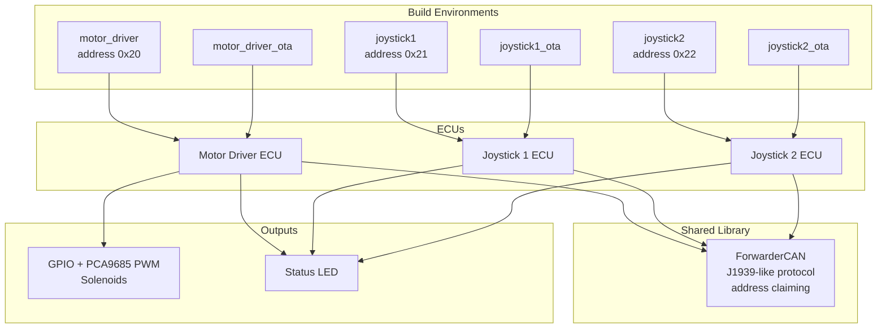
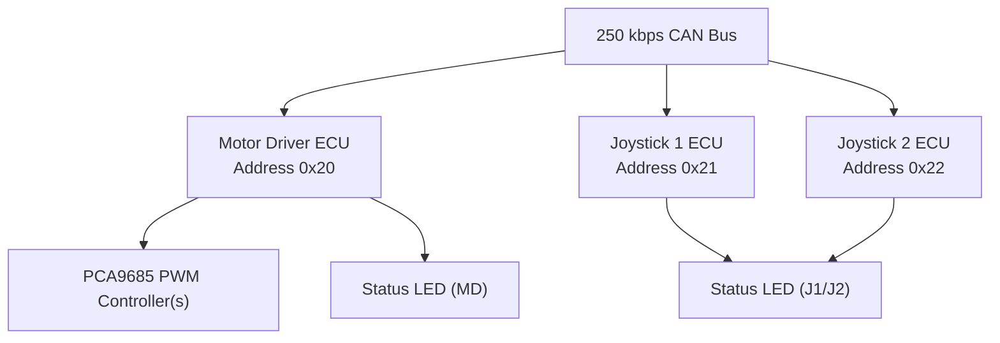
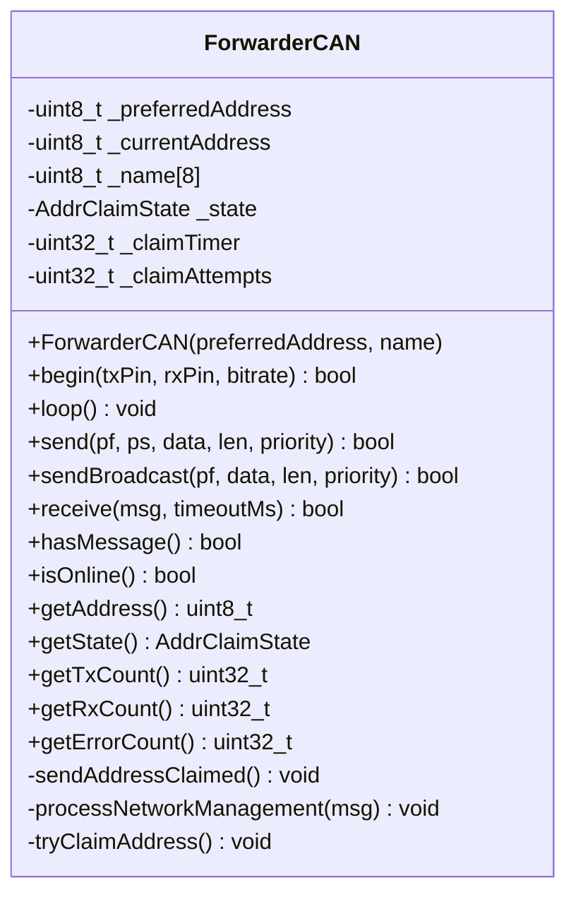
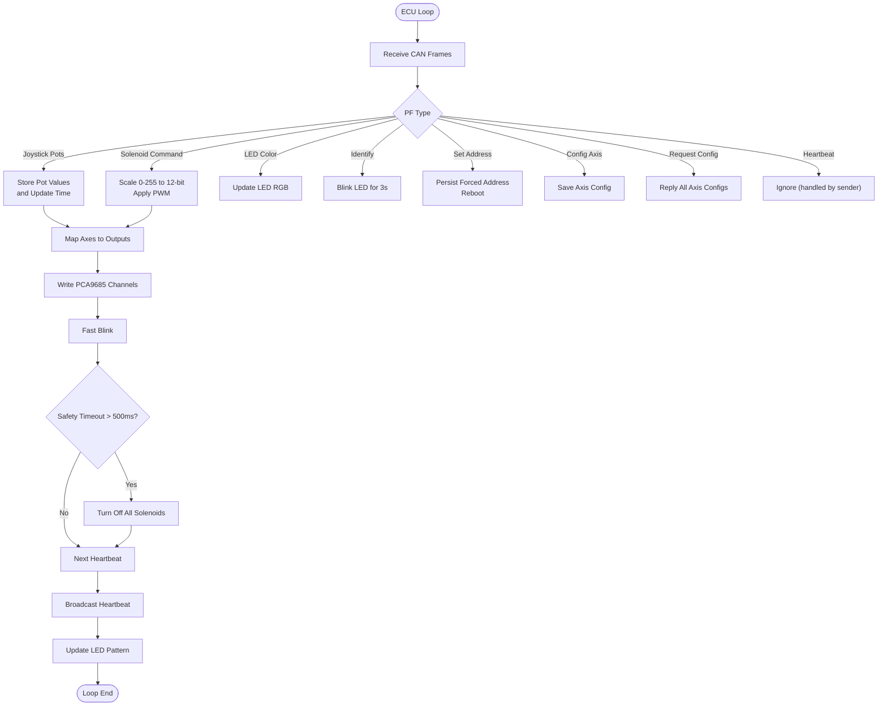
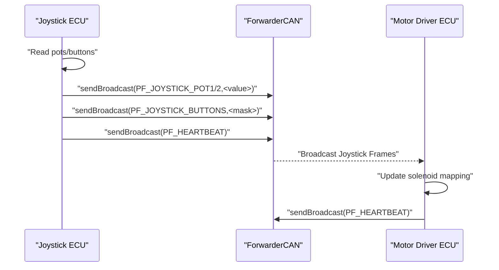
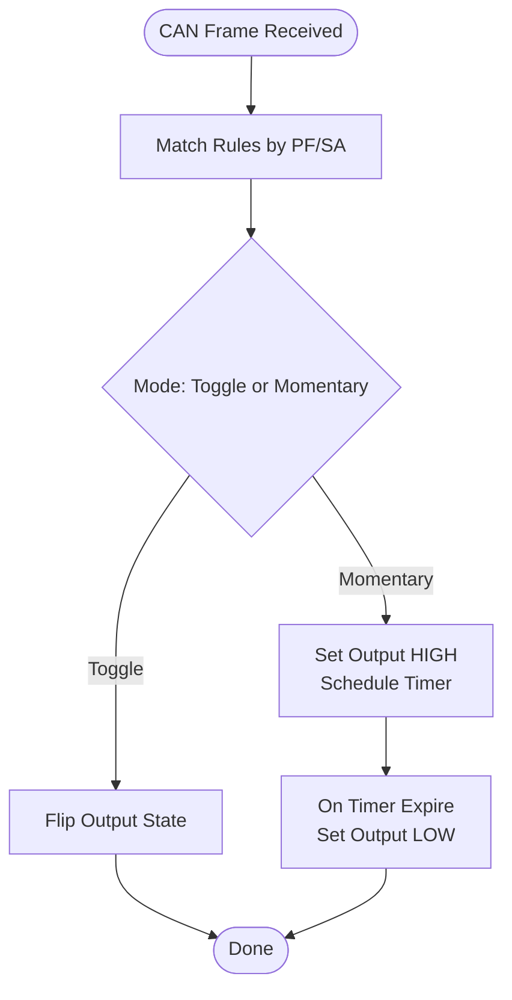
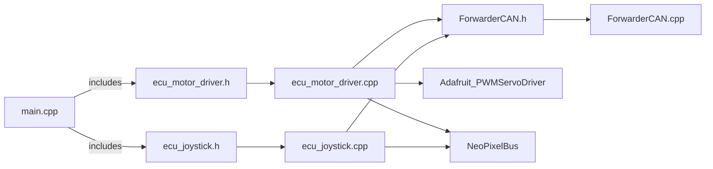

# Project Overview

<cite>
**Referenced Files in This Document**
- [README.md](file://README.md)
- [main.cpp](file://src/main.cpp)
- [platformio.ini](file://platformio.ini)
- [ForwarderCAN.h](file://lib/ForwarderCAN/ForwarderCAN.h)
- [ForwarderCAN.cpp](file://lib/ForwarderCAN/ForwarderCAN.cpp)
- [ecu_motor_driver.cpp](file://src/ecu_motor_driver.cpp)
- [ecu_motor_driver.h](file://src/ecu_motor_driver.h)
- [ecu_joystick.cpp](file://src/ecu_joystick.cpp)
- [ecu_joystick.h](file://src/ecu_joystick.h)
- [can_output.h](file://src/can_output.h)
- [can_output.cpp](file://src/can_output.cpp)
- [web_state.h](file://src/web_state.h)
- [web_state.cpp](file://src/web_state.cpp)
</cite>

## Table of Contents
1. [Introduction](#introduction)
2. [Project Structure](#project-structure)
3. [Core Components](#core-components)
4. [Architecture Overview](#architecture-overview)
5. [Detailed Component Analysis](#detailed-component-analysis)
6. [Dependency Analysis](#dependency-analysis)
7. [Performance Considerations](#performance-considerations)
8. [Troubleshooting Guide](#troubleshooting-guide)
9. [Conclusion](#conclusion)

## Introduction
ForwarderKE is an open-source, ESP32-S3-based control system designed to replace factory controllers in agricultural forwarder (logging machine) hydraulic valve blocks. It implements a J1939-like CAN protocol over a 250 kbps bus to coordinate a three-ECU architecture: a Motor Driver ECU controlling solenoids, and two Joystick ECUs for operator input. The system emphasizes robustness, safety, and transparency through open-source firmware and hardware, enabling operators and integrators to customize and maintain their equipment independently.

Target applications include:
- Replacing proprietary controllers in forwarders and similar agricultural machines
- Providing a transparent, modifiable control stack for research, education, and rapid prototyping
- Enabling field diagnostics, remote updates (OTA), and flexible I/O mapping

Key benefits of the open-source approach:
- Full visibility into control logic and communication
- Community-driven improvements and bug fixes
- Reduced vendor lock-in and long-term maintenance costs
- Support for custom I/O mapping and output rules

## Project Structure
The project is organized around a small set of libraries and ECUs:
- A shared CAN/J1939-like library encapsulates protocol parsing, address claiming, and TWAI driver integration
- Two ECU implementations: one for joysticks (inputs) and one for motor control (outputs)
- A small CAN output rule engine for mapping CAN events to GPIO pins
- A web state module exposing runtime state for optional OTA web UI
- Build environments managed via PlatformIO with separate targets for each ECU and OTA variants

**Diagram sources**
- [platformio.ini:17-79](file://platformio.ini#L17-L79)
- [ForwarderCAN.h:66-119](file://lib/ForwarderCAN/ForwarderCAN.h#L66-L119)
- [ecu_motor_driver.cpp:290-323](file://src/ecu_motor_driver.cpp#L290-L323)
- [ecu_joystick.cpp:159-191](file://src/ecu_joystick.cpp#L159-L191)

**Section sources**
- [README.md:112-126](file://README.md#L112-L126)
- [platformio.ini:1-80](file://platformio.ini#L1-L80)

## Core Components
- ForwarderCAN library: Implements J1939-like 29-bit ID layout, address claiming, and TWAI driver integration. Provides APIs for sending/receiving messages, broadcasting, and monitoring statistics.
- Motor Driver ECU: Reads joystick data, maps axes to solenoid outputs via PCA9685 PWM, manages LEDs, and supports configuration and heartbeat messages.
- Joystick ECUs: Read analog pots and buttons, publish joystick data and button states, manage LEDs, and handle address assignment requests.
- CAN Output Rules: Optional mapping of CAN frames to GPIO pins for toggling or momentary pulses.

**Section sources**
- [ForwarderCAN.h:66-119](file://lib/ForwarderCAN/ForwarderCAN.h#L66-L119)
- [ecu_motor_driver.cpp:290-350](file://src/ecu_motor_driver.cpp#L290-L350)
- [ecu_joystick.cpp:159-236](file://src/ecu_joystick.cpp#L159-L236)
- [can_output.h:7-11](file://src/can_output.h#L7-L11)

## Architecture Overview
The system operates on a 250 kbps CAN bus with J1939-like addressing. Three ECUs coexist:
- Motor Driver ECU at address 0x20 controls 8 solenoids (16 with dual PCA9685), receives joystick data, and broadcasts heartbeat/status
- Joystick 1 ECU at address 0x21 reads 3 pots + 2 buttons and publishes joystick frames
- Joystick 2 ECU at address 0x22 mirrors joystick 1’s role

**Diagram sources**
- [README.md:8-14](file://README.md#L8-L14)
- [platformio.ini:17-61](file://platformio.ini#L17-L61)
- [ecu_motor_driver.cpp:39-41](file://src/ecu_motor_driver.cpp#L39-L41)
- [ecu_joystick.cpp:39](file://src/ecu_joystick.cpp#L39)

## Detailed Component Analysis

### ForwarderCAN Library
The library encapsulates:
- J1939-like ID packing/unpacking macros and constants
- Address claiming state machine with arbitration and retries
- TWAI driver initialization, bus-off recovery, and message send/receive
- Statistics counters for TX/RX/error counts

**Diagram sources**
- [ForwarderCAN.h:66-119](file://lib/ForwarderCAN/ForwarderCAN.h#L66-L119)
- [ForwarderCAN.cpp:3-119](file://lib/ForwarderCAN/ForwarderCAN.cpp#L3-L119)

**Section sources**
- [ForwarderCAN.h:9-57](file://lib/ForwarderCAN/ForwarderCAN.h#L9-L57)
- [ForwarderCAN.cpp:13-52](file://lib/ForwarderCAN/ForwarderCAN.cpp#L13-L52)
- [ForwarderCAN.cpp:54-119](file://lib/ForwarderCAN/ForwarderCAN.cpp#L54-L119)

### Motor Driver ECU
Responsibilities:
- Initialize PCA9685 PWM controllers (detect dual controller), set frequency, and map axis values to PWM
- Receive joystick pots and buttons, compute solenoid outputs per axis configuration, and apply deadband/bidirectional mapping
- Handle LED color, identify, and heartbeat messages; enforce safety timeout to turn off solenoids after inactivity
- Manage CAN output rules for GPIO mapping

**Diagram sources**
- [ecu_motor_driver.cpp:184-275](file://src/ecu_motor_driver.cpp#L184-L275)
- [ecu_motor_driver.cpp:137-151](file://src/ecu_motor_driver.cpp#L137-L151)
- [ecu_motor_driver.cpp:330-335](file://src/ecu_motor_driver.cpp#L330-L335)
- [ecu_motor_driver.cpp:277-288](file://src/ecu_motor_driver.cpp#L277-L288)

**Section sources**
- [ecu_motor_driver.cpp:290-350](file://src/ecu_motor_driver.cpp#L290-L350)
- [ecu_motor_driver.cpp:69-99](file://src/ecu_motor_driver.cpp#L69-L99)
- [ecu_motor_driver.cpp:101-135](file://src/ecu_motor_driver.cpp#L101-L135)
- [ecu_motor_driver.cpp:184-275](file://src/ecu_motor_driver.cpp#L184-L275)

### Joystick ECUs
Responsibilities:
- Read 3 pots and 2 buttons, publish pot and button frames at ~100 ms intervals or on change
- Respond to LED color and identify commands; persist forced address on request
- Broadcast heartbeat with online status and counters

**Diagram sources**
- [ecu_joystick.cpp:194-236](file://src/ecu_joystick.cpp#L194-L236)
- [ecu_motor_driver.cpp:184-204](file://src/ecu_motor_driver.cpp#L184-L204)

**Section sources**
- [ecu_joystick.cpp:159-191](file://src/ecu_joystick.cpp#L159-L191)
- [ecu_joystick.cpp:194-236](file://src/ecu_joystick.cpp#L194-L236)

### CAN Output Rules Engine
Maps incoming CAN frames to GPIO pins:
- Toggle mode flips output state on match
- Momentary mode sets output HIGH for a configured duration then LOW

**Diagram sources**
- [can_output.cpp:29-61](file://src/can_output.cpp#L29-L61)

**Section sources**
- [can_output.h:7-11](file://src/can_output.h#L7-L11)
- [can_output.cpp:7-19](file://src/can_output.cpp#L7-L19)
- [can_output.cpp:29-61](file://src/can_output.cpp#L29-L61)

## Dependency Analysis
- Build-time selection: The main entry chooses the ECU implementation via build flags, ensuring only one ECU is compiled per environment.
- Runtime dependencies:
  - ECUs depend on ForwarderCAN for protocol and addressing
  - Motor Driver depends on PCA9685 drivers and NeoPixel for LEDs
  - Joystick ECUs depend on NeoPixel for LEDs and optional CAN SE pin for transceiver enable
  - Optional OTA web server is enabled per environment

**Diagram sources**
- [main.cpp:11-17](file://src/main.cpp#L11-L17)
- [ecu_motor_driver.cpp:1-12](file://src/ecu_motor_driver.cpp#L1-L12)
- [ecu_joystick.cpp:1-9](file://src/ecu_joystick.cpp#L1-L9)
- [ForwarderCAN.h:3-4](file://lib/ForwarderCAN/ForwarderCAN.h#L3-L4)
- [ForwarderCAN.cpp:1](file://lib/ForwarderCAN/ForwarderCAN.cpp#L1)

**Section sources**
- [main.cpp:11-17](file://src/main.cpp#L11-L17)
- [platformio.ini:17-79](file://platformio.ini#L17-L79)

## Performance Considerations
- TWAI driver tuning: The library configures TX/RX queues and timing based on bitrate, ensuring reliable frame reception under load.
- Address claiming: The state machine retries up to a limit and falls back to an alternate address derived from the device name, minimizing startup stalls.
- Safety timeout: The motor driver disables solenoids after 500 ms without CAN commands, preventing unintended actuation.
- Heartbeat cadence: All ECUs broadcast status every 1 second, balancing diagnostics visibility with bus utilization.

[No sources needed since this section provides general guidance]

## Troubleshooting Guide
Common issues and remedies:
- CAN initialization failure: The motor driver flashes a red LED pattern and loops when TWAI fails to start; verify wiring and pin assignments.
- Address collision: If another ECU occupies the preferred address, the claiming state machine retries and may switch to an alternate address; check logs for claim attempts and verify unique addresses.
- Bus-off state: The library automatically initiates recovery upon detecting bus-off; inspect wiring and power integrity if recovery loops occur frequently.
- OTA upload problems: Ensure the correct environment is selected and the device connects to the AP; confirm the generated firmware binary location.

**Section sources**
- [ecu_motor_driver.cpp:305-316](file://src/ecu_motor_driver.cpp#L305-L316)
- [ForwarderCAN.cpp:42-47](file://lib/ForwarderCAN/ForwarderCAN.cpp#L42-L47)
- [ForwarderCAN.cpp:98-109](file://lib/ForwarderCAN/ForwarderCAN.cpp#L98-L109)
- [README.md:84-103](file://README.md#L84-L103)

## Conclusion
ForwarderKE delivers a robust, open-source replacement for factory controllers in agricultural forwarders. Its J1939-like protocol, three-ECU architecture, and safety-focused design enable reliable operation in demanding environments. The modular library and clear separation of concerns make it straightforward to extend, debug, and deploy across diverse applications.