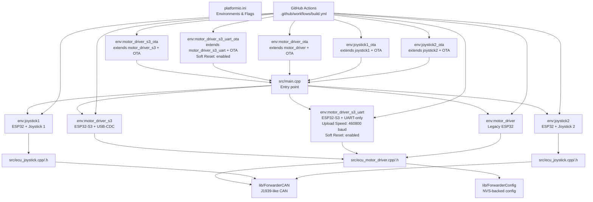
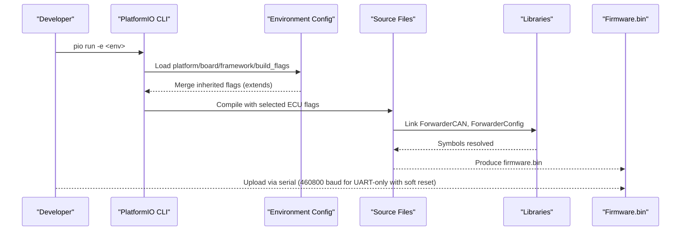
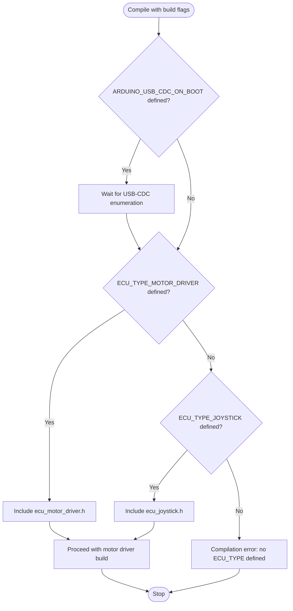
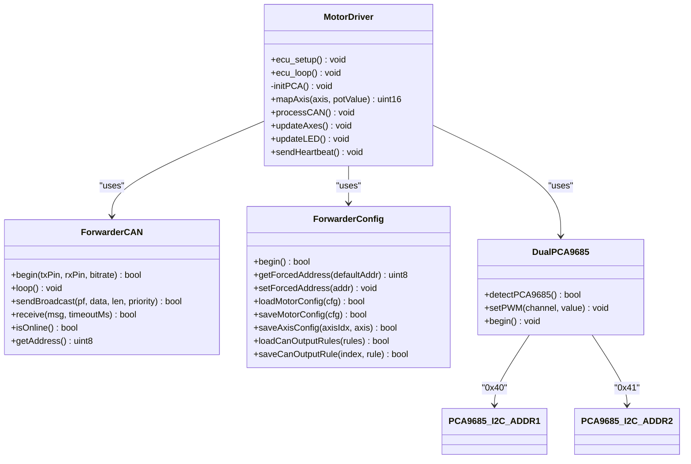
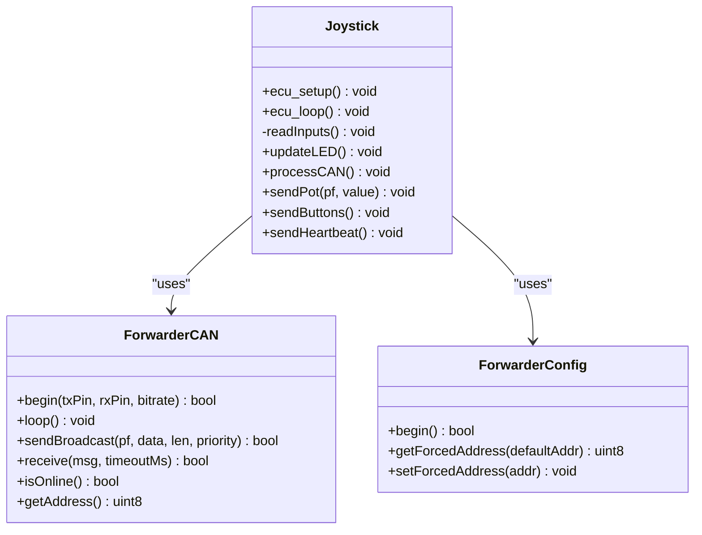
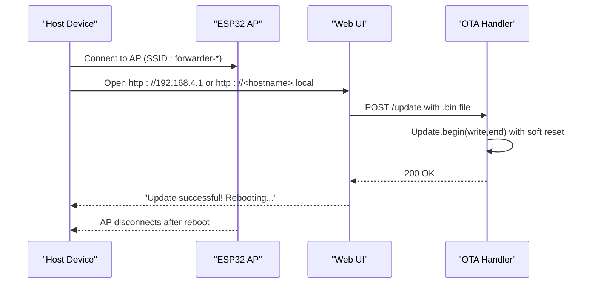
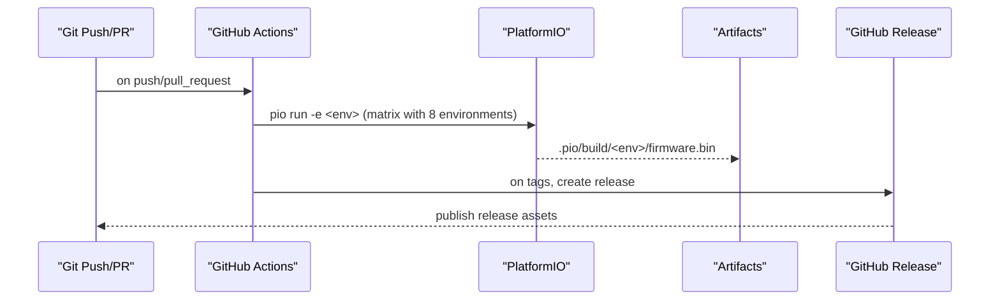
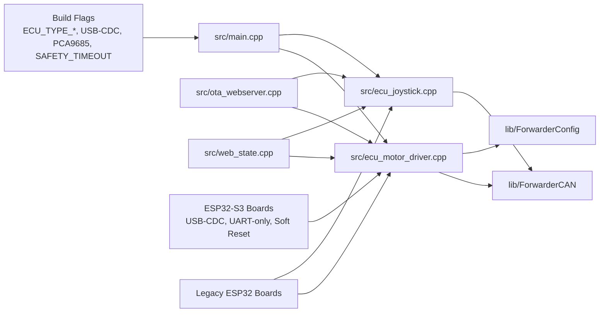

# Build System Configuration

<cite>
**Referenced Files in This Document**
- [platformio.ini](file://platformio.ini)
- [.github/workflows/build.yml](file://.github/workflows/build.yml)
- [README.md](file://README.md)
- [src/main.cpp](file://src/main.cpp)
- [src/ecu_motor_driver.cpp](file://src/ecu_motor_driver.cpp)
- [src/ecu_motor_driver.h](file://src/ecu_motor_driver.h)
- [src/ecu_joystick.cpp](file://src/ecu_joystick.cpp)
- [src/ecu_joystick.h](file://src/ecu_joystick.h)
- [src/ota_webserver.cpp](file://src/ota_webserver.cpp)
- [src/ota_webserver.h](file://src/ota_webserver.h)
- [src/web_state.cpp](file://src/web_state.cpp)
- [src/web_state.h](file://src/web_state.h)
- [src/can_output.cpp](file://src/can_output.cpp)
- [lib/ForwarderCAN/ForwarderCAN.h](file://lib/ForwarderCAN/ForwarderCAN.h)
- [lib/ForwarderConfig/ForwarderConfig.h](file://lib/ForwarderConfig/ForwarderConfig.h)
- [build_flash.bat](file://build_flash.bat)
</cite>

## Update Summary
**Changes Made**
- Updated safety timeout from 80ms to 200ms across all environments for improved reliability
- Added soft_reset upload flags for ESP32-S3 boards to enhance OTA update reliability
- Enhanced upload speed configuration from 115200 to 460800 baud for ESP32-S3 UART-only environment
- Updated troubleshooting section to include upload speed and safety timeout considerations

## Table of Contents
1. [Introduction](#introduction)
2. [Project Structure](#project-structure)
3. [Core Components](#core-components)
4. [Architecture Overview](#architecture-overview)
5. [Detailed Component Analysis](#detailed-component-analysis)
6. [Dependency Analysis](#dependency-analysis)
7. [Performance Considerations](#performance-considerations)
8. [Troubleshooting Guide](#troubleshooting-guide)
9. [Conclusion](#conclusion)
10. [Appendices](#appendices)

## Introduction
This document explains the build system for ForwarderKE's PlatformIO configuration. It covers the eight distinct build environments, their purposes, and how they target different ECU types and deployment scenarios. The system now includes expanded ESP32-S3 support with USB-CDC enabled and UART-only variants, plus dual PCA9685 I2C addressing for enhanced hardware capabilities. It details compiler flags, build options, and ESP32-specific settings, describes the environment variable system for selecting ECU types, documents the release management process, and explains cross-compilation setup. Practical examples and troubleshooting guidance are included, along with CI/CD pipeline integration via GitHub Actions and automated release workflows.

## Project Structure
The project is organized around PlatformIO environments defined in the configuration file. Each environment compiles either the motor driver ECU or one of two joystick ECUs, with optional over-the-air (OTA) capabilities. The source tree separates ECU logic and shared libraries, while the CI workflow automates builds and releases across both legacy ESP32 and new ESP32-S3 targets.

**Diagram sources**
- [platformio.ini:1-148](file://platformio.ini#L1-L148)
- [src/main.cpp:1-39](file://src/main.cpp#L1-L39)
- [src/ecu_motor_driver.cpp:1-479](file://src/ecu_motor_driver.cpp#L1-L479)
- [src/ecu_joystick.cpp:1-239](file://src/ecu_joystick.cpp#L1-L239)
- [.github/workflows/build.yml:1-81](file://.github/workflows/build.yml#L1-L81)
- [lib/ForwarderCAN/ForwarderCAN.h:1-137](file://lib/ForwarderCAN/ForwarderCAN.h#L1-L137)
- [lib/ForwarderConfig/ForwarderConfig.h:1-100](file://lib/ForwarderConfig/ForwarderConfig.h#L1-L100)

**Section sources**
- [platformio.ini:1-148](file://platformio.ini#L1-L148)
- [README.md:1-194](file://README.md#L1-L194)

## Core Components
- PlatformIO configuration defines a base environment and eight environments: three ESP32-S3 variants (USB-CDC enabled, UART-only, and legacy), two joystick environments, plus four OTA variants extending the base environments.
- The entry point selects the ECU implementation at compile time via build flags.
- ECU-specific implementations configure hardware pins, CAN bitrates, and device-specific peripherals.
- Shared libraries encapsulate CAN protocol handling and persistent configuration.
- GitHub Actions automates builds for all environments and creates releases from tagged commits.

**Section sources**
- [platformio.ini:1-148](file://platformio.ini#L1-L148)
- [src/main.cpp:1-39](file://src/main.cpp#L1-L39)
- [lib/ForwarderCAN/ForwarderCAN.h:1-137](file://lib/ForwarderCAN/ForwarderCAN.h#L1-L137)
- [lib/ForwarderConfig/ForwarderConfig.h:1-100](file://lib/ForwarderConfig/ForwarderConfig.h#L1-L100)
- [.github/workflows/build.yml:1-81](file://.github/workflows/build.yml#L1-L81)

## Architecture Overview
The build system centers on PlatformIO environments that inject compile-time flags to choose the ECU type and board-specific pin assignments. The entry point conditionally includes the appropriate ECU module. OTA-enabled environments add a Wi-Fi AP and web server for firmware updates. The CI pipeline builds all environments and, on tag pushes, packages firmware binaries into a GitHub Release. The new ESP32-S3 variants offer enhanced USB-CDC support and flexible UART configurations for different deployment scenarios, with optimized upload speeds for improved development workflow and enhanced OTA reliability through soft reset uploads.

**Diagram sources**
- [platformio.ini:1-148](file://platformio.ini#L1-L148)
- [src/main.cpp:1-39](file://src/main.cpp#L1-L39)
- [src/ecu_motor_driver.cpp:1-479](file://src/ecu_motor_driver.cpp#L1-L479)
- [src/ecu_joystick.cpp:1-239](file://src/ecu_joystick.cpp#L1-L239)
- [lib/ForwarderCAN/ForwarderCAN.h:1-137](file://lib/ForwarderCAN/ForwarderCAN.h#L1-L137)
- [lib/ForwarderConfig/ForwarderConfig.h:1-100](file://lib/ForwarderConfig/ForwarderConfig.h#L1-L100)

## Detailed Component Analysis

### Build Environments and Purposes
- Base environment settings:
  - Platform: ESP32 Arduino framework
  - Board: ESP32-S3 DevKit C-1 by default
  - Monitor speed: 115200
  - Global libraries: Adafruit PWM Servo Driver, NeoPixelBus
  - Global build flags: CAN bitrate, protocol priority, watchdog timeout
- **ESP32-S3 USB-CDC Enabled** (`motor_driver_s3`):
  - Selects motor driver ECU with USB-CDC support
  - Uses ESP32-S3 Box board with 8MB flash partition
  - Enables `ARDUINO_USB_CDC_ON_BOOT=1` for USB serial support
  - CAN TX/RX pins, onboard WS2812 LED pin, dual PCA9685 I2C pins and addresses
  - Safety timeout for solenoid outputs increased to 200ms for improved reliability
- **ESP32-S3 UART-Only** (`motor_driver_s3_uart`):
  - Selects motor driver ECU without USB-CDC
  - Uses standard ESP32-S3 DevKit C-1 board
  - Same pin assignments as S3 variant but without USB-CDC
  - Upload speed set to 460800 baud for significantly faster serial flashing
  - Soft reset upload flags enabled for enhanced OTA reliability
- **Legacy ESP32** (`motor_driver`):
  - Traditional motor driver ECU for T-CAN boards
  - Uses ESP32 DevKit with legacy pin assignments
  - CAN TX/RX pins, onboard WS2812 LED pin, dual PCA9685 I2C pins and addresses
  - Safety timeout for solenoid outputs increased to 200ms for improved reliability
- **Joystick Environments** (`joystick1`, `joystick2`):
  - Selects joystick ECU with 3 pots and 2 buttons
  - Preferred address and joystick ID constants
  - CAN TX/RX/SE pins, onboard WS2812 LED pin
  - Potentiometer and button pins
  - Safety timeout for solenoid outputs increased to 200ms for improved reliability
- **OTA Variants**:
  - Extend their respective base environments
  - Add a flag enabling the embedded OTA web server
  - Soft reset upload flags enabled for ESP32-S3 variants

Practical usage examples:
- Build ESP32-S3 USB-CDC motor driver: `pio run -e motor_driver_s3`
- Build ESP32-S3 UART-only motor driver: `pio run -e motor_driver_s3_uart`
- Build legacy ESP32 motor driver: `pio run -e motor_driver`
- Build joystick 1: `pio run -e joystick1`
- Build joystick 2: `pio run -e joystick2`
- Build OTA motor driver (S3): `pio run -e motor_driver_s3_ota`

**Updated** Increased safety timeout from 80ms to 200ms across all environments for improved reliability, added soft_reset upload flags for ESP32-S3 boards to enhance OTA update reliability

**Section sources**
- [platformio.ini:17-148](file://platformio.ini#L17-L148)
- [README.md:126-145](file://README.md#L126-L145)

### Environment Variable System for ECU Type Selection
- The entry point uses preprocessor directives to include the correct ECU module based on a single build flag:
  - `ECU_TYPE_MOTOR_DRIVER` selects the motor driver implementation
  - `ECU_TYPE_JOYSTICK` selects the joystick implementation
- If neither flag is defined, compilation fails with an explicit error, ensuring intentional ECU selection.
- **USB-CDC Support**: The main entry point checks for `ARDUINO_USB_CDC_ON_BOOT` to handle USB enumeration timing for ESP32-S3 boards.

**Diagram sources**
- [src/main.cpp:21-27](file://src/main.cpp#L21-L27)

**Section sources**
- [src/main.cpp:6-17](file://src/main.cpp#L6-L17)
- [src/main.cpp:21-27](file://src/main.cpp#L21-L27)

### Compiler Flags, Build Options, and ESP32 Settings
- Global flags:
  - `CAN_BITRATE`: sets the CAN bus bitrate
  - `PROTOCOL_PRIORITY_DEFAULT`: default priority for outgoing CAN frames
  - `WATCHDOG_TIMEOUT_MS`: global watchdog timeout
- **ESP32-S3 USB-CDC Variant** (`motor_driver_s3`):
  - `ECU_TYPE_MOTOR_DRIVER`, `ECU_PREFERRED_ADDRESS=0x20`, `ECU_NAME_MOTOR_DRIVER=0x01`
  - `ARDUINO_USB_CDC_ON_BOOT=1`: enables USB serial support
  - `CONFIG_I2CDEV_NOLOCK=1`: disables I2C locking for performance
  - CAN TX/RX pins, WS2812 pin, dual PCA9685 I2C addresses (0x40, 0x41)
  - Safety timeout for solenoid outputs increased to 200ms for improved reliability
- **ESP32-S3 UART-Only Variant** (`motor_driver_s3_uart`):
  - Same as S3 variant but without USB-CDC support
  - Upload speed set to 460800 baud for significantly faster serial flashing
  - Soft reset upload flags enabled for enhanced OTA reliability
  - Safety timeout for solenoid outputs increased to 200ms for improved reliability
- **Legacy ESP32 Variant** (`motor_driver`):
  - Traditional pin assignments for T-CAN boards
  - CAN TX/RX pins, onboard WS2812 LED pin, dual PCA9685 I2C pins and addresses
  - Safety timeout for solenoid outputs increased to 200ms for improved reliability
- **Joystick Environments** (`joystick1`, `joystick2`):
  - `ECU_TYPE_JOYSTICK`, `ECU_PREFERRED_ADDRESS=0x21/0x22`, `ECU_JOYSTICK_ID=1/2`
  - CAN TX/RX/SE pins, onboard WS2812 LED pin
  - Potentiometer and button pins
  - Safety timeout for solenoid outputs increased to 200ms for improved reliability
- **OTA Environments**:
  - `ENABLE_OTA_WEBSERVER` flag enables the embedded web server and AP
  - Soft reset upload flags enabled for ESP32-S3 variants

Board and framework:
- Platform: espressif32
- Framework: arduino
- **Default board**: esp32-s3-devkitc-1 (base environment)
- **ESP32-S3 USB-CDC board**: esp32s3box with 8MB flash partition
- **ESP32-S3 UART-only board**: esp32-s3-devkitc-1
- **Legacy board**: esp32dev
- Per-environment overrides:
  - ESP32-S3 variants override board to specific models
  - Joystick environments override board to esp32dev

**Updated** Increased safety timeout from 80ms to 200ms across all environments for improved reliability, added soft_reset upload flags for ESP32-S3 boards to enhance OTA update reliability

**Section sources**
- [platformio.ini:4-148](file://platformio.ini#L4-L148)

### ECU-Specific Implementations

#### Motor Driver ECU
- Initializes dual PCA9685 PWM drivers (one or two units), onboard LED, CAN controller, and persistent configuration
- Receives joystick inputs and solenoid commands over CAN, maps joystick values to solenoid outputs, and enforces safety timeouts
- Supports OTA via embedded web server when enabled
- **Dual PCA9685 Support**: Automatically detects and configures second PCA9685 controller for expanded 16-channel PWM output
- **Safety Timeout**: All motor driver variants now enforce a 200ms safety timeout for solenoid outputs to prevent stale actuator states

**Diagram sources**
- [src/ecu_motor_driver.cpp:39-99](file://src/ecu_motor_driver.cpp#L39-L99)
- [lib/ForwarderCAN/ForwarderCAN.h:1-137](file://lib/ForwarderCAN/ForwarderCAN.h#L1-L137)
- [lib/ForwarderConfig/ForwarderConfig.h:1-100](file://lib/ForwarderConfig/ForwarderConfig.h#L1-L100)

**Section sources**
- [src/ecu_motor_driver.cpp:1-479](file://src/ecu_motor_driver.cpp#L1-L479)
- [src/ecu_motor_driver.h:1-5](file://src/ecu_motor_driver.h#L1-L5)

#### Joystick ECU
- Reads three potentiometers and two buttons, periodically broadcasting joystick data and button states over CAN
- Supports OTA via embedded web server when enabled
- **Safety Timeout**: All joystick variants now enforce a 200ms safety timeout for solenoid outputs to prevent stale actuator states

**Diagram sources**
- [src/ecu_joystick.cpp:1-239](file://src/ecu_joystick.cpp#L1-L239)
- [lib/ForwarderCAN/ForwarderCAN.h:1-137](file://lib/ForwarderCAN/ForwarderCAN.h#L1-L137)
- [lib/ForwarderConfig/ForwarderConfig.h:1-100](file://lib/ForwarderConfig/ForwarderConfig.h#L1-L100)

**Section sources**
- [src/ecu_joystick.cpp:1-239](file://src/ecu_joystick.cpp#L1-L239)
- [src/ecu_joystick.h:1-5](file://src/ecu_joystick.h#L1-L5)

### OTA Web Server
- Enabled by the `ENABLE_OTA_WEBSERVER` flag
- Creates a Wi-Fi AP with a predictable hostname and serves a dashboard UI
- Provides endpoints to:
  - View live state and bus statistics
  - Configure joystick-to-solenoid mapping
  - Configure CAN-triggered GPIO outputs
  - Perform firmware updates via HTTP POST
- Uses mDNS for service discovery
- **Enhanced Reliability**: ESP32-S3 variants now use soft reset upload flags to improve OTA update reliability

**Diagram sources**
- [src/ota_webserver.cpp:766-796](file://src/ota_webserver.cpp#L766-L796)
- [platformio.ini:40-43](file://platformio.ini#L40-L43)

**Section sources**
- [src/ota_webserver.cpp:1-809](file://src/ota_webserver.cpp#L1-L809)
- [src/ota_webserver.h:1-6](file://src/ota_webserver.h#L1-L6)
- [README.md:147-166](file://README.md#L147-L166)

### Cross-Compilation and Dependency Resolution
- Platform: ESP32 (Espressif)
- Framework: Arduino
- **Board selection per environment**:
  - **Base**: esp32-s3-devkitc-1
  - **ESP32-S3 USB-CDC**: esp32s3box with 8MB flash partition
  - **ESP32-S3 UART-only**: esp32-s3-devkitc-1 with 460800 baud upload speed and soft reset flags
  - **Legacy**: esp32dev
- Libraries:
  - Adafruit PWM Servo Driver Library
  - Makuna NeoPixelBus
- Shared libraries:
  - ForwarderCAN: J1939-like 29-bit ID layout, PF definitions, address claiming, send/receive helpers
  - ForwarderConfig: NVS-backed configuration for axes and CAN output rules

**Updated** Increased safety timeout from 80ms to 200ms across all environments for improved reliability, added soft_reset upload flags for ESP32-S3 boards to enhance OTA update reliability

**Section sources**
- [platformio.ini:4-148](file://platformio.ini#L4-L148)
- [lib/ForwarderCAN/ForwarderCAN.h:1-137](file://lib/ForwarderCAN/ForwarderCAN.h#L1-L137)
- [lib/ForwarderConfig/ForwarderConfig.h:1-100](file://lib/ForwarderConfig/ForwarderConfig.h#L1-L100)

### CI/CD Pipeline Integration
- Triggers on pushes to main and tags matching v*
- **Matrix builds all eight environments** (including new ESP32-S3 variants)
- Caches PlatformIO installation to speed up jobs
- Installs PlatformIO Core and builds each environment
- Uploads firmware artifacts for later use
- On tag pushes, downloads all firmware artifacts, renames them to environment-specific filenames, and creates a GitHub Release with prerelease detection

**Diagram sources**
- [.github/workflows/build.yml:1-81](file://.github/workflows/build.yml#L1-L81)

**Section sources**
- [.github/workflows/build.yml:1-81](file://.github/workflows/build.yml#L1-L81)

## Dependency Analysis
The build-time selection and environment flags create a tight coupling between configuration and source modules. The shared state and web UI rely on conditional compilation to expose only relevant symbols. The new ESP32-S3 variants introduce additional complexity with USB-CDC support and dual PCA9685 detection.

**Diagram sources**
- [src/main.cpp:6-17](file://src/main.cpp#L6-L17)
- [src/ecu_motor_driver.cpp:1-479](file://src/ecu_motor_driver.cpp#L1-L479)
- [src/ecu_joystick.cpp:1-239](file://src/ecu_joystick.cpp#L1-L239)
- [src/ota_webserver.cpp:1-809](file://src/ota_webserver.cpp#L1-L809)
- [src/web_state.cpp:1-20](file://src/web_state.cpp#L1-L20)
- [lib/ForwarderCAN/ForwarderCAN.h:1-137](file://lib/ForwarderCAN/ForwarderCAN.h#L1-L137)
- [lib/ForwarderConfig/ForwarderConfig.h:1-100](file://lib/ForwarderConfig/ForwarderConfig.h#L1-L100)

**Section sources**
- [src/main.cpp:6-17](file://src/main.cpp#L6-L17)
- [src/web_state.cpp:1-20](file://src/web_state.cpp#L1-L20)

## Performance Considerations
- CAN bitrate and priority defaults balance responsiveness and bus efficiency.
- **Enhanced Safety Timeout**: All environments now use a 200ms safety timeout for solenoid outputs, improving system reliability and preventing stale actuator states.
- Watchdog and safety timeouts prevent stale actuator states.
- OTA update progress reporting and mDNS availability improve operational reliability.
- Using cached PlatformIO installations reduces CI runtime overhead.
- **ESP32-S3 USB-CDC**: Provides faster development workflow with USB serial support.
- **Dual PCA9685**: Enables 16-channel PWM output for expanded hardware capabilities.
- **I2C Locking Disabled**: Improves I2C performance for multiple PCA9685 controllers.
- **Enhanced Upload Speed**: ESP32-S3 UART-only environment now uses 460800 baud upload speed, significantly reducing firmware flashing times during development compared to the previous 115200 baud rate.
- **Soft Reset Uploads**: ESP32-S3 variants use soft reset upload flags to improve OTA update reliability and reduce upload failures.

## Troubleshooting Guide
Common build issues and resolutions:
- Missing ECU type flag:
  - Symptom: Compilation error indicating no ECU_TYPE defined
  - Fix: Choose one of the eight environments (e.g., motor_driver_s3, motor_driver_s3_uart, motor_driver, joystick1, joystick2, or their OTA variants)
- **ESP32-S3 USB-CDC Issues**:
  - Symptom: USB serial not available or slow enumeration
  - Fix: Ensure `ARDUINO_USB_CDC_ON_BOOT=1` is defined for S3 variants; verify ESP32-S3 board configuration
- **Dual PCA9685 Detection Failures**:
  - Symptom: Only 8 channels available instead of expected 16
  - Fix: Verify PCA9685 I2C addresses (0x40, 0x41) are correct and both controllers are physically connected
- **UART-Only vs USB-CDC Confusion**:
  - Symptom: Unexpected serial communication behavior
  - Fix: Choose appropriate environment - motor_driver_s3 for USB-CDC, motor_driver_s3_uart for pure UART
- **Upload Speed Issues**:
  - Symptom: Slow firmware flashing or upload failures
  - Fix: Use motor_driver_s3_uart environment for 460800 baud upload speed; ensure serial port settings match the selected environment
- **OTA Upload Failures**:
  - Symptom: Upload endpoint returns an error or OTA fails mid-transfer
  - Fix: Use ESP32-S3 variants with soft reset upload flags; ensure stable power supply during OTA; verify AP connectivity and mDNS resolution
- **Safety Timeout Issues**:
  - Symptom: Solenoids shutting off unexpectedly or delayed response
  - Fix: All environments now use 200ms safety timeout; ensure CAN bus communication is active; check for bus errors or address conflicts
- **Incorrect Board Selection**:
  - Symptom: Pin conflicts or missing pins
  - Fix: Ensure the environment's board matches your hardware; ESP32-S3 variants use different boards than legacy ESP32
- **OTA Web Server Not Appearing**:
  - Symptom: No AP or web UI
  - Fix: Build with an OTA environment (ending in _ota) or define ENABLE_OTA_WEBSERVER in the base environment
- **CAN Initialization Failure**:
  - Symptom: Red blinking LED or loop stalls during CAN init
  - Fix: Verify TX/RX pins and SE pin (for joysticks), and ensure the board supports the chosen pins
- **OTA Update Failures**:
  - Symptom: Upload endpoint returns an error
  - Fix: Confirm the uploaded file is a valid firmware binary produced by the build; verify AP connectivity and mDNS resolution

**Updated** Added troubleshooting guidance for enhanced upload speed configuration, soft reset uploads, and safety timeout considerations

**Section sources**
- [src/main.cpp:15-17](file://src/main.cpp#L15-L17)
- [platformio.ini:18-148](file://platformio.ini#L18-L148)
- [src/ota_webserver.cpp:705-733](file://src/ota_webserver.cpp#L705-L733)
- [README.md:147-166](file://README.md#L147-L166)

## Conclusion
The ForwarderKE build system leverages PlatformIO environments to cleanly separate ECU roles and deployment modes across both legacy ESP32 and new ESP32-S3 targets. Build flags determine the ECU type, hardware pin assignments, and board-specific configurations, while shared libraries encapsulate protocol and persistence concerns. The CI pipeline automates builds and releases across all eight environments, and OTA environments streamline field updates. The new ESP32-S3 variants provide enhanced USB-CDC support and flexible UART configurations, while dual PCA9685 I2C addressing expands hardware capabilities. The recent enhancements of increasing safety timeout from 80ms to 200ms across all environments significantly improves system reliability, and adding soft reset upload flags for ESP32-S3 boards enhances OTA update reliability. The improved upload speed from 115200 to 460800 baud for the ESP32-S3 UART-only environment significantly improves development workflow efficiency. Following the documented environments and troubleshooting steps ensures reliable builds and deployments across motor driver and joystick ECUs.

## Appendices

### Practical Build Examples
- **ESP32-S3 USB-CDC Motor Driver**: `pio run -e motor_driver_s3`
- **ESP32-S3 UART-Only Motor Driver**: `pio run -e motor_driver_s3_uart`
- **Legacy ESP32 Motor Driver**: `pio run -e motor_driver`
- **ESP32-S3 USB-CDC Joystick 1**: `pio run -e joystick1`
- **ESP32-S3 USB-CDC Joystick 2**: `pio run -e joystick2`
- **OTA Motor Driver (S3 USB-CDC)**: `pio run -e motor_driver_s3_ota`
- **OTA Motor Driver (S3 UART-only)**: `pio run -e motor_driver_s3_uart_ota`
- **OTA Legacy Motor Driver**: `pio run -e motor_driver_ota`
- **OTA Joystick 1**: `pio run -e joystick1_ota`
- **OTA Joystick 2**: `pio run -e joystick2_ota`

**Updated** Added new ESP32-S3 build examples with USB-CDC and UART-only variants

**Section sources**
- [README.md:126-166](file://README.md#L126-L166)

### Environment Variables Reference
- `ECU_TYPE_MOTOR_DRIVER`: selects motor driver ECU
- `ECU_TYPE_JOYSTICK`: selects joystick ECU
- `ECU_PREFERRED_ADDRESS`: preferred CAN address for the ECU
- `ECU_NAME_MOTOR_DRIVER`: lower byte of motor driver ECU name
- `ECU_JOYSTICK_ID`: joystick unit identifier (1 or 2)
- `CAN_TX_PIN`, `CAN_RX_PIN`, `CAN_SE_PIN`: CAN transceiver pins
- `WS2812_PIN`: onboard status LED pin
- `POT1_PIN`, `POT2_PIN`, `POT3_PIN`, `BTN1_PIN`, `BTN2_PIN`: joystick input pins
- **ESP32-S3 Specific**:
  - `ARDUINO_USB_CDC_ON_BOOT`: enable USB serial support
  - `CONFIG_I2CDEV_NOLOCK`: disable I2C locking for performance
  - `PCA9685_I2C_ADDR1`, `PCA9685_I2C_ADDR2`: dual PCA9685 I2C addresses (0x40, 0x41)
  - `upload_speed`: 460800 baud for UART-only variants
  - `upload_flags`: soft_reset for enhanced OTA reliability
- `ENABLE_OTA_WEBSERVER`: enable embedded OTA web server
- `SAFETY_TIMEOUT_MS`: safety timeout for solenoid outputs (200ms across all environments)

**Updated** Added new ESP32-S3 environment variables, upload speed configuration, soft reset flags, and safety timeout details

**Section sources**
- [platformio.ini:17-148](file://platformio.ini#L17-L148)
- [src/ecu_motor_driver.cpp:14-41](file://src/ecu_motor_driver.cpp#L14-L41)
- [src/ecu_joystick.cpp:11-37](file://src/ecu_joystick.cpp#L11-L37)

### Board Configuration Matrix
| Environment | Board Model | Flash Size | USB-CDC | UART-Only | Upload Speed | Soft Reset | Purpose |
|-------------|-------------|------------|---------|-----------|--------------|------------|---------|
| motor_driver_s3 | esp32s3box | 8MB | ✓ | ✗ | 115200 baud | ✗ | ESP32-S3 with USB-CDC |
| motor_driver_s3_uart | esp32-s3-devkitc-1 | 8MB | ✗ | ✓ | **460800 baud** | **✓** | ESP32-S3 UART-only (enhanced speed & OTA reliability) |
| motor_driver | esp32dev | 4MB | ✗ | ✗ | 115200 baud | ✗ | Legacy ESP32 |
| joystick1 | esp32dev | 4MB | ✗ | ✗ | 115200 baud | ✗ | Joystick ECU 1 |
| joystick2 | esp32dev | 4MB | ✗ | ✗ | 115200 baud | ✗ | Joystick ECU 2 |

**Updated** Enhanced upload speed column to reflect 460800 baud for UART-only variants, added soft reset column for OTA reliability

**Section sources**
- [platformio.ini:18-148](file://platformio.ini#L18-L148)