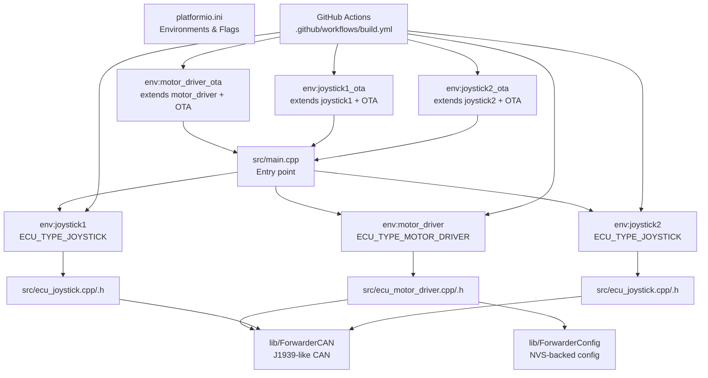
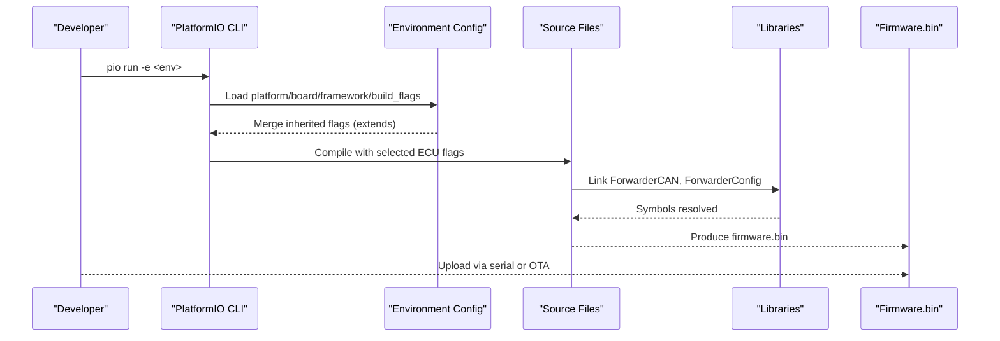
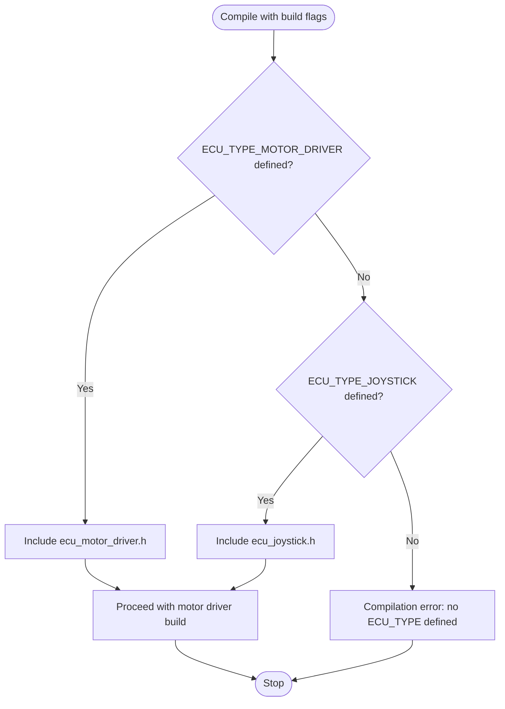
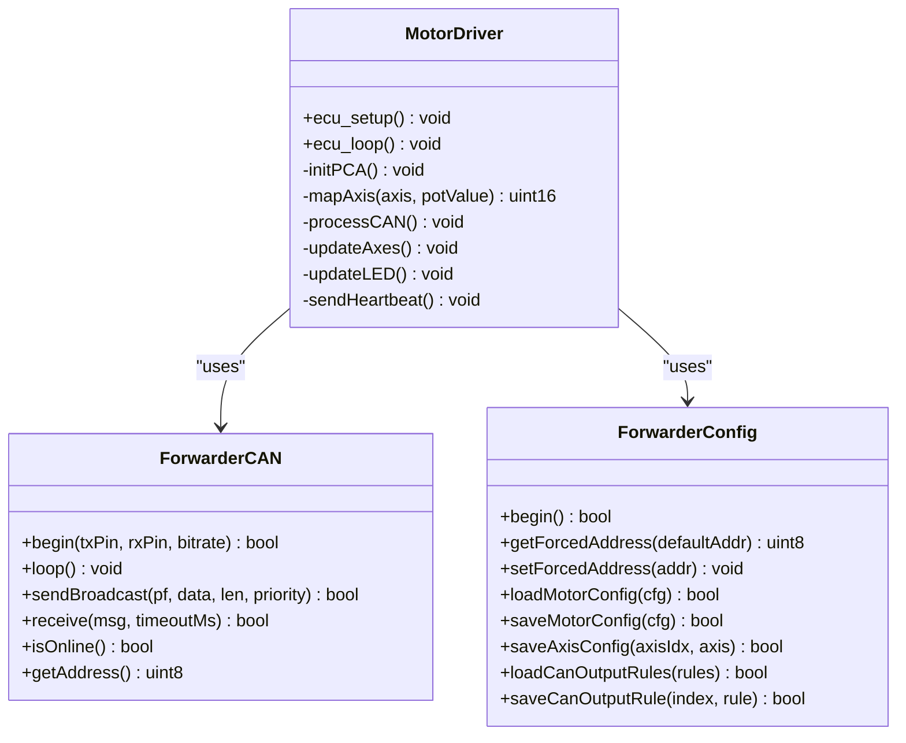
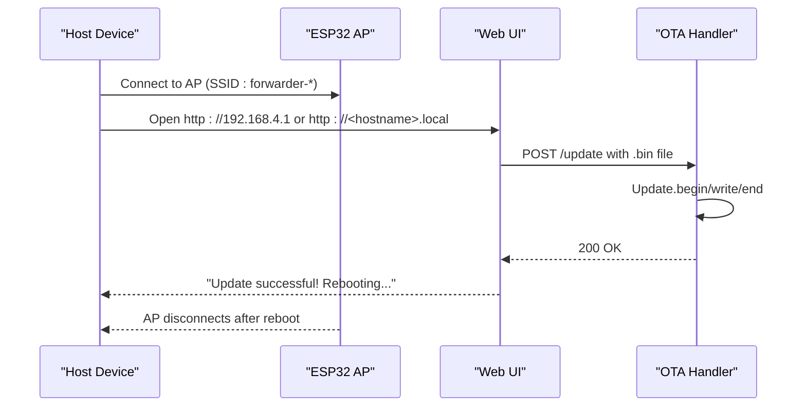
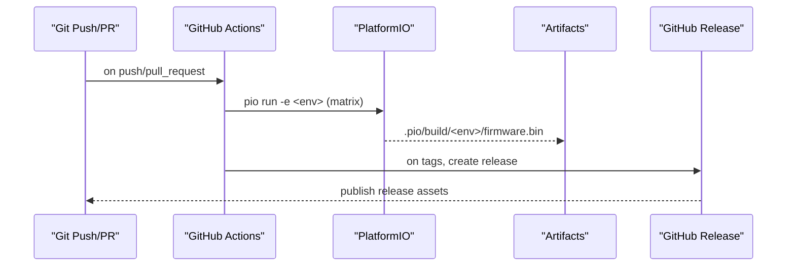
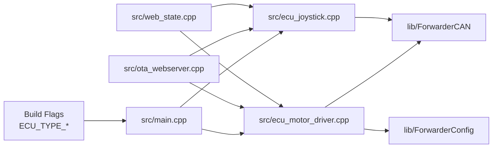

# Build System Configuration

<cite>
**Referenced Files in This Document**
- [platformio.ini](file://platformio.ini)
- [.github/workflows/build.yml](file://.github/workflows/build.yml)
- [README.md](file://README.md)
- [src/main.cpp](file://src/main.cpp)
- [src/ecu_motor_driver.cpp](file://src/ecu_motor_driver.cpp)
- [src/ecu_motor_driver.h](file://src/ecu_motor_driver.h)
- [src/ecu_joystick.cpp](file://src/ecu_joystick.cpp)
- [src/ecu_joystick.h](file://src/ecu_joystick.h)
- [src/ota_webserver.cpp](file://src/ota_webserver.cpp)
- [src/ota_webserver.h](file://src/ota_webserver.h)
- [src/web_state.cpp](file://src/web_state.cpp)
- [src/web_state.h](file://src/web_state.h)
- [lib/ForwarderCAN/ForwarderCAN.h](file://lib/ForwarderCAN/ForwarderCAN.h)
- [lib/ForwarderConfig/ForwarderConfig.h](file://lib/ForwarderConfig/ForwarderConfig.h)
</cite>

## Table of Contents
1. [Introduction](#introduction)
2. [Project Structure](#project-structure)
3. [Core Components](#core-components)
4. [Architecture Overview](#architecture-overview)
5. [Detailed Component Analysis](#detailed-component-analysis)
6. [Dependency Analysis](#dependency-analysis)
7. [Performance Considerations](#performance-considerations)
8. [Troubleshooting Guide](#troubleshooting-guide)
9. [Conclusion](#conclusion)
10. [Appendices](#appendices)

## Introduction
This document explains the build system for ForwarderKE’s PlatformIO configuration. It covers the six distinct build environments, their purposes, and how they target different ECU types and deployment scenarios. It details compiler flags, build options, and ESP32-specific settings, describes the environment variable system for selecting ECU types, documents the release management process, and explains cross-compilation setup. Practical examples and troubleshooting guidance are included, along with CI/CD pipeline integration via GitHub Actions and automated release workflows.

## Project Structure
The project is organized around PlatformIO environments defined in the configuration file. Each environment compiles either the motor driver ECU or one of two joystick ECUs, with optional over-the-air (OTA) capabilities. The source tree separates ECU logic and shared libraries, while the CI workflow automates builds and releases.

**Diagram sources**
- [platformio.ini:1-80](file://platformio.ini#L1-L80)
- [src/main.cpp:1-32](file://src/main.cpp#L1-L32)
- [src/ecu_motor_driver.cpp:1-355](file://src/ecu_motor_driver.cpp#L1-L355)
- [src/ecu_joystick.cpp:1-239](file://src/ecu_joystick.cpp#L1-L239)
- [.github/workflows/build.yml:1-81](file://.github/workflows/build.yml#L1-L81)
- [lib/ForwarderCAN/ForwarderCAN.h:1-120](file://lib/ForwarderCAN/ForwarderCAN.h#L1-L120)
- [lib/ForwarderConfig/ForwarderConfig.h:1-92](file://lib/ForwarderConfig/ForwarderConfig.h#L1-L92)

**Section sources**
- [platformio.ini:1-80](file://platformio.ini#L1-L80)
- [README.md:1-131](file://README.md#L1-L131)

## Core Components
- PlatformIO configuration defines a base environment and six environments: motor_driver, joystick1, joystick2, plus three OTA variants extending the base environments.
- The entry point selects the ECU implementation at compile time via build flags.
- ECU-specific implementations configure hardware pins, CAN bitrates, and device-specific peripherals.
- Shared libraries encapsulate CAN protocol handling and persistent configuration.
- GitHub Actions automates builds for all environments and creates releases from tagged commits.

**Section sources**
- [platformio.ini:1-80](file://platformio.ini#L1-L80)
- [src/main.cpp:1-32](file://src/main.cpp#L1-L32)
- [lib/ForwarderCAN/ForwarderCAN.h:1-120](file://lib/ForwarderCAN/ForwarderCAN.h#L1-L120)
- [lib/ForwarderConfig/ForwarderConfig.h:1-92](file://lib/ForwarderConfig/ForwarderConfig.h#L1-L92)
- [.github/workflows/build.yml:1-81](file://.github/workflows/build.yml#L1-L81)

## Architecture Overview
The build system centers on PlatformIO environments that inject compile-time flags to choose the ECU type and board-specific pin assignments. The entry point conditionally includes the appropriate ECU module. OTA-enabled environments add a Wi-Fi AP and web server for firmware updates. The CI pipeline builds all environments and, on tag pushes, packages firmware binaries into a GitHub Release.

**Diagram sources**
- [platformio.ini:1-80](file://platformio.ini#L1-L80)
- [src/main.cpp:1-32](file://src/main.cpp#L1-L32)
- [src/ecu_motor_driver.cpp:1-355](file://src/ecu_motor_driver.cpp#L1-L355)
- [src/ecu_joystick.cpp:1-239](file://src/ecu_joystick.cpp#L1-L239)
- [lib/ForwarderCAN/ForwarderCAN.h:1-120](file://lib/ForwarderCAN/ForwarderCAN.h#L1-L120)
- [lib/ForwarderConfig/ForwarderConfig.h:1-92](file://lib/ForwarderConfig/ForwarderConfig.h#L1-L92)

## Detailed Component Analysis

### Build Environments and Purposes
- Base environment settings:
  - Platform: ESP32 Arduino framework
  - Board: ESP32-S3 DevKit C-1 by default
  - Monitor speed: 115200
  - Global libraries: Adafruit PWM Servo Driver, NeoPixelBus
  - Global build flags: CAN bitrate, protocol priority, watchdog timeout
- motor_driver:
  - Selects motor driver ECU
  - Preferred address and ECU name constants
  - CAN TX/RX pins, onboard WS2812 LED pin, PCA9685 I2C pins and address
  - Safety timeout for solenoid outputs
- joystick1:
  - Selects joystick ECU 1
  - Preferred address and joystick ID constant
  - CAN TX/RX/SE pins, onboard WS2812 LED pin
  - Potentiometer and button pins
- joystick2:
  - Selects joystick ECU 2
  - Preferred address and joystick ID constant
  - Identical pin assignments to joystick1 except address
- motor_driver_ota, joystick1_ota, joystick2_ota:
  - Extend their respective base environments
  - Add a flag enabling the embedded OTA web server

Practical usage examples:
- Build motor driver: pio run -e motor_driver
- Build joystick 1: pio run -e joystick1
- Build joystick 2: pio run -e joystick2
- Build OTA motor driver: pio run -e motor_driver_ota

**Section sources**
- [platformio.ini:1-80](file://platformio.ini#L1-L80)
- [README.md:63-103](file://README.md#L63-L103)

### Environment Variable System for ECU Type Selection
- The entry point uses preprocessor directives to include the correct ECU module based on a single build flag:
  - ECU_TYPE_MOTOR_DRIVER selects the motor driver implementation
  - ECU_TYPE_JOYSTICK selects the joystick implementation
- If neither flag is defined, compilation fails with an explicit error, ensuring intentional ECU selection.

**Diagram sources**
- [src/main.cpp:6-17](file://src/main.cpp#L6-L17)

**Section sources**
- [src/main.cpp:6-17](file://src/main.cpp#L6-L17)

### Compiler Flags, Build Options, and ESP32 Settings
- Global flags:
  - CAN_BITRATE: sets the CAN bus bitrate
  - PROTOCOL_PRIORITY_DEFAULT: default priority for outgoing CAN frames
  - WATCHDOG_TIMEOUT_MS: global watchdog timeout
- motor_driver flags:
  - ECU_TYPE_MOTOR_DRIVER, ECU_PREFERRED_ADDRESS, ECU_NAME_MOTOR_DRIVER
  - CAN_TX_PIN, CAN_RX_PIN, WS2812_PIN
  - PCA9685_SDA, PCA9685_SCL, PCA9685_I2C_ADDR
  - SAFETY_TIMEOUT_MS
- joystick1/joystick2 flags:
  - ECU_TYPE_JOYSTICK, ECU_PREFERRED_ADDRESS, ECU_JOYSTICK_ID
  - CAN_TX_PIN, CAN_RX_PIN, CAN_SE_PIN
  - WS2812_PIN, POT1_PIN, POT2_PIN, BTN1_PIN, BTN2_PIN
- OTA environments:
  - ENABLE_OTA_WEBSERVER flag enables the embedded web server and AP

Board and framework:
- Platform: espressif32
- Framework: arduino
- Default board: esp32-s3-devkitc-1
- Per-environment overrides:
  - joystick1/joystick2 override board to esp32dev

**Section sources**
- [platformio.ini:4-80](file://platformio.ini#L4-L80)

### ECU-Specific Implementations

#### Motor Driver ECU
- Initializes PCA9685 PWM drivers (one or two units), onboard LED, CAN controller, and persistent configuration
- Receives joystick inputs and solenoid commands over CAN, maps joystick values to solenoid outputs, and enforces safety timeouts
- Supports OTA via embedded web server when enabled

**Diagram sources**
- [src/ecu_motor_driver.cpp:1-355](file://src/ecu_motor_driver.cpp#L1-L355)
- [lib/ForwarderCAN/ForwarderCAN.h:1-120](file://lib/ForwarderCAN/ForwarderCAN.h#L1-L120)
- [lib/ForwarderConfig/ForwarderConfig.h:1-92](file://lib/ForwarderConfig/ForwarderConfig.h#L1-L92)

**Section sources**
- [src/ecu_motor_driver.cpp:1-355](file://src/ecu_motor_driver.cpp#L1-L355)
- [src/ecu_motor_driver.h:1-5](file://src/ecu_motor_driver.h#L1-L5)

#### Joystick ECU
- Reads two potentiometers and two buttons, periodically broadcasting joystick data and button states over CAN
- Supports OTA via embedded web server when enabled

**Diagram sources**
- [src/ecu_joystick.cpp:1-239](file://src/ecu_joystick.cpp#L1-L239)
- [lib/ForwarderCAN/ForwarderCAN.h:1-120](file://lib/ForwarderCAN/ForwarderCAN.h#L1-L120)
- [lib/ForwarderConfig/ForwarderConfig.h:1-92](file://lib/ForwarderConfig/ForwarderConfig.h#L1-L92)

**Section sources**
- [src/ecu_joystick.cpp:1-239](file://src/ecu_joystick.cpp#L1-L239)
- [src/ecu_joystick.h:1-5](file://src/ecu_joystick.h#L1-L5)

### OTA Web Server
- Enabled by the ENABLE_OTA_WEBSERVER flag
- Creates a Wi-Fi AP with a predictable hostname and serves a dashboard UI
- Provides endpoints to:
  - View live state and bus statistics
  - Configure joystick-to-solenoid mapping
  - Configure CAN-triggered GPIO outputs
  - Perform firmware updates via HTTP POST
- Uses mDNS for service discovery

**Diagram sources**
- [src/ota_webserver.cpp:766-796](file://src/ota_webserver.cpp#L766-L796)
- [platformio.ini:63-79](file://platformio.ini#L63-L79)

**Section sources**
- [src/ota_webserver.cpp:1-809](file://src/ota_webserver.cpp#L1-L809)
- [src/ota_webserver.h:1-6](file://src/ota_webserver.h#L1-L6)
- [README.md:84-103](file://README.md#L84-L103)

### Cross-Compilation and Dependency Resolution
- Platform: ESP32 (Espressif)
- Framework: Arduino
- Board selection per environment:
  - Default: esp32-s3-devkitc-1
  - joystick1/joystick2 override to esp32dev
- Libraries:
  - Adafruit PWM Servo Driver Library
  - Makuna NeoPixelBus
- Shared libraries:
  - ForwarderCAN: J1939-like 29-bit ID layout, PF definitions, address claiming, send/receive helpers
  - ForwarderConfig: NVS-backed configuration for axes and CAN output rules

**Section sources**
- [platformio.ini:4-12](file://platformio.ini#L4-L12)
- [lib/ForwarderCAN/ForwarderCAN.h:1-120](file://lib/ForwarderCAN/ForwarderCAN.h#L1-L120)
- [lib/ForwarderConfig/ForwarderConfig.h:1-92](file://lib/ForwarderConfig/ForwarderConfig.h#L1-L92)

### CI/CD Pipeline Integration
- Triggers on pushes to main and tags matching v*
- Matrix builds all six environments
- Caches PlatformIO installation to speed up jobs
- Installs PlatformIO Core and builds each environment
- Uploads firmware artifacts for later use
- On tag pushes, downloads all firmware artifacts, renames them to environment-specific filenames, and creates a GitHub Release with prerelease detection

**Diagram sources**
- [.github/workflows/build.yml:1-81](file://.github/workflows/build.yml#L1-L81)

**Section sources**
- [.github/workflows/build.yml:1-81](file://.github/workflows/build.yml#L1-L81)

## Dependency Analysis
The build-time selection and environment flags create a tight coupling between configuration and source modules. The shared state and web UI rely on conditional compilation to expose only relevant symbols.

**Diagram sources**
- [src/main.cpp:6-17](file://src/main.cpp#L6-L17)
- [src/ecu_motor_driver.cpp:1-355](file://src/ecu_motor_driver.cpp#L1-L355)
- [src/ecu_joystick.cpp:1-239](file://src/ecu_joystick.cpp#L1-L239)
- [src/ota_webserver.cpp:1-809](file://src/ota_webserver.cpp#L1-L809)
- [src/web_state.cpp:1-20](file://src/web_state.cpp#L1-L20)
- [lib/ForwarderCAN/ForwarderCAN.h:1-120](file://lib/ForwarderCAN/ForwarderCAN.h#L1-L120)
- [lib/ForwarderConfig/ForwarderConfig.h:1-92](file://lib/ForwarderConfig/ForwarderConfig.h#L1-L92)

**Section sources**
- [src/main.cpp:6-17](file://src/main.cpp#L6-L17)
- [src/web_state.cpp:1-20](file://src/web_state.cpp#L1-L20)

## Performance Considerations
- CAN bitrate and priority defaults balance responsiveness and bus efficiency.
- Watchdog and safety timeouts prevent stale actuator states.
- OTA update progress reporting and mDNS availability improve operational reliability.
- Using cached PlatformIO installations reduces CI runtime overhead.

[No sources needed since this section provides general guidance]

## Troubleshooting Guide
Common build issues and resolutions:
- Missing ECU type flag:
  - Symptom: Compilation error indicating no ECU_TYPE defined
  - Fix: Choose one of the six environments (e.g., motor_driver, joystick1, joystick2, or their OTA variants)
- Incorrect board selection:
  - Symptom: Pin conflicts or missing pins
  - Fix: Ensure the environment’s board matches your hardware; joystick environments default to esp32dev
- OTA web server not appearing:
  - Symptom: No AP or web UI
  - Fix: Build with an OTA environment (ending in _ota) or define ENABLE_OTA_WEBSERVER in the base environment
- CAN initialization failure:
  - Symptom: Red blinking LED or loop stalls during CAN init
  - Fix: Verify TX/RX pins and SE pin (for joysticks), and ensure the board supports the chosen pins
- OTA update failures:
  - Symptom: Upload endpoint returns an error
  - Fix: Confirm the uploaded file is a valid firmware binary produced by the build; verify AP connectivity and mDNS resolution

**Section sources**
- [src/main.cpp:15-17](file://src/main.cpp#L15-L17)
- [platformio.ini:32-61](file://platformio.ini#L32-L61)
- [src/ota_webserver.cpp:705-733](file://src/ota_webserver.cpp#L705-L733)
- [README.md:84-103](file://README.md#L84-L103)

## Conclusion
The ForwarderKE build system leverages PlatformIO environments to cleanly separate ECU roles and deployment modes. Build flags determine the ECU type and hardware pin assignments, while shared libraries encapsulate protocol and persistence concerns. The CI pipeline automates builds and releases, and OTA environments streamline field updates. Following the documented environments and troubleshooting steps ensures reliable builds and deployments across motor driver and joystick ECUs.

[No sources needed since this section summarizes without analyzing specific files]

## Appendices

### Practical Build Examples
- Build motor driver: pio run -e motor_driver
- Build joystick 1: pio run -e joystick1
- Build joystick 2: pio run -e joystick2
- Build OTA motor driver: pio run -e motor_driver_ota
- Build OTA joystick 1: pio run -e joystick1_ota
- Build OTA joystick 2: pio run -e joystick2_ota

**Section sources**
- [README.md:67-103](file://README.md#L67-L103)

### Environment Variables Reference
- ECU_TYPE_MOTOR_DRIVER: selects motor driver ECU
- ECU_TYPE_JOYSTICK: selects joystick ECU
- ECU_PREFERRED_ADDRESS: preferred CAN address for the ECU
- ECU_NAME_MOTOR_DRIVER: lower byte of motor driver ECU name
- ECU_JOYSTICK_ID: joystick unit identifier (1 or 2)
- CAN_TX_PIN, CAN_RX_PIN, CAN_SE_PIN: CAN transceiver pins
- WS2812_PIN: onboard status LED pin
- POT1_PIN, POT2_PIN, BTN1_PIN, BTN2_PIN: joystick input pins
- PCA9685_SDA, PCA9685_SCL, PCA9685_I2C_ADDR: PCA9685 I2C configuration
- ENABLE_OTA_WEBSERVER: enable embedded OTA web server

**Section sources**
- [platformio.ini:17-79](file://platformio.ini#L17-L79)
- [src/ecu_motor_driver.cpp:14-37](file://src/ecu_motor_driver.cpp#L14-L37)
- [src/ecu_joystick.cpp:11-37](file://src/ecu_joystick.cpp#L11-L37)