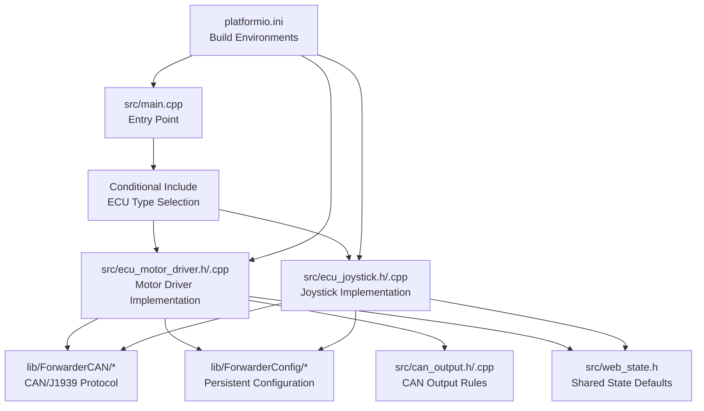
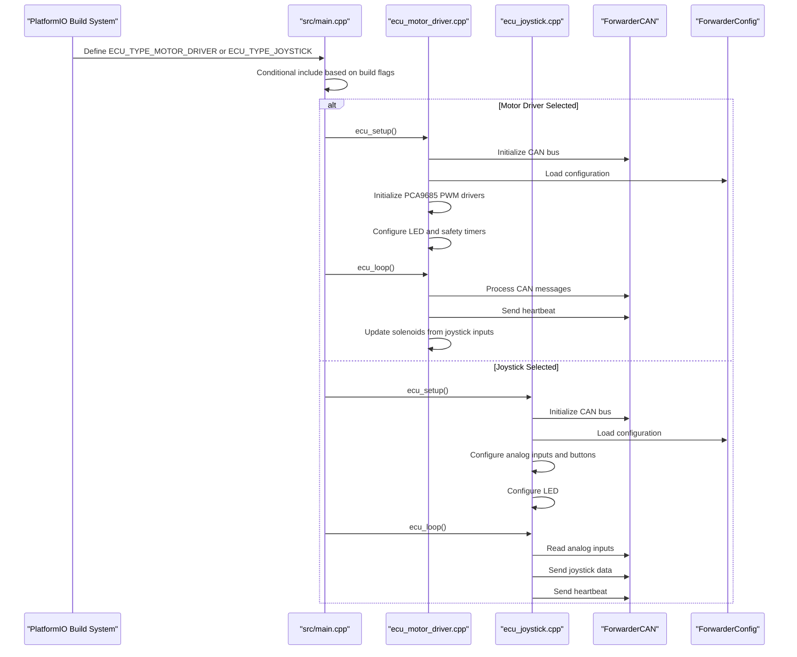
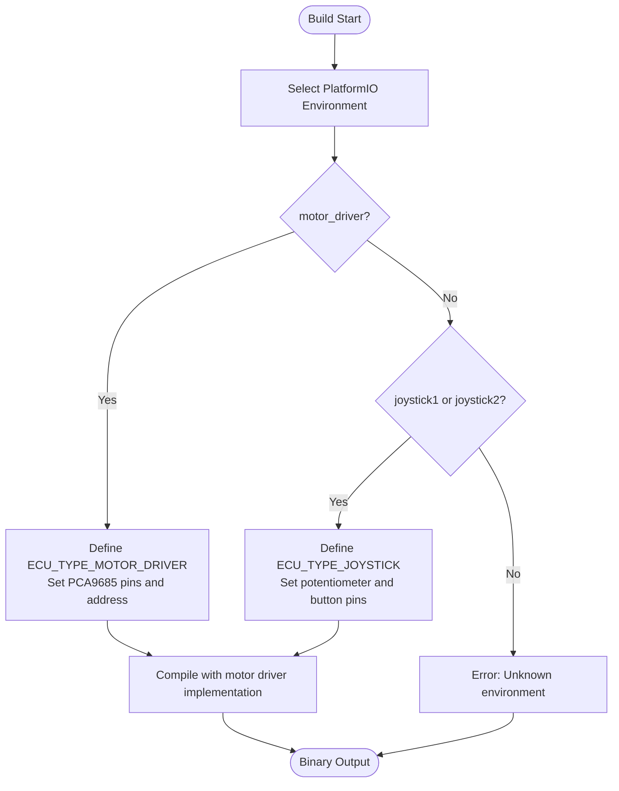
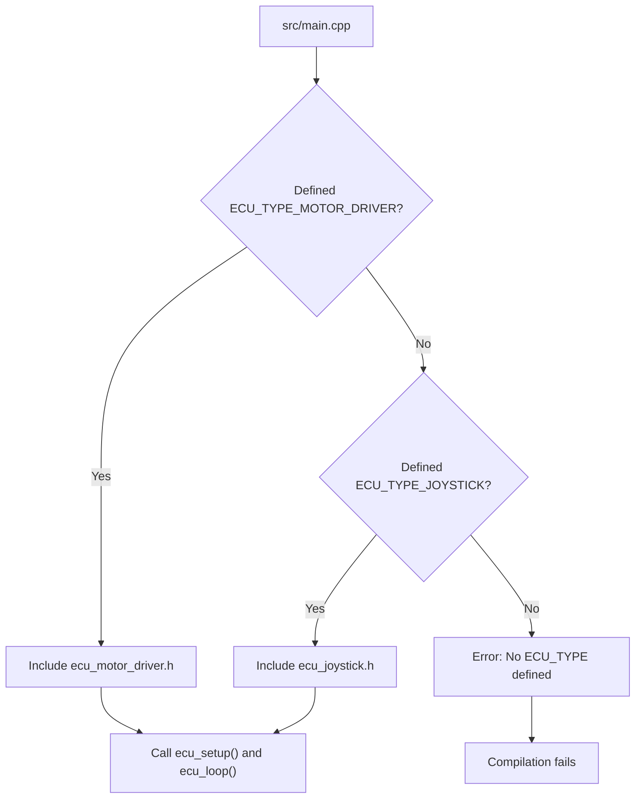
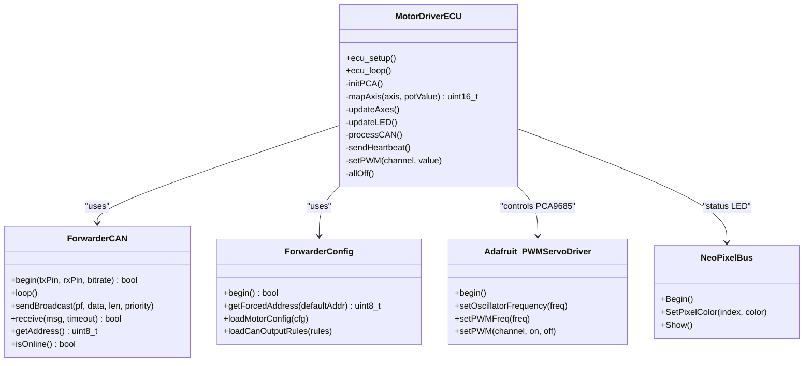
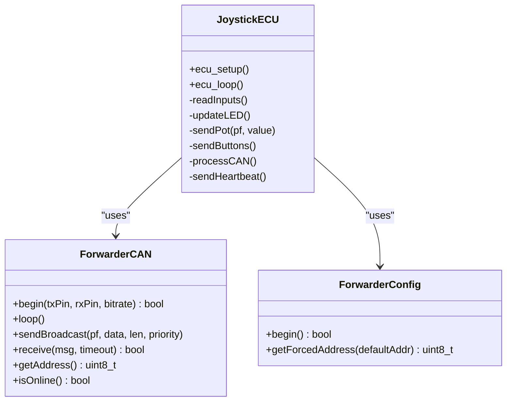
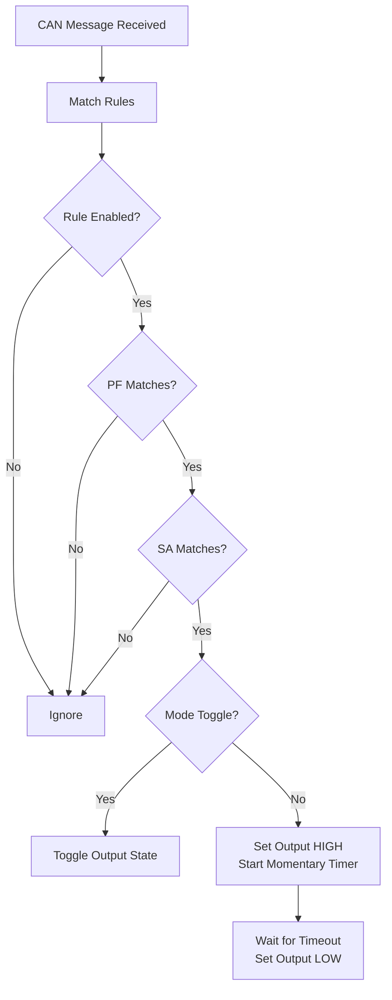
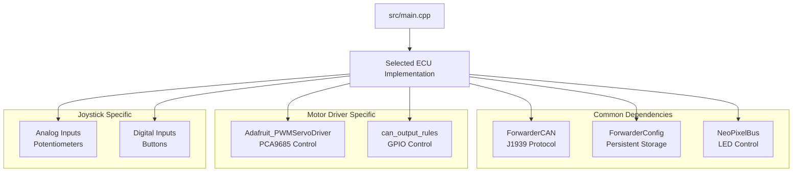

# ECU Type Selection System

<cite>
**Referenced Files in This Document**
- [main.cpp](file://src/main.cpp)
- [platformio.ini](file://platformio.ini)
- [README.md](file://README.md)
- [ecu_motor_driver.h](file://src/ecu_motor_driver.h)
- [ecu_motor_driver.cpp](file://src/ecu_motor_driver.cpp)
- [ecu_joystick.h](file://src/ecu_joystick.h)
- [ecu_joystick.cpp](file://src/ecu_joystick.cpp)
- [can_output.h](file://src/can_output.h)
- [can_output.cpp](file://src/can_output.cpp)
- [web_state.h](file://src/web_state.h)
- [ForwarderCAN.h](file://lib/ForwarderCAN/ForwarderCAN.h)
- [ForwarderCAN.cpp](file://lib/ForwarderCAN/ForwarderCAN.cpp)
- [ForwarderConfig.cpp](file://lib/ForwarderConfig/ForwarderConfig.cpp)
</cite>

## Table of Contents
1. [Introduction](#introduction)
2. [Project Structure](#project-structure)
3. [Core Components](#core-components)
4. [Architecture Overview](#architecture-overview)
5. [Detailed Component Analysis](#detailed-component-analysis)
6. [Dependency Analysis](#dependency-analysis)
7. [Performance Considerations](#performance-considerations)
8. [Troubleshooting Guide](#troubleshooting-guide)
9. [Conclusion](#conclusion)

## Introduction
This document explains ForwarderKE's ECU type selection mechanism using preprocessor directives and compile-time configuration. The system allows developers to choose between two distinct ECU implementations—motor driver and joystick—by defining specific build flags during compilation. This approach enables memory optimization, performance tuning, and clean separation of concerns through a shared interface pattern.

## Project Structure
The project is organized around a central entry point that conditionally includes the appropriate ECU implementation based on build flags. PlatformIO environments define the build flags and hardware pin assignments for each ECU type.

**Diagram sources**
- [main.cpp:11-17](file://src/main.cpp#L11-L17)
- [platformio.ini:17-30](file://platformio.ini#L17-L30)
- [platformio.ini:31-61](file://platformio.ini#L31-L61)

**Section sources**
- [main.cpp:1-32](file://src/main.cpp#L1-L32)
- [platformio.ini:1-80](file://platformio.ini#L1-L80)

## Core Components
The ECU selection system centers on a small set of components that work together to provide a unified interface while enabling different implementations:

- **Entry Point**: The main application initializes serial communication and delegates to the selected ECU implementation via a common interface.
- **ECU Interface**: Both implementations expose identical function signatures (`ecu_setup()` and `ecu_loop()`) to ensure seamless switching.
- **Conditional Compilation**: Preprocessor directives select the appropriate ECU implementation at compile time.
- **Build Flags**: PlatformIO environments define the ECU type and hardware configuration through build flags.
- **Shared Libraries**: Both implementations rely on shared libraries for CAN protocol handling and persistent configuration.

Key characteristics:
- Compile-time selection eliminates runtime overhead and reduces binary size.
- The shared interface simplifies testing and deployment workflows.
- Hardware-specific configurations are isolated within each ECU implementation.

**Section sources**
- [main.cpp:19-31](file://src/main.cpp#L19-L31)
- [ecu_motor_driver.h:3-4](file://src/ecu_motor_driver.h#L3-L4)
- [ecu_joystick.h:3-4](file://src/ecu_joystick.h#L3-L4)

## Architecture Overview
The system uses a factory-like pattern where the build system selects the implementation at compile time. The main application remains unchanged regardless of the chosen ECU type.

**Diagram sources**
- [main.cpp:11-17](file://src/main.cpp#L11-L17)
- [ecu_motor_driver.cpp:290-325](file://src/ecu_motor_driver.cpp#L290-L325)
- [ecu_joystick.cpp:159-192](file://src/ecu_joystick.cpp#L159-L192)
- [ForwarderCAN.cpp:13-52](file://lib/ForwarderCAN/ForwarderCAN.cpp#L13-L52)
- [ForwarderConfig.cpp:56-69](file://lib/ForwarderConfig/ForwarderConfig.cpp#L56-L69)

## Detailed Component Analysis

### Build Flag System and Environment Configuration
PlatformIO environments define the ECU type and associated hardware configuration through build flags. Each environment sets the ECU type flag and provides device-specific pin assignments and operational parameters.

**Diagram sources**
- [platformio.ini:17-30](file://platformio.ini#L17-L30)
- [platformio.ini:31-61](file://platformio.ini#L31-L61)

**Section sources**
- [platformio.ini:17-30](file://platformio.ini#L17-L30)
- [platformio.ini:31-61](file://platformio.ini#L31-L61)

### Conditional Compilation in Main Application
The main application uses preprocessor directives to include the appropriate ECU implementation header. This creates a compile-time decision that determines which implementation is linked into the final binary.

**Diagram sources**
- [main.cpp:11-17](file://src/main.cpp#L11-L17)

**Section sources**
- [main.cpp:11-17](file://src/main.cpp#L11-L17)

### Motor Driver ECU Implementation
The motor driver ECU controls solenoids via PCA9685 PWM drivers. It reads joystick inputs from the CAN bus and translates them into proportional solenoid commands.

Key features:
- Dual PCA9685 support with automatic detection
- Proportional mapping with deadband and PWM scaling
- Safety timeout to turn off solenoids after inactivity
- LED status indication with identification mode
- CAN output rules for GPIO control

**Diagram sources**
- [ecu_motor_driver.cpp:39-45](file://src/ecu_motor_driver.cpp#L39-L45)
- [ecu_motor_driver.cpp:290-325](file://src/ecu_motor_driver.cpp#L290-L325)
- [ForwarderCAN.h:66-72](file://lib/ForwarderCAN/ForwarderCAN.h#L66-L72)
- [ForwarderConfig.cpp:56-69](file://lib/ForwarderConfig/ForwarderConfig.cpp#L56-L69)

**Section sources**
- [ecu_motor_driver.cpp:39-99](file://src/ecu_motor_driver.cpp#L39-L99)
- [ecu_motor_driver.cpp:101-151](file://src/ecu_motor_driver.cpp#L101-L151)
- [ecu_motor_driver.cpp:184-275](file://src/ecu_motor_driver.cpp#L184-L275)
- [ecu_motor_driver.cpp:290-352](file://src/ecu_motor_driver.cpp#L290-L352)

### Joystick ECU Implementation
The joystick ECU reads analog inputs from potentiometers and button states, then publishes them over the CAN bus.

Key features:
- Analog input processing with configurable resolution and attenuation
- Button debouncing through threshold checking
- LED status indication with identification mode
- CAN address claiming and heartbeat broadcasting
- Optional CAN transceiver enable pin

**Diagram sources**
- [ecu_joystick.cpp:39-41](file://src/ecu_joystick.cpp#L39-L41)
- [ecu_joystick.cpp:159-192](file://src/ecu_joystick.cpp#L159-L192)
- [ForwarderCAN.h:66-72](file://lib/ForwarderCAN/ForwarderCAN.h#L66-L72)
- [ForwarderConfig.cpp:56-69](file://lib/ForwarderConfig/ForwarderConfig.cpp#L56-L69)

**Section sources**
- [ecu_joystick.cpp:63-68](file://src/ecu_joystick.cpp#L63-L68)
- [ecu_joystick.cpp:106-112](file://src/ecu_joystick.cpp#L106-L112)
- [ecu_joystick.cpp:114-144](file://src/ecu_joystick.cpp#L114-L144)
- [ecu_joystick.cpp:159-236](file://src/ecu_joystick.cpp#L159-L236)

### CAN Output Rules System
The CAN output rules system provides a flexible mechanism to control GPIO pins based on incoming CAN messages. This feature is primarily used by the motor driver ECU to control external devices.

**Diagram sources**
- [can_output.cpp:29-49](file://src/can_output.cpp#L29-L49)
- [can_output.cpp:51-61](file://src/can_output.cpp#L51-L61)

**Section sources**
- [can_output.h:7-9](file://src/can_output.h#L7-L9)
- [can_output.cpp:7-19](file://src/can_output.cpp#L7-L19)
- [can_output.cpp:29-61](file://src/can_output.cpp#L29-L61)

### Shared State Management
The web_state.h file provides default definitions for global variables that are only defined in the ECU implementation that is NOT being compiled in the current build. This prevents linker errors when switching between ECU types.

**Section sources**
- [web_state.h:6-19](file://src/web_state.h#L6-L19)

## Dependency Analysis
The ECU implementations share several dependencies while maintaining distinct hardware requirements.

**Diagram sources**
- [ecu_motor_driver.cpp:5-12](file://src/ecu_motor_driver.cpp#L5-L12)
- [ecu_joystick.cpp:5-9](file://src/ecu_joystick.cpp#L5-L9)
- [ForwarderCAN.h:66-72](file://lib/ForwarderCAN/ForwarderCAN.h#L66-L72)
- [ForwarderConfig.cpp:56-69](file://lib/ForwarderConfig/ForwarderConfig.cpp#L56-L69)

**Section sources**
- [ecu_motor_driver.cpp:5-12](file://src/ecu_motor_driver.cpp#L5-L12)
- [ecu_joystick.cpp:5-9](file://src/ecu_joystick.cpp#L5-L9)

## Performance Considerations
Compile-time selection offers several performance and memory advantages:

- **Reduced Binary Size**: Only the selected ECU implementation and its dependencies are included, eliminating unused code paths.
- **Optimized Memory Usage**: Hardware-specific buffers and configurations are allocated only for the active implementation.
- **Eliminated Runtime Overhead**: The conditional inclusion decision happens at compile time, removing runtime branching costs.
- **Targeted Hardware Access**: Pin assignments and peripheral configurations are optimized for the specific ECU type.

Benefits for memory optimization and performance tuning:
- Motor driver builds exclude analog input processing and button handling code.
- Joystick builds exclude PCA9685 control and solenoid mapping logic.
- Build flags enable hardware-specific optimizations (e.g., CAN pin assignments, LED pin configuration).
- Safety timeouts and watchdog mechanisms are tailored to each implementation's requirements.

**Section sources**
- [platformio.ini:17-30](file://platformio.ini#L17-L30)
- [platformio.ini:31-61](file://platformio.ini#L31-L61)

## Troubleshooting Guide
Common issues and solutions when working with the ECU type selection system:

### Build Issues
- **Error: No ECU_TYPE defined**: Ensure you selected a valid PlatformIO environment (motor_driver, joystick1, or joystick2).
- **Missing hardware dependencies**: Verify that required libraries (Adafruit PWM Servo Driver, NeoPixelBus) are installed.
- **Pin conflicts**: Check that the selected pins in platformio.ini do not conflict with other peripherals.

### Runtime Issues
- **CAN initialization failures**: Verify CAN pin assignments and ensure the transceiver is properly connected.
- **PCA9685 detection problems**: Confirm I2C connections and address settings for the motor driver implementation.
- **Joystick input noise**: Adjust analog read resolution and attenuation settings in the joystick implementation.

### Debugging Tips
- Use the serial output to identify which ECU implementation is active and its initialization status.
- Monitor LED patterns for different operational states (normal, offline, identification).
- Utilize the heartbeat messages to verify CAN bus communication health.

**Section sources**
- [main.cpp:15-17](file://src/main.cpp#L15-L17)
- [ecu_motor_driver.cpp:305-316](file://src/ecu_motor_driver.cpp#L305-L316)
- [ecu_joystick.cpp:175-185](file://src/ecu_joystick.cpp#L175-L185)

## Conclusion
ForwarderKE's ECU type selection system demonstrates a clean and efficient approach to managing multiple device roles within a single codebase. Through strategic use of preprocessor directives and PlatformIO environments, the system achieves:

- **Clean Separation of Concerns**: Each ECU implementation maintains its own hardware-specific logic while sharing a common interface.
- **Memory Optimization**: Only the necessary code is compiled into each binary, reducing memory footprint and flash usage.
- **Development Flexibility**: Easy switching between implementations for testing and deployment scenarios.
- **Hardware Abstraction**: Shared libraries handle protocol details, allowing focus on device-specific functionality.

This architecture provides a solid foundation for extending the system with additional ECU types or integrating new hardware capabilities while maintaining code clarity and performance.