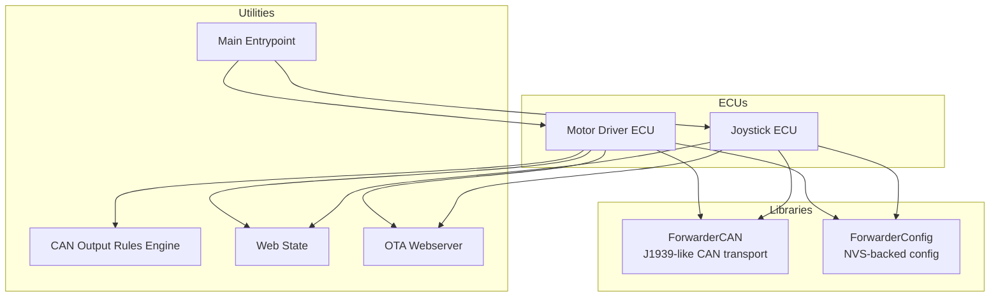
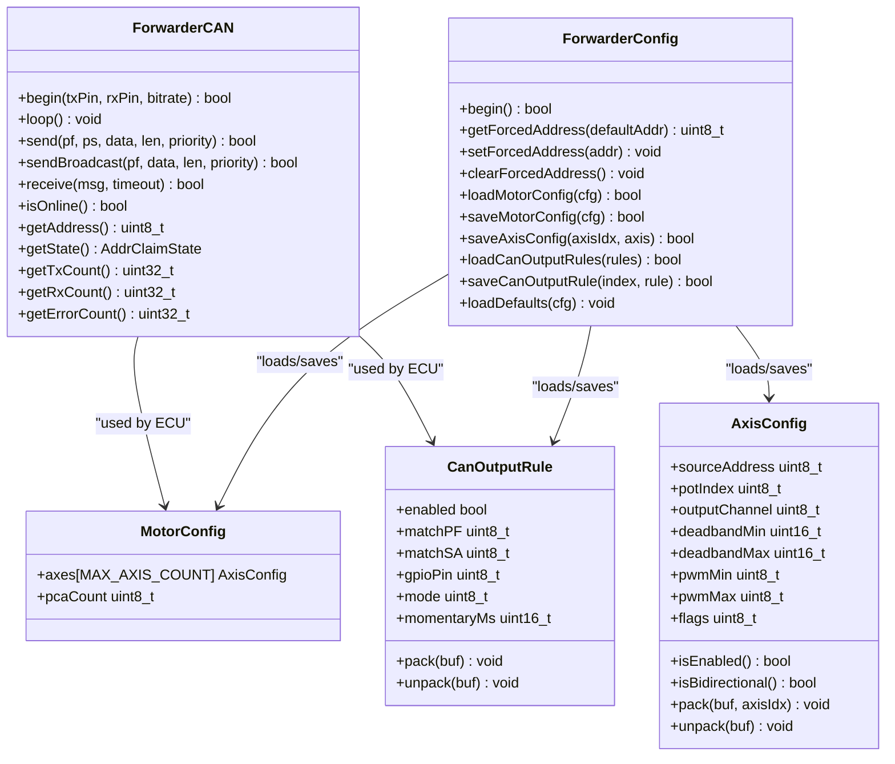
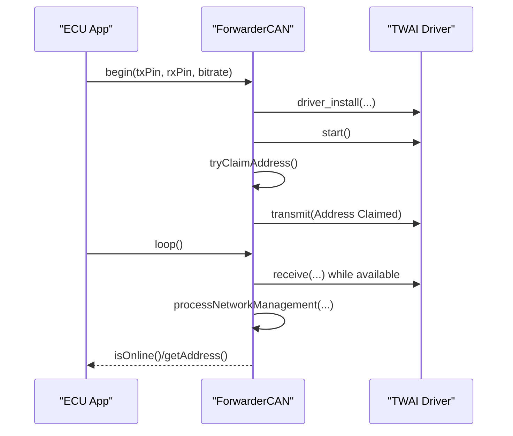
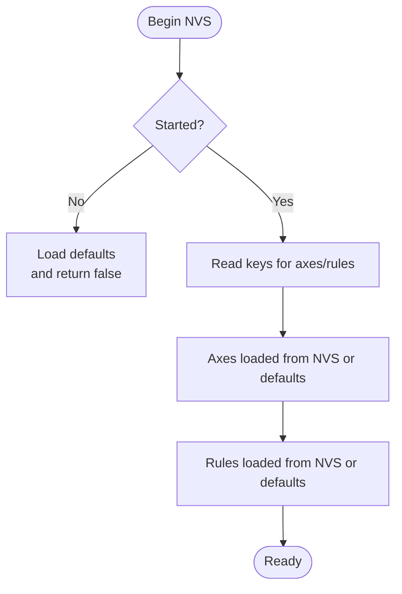
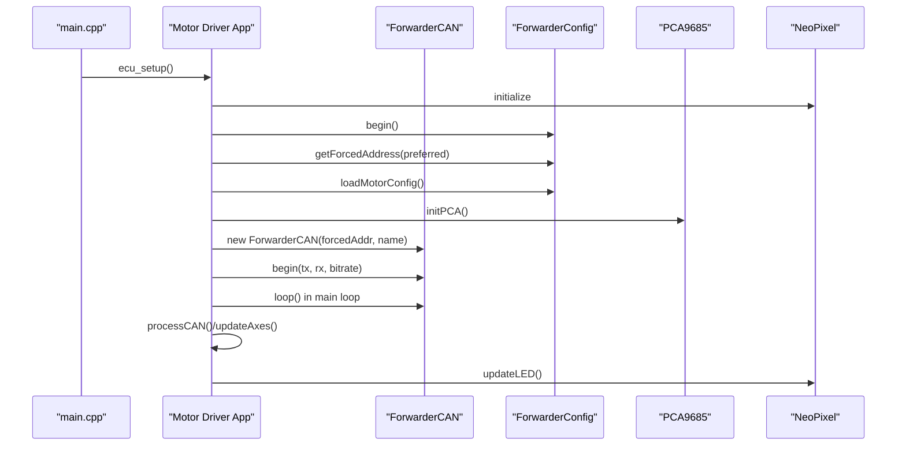
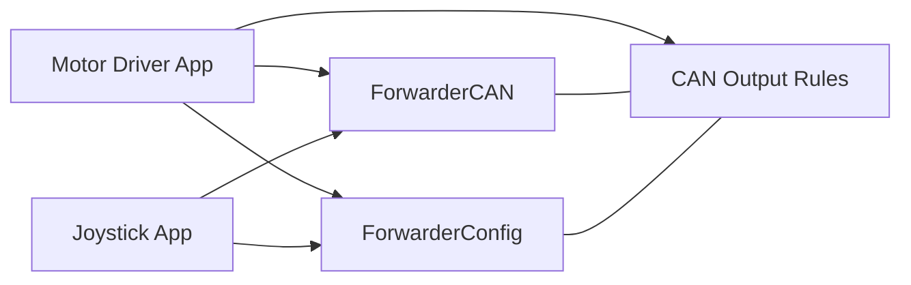
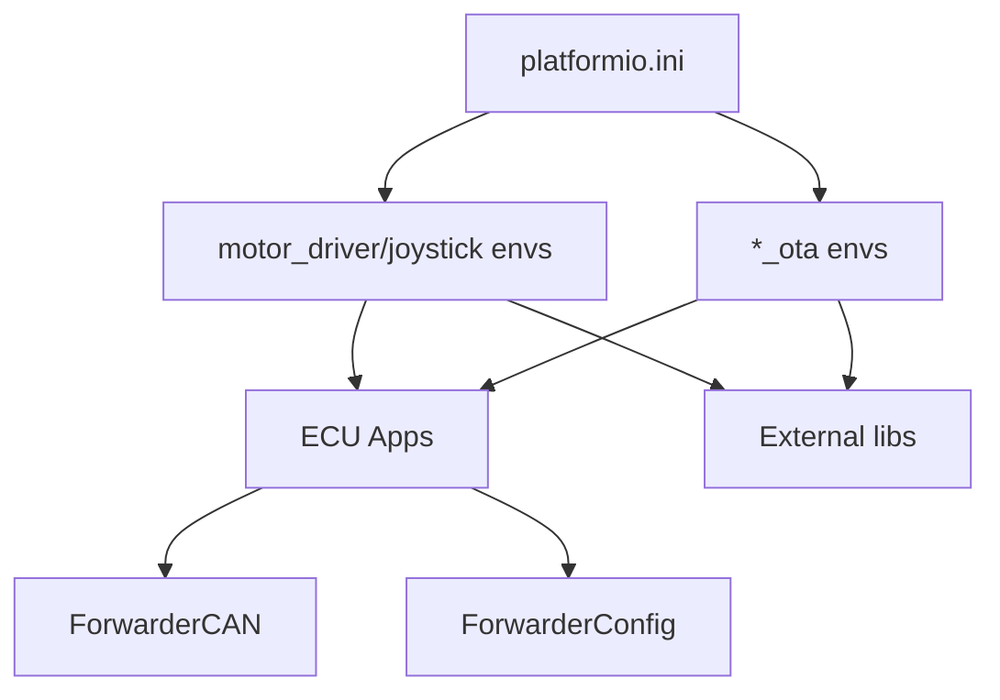

# Library Architecture

<cite>
**Referenced Files in This Document**
- [README.md](file://README.md)
- [platformio.ini](file://platformio.ini)
- [ForwarderCAN.h](file://lib/ForwarderCAN/ForwarderCAN.h)
- [ForwarderCAN.cpp](file://lib/ForwarderCAN/ForwarderCAN.cpp)
- [ForwarderConfig.h](file://lib/ForwarderConfig/ForwarderConfig.h)
- [ForwarderConfig.cpp](file://lib/ForwarderConfig/ForwarderConfig.cpp)
- [main.cpp](file://src/main.cpp)
- [ecu_motor_driver.cpp](file://src/ecu_motor_driver.cpp)
- [ecu_joystick.cpp](file://src/ecu_joystick.cpp)
- [can_output.h](file://src/can_output.h)
- [web_state.h](file://src/web_state.h)
- [ota_webserver.h](file://src/ota_webserver.h)
</cite>

## Table of Contents
1. [Introduction](#introduction)
2. [Project Structure](#project-structure)
3. [Core Components](#core-components)
4. [Architecture Overview](#architecture-overview)
5. [Detailed Component Analysis](#detailed-component-analysis)
6. [Dependency Analysis](#dependency-analysis)
7. [Performance Considerations](#performance-considerations)
8. [Troubleshooting Guide](#troubleshooting-guide)
9. [Conclusion](#conclusion)

## Introduction
This document describes the shared library architecture of ForwarderKE, focusing on the separation of concerns between ForwarderCAN and ForwarderConfig. It explains how ForwarderCAN implements a J1939-like CAN protocol with address claiming and message handling, and how ForwarderConfig manages persistent storage using NVS (Non-Volatile Storage) and configuration. It also documents the library interfaces, dependency relationships, integration with ECU implementations, initialization sequences, global state management, and inter-library communication patterns.

## Project Structure
The project is organized around a small set of libraries and ECU-specific applications:
- lib/ForwarderCAN: Shared CAN/J1939 library providing address claiming, message framing, and transport.
- lib/ForwarderConfig: Shared configuration library providing NVS-backed persistence and configuration models.
- src: ECU implementations (motor driver and joysticks) plus shared utilities and web OTA components.

**Diagram sources**
- [main.cpp:19-31](file://src/main.cpp#L19-L31)
- [ecu_motor_driver.cpp:290-325](file://src/ecu_motor_driver.cpp#L290-L325)
- [ecu_joystick.cpp:159-191](file://src/ecu_joystick.cpp#L159-L191)
- [ForwarderCAN.h:66-119](file://lib/ForwarderCAN/ForwarderCAN.h#L66-L119)
- [ForwarderConfig.h:64-91](file://lib/ForwarderConfig/ForwarderConfig.h#L64-L91)

**Section sources**
- [README.md:112-126](file://README.md#L112-L126)
- [platformio.ini:1-80](file://platformio.ini#L1-L80)

## Core Components
- ForwarderCAN
  - Implements J1939-like 29-bit ID layout and PF/PS semantics.
  - Provides address claiming with arbitration and collision handling.
  - Encapsulates TWAI driver initialization, transmit/receive, and statistics.
  - Exposes send/receive APIs and address state queries.
- ForwarderConfig
  - Manages NVS namespace-scoped preferences.
  - Defines configuration models for axes, motor mapping, and CAN-triggered GPIO rules.
  - Provides load/save routines for persistent storage and defaults.

**Section sources**
- [ForwarderCAN.h:66-119](file://lib/ForwarderCAN/ForwarderCAN.h#L66-L119)
- [ForwarderCAN.cpp:13-52](file://lib/ForwarderCAN/ForwarderCAN.cpp#L13-L52)
- [ForwarderConfig.h:64-91](file://lib/ForwarderConfig/ForwarderConfig.h#L64-L91)
- [ForwarderConfig.cpp:56-59](file://lib/ForwarderConfig/ForwarderConfig.cpp#L56-L59)

## Architecture Overview
The system separates transport and persistence concerns:
- Transport (ForwarderCAN) handles bus arbitration, message framing, and delivery.
- Persistence (ForwarderConfig) stores user-configurable mappings and runtime overrides.
- ECU implementations depend on both libraries and orchestrate device-specific behavior.

**Diagram sources**
- [ForwarderCAN.h:66-119](file://lib/ForwarderCAN/ForwarderCAN.h#L66-L119)
- [ForwarderConfig.h:64-91](file://lib/ForwarderConfig/ForwarderConfig.h#L64-L91)
- [ForwarderConfig.cpp:76-104](file://lib/ForwarderConfig/ForwarderConfig.cpp#L76-L104)
- [ForwarderConfig.cpp:119-127](file://lib/ForwarderConfig/ForwarderConfig.cpp#L119-L127)
- [ForwarderConfig.cpp:129-159](file://lib/ForwarderConfig/ForwarderConfig.cpp#L129-L159)

## Detailed Component Analysis

### ForwarderCAN Library
- Responsibilities
  - Initialize TWAI driver with configurable bitrate and pins.
  - Implement J1939-like ID packing/unpacking macros and PF/PS constants.
  - Manage address claiming state machine with timeouts and retries.
  - Provide send/receive APIs for both unicast and broadcast.
  - Track TX/RX/error counts and expose online status.
- Initialization sequence
  - begin(txPin, rxPin, bitrate): installs driver, starts TWAI, initiates bus-off recovery if needed, and starts address claiming.
  - loop(): periodically checks bus state, runs address claiming state machine, and processes network management frames.
- Address claiming
  - Uses broadcast Address Claimed messages and listens for conflicts.
  - Arbitration resolves by NAME comparison; alternates to a derived address if needed.
- Message handling
  - send/sendBroadcast construct 29-bit IDs and transmit via TWAI.
  - receive extracts frames and updates counters.

**Diagram sources**
- [ForwarderCAN.cpp:13-52](file://lib/ForwarderCAN/ForwarderCAN.cpp#L13-L52)
- [ForwarderCAN.cpp:79-119](file://lib/ForwarderCAN/ForwarderCAN.cpp#L79-L119)
- [ForwarderCAN.cpp:121-142](file://lib/ForwarderCAN/ForwarderCAN.cpp#L121-L142)

**Section sources**
- [ForwarderCAN.h:22-33](file://lib/ForwarderCAN/ForwarderCAN.h#L22-L33)
- [ForwarderCAN.h:35-57](file://lib/ForwarderCAN/ForwarderCAN.h#L35-L57)
- [ForwarderCAN.h:66-119](file://lib/ForwarderCAN/ForwarderCAN.h#L66-L119)
- [ForwarderCAN.cpp:13-52](file://lib/ForwarderCAN/ForwarderCAN.cpp#L13-L52)
- [ForwarderCAN.cpp:54-61](file://lib/ForwarderCAN/ForwarderCAN.cpp#L54-L61)
- [ForwarderCAN.cpp:63-77](file://lib/ForwarderCAN/ForwarderCAN.cpp#L63-L77)
- [ForwarderCAN.cpp:79-119](file://lib/ForwarderCAN/ForwarderCAN.cpp#L79-L119)
- [ForwarderCAN.cpp:121-142](file://lib/ForwarderCAN/ForwarderCAN.cpp#L121-L142)
- [ForwarderCAN.cpp:144-171](file://lib/ForwarderCAN/ForwarderCAN.cpp#L144-L171)
- [ForwarderCAN.cpp:173-188](file://lib/ForwarderCAN/ForwarderCAN.cpp#L173-L188)

### ForwarderConfig Library
- Responsibilities
  - Provide NVS-backed persistence under a namespace.
  - Load/store motor mapping configurations (AxisConfig) and CAN output rules.
  - Support forced address overrides persisted across reboots.
  - Provide factory defaults when keys are missing.
- Data models
  - AxisConfig: per-axis mapping with deadbands and PWM scaling.
  - CanOutputRule: CAN-triggered GPIO actions (toggle or momentary).
  - MotorConfig: container for axes and PCA count.
- Persistence model
  - Keys for axes: axis_0..15; keys for CAN output rules: canout_0..3.
  - Forced address stored under a dedicated key.

**Diagram sources**
- [ForwarderConfig.cpp:56-59](file://lib/ForwarderConfig/ForwarderConfig.cpp#L56-L59)
- [ForwarderConfig.cpp:76-104](file://lib/ForwarderConfig/ForwarderConfig.cpp#L76-L104)
- [ForwarderConfig.cpp:129-159](file://lib/ForwarderConfig/ForwarderConfig.cpp#L129-L159)

**Section sources**
- [ForwarderConfig.h:41-57](file://lib/ForwarderConfig/ForwarderConfig.h#L41-L57)
- [ForwarderConfig.h:29-39](file://lib/ForwarderConfig/ForwarderConfig.h#L29-L39)
- [ForwarderConfig.h:59-63](file://lib/ForwarderConfig/ForwarderConfig.h#L59-L63)
- [ForwarderConfig.cpp:56-59](file://lib/ForwarderConfig/ForwarderConfig.cpp#L56-L59)
- [ForwarderConfig.cpp:76-104](file://lib/ForwarderConfig/ForwarderConfig.cpp#L76-L104)
- [ForwarderConfig.cpp:119-127](file://lib/ForwarderConfig/ForwarderConfig.cpp#L119-L127)
- [ForwarderConfig.cpp:129-159](file://lib/ForwarderConfig/ForwarderConfig.cpp#L129-L159)
- [ForwarderConfig.cpp:171-183](file://lib/ForwarderConfig/ForwarderConfig.cpp#L171-L183)

### ECU Integrations and Global State
- Motor Driver ECU
  - Initializes LED, PCA9685, and CAN.
  - Loads configuration from NVS and applies forced address if present.
  - Processes joystick inputs and solenoid commands via CAN.
  - Periodically sends heartbeat and updates onboard LED.
- Joystick ECU
  - Initializes LED, reads analog pots/buttons, and sends joystick telemetry.
  - Responds to LED color and identify requests.
  - Supports address override via CAN and persists it to NVS.
- Global state
  - Shared arrays and structures expose runtime state for web UI and OTA.

**Diagram sources**
- [main.cpp:19-31](file://src/main.cpp#L19-L31)
- [ecu_motor_driver.cpp:290-325](file://src/ecu_motor_driver.cpp#L290-L325)
- [ecu_motor_driver.cpp:305-318](file://src/ecu_motor_driver.cpp#L305-L318)
- [ecu_motor_driver.cpp:327-352](file://src/ecu_motor_driver.cpp#L327-L352)
- [ecu_joystick.cpp:159-191](file://src/ecu_joystick.cpp#L159-L191)
- [ecu_joystick.cpp:194-236](file://src/ecu_joystick.cpp#L194-L236)

**Section sources**
- [ecu_motor_driver.cpp:290-325](file://src/ecu_motor_driver.cpp#L290-L325)
- [ecu_motor_driver.cpp:327-352](file://src/ecu_motor_driver.cpp#L327-L352)
- [ecu_joystick.cpp:159-191](file://src/ecu_joystick.cpp#L159-L191)
- [ecu_joystick.cpp:194-236](file://src/ecu_joystick.cpp#L194-L236)
- [web_state.h:10-22](file://src/web_state.h#L10-L22)

### Inter-Library Communication Patterns
- ECU apps construct ForwarderCAN with a preferred address and ECU name, then call begin().
- ECU apps consult ForwarderConfig for forced address and initial configuration.
- ECU apps exchange CAN messages using ForwarderCAN’s send/receive APIs.
- ECU apps persist configuration changes via ForwarderConfig’s save routines.
- CAN output rules engine integrates with ForwarderCAN and ForwarderConfig to trigger GPIO actions.

**Diagram sources**
- [ecu_motor_driver.cpp:44-45](file://src/ecu_motor_driver.cpp#L44-L45)
- [ecu_motor_driver.cpp:297-300](file://src/ecu_motor_driver.cpp#L297-L300)
- [ecu_motor_driver.cpp:184-275](file://src/ecu_motor_driver.cpp#L184-L275)
- [ecu_joystick.cpp:40-41](file://src/ecu_joystick.cpp#L40-L41)
- [ecu_joystick.cpp:171-172](file://src/ecu_joystick.cpp#L171-L172)
- [ecu_joystick.cpp:114-144](file://src/ecu_joystick.cpp#L114-L144)
- [can_output.h:7-10](file://src/can_output.h#L7-L10)

**Section sources**
- [ecu_motor_driver.cpp:44-45](file://src/ecu_motor_driver.cpp#L44-L45)
- [ecu_motor_driver.cpp:297-300](file://src/ecu_motor_driver.cpp#L297-L300)
- [ecu_motor_driver.cpp:184-275](file://src/ecu_motor_driver.cpp#L184-L275)
- [ecu_joystick.cpp:40-41](file://src/ecu_joystick.cpp#L40-L41)
- [ecu_joystick.cpp:171-172](file://src/ecu_joystick.cpp#L171-L172)
- [ecu_joystick.cpp:114-144](file://src/ecu_joystick.cpp#L114-L144)
- [can_output.h:7-10](file://src/can_output.h#L7-L10)

## Dependency Analysis
- Build-time dependencies
  - Arduino framework and ESP-IDF TWAI driver.
  - Adafruit PWM Servo Driver and NeoPixelBus for motor driver ECU.
- Runtime dependencies
  - ECU apps depend on ForwarderCAN and ForwarderConfig.
  - CAN output rules engine depends on ForwarderCAN and ForwarderConfig.
  - Optional OTA web server depends on WiFi stack and embedded web server.

**Diagram sources**
- [platformio.ini:17-30](file://platformio.ini#L17-L30)
- [platformio.ini:31-62](file://platformio.ini#L31-L62)
- [platformio.ini:63-79](file://platformio.ini#L63-L79)

**Section sources**
- [platformio.ini:9-15](file://platformio.ini#L9-L15)
- [platformio.ini:17-30](file://platformio.ini#L17-L30)
- [platformio.ini:31-62](file://platformio.ini#L31-L62)
- [platformio.ini:63-79](file://platformio.ini#L63-L79)

## Performance Considerations
- TWAI queue sizing: TX/RX queues are configured during driver installation to balance latency and throughput.
- Address claiming timeouts: Configured retry intervals and maximum attempts prevent indefinite blocking.
- Heartbeat cadence: ECU apps broadcast periodic heartbeats to maintain bus activity and health visibility.
- Safety timeout: Motor driver disables outputs after a configured timeout to prevent stale actuation.
- LED updates: Throttled updates reduce CPU overhead.

[No sources needed since this section provides general guidance]

## Troubleshooting Guide
- CAN initialization failures
  - Symptoms: Failure to start TWAI or address claiming stalls.
  - Checks: Verify pin assignments, bitrate configuration, and external transceiver wiring.
- Bus-off state
  - Symptoms: No TX/RX after transient fault.
  - Checks: ForwarderCAN performs automatic recovery; monitor error counters and logs.
- Address conflicts
  - Symptoms: Frequent retries or oscillating address.
  - Checks: Review forced address overrides and ECU NAME uniqueness; ensure proper NAME encoding.
- NVS corruption or missing keys
  - Symptoms: Defaults applied unexpectedly.
  - Checks: ForwarderConfig loads defaults when keys are absent; validate NVS partition and namespace.
- OTA upload issues
  - Symptoms: Web UI not reachable or upload fails.
  - Checks: Confirm OTA environment flags and Wi-Fi credentials; verify firmware bin generation.

**Section sources**
- [ForwarderCAN.cpp:30-38](file://lib/ForwarderCAN/ForwarderCAN.cpp#L30-L38)
- [ForwarderCAN.cpp:42-47](file://lib/ForwarderCAN/ForwarderCAN.cpp#L42-L47)
- [ForwarderCAN.cpp:92-109](file://lib/ForwarderCAN/ForwarderCAN.cpp#L92-L109)
- [ForwarderConfig.cpp:76-104](file://lib/ForwarderConfig/ForwarderConfig.cpp#L76-L104)
- [ecu_motor_driver.cpp:306-316](file://src/ecu_motor_driver.cpp#L306-L316)

## Conclusion
ForwarderCAN and ForwarderConfig form a clean separation of concerns: transport and persistence. This modularity enables reuse across ECU types, simplifies testing, and supports future extensions such as additional PF/PS services, expanded configuration models, and enhanced OTA capabilities. The initialization sequences and global state management are straightforward, enabling predictable startup and runtime behavior across motor driver and joystick ECUs.