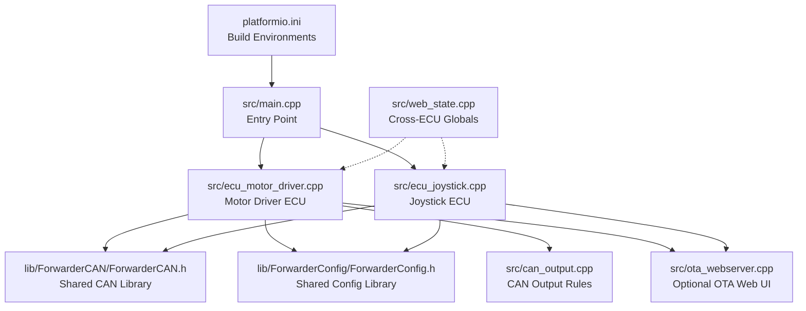
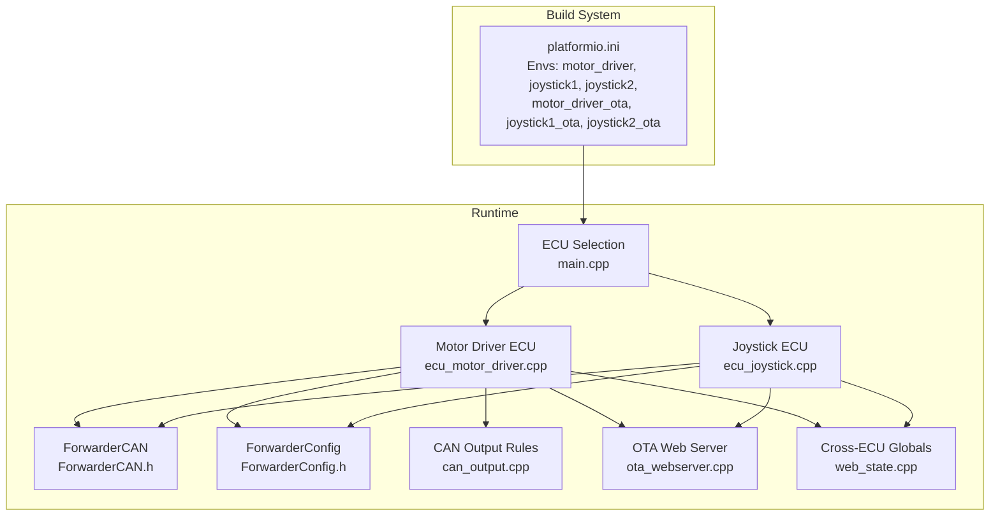
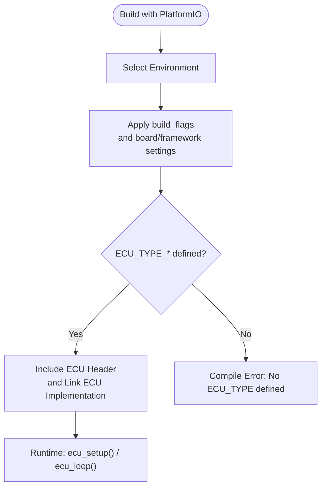
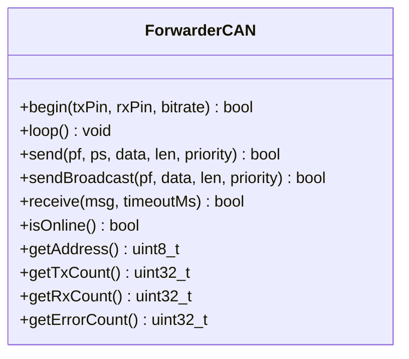
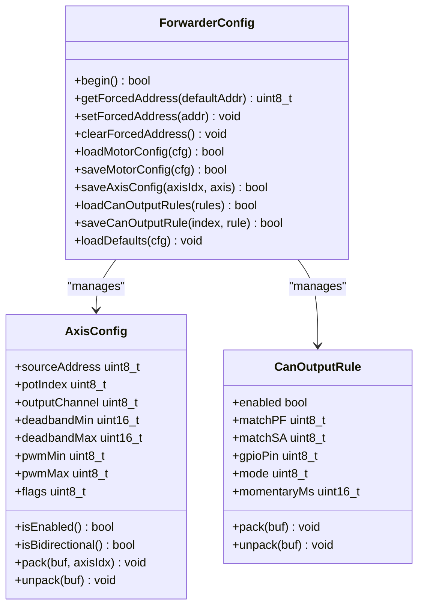
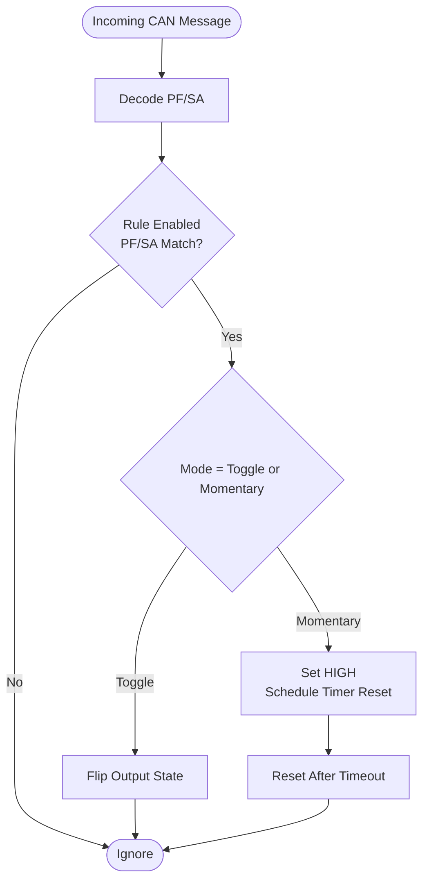
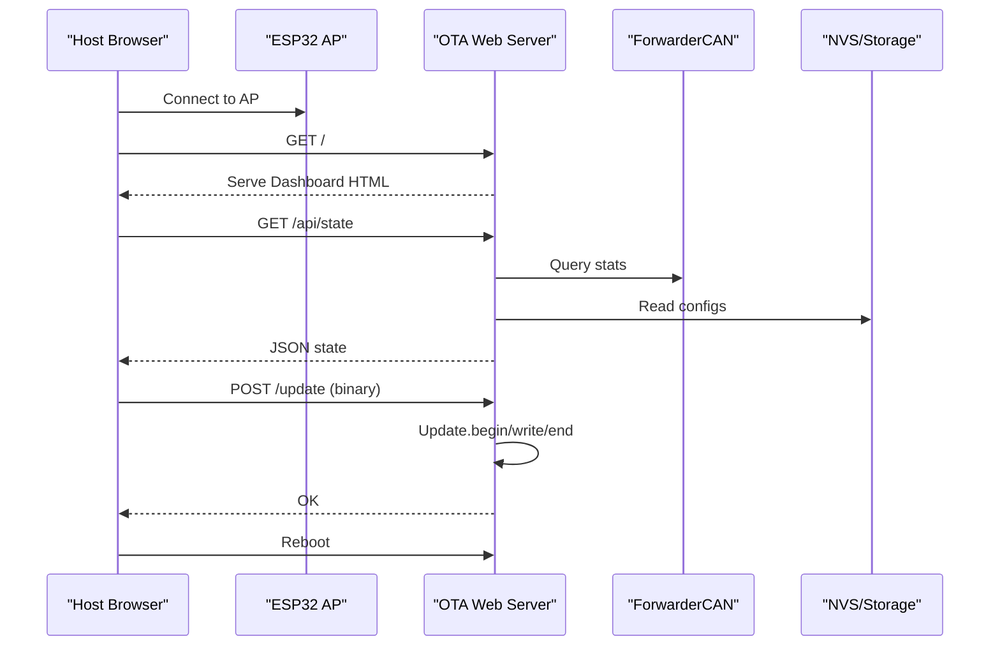
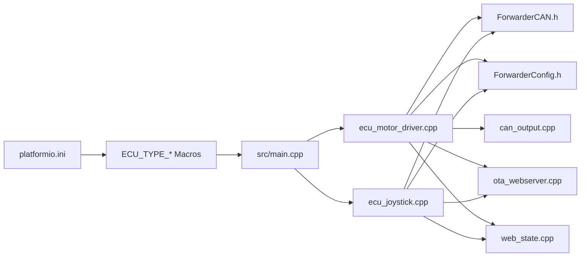

# Software Architecture

<cite>
**Referenced Files in This Document**
- [platformio.ini](file://platformio.ini)
- [README.md](file://README.md)
- [main.cpp](file://src/main.cpp)
- [ecu_motor_driver.cpp](file://src/ecu_motor_driver.cpp)
- [ecu_motor_driver.h](file://src/ecu_motor_driver.h)
- [ecu_joystick.cpp](file://src/ecu_joystick.cpp)
- [ecu_joystick.h](file://src/ecu_joystick.h)
- [can_output.cpp](file://src/can_output.cpp)
- [can_output.h](file://src/can_output.h)
- [ota_webserver.cpp](file://src/ota_webserver.cpp)
- [web_state.cpp](file://src/web_state.cpp)
- [ForwarderCAN.h](file://lib/ForwarderCAN/ForwarderCAN.h)
- [ForwarderConfig.h](file://lib/ForwarderConfig/ForwarderConfig.h)
</cite>

## Table of Contents
1. [Introduction](#introduction)
2. [Project Structure](#project-structure)
3. [Core Components](#core-components)
4. [Architecture Overview](#architecture-overview)
5. [Detailed Component Analysis](#detailed-component-analysis)
6. [Dependency Analysis](#dependency-analysis)
7. [Performance Considerations](#performance-considerations)
8. [Troubleshooting Guide](#troubleshooting-guide)
9. [Conclusion](#conclusion)
10. [Appendices](#appendices)

## Introduction
This document describes the software architecture of ForwarderKE, an embedded CAN control system for agricultural machinery. It focuses on the modular embedded design, build configuration management via PlatformIO environments, and the ECU type selection mechanism driven by preprocessor directives. The system supports two ECU roles: a motor driver ECU controlling solenoids via PCA9685 PWM drivers and joystick ECUs that capture analog inputs and publish them over CAN. A shared library architecture separates CAN protocol implementation (ForwarderCAN) and persistent configuration management (ForwarderConfig). The document also covers the main entry point, initialization sequence, runtime coordination, memory and real-time constraints, interrupt handling strategies, and system context diagrams.

## Project Structure
The repository is organized around a PlatformIO-based embedded project with a clear separation of concerns:
- src: Application entry point and ECU-specific logic
- lib: Shared libraries for CAN and configuration
- platformio.ini: Build environments and compile-time flags
- README.md: Protocol specification, hardware pinouts, and build instructions



**Diagram sources**
- [platformio.ini:1-80](file://platformio.ini#L1-L80)
- [main.cpp:1-32](file://src/main.cpp#L1-L32)
- [ecu_motor_driver.cpp:1-353](file://src/ecu_motor_driver.cpp#L1-L353)
- [ecu_joystick.cpp:1-239](file://src/ecu_joystick.cpp#L1-L239)
- [can_output.cpp:1-66](file://src/can_output.cpp#L1-L66)
- [ota_webserver.cpp:1-809](file://src/ota_webserver.cpp#L1-L809)
- [web_state.cpp:1-20](file://src/web_state.cpp#L1-L20)
- [ForwarderCAN.h:1-120](file://lib/ForwarderCAN/ForwarderCAN.h#L1-L120)
- [ForwarderConfig.h:1-92](file://lib/ForwarderConfig/ForwarderConfig.h#L1-L92)

**Section sources**
- [platformio.ini:1-80](file://platformio.ini#L1-L80)
- [README.md:1-131](file://README.md#L1-L131)
- [main.cpp:1-32](file://src/main.cpp#L1-L32)

## Core Components
- Entry point and ECU selection:
  - The application entry point conditionally includes either the motor driver or joystick ECU implementation based on compile-time flags. This determines the runtime behavior and hardware pin assignments.
- Motor Driver ECU:
  - Initializes PCA9685 PWM drivers, manages solenoid outputs, processes joystick inputs, handles LED status, and optionally exposes an OTA web server.
- Joystick ECU:
  - Reads analog pots and buttons, publishes joystick data over CAN, controls onboard LED, and optionally exposes an OTA web server.
- CAN Protocol Library (ForwarderCAN):
  - Implements J1939-like 29-bit ID layout, address claiming, message send/receive, and statistics.
- Configuration Library (ForwarderConfig):
  - Provides persistent storage for address overrides, motor mapping configurations, and CAN-triggered GPIO output rules using NVS.
- CAN Output Rules:
  - Translates incoming CAN messages into GPIO actions (toggle or momentary pulses) based on configurable rules.
- OTA Web Server:
  - Optional Wi-Fi AP-based web UI for diagnostics, configuration updates, and firmware OTA.

**Section sources**
- [main.cpp:1-32](file://src/main.cpp#L1-L32)
- [ecu_motor_driver.cpp:1-353](file://src/ecu_motor_driver.cpp#L1-L353)
- [ecu_joystick.cpp:1-239](file://src/ecu_joystick.cpp#L1-L239)
- [ForwarderCAN.h:1-120](file://lib/ForwarderCAN/ForwarderCAN.h#L1-L120)
- [ForwarderConfig.h:1-92](file://lib/ForwarderConfig/ForwarderConfig.h#L1-L92)
- [can_output.cpp:1-66](file://src/can_output.cpp#L1-L66)
- [ota_webserver.cpp:1-809](file://src/ota_webserver.cpp#L1-L809)

## Architecture Overview
The system employs a modular, library-centric design:
- Preprocessor-driven ECU selection at compile time
- Shared libraries for protocol and persistence
- Environment-specific build flags for hardware pin mapping and behavior
- Optional OTA web server for diagnostics and updates



**Diagram sources**
- [platformio.ini:1-80](file://platformio.ini#L1-L80)
- [main.cpp:1-32](file://src/main.cpp#L1-L32)
- [ecu_motor_driver.cpp:1-353](file://src/ecu_motor_driver.cpp#L1-L353)
- [ecu_joystick.cpp:1-239](file://src/ecu_joystick.cpp#L1-L239)
- [ForwarderCAN.h:1-120](file://lib/ForwarderCAN/ForwarderCAN.h#L1-L120)
- [ForwarderConfig.h:1-92](file://lib/ForwarderConfig/ForwarderConfig.h#L1-L92)
- [can_output.cpp:1-66](file://src/can_output.cpp#L1-L66)
- [ota_webserver.cpp:1-809](file://src/ota_webserver.cpp#L1-L809)
- [web_state.cpp:1-20](file://src/web_state.cpp#L1-L20)

## Detailed Component Analysis

### ECU Type Selection and Build Configuration
- Compile-time selection:
  - The entry point includes either the motor driver or joystick ECU header based on defined macros. This single point of selection drives the entire runtime behavior.
- PlatformIO environments:
  - Six environments define hardware pin mappings, preferred addresses, and optional OTA support. Each environment extends common base flags and adds device-specific settings.
- Environment inheritance:
  - OTA-enabled environments extend their non-OTA counterparts, inheriting base flags and adding OTA-related flags.



**Diagram sources**
- [platformio.ini:1-80](file://platformio.ini#L1-L80)
- [main.cpp:1-32](file://src/main.cpp#L1-L32)

**Section sources**
- [main.cpp:6-17](file://src/main.cpp#L6-L17)
- [platformio.ini:17-79](file://platformio.ini#L17-L79)
- [README.md:43-46](file://README.md#L43-L46)

### Motor Driver ECU Initialization and Runtime
- Initialization sequence:
  - LED initialization, configuration manager begin, loading forced address and persisted configs, PCA9685 initialization, CAN bus initialization, optional OTA setup.
- Runtime coordination:
  - Periodic CAN processing, joystick-to-solenoid mapping, safety timeout to turn off outputs, heartbeat broadcasting, LED status updates, and optional OTA loop.
- Safety features:
  - Solenoid timeout resets outputs after a period without CAN commands.

```mermaid
sequenceDiagram
participant Boot as "Boot"
participant Setup as "ecu_setup()"
participant CAN as "ForwarderCAN"
participant CFG as "ForwarderConfig"
participant PCA as "PCA9685"
participant Loop as "ecu_loop()"
participant OTA as "OTA Web Server"
Boot->>Setup : Call ecu_setup()
Setup->>CFG : begin()
Setup->>CFG : getForcedAddress()
Setup->>CFG : loadMotorConfig()/loadCanOutputRules()
Setup->>PCA : initPCA()
Setup->>CAN : begin(txPin, rxPin, bitrate)
alt ENABLE_OTA_WEBSERVER
Setup->>OTA : ota_setup(hostname)
end
Loop->>CAN : loop()
Loop->>Loop : processCAN()
Loop->>PCA : updateAxes()
Loop->>Loop : sendHeartbeat()
Loop->>Loop : updateLED()
Loop->>Loop : can_output_loop()
alt ENABLE_OTA_WEBSERVER
Loop->>OTA : ota_loop()
end
```

**Diagram sources**
- [ecu_motor_driver.cpp:290-350](file://src/ecu_motor_driver.cpp#L290-L350)
- [ForwarderCAN.h:66-119](file://lib/ForwarderCAN/ForwarderCAN.h#L66-L119)
- [ForwarderConfig.h:64-91](file://lib/ForwarderConfig/ForwarderConfig.h#L64-L91)
- [can_output.cpp:51-61](file://src/can_output.cpp#L51-L61)
- [ota_webserver.cpp:766-796](file://src/ota_webserver.cpp#L766-L796)

**Section sources**
- [ecu_motor_driver.cpp:290-350](file://src/ecu_motor_driver.cpp#L290-L350)

### Joystick ECU Initialization and Runtime
- Initialization sequence:
  - LED initialization, input pin setup, configuration manager begin, CAN initialization with address claiming, optional OTA setup.
- Runtime coordination:
  - Input sampling, CAN processing, periodic publishing of pots/buttons, heartbeat broadcasting, LED updates, and optional OTA loop.

```mermaid
sequenceDiagram
participant Boot as "Boot"
participant Setup as "ecu_setup()"
participant CAN as "ForwarderCAN"
participant CFG as "ForwarderConfig"
participant Loop as "ecu_loop()"
participant OTA as "OTA Web Server"
Boot->>Setup : Call ecu_setup()
Setup->>CFG : begin()
Setup->>CFG : getForcedAddress()
Setup->>CAN : begin(txPin, rxPin, bitrate)
alt ENABLE_OTA_WEBSERVER
Setup->>OTA : ota_setup(hostname)
end
Loop->>CAN : loop()
Loop->>Loop : readInputs()
Loop->>Loop : processCAN()
Loop->>CAN : sendBroadcast(PF_JOYSTICK_*)
Loop->>Loop : sendHeartbeat()
Loop->>Loop : updateLED()
alt ENABLE_OTA_WEBSERVER
Loop->>OTA : ota_loop()
end
```

**Diagram sources**
- [ecu_joystick.cpp:159-192](file://src/ecu_joystick.cpp#L159-L192)
- [ForwarderCAN.h:66-119](file://lib/ForwarderCAN/ForwarderCAN.h#L66-L119)
- [ForwarderConfig.h:64-91](file://lib/ForwarderConfig/ForwarderConfig.h#L64-L91)
- [ota_webserver.cpp:766-796](file://src/ota_webserver.cpp#L766-L796)

**Section sources**
- [ecu_joystick.cpp:159-192](file://src/ecu_joystick.cpp#L159-L192)

### CAN Protocol and Address Claiming
- Protocol layout:
  - 29-bit extended IDs with J1939-like fields for priority, DP, PF, PS, and SA.
- Address claiming:
  - Implements address arbitration with retries and conflict resolution.
- Message handling:
  - Dedicated PF values for joystick data, LED control, solenoid commands, identification, address setting, configuration exchange, and heartbeat.



**Diagram sources**
- [ForwarderCAN.h:66-119](file://lib/ForwarderCAN/ForwarderCAN.h#L66-L119)

**Section sources**
- [ForwarderCAN.h:1-120](file://lib/ForwarderCAN/ForwarderCAN.h#L1-L120)

### Configuration Management and Persistent Storage
- Data structures:
  - AxisConfig defines joystick-to-solenoid mapping with deadbands and PWM scaling.
  - CanOutputRule defines CAN-triggered GPIO actions.
  - MotorConfig aggregates axis mappings and PCA count.
- Persistence:
  - Uses NVS Preferences to store forced addresses, axis configs, and CAN output rules.
- Cross-ECU visibility:
  - web_state.cpp provides default definitions for global arrays and structs used by the non-selected ECU, enabling unified web UI.



**Diagram sources**
- [ForwarderConfig.h:64-91](file://lib/ForwarderConfig/ForwarderConfig.h#L64-L91)

**Section sources**
- [ForwarderConfig.h:1-92](file://lib/ForwarderConfig/ForwarderConfig.h#L1-L92)
- [web_state.cpp:6-19](file://src/web_state.cpp#L6-L19)

### CAN Output Rules Engine
- Purpose:
  - Translate incoming CAN messages into GPIO actions based on configurable rules.
- Operation:
  - On match, toggle or momentarily activate a GPIO pin; momentary mode auto-resets after a configured timeout.
- Integration:
  - Motor driver ECU initializes rules from persistent storage and applies them during runtime.



**Diagram sources**
- [can_output.cpp:29-61](file://src/can_output.cpp#L29-L61)

**Section sources**
- [can_output.cpp:1-66](file://src/can_output.cpp#L1-L66)

### OTA Web Server and Diagnostics
- Functionality:
  - Creates a Wi-Fi AP, serves a dashboard, exposes APIs for configuration, address changes, and OTA updates.
- Integration:
  - Conditionally compiled and integrated into both ECUs when enabled via build flags.
- Security:
  - Access point password and local mDNS service discovery.



**Diagram sources**
- [ota_webserver.cpp:766-796](file://src/ota_webserver.cpp#L766-L796)
- [ForwarderCAN.h:94-96](file://lib/ForwarderCAN/ForwarderCAN.h#L94-L96)
- [ForwarderConfig.h:70-82](file://lib/ForwarderConfig/ForwarderConfig.h#L70-L82)

**Section sources**
- [ota_webserver.cpp:1-809](file://src/ota_webserver.cpp#L1-L809)
- [platformio.ini:63-79](file://platformio.ini#L63-L79)

## Dependency Analysis
- Build-time dependencies:
  - PlatformIO environments define macro sets that select ECU type and hardware pin mappings.
- Runtime dependencies:
  - Both ECUs depend on ForwarderCAN and ForwarderConfig. Motor driver additionally depends on PCA9685 and NeoPixel libraries. OTA web server depends on ESP32 Wi-Fi and Update libraries.
- Coupling:
  - Shared libraries reduce coupling between ECU implementations; cross-ECU globals are provided via web_state.cpp to unify the web UI.



**Diagram sources**
- [platformio.ini:1-80](file://platformio.ini#L1-L80)
- [main.cpp:1-32](file://src/main.cpp#L1-L32)
- [ecu_motor_driver.cpp:1-353](file://src/ecu_motor_driver.cpp#L1-L353)
- [ecu_joystick.cpp:1-239](file://src/ecu_joystick.cpp#L1-L239)
- [ForwarderCAN.h:1-120](file://lib/ForwarderCAN/ForwarderCAN.h#L1-L120)
- [ForwarderConfig.h:1-92](file://lib/ForwarderConfig/ForwarderConfig.h#L1-L92)
- [can_output.cpp:1-66](file://src/can_output.cpp#L1-L66)
- [ota_webserver.cpp:1-809](file://src/ota_webserver.cpp#L1-L809)
- [web_state.cpp:1-20](file://src/web_state.cpp#L1-L20)

**Section sources**
- [platformio.ini:1-80](file://platformio.ini#L1-L80)
- [main.cpp:1-32](file://src/main.cpp#L1-L32)

## Performance Considerations
- Real-time constraints:
  - CAN bus operations rely on TWAI peripheral interrupts; ensure minimal blocking in ISR contexts and keep message processing loops efficient.
- Memory management:
  - Static allocation for PCA instances and LED strips reduces heap fragmentation. Prefer stack allocation for small buffers; avoid dynamic allocations in long-running tasks.
- Interrupt handling:
  - TWAI driver handles receive interrupts; application code should poll and process messages promptly without long delays.
- Timing loops:
  - Heartbeat and LED updates use millisecond timers; maintain short loop iterations to preserve responsiveness.
- OTA updates:
  - Binary uploads occur over HTTP; ensure sufficient free flash space and handle partial failures gracefully.

[No sources needed since this section provides general guidance]

## Troubleshooting Guide
- Address claiming failures:
  - Verify unique preferred addresses per environment; check forced address persistence and conflict resolution behavior.
- CAN bus offline:
  - Confirm correct TX/RX pin assignments and bitrate; monitor online state and error counters.
- Solenoid outputs not responding:
  - Check joystick-to-solenoid mapping, deadband thresholds, and safety timeout conditions.
- OTA upload failures:
  - Validate AP connectivity, correct binary file, and sufficient free flash space; review serial logs for Update errors.
- Web UI not loading:
  - Ensure OTA is enabled for the selected environment and AP credentials; confirm mDNS service availability.

**Section sources**
- [ecu_motor_driver.cpp:305-316](file://src/ecu_motor_driver.cpp#L305-L316)
- [ecu_joystick.cpp:174-185](file://src/ecu_joystick.cpp#L174-L185)
- [ota_webserver.cpp:705-732](file://src/ota_webserver.cpp#L705-L732)

## Conclusion
ForwarderKE demonstrates a clean, modular embedded architecture centered on compile-time ECU selection and shared libraries for protocol and persistence. PlatformIO environments encapsulate hardware differences and deployment variants, while the motor driver and joystick ECUs coordinate via a standardized CAN protocol. Optional OTA capabilities streamline maintenance and diagnostics. Adhering to real-time constraints, careful memory management, and efficient interrupt handling ensures reliable operation in field conditions.

[No sources needed since this section summarizes without analyzing specific files]

## Appendices

### Build Environments Reference
- motor_driver: Motor driver with PCA9685 and onboard LED
- joystick1/joystick2: Joystick units with potentiometer and button inputs
- motor_driver_ota/joystick1_ota/joystick2_ota: OTA-enabled variants

**Section sources**
- [platformio.ini:17-79](file://platformio.ini#L17-L79)
- [README.md:63-103](file://README.md#L63-L103)