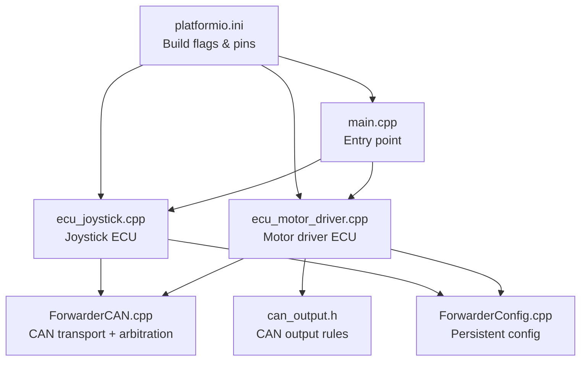
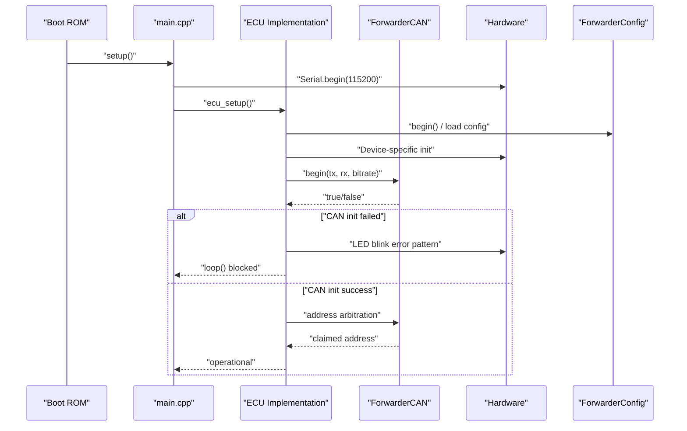
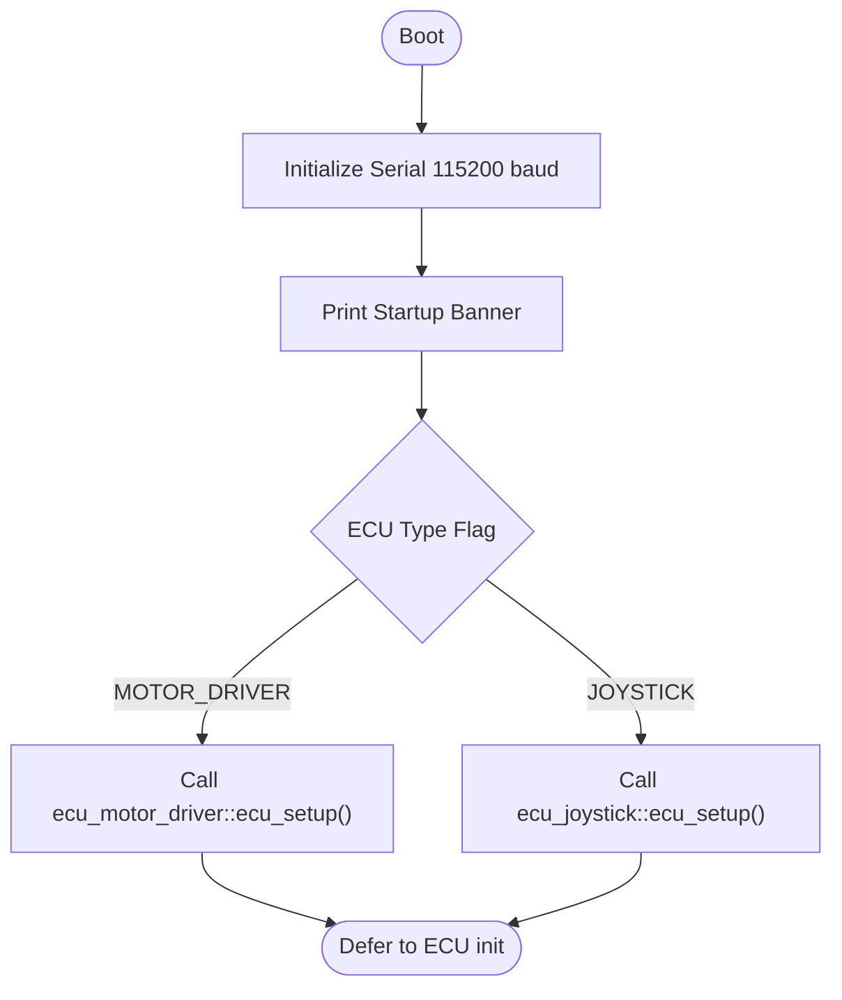
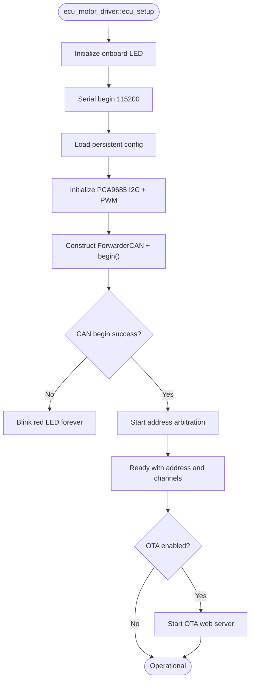
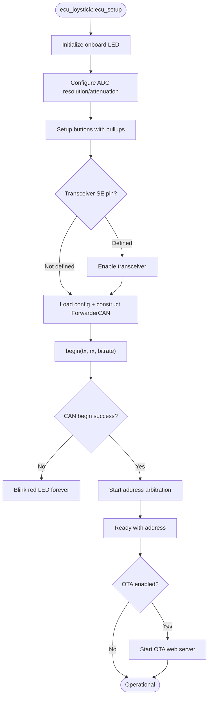
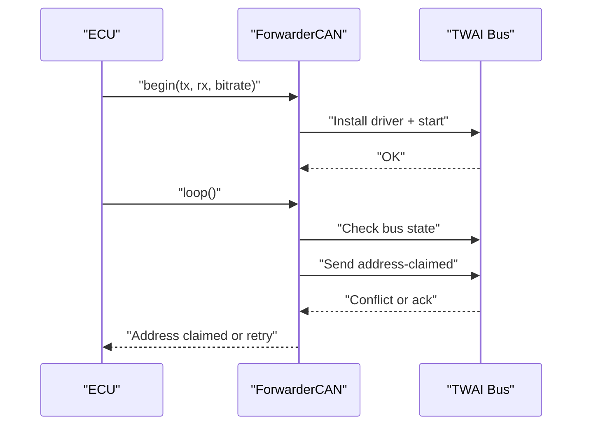
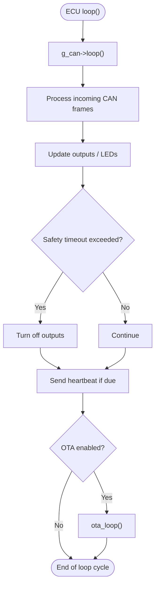
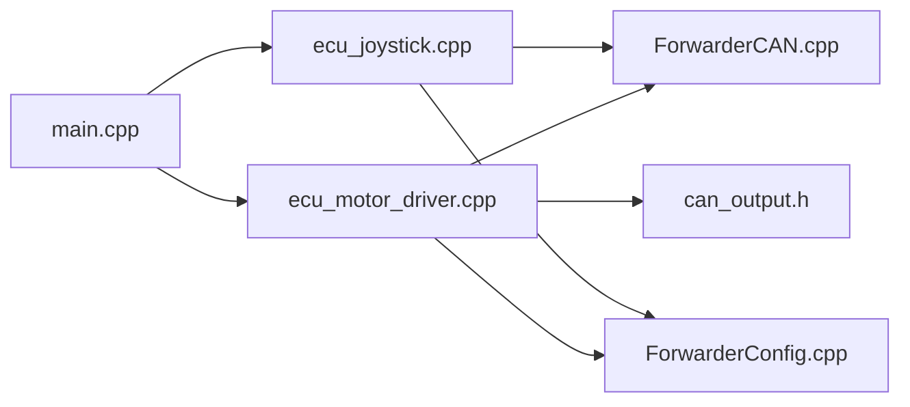

# System Initialization Sequence

<cite>
**Referenced Files in This Document**
- [main.cpp](file://src/main.cpp)
- [ecu_motor_driver.cpp](file://src/ecu_motor_driver.cpp)
- [ecu_motor_driver.h](file://src/ecu_motor_driver.h)
- [ecu_joystick.cpp](file://src/ecu_joystick.cpp)
- [ecu_joystick.h](file://src/ecu_joystick.h)
- [platformio.ini](file://platformio.ini)
- [README.md](file://README.md)
- [ForwarderCAN.cpp](file://lib/ForwarderCAN/ForwarderCAN.cpp)
- [ForwarderCAN.h](file://lib/ForwarderCAN/ForwarderCAN.h)
- [ForwarderConfig.cpp](file://lib/ForwarderConfig/ForwarderConfig.cpp)
- [can_output.h](file://src/can_output.h)
</cite>

## Table of Contents
1. [Introduction](#introduction)
2. [Project Structure](#project-structure)
3. [Core Components](#core-components)
4. [Architecture Overview](#architecture-overview)
5. [Detailed Component Analysis](#detailed-component-analysis)
6. [Dependency Analysis](#dependency-analysis)
7. [Performance Considerations](#performance-considerations)
8. [Troubleshooting Guide](#troubleshooting-guide)
9. [Conclusion](#conclusion)

## Introduction
This document describes the complete system initialization sequence in ForwarderKE from boot-up to operational state. It traces the execution flow from the Arduino entry point through ECU-specific initialization routines, details serial communication setup, hardware initialization order, and component registration processes. It explains the differences between the motor driver and joystick ECUs, including their unique initialization requirements, watchdog-related build flags, interrupt configuration, and real-time task scheduling. Timing considerations, startup error handling, and diagnostic output patterns are documented alongside graceful degradation strategies and fallback mechanisms during initialization failures.

## Project Structure
ForwarderKE is organized around a small set of source files and shared libraries:
- Entry point: main.cpp conditionally includes either motor driver or joystick ECU headers based on build flags.
- ECU implementations: ecu_motor_driver.cpp and ecu_joystick.cpp implement device-specific initialization and loops.
- Shared libraries: ForwarderCAN provides J1939-like CAN transport and address arbitration; ForwarderConfig persists runtime configuration.
- Build configuration: platformio.ini defines environments and compile-time flags for each ECU type.



**Diagram sources**
- [main.cpp:19-31](file://src/main.cpp#L19-L31)
- [ecu_motor_driver.cpp:290-325](file://src/ecu_motor_driver.cpp#L290-L325)
- [ecu_joystick.cpp:159-192](file://src/ecu_joystick.cpp#L159-L192)
- [ForwarderCAN.cpp:13-52](file://lib/ForwarderCAN/ForwarderCAN.cpp#L13-L52)
- [ForwarderConfig.cpp:56-74](file://lib/ForwarderConfig/ForwarderConfig.cpp#L56-L74)
- [platformio.ini:17-80](file://platformio.ini#L17-L80)

**Section sources**
- [main.cpp:19-31](file://src/main.cpp#L19-L31)
- [platformio.ini:17-80](file://platformio.ini#L17-L80)
- [README.md:112-126](file://README.md#L112-L126)

## Core Components
- Arduino entry point: Initializes serial debug, prints a banner, and delegates to the selected ECU initialization routine.
- ECU selection: Conditional inclusion of ecu_motor_driver.h or ecu_joystick.h based on ECU_TYPE_* build flags.
- ECU-specific initialization: Each ECU implements ecu_setup() and ecu_loop() to configure hardware, CAN, and runtime tasks.
- CAN transport: ForwarderCAN manages TWAI driver installation, bus state monitoring, and J1939 address arbitration.
- Persistent configuration: ForwarderConfig stores and retrieves runtime parameters (addresses, axis configs, CAN output rules).

**Section sources**
- [main.cpp:11-27](file://src/main.cpp#L11-L27)
- [ecu_motor_driver.h:3-4](file://src/ecu_motor_driver.h#L3-L4)
- [ecu_joystick.h:3-4](file://src/ecu_joystick.h#L3-L4)
- [ForwarderCAN.cpp:13-52](file://lib/ForwarderCAN/ForwarderCAN.cpp#L13-L52)
- [ForwarderConfig.cpp:56-74](file://lib/ForwarderConfig/ForwarderConfig.cpp#L56-L74)

## Architecture Overview
The system boots into main.cpp, which selects the ECU implementation at compile time. Both ECUs initialize serial output, then perform device-specific hardware setup, followed by CAN initialization and address arbitration. Once online, each ECU periodically broadcasts heartbeat messages and processes incoming CAN frames. The motor driver additionally manages PCA9685 PWM outputs and onboard LED indication, while the joystick reads analog inputs and buttons.



**Diagram sources**
- [main.cpp:19-27](file://src/main.cpp#L19-L27)
- [ecu_motor_driver.cpp:290-325](file://src/ecu_motor_driver.cpp#L290-L325)
- [ecu_joystick.cpp:159-192](file://src/ecu_joystick.cpp#L159-L192)
- [ForwarderCAN.cpp:13-52](file://lib/ForwarderCAN/ForwarderCAN.cpp#L13-L52)

## Detailed Component Analysis

### System Entry and ECU Selection
- main.cpp initializes serial communication at 115200 baud, prints a startup banner, and calls ecu_setup().
- The build system defines ECU_TYPE_MOTOR_DRIVER or ECU_TYPE_JOYSTICK, causing the appropriate header to be included and linked.



**Diagram sources**
- [main.cpp:19-27](file://src/main.cpp#L19-L27)
- [platformio.ini:18-22](file://platformio.ini#L18-L22)

**Section sources**
- [main.cpp:19-27](file://src/main.cpp#L19-L27)
- [platformio.ini:18-22](file://platformio.ini#L18-L22)

### Motor Driver ECU Initialization
The motor driver ECU performs the following initialization steps:
- LED initialization: Initializes onboard WS2812 LED and sets a blue indicator.
- Serial: Reinitializes serial for logging after LED setup.
- Configuration: Loads persistent configuration for addresses, axis mapping, and CAN output rules.
- PCA9685 PWM: Configures I2C pins, initializes PCA9685 chips, detects presence of a second PCA9685, and sets oscillator frequency and PWM rate.
- CAN: Constructs ForwarderCAN with a preferred address and ECU name, then installs and starts the TWAI driver with configured bitrate.
- Error handling: If CAN fails to start, blinks red LED in a loop until reset.
- OTA: Optionally starts an embedded web server for OTA updates.



**Diagram sources**
- [ecu_motor_driver.cpp:290-325](file://src/ecu_motor_driver.cpp#L290-L325)

**Section sources**
- [ecu_motor_driver.cpp:290-325](file://src/ecu_motor_driver.cpp#L290-L325)

### Joystick ECU Initialization
The joystick ECU performs the following initialization steps:
- LED initialization: Initializes onboard WS2812 LED and sets a green indicator.
- ADC resolution and attenuation: Sets analog read resolution and attenuation for stable pot readings.
- Button pins: Configures buttons with internal pullups.
- Transceiver enable: Optionally enables a separate CAN transceiver via a pin.
- Configuration: Loads persistent configuration for forced address.
- CAN: Constructs ForwarderCAN with a preferred address and ECU name, then installs and starts the TWAI driver.
- Error handling: If CAN fails to start, blinks red LED in a loop until reset.
- OTA: Optionally starts an embedded web server for OTA updates.



**Diagram sources**
- [ecu_joystick.cpp:159-192](file://src/ecu_joystick.cpp#L159-L192)

**Section sources**
- [ecu_joystick.cpp:159-192](file://src/ecu_joystick.cpp#L159-L192)

### CAN Transport and Address Arbitration
Both ECUs rely on ForwarderCAN for transport and address arbitration:
- Driver installation: Installs TWAI driver with configurable TX/RX queues and bitrate.
- Bus state monitoring: Periodically checks bus-off state and initiates recovery.
- Address claiming: Sends address-claimed messages and handles conflicts via J1939-style arbitration.
- Network management: Processes address-claimed and request-ac messages to resolve conflicts.



**Diagram sources**
- [ForwarderCAN.cpp:13-52](file://lib/ForwarderCAN/ForwarderCAN.cpp#L13-L52)
- [ForwarderCAN.cpp:79-119](file://lib/ForwarderCAN/ForwarderCAN.cpp#L79-L119)
- [ForwarderCAN.cpp:121-142](file://lib/ForwarderCAN/ForwarderCAN.cpp#L121-L142)

**Section sources**
- [ForwarderCAN.cpp:13-52](file://lib/ForwarderCAN/ForwarderCAN.cpp#L13-L52)
- [ForwarderCAN.cpp:79-119](file://lib/ForwarderCAN/ForwarderCAN.cpp#L79-L119)
- [ForwarderCAN.cpp:121-142](file://lib/ForwarderCAN/ForwarderCAN.cpp#L121-L142)

### Real-Time Task Scheduling and Loop Behavior
Both ECUs implement a continuous loop() that:
- Polls the CAN stack for incoming messages.
- Processes protocol-specific frames (joystick pots/buttons, solenoid commands, LED control, identification, address changes, configuration requests).
- Updates outputs (PWM for motor driver, button/pot reports for joystick).
- Emits periodic heartbeat messages when online.
- Manages LEDs and optional OTA tasks.



**Diagram sources**
- [ecu_motor_driver.cpp:327-352](file://src/ecu_motor_driver.cpp#L327-L352)
- [ecu_joystick.cpp:194-236](file://src/ecu_joystick.cpp#L194-L236)

**Section sources**
- [ecu_motor_driver.cpp:327-352](file://src/ecu_motor_driver.cpp#L327-L352)
- [ecu_joystick.cpp:194-236](file://src/ecu_joystick.cpp#L194-L236)

### ECU-Specific Initialization Functions
- ecu_motor_driver_setup():
  - Initializes onboard LED, serial, loads configuration, detects and configures PCA9685 chips, constructs ForwarderCAN, and optionally starts OTA.
  - Unique requirements: I2C pin configuration for PCA9685, oscillator frequency and PWM rate tuning, detection of dual PCA9685 boards, and safety timeout for solenoid outputs.
- ecu_joystick_setup():
  - Initializes onboard LED, ADC resolution/attenuation, button pins, optional transceiver enable, constructs ForwarderCAN, and optionally starts OTA.
  - Unique requirements: Analog input sampling, button debouncing via thresholds, and CAN transceiver enable pin.

```mermaid
classDiagram
class MotorDriver {
+ecu_setup()
+ecu_loop()
-initPCA()
-mapAxis()
-updateAxes()
-updateLED()
-processCAN()
-sendHeartbeat()
}
class Joystick {
+ecu_setup()
+ecu_loop()
-readInputs()
-updateLED()
-sendPot()
-sendButtons()
-processCAN()
-sendHeartbeat()
}
MotorDriver <.. Joystick : "Both call ForwarderCAN : : begin()"
```

**Diagram sources**
- [ecu_motor_driver.cpp:290-352](file://src/ecu_motor_driver.cpp#L290-L352)
- [ecu_joystick.cpp:159-236](file://src/ecu_joystick.cpp#L159-L236)

**Section sources**
- [ecu_motor_driver.cpp:290-352](file://src/ecu_motor_driver.cpp#L290-L352)
- [ecu_joystick.cpp:159-236](file://src/ecu_joystick.cpp#L159-L236)

### Watchdog and Interrupt Configuration
- Watchdog timeout is defined via build flag WATCHDOG_TIMEOUT_MS in platformio.ini. This indicates the system expects a watchdog mechanism to be configured externally or via the framework, with a timeout value of 1000 ms.
- Interrupt configuration is handled implicitly by the TWAI driver installed by ForwarderCAN.begin(). The driver uses RTOS queues and callbacks managed by the ESP-IDF TWAI stack.

**Section sources**
- [platformio.ini:15](file://platformio.ini#L15)
- [ForwarderCAN.cpp:13-52](file://lib/ForwarderCAN/ForwarderCAN.cpp#L13-L52)

### Timing Considerations
- Startup delays: Serial initialization includes deliberate delays to ensure console readiness.
- Safety timeout: The motor driver disables solenoids after SAFETY_TIMEOUT_MS (defined per environment) without CAN activity.
- Heartbeat intervals: Both ECUs broadcast heartbeat messages every 1000 ms when online.
- LED update throttling: LED updates are rate-limited to reduce CPU overhead.
- CAN output rules: The motor driver supports configurable CAN-to-GPIO rules processed in can_output_loop().

**Section sources**
- [ecu_motor_driver.cpp:332-348](file://src/ecu_motor_driver.cpp#L332-L348)
- [ecu_joystick.cpp:226-232](file://src/ecu_joystick.cpp#L226-L232)
- [platformio.ini:29](file://platformio.ini#L29)
- [can_output.h:7-9](file://src/can_output.h#L7-L9)

### Startup Error Handling and Diagnostic Output
- Serial diagnostics: Each ECU logs initialization steps and outcomes to the serial console.
- CAN failure handling: On driver installation or start failure, both ECUs enter a blinking red LED loop indicating unrecoverable failure.
- Address arbitration: Conflicts are resolved automatically; logs indicate claim attempts and outcomes.
- OTA failure: OTA is optional; if enabled, failures are handled by the OTA subsystem.

**Section sources**
- [ecu_motor_driver.cpp:306-316](file://src/ecu_motor_driver.cpp#L306-L316)
- [ecu_joystick.cpp:175-185](file://src/ecu_joystick.cpp#L175-L185)
- [ForwarderCAN.cpp:60-61](file://lib/ForwarderCAN/ForwarderCAN.cpp#L60-L61)
- [ForwarderCAN.cpp:98-109](file://lib/ForwarderCAN/ForwarderCAN.cpp#L98-L109)

### Graceful Degradation and Fallback Mechanisms
- Address arbitration: If arbitration fails, the system retries up to a maximum number of attempts, then falls back to an alternate address derived from the ECU name hash.
- Bus-off recovery: The CAN driver automatically attempts recovery when the bus enters a bus-off state.
- Safety timeout: The motor driver gracefully deactivates outputs after SAFETY_TIMEOUT_MS to prevent unintended actuation.
- OTA disabled: If OTA is not enabled, the system proceeds without Wi-Fi update capability, maintaining core functionality.

**Section sources**
- [ForwarderCAN.cpp:98-109](file://lib/ForwarderCAN/ForwarderCAN.cpp#L98-L109)
- [ForwarderCAN.cpp:82-89](file://lib/ForwarderCAN/ForwarderCAN.cpp#L82-L89)
- [ecu_motor_driver.cpp:332-337](file://src/ecu_motor_driver.cpp#L332-L337)
- [platformio.ini:63-79](file://platformio.ini#L63-L79)

## Dependency Analysis
The initialization sequence exhibits clear module boundaries:
- main.cpp depends on compile-time flags to select an ECU implementation.
- Each ECU depends on ForwarderCAN for transport and ForwarderConfig for persistence.
- The motor driver additionally depends on PCA9685 libraries and can_output rules.



**Diagram sources**
- [main.cpp:11-17](file://src/main.cpp#L11-L17)
- [ecu_motor_driver.cpp:1-12](file://src/ecu_motor_driver.cpp#L1-L12)
- [ecu_joystick.cpp:1-9](file://src/ecu_joystick.cpp#L1-L9)
- [ForwarderCAN.cpp:1-11](file://lib/ForwarderCAN/ForwarderCAN.cpp#L1-L11)
- [ForwarderConfig.cpp:1-1](file://lib/ForwarderConfig/ForwarderConfig.cpp#L1-L1)
- [can_output.h:1-10](file://src/can_output.h#L1-L10)

**Section sources**
- [main.cpp:11-17](file://src/main.cpp#L11-L17)
- [ecu_motor_driver.cpp:1-12](file://src/ecu_motor_driver.cpp#L1-L12)
- [ecu_joystick.cpp:1-9](file://src/ecu_joystick.cpp#L1-L9)

## Performance Considerations
- Rate-limiting LED updates reduces CPU usage and power consumption.
- CAN receive loops process queued messages efficiently without blocking.
- Motor driver PWM updates occur only when values change, minimizing I2C traffic.
- Heartbeat broadcasting occurs at 1-second intervals to balance diagnostics and bandwidth.

## Troubleshooting Guide
- No CAN bus activity:
  - Verify TX/RX pin assignments and bitrate in platformio.ini.
  - Confirm transceiver enable pin wiring for joystick ECU.
- Address conflicts:
  - Observe serial logs for address claim attempts and alternates.
  - Use PF_SET_ADDRESS to force a new address and restart.
- PCA9685 detection issues:
  - Check I2C SDA/SCL pin assignments and pull-ups.
  - Verify second PCA9685 address configuration.
- OTA not working:
  - Ensure ENABLE_OTA_WEBSERVER is defined for the environment.
  - Confirm Wi-Fi credentials and AP availability.

**Section sources**
- [platformio.ini:17-80](file://platformio.ini#L17-L80)
- [ecu_motor_driver.cpp:301-302](file://src/ecu_motor_driver.cpp#L301-L302)
- [ecu_joystick.cpp:171-174](file://src/ecu_joystick.cpp#L171-L174)
- [ForwarderCAN.cpp:60-61](file://lib/ForwarderCAN/ForwarderCAN.cpp#L60-L61)

## Conclusion
ForwarderKE’s initialization sequence is modular and robust. The Arduino entry point delegates to a compile-time-selected ECU implementation, which initializes serial, persistent configuration, device hardware, and CAN transport. Address arbitration and bus-off recovery ensure reliable operation on the shared CAN bus. The motor driver and joystick ECUs share common patterns while addressing distinct hardware requirements. Safety timeouts, diagnostic output, and OTA support provide predictable behavior and maintainability across deployments.