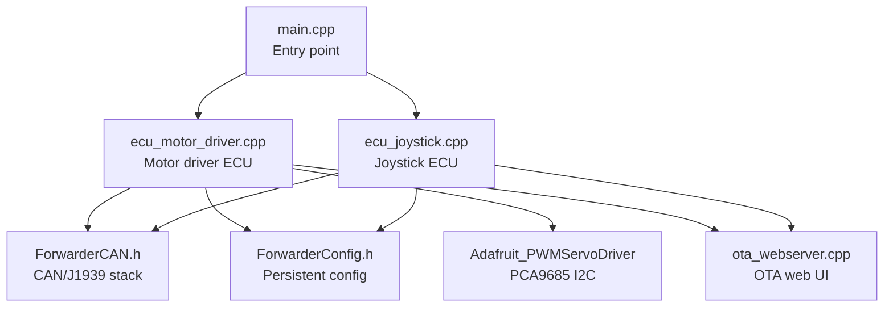
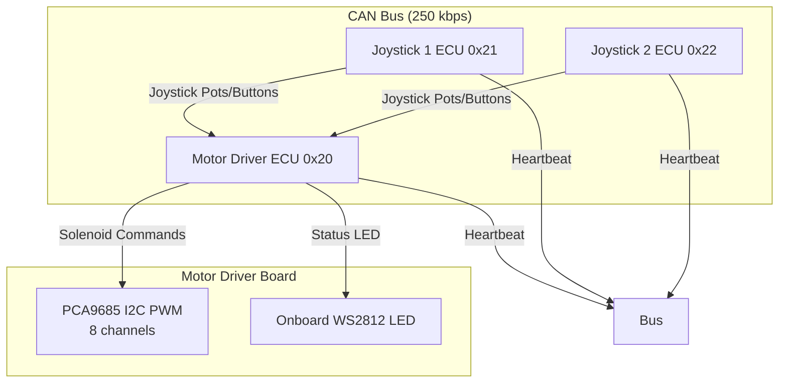
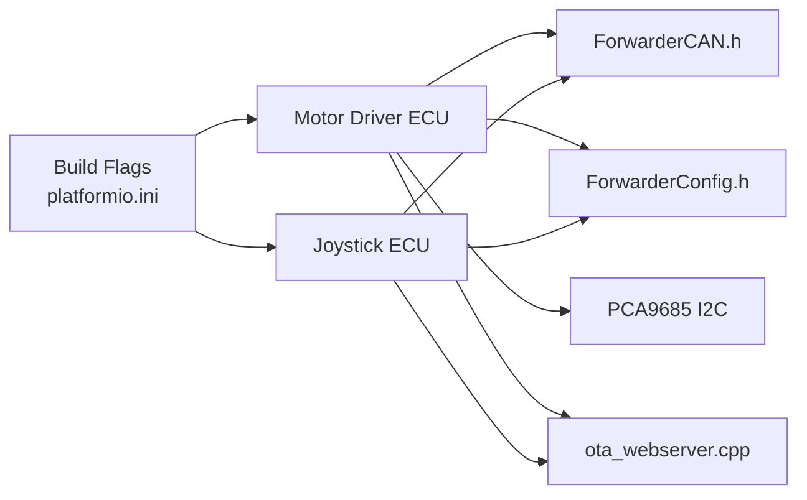

# Common Issues and Resolution

<cite>
**Referenced Files in This Document**
- [README.md](file://README.md)
- [platformio.ini](file://platformio.ini)
- [main.cpp](file://src/main.cpp)
- [ecu_motor_driver.cpp](file://src/ecu_motor_driver.cpp)
- [ecu_motor_driver.h](file://src/ecu_motor_driver.h)
- [ecu_joystick.cpp](file://src/ecu_joystick.cpp)
- [ecu_joystick.h](file://src/ecu_joystick.h)
- [ota_webserver.cpp](file://src/ota_webserver.cpp)
- [ota_webserver.h](file://src/ota_webserver.h)
- [can_output.h](file://src/can_output.h)
- [ForwarderCAN.h](file://lib/ForwarderCAN/ForwarderCAN.h)
- [ForwarderConfig.h](file://lib/ForwarderConfig/ForwarderConfig.h)
</cite>

## Table of Contents
1. [Introduction](#introduction)
2. [Project Structure](#project-structure)
3. [Core Components](#core-components)
4. [Architecture Overview](#architecture-overview)
5. [Detailed Component Analysis](#detailed-component-analysis)
6. [Dependency Analysis](#dependency-analysis)
7. [Performance Considerations](#performance-considerations)
8. [Troubleshooting Guide](#troubleshooting-guide)
9. [Conclusion](#conclusion)

## Introduction
This document provides a practical guide to diagnosing and resolving common issues in ForwarderKE, an ESP32-S3-based CAN controller for agricultural forwarder machines. It focuses on:
- CAN bus communication failures
- Address claiming conflicts during startup
- Solenoid control malfunctions
- Web interface and OTA connectivity issues
- Heartbeat timeout handling
- Bus-off recovery procedures
- I2C communication failures with PCA9685
- WiFi OTA update failures, web server connectivity problems, and configuration corruption

Each problem area includes root cause analysis, step-by-step resolution procedures, preventive measures, and escalation guidance.

## Project Structure
ForwarderKE is organized around a small set of source files and shared libraries:
- Entry point dispatches to ECU-specific logic based on build flags
- Motor driver ECU controls solenoids via PCA9685 and publishes heartbeat/status
- Joystick ECUs read analog inputs and publish joystick data
- Optional OTA web server enables firmware updates and diagnostics
- Shared libraries implement CAN/J1939 framing and persistent configuration

**Diagram sources**
- [main.cpp:19-31](file://src/main.cpp#L19-L31)
- [ecu_motor_driver.cpp:290-325](file://src/ecu_motor_driver.cpp#L290-L325)
- [ecu_joystick.cpp:159-192](file://src/ecu_joystick.cpp#L159-L192)
- [ota_webserver.cpp:766-791](file://src/ota_webserver.cpp#L766-L791)

**Section sources**
- [README.md:112-126](file://README.md#L112-L126)
- [platformio.ini:17-80](file://platformio.ini#L17-L80)

## Core Components
- CAN/J1939 stack encapsulated in ForwarderCAN.h
- Persistent configuration via ForwarderConfig.h
- Motor driver ECU: PCA9685 I2C control, heartbeat broadcasting, safety timeout
- Joystick ECU: analog input sampling, button reporting, heartbeat broadcasting
- OTA web server: AP provisioning, mDNS, HTTP handlers, firmware update endpoint

Key runtime behaviors:
- Address claiming and arbitration occur at startup; collisions are resolved automatically
- Heartbeat broadcast every 1 second indicates online/offline status
- Motor driver shuts off solenoids after 500 ms without commands
- OTA builds enable Wi-Fi AP and web UI for diagnostics and updates

**Section sources**
- [README.md:105-111](file://README.md#L105-L111)
- [ecu_motor_driver.cpp:327-352](file://src/ecu_motor_driver.cpp#L327-L352)
- [ecu_joystick.cpp:194-236](file://src/ecu_joystick.cpp#L194-L236)
- [ota_webserver.cpp:766-791](file://src/ota_webserver.cpp#L766-L791)

## Architecture Overview
The system uses a 250 kbps CAN bus with J1939-style extended IDs. Three ECUs coexist:
- Motor driver (address 0x20): controls 8 solenoids via PCA9685
- Joystick 1 (address 0x21): reads 3 pots + 2 buttons
- Joystick 2 (address 0x22): reads 3 pots + 2 buttons

**Diagram sources**
- [README.md:8-41](file://README.md#L8-L41)
- [ecu_motor_driver.cpp:69-99](file://src/ecu_motor_driver.cpp#L69-L99)
- [ecu_motor_driver.cpp:184-275](file://src/ecu_motor_driver.cpp#L184-L275)
- [ecu_joystick.cpp:114-144](file://src/ecu_joystick.cpp#L114-L144)

## Detailed Component Analysis

### Address Claiming Conflicts During Startup
Symptoms:
- Device fails to boot or repeatedly restarts
- LED blinks red rapidly
- No heartbeat observed on bus

Root causes:
- Multiple ECUs attempting to claim the same preferred address
- Forced address mismatch or invalid value stored in configuration

Resolution procedure:
1. Verify build flags define the correct preferred address per environment.
2. If a forced address exists in configuration, clear or adjust it to a unique value within 0x20–0xEF.
3. Power cycle the device; the address arbitration should resolve automatically.
4. Confirm the selected address appears in the web dashboard under “Modules”.

Preventive measures:
- Use separate PlatformIO environments for each ECU to enforce correct build flags.
- Avoid setting conflicting forced addresses across units.
- Keep the hardware address jumpers/pins consistent with intended address.

Escalation:
- If collisions persist, reflash with a different preferred address and re-run arbitration.

**Section sources**
- [platformio.ini:17-62](file://platformio.ini#L17-L62)
- [ecu_motor_driver.cpp:290-325](file://src/ecu_motor_driver.cpp#L290-L325)
- [ecu_joystick.cpp:159-192](file://src/ecu_joystick.cpp#L159-L192)
- [ota_webserver.cpp:506-563](file://src/ota_webserver.cpp#L506-L563)

### Heartbeat Timeout Handling
Symptoms:
- Motor driver solenoids shut off unexpectedly
- Dashboard shows offline status intermittently
- LED pattern indicates offline condition

Root causes:
- Excessive bus load or noise causing missed frames
- Safety timeout exceeded due to lack of joystick commands
- CAN transceiver or wiring issues

Resolution procedure:
1. Check CAN termination and wiring integrity.
2. Reduce bus load by disconnecting non-essential devices temporarily.
3. Inspect for high-frequency noise or ground loops.
4. Confirm joystick units are sending periodic joystick data.
5. Observe LED behavior; it will flash red when offline.

Preventive measures:
- Maintain clean wiring and proper termination.
- Ensure joystick units remain powered and responsive.
- Monitor heartbeat broadcasts via the web dashboard.

**Section sources**
- [README.md:108-110](file://README.md#L108-L110)
- [ecu_motor_driver.cpp:327-352](file://src/ecu_motor_driver.cpp#L327-L352)
- [ecu_motor_driver.cpp:153-182](file://src/ecu_motor_driver.cpp#L153-L182)

### Solenoid Control Malfunctions
Symptoms:
- Solenoids do not respond to joystick input
- PWM output appears inconsistent or zero
- PCA9685 not detected or partial channel control

Root causes:
- PCA9685 I2C address conflict or missing second PCA9685
- Incorrect axis mapping or deadband settings
- Safety timeout disabling outputs

Resolution procedure:
1. Verify I2C SDA/SCL connections and pull-ups.
2. Confirm PCA9685 addresses 0x40 and 0x41 are present; the driver auto-detects a second PCA9685.
3. Adjust axis mapping in the web UI; ensure source address and pot index are correct.
4. Review deadband and PWM limits; ensure joystick movement exceeds deadband thresholds.
5. Clear safety timeout by sending fresh joystick data or solenoid commands.

Preventive measures:
- Use verified I2C cables and keep lengths short.
- Calibrate deadbands carefully to avoid unintended cutoffs.
- Keep watchdog-fed by sending periodic joystick updates.

**Section sources**
- [ecu_motor_driver.cpp:69-99](file://src/ecu_motor_driver.cpp#L69-L99)
- [ecu_motor_driver.cpp:101-151](file://src/ecu_motor_driver.cpp#L101-L151)
- [ecu_motor_driver.cpp:206-218](file://src/ecu_motor_driver.cpp#L206-L218)
- [ota_webserver.cpp:327-421](file://src/ota_webserver.cpp#L327-L421)

### CAN Bus Communication Failures
Symptoms:
- Frequent bus errors reported
- Devices appear offline in dashboard
- No heartbeat or delayed heartbeats

Root causes:
- Faulty CAN transceiver or wiring
- Incorrect bit rate or timing
- Ground loops or electrical noise

Resolution procedure:
1. Measure CAN-H and CAN-L voltages with a scope; verify 2.5 V nominal at rest.
2. Check continuity and shielding integrity.
3. Verify bit rate matches 250 kbps as configured.
4. Replace transceiver or upgrade to a higher-grade cable if noisy.
5. Use a bus analyzer to inspect frame integrity.

Preventive measures:
- Install ferrite beads near the MCU.
- Use twisted pair wiring with chassis ground.
- Keep the bus terminated at both ends.

**Section sources**
- [README.md:22-41](file://README.md#L22-L41)
- [platformio.ini:12-15](file://platformio.ini#L12-L15)

### Bus-Off Recovery Procedures
Symptoms:
- CAN controller enters bus-off state
- No TX frames; RX may still work

Root causes:
- Excessive bus errors due to electrical faults or overload

Resolution procedure:
1. Wait for automatic TWAI recovery; the stack handles bus-off recovery.
2. If persistent, power cycle the device to reset the controller.
3. Investigate root cause (wiring, load, noise) before re-enabling operation.

Preventive measures:
- Avoid connecting faulty devices to the bus.
- Ensure proper termination and signal integrity.

**Section sources**
- [README.md:109-110](file://README.md#L109-L110)

### I2C Communication Failures with PCA9685
Symptoms:
- PCA9685 not detected
- Partial channel control or flickering
- Runtime errors during initialization

Root causes:
- Incorrect SDA/SCL pin assignments
- Pull-up resistors missing or insufficient
- I2C bus speed mismatch
- Address conflict with other devices

Resolution procedure:
1. Confirm SDA/SCL pin defines match hardware.
2. Install 4.7 kΩ pull-ups to 3.3 V on both lines.
3. Verify no other I2C devices share conflicting addresses.
4. Use an I2C scanner to validate bus presence.
5. Reinitialize PCA9685 after correcting wiring.

Preventive measures:
- Use shielded I2C cables for long runs.
- Keep I2C bus length under 1 meter for reliability.

**Section sources**
- [platformio.ini:26-28](file://platformio.ini#L26-L28)
- [ecu_motor_driver.cpp:85-99](file://src/ecu_motor_driver.cpp#L85-L99)

### Web Interface Connectivity Issues
Symptoms:
- Cannot reach the web UI at 192.168.4.1 or hostname.local
- Dashboard shows no data
- OTA tab reports network errors

Root causes:
- Wi-Fi AP disabled or mDNS not responding
- Host firewall blocking local DNS
- Incorrect hostname or AP credentials

Resolution procedure:
1. Ensure OTA build flags are enabled for the environment.
2. Connect to the AP named after the device (e.g., forwarder-motor-XX).
3. Access http://192.168.4.1 or http://<hostname>.local.
4. Verify mDNS service registration and browse .local domains.
5. Check browser console for CORS or mixed-content warnings.

Preventive measures:
- Use unique hostnames derived from device address.
- Keep AP password consistent across builds.

**Section sources**
- [README.md:84-98](file://README.md#L84-L98)
- [platformio.ini:63-79](file://platformio.ini#L63-L79)
- [ota_webserver.cpp:766-791](file://src/ota_webserver.cpp#L766-L791)

### WiFi OTA Update Failures
Symptoms:
- Upload progress reaches 100% but update fails
- Device does not reboot into new firmware
- Error message indicates update failure

Root causes:
- Corrupted firmware image
- Insufficient free flash space
- Interrupted upload or network instability
- Update.handle() not invoked properly

Resolution procedure:
1. Recompile firmware and verify .bin size.
2. Ensure sufficient free space on device.
3. Retry upload using a wired Ethernet adapter or stable Wi-Fi.
4. Check serial logs for Update errors and retry.
5. If the device does not reboot, power cycle manually.

Preventive measures:
- Validate firmware images before flashing.
- Avoid power interruptions during OTA.

**Section sources**
- [README.md:88-103](file://README.md#L88-L103)
- [ota_webserver.cpp:705-737](file://src/ota_webserver.cpp#L705-L737)

### Configuration Corruption
Symptoms:
- Unexpected address changes
- Lost axis mapping or CAN output rules
- Device behavior differs after power loss

Root causes:
- Power loss during writes
- Flash wear or write errors
- Incorrect configuration keys

Resolution procedure:
1. Reset configuration by clearing stored values via web UI or by reflashing without saved config.
2. Re-apply axis mapping and CAN output rules.
3. Save configuration from the web UI to persist settings.

Preventive measures:
- Avoid abrupt power removal during configuration changes.
- Use stable power supplies and consider backup strategies if applicable.

**Section sources**
- [ecu_motor_driver.cpp:297-300](file://src/ecu_motor_driver.cpp#L297-L300)
- [ecu_joystick.cpp:171-172](file://src/ecu_joystick.cpp#L171-L172)
- [ota_webserver.cpp:587-626](file://src/ota_webserver.cpp#L587-L626)

## Dependency Analysis
The ECU implementations depend on shared libraries and hardware pins defined by build flags. The OTA web server depends on Wi-Fi, mDNS, and HTTP libraries.

**Diagram sources**
- [platformio.ini:17-80](file://platformio.ini#L17-L80)
- [ecu_motor_driver.cpp:9-12](file://src/ecu_motor_driver.cpp#L9-L12)
- [ecu_joystick.cpp:6-9](file://src/ecu_joystick.cpp#L6-L9)
- [ota_webserver.cpp:5-11](file://src/ota_webserver.cpp#L5-L11)

**Section sources**
- [platformio.ini:12-15](file://platformio.ini#L12-L15)
- [ecu_motor_driver.cpp:9-12](file://src/ecu_motor_driver.cpp#L9-L12)
- [ecu_joystick.cpp:6-9](file://src/ecu_joystick.cpp#L6-L9)

## Performance Considerations
- CAN bus utilization: Keep message rates reasonable to avoid congestion.
- I2C bus speed: PCA9685 operates at 200 Hz; ensure adequate I2C timing margins.
- Watchdog timeouts: Short watchdog resets solenoids; maintain periodic joystick updates.
- OTA bandwidth: Large firmware images may take several seconds; ensure stable connection.

## Troubleshooting Guide

### Quick Reference Solutions
- Address collision resolved via arbitration; confirm unique address in dashboard
- Safety timeout disables outputs; send joystick data to re-enable
- PCA9685 not detected; verify SDA/SCL, pull-ups, and addresses
- OTA upload fails; reflash with validated .bin and retry
- Web UI unreachable; connect to AP and access 192.168.4.1 or hostname.local

### Escalation Procedures
- If bus-off persists, investigate wiring and load; replace transceiver if necessary
- If configuration corruption recurs, check power stability and avoid abrupt power removal
- If heartbeat anomalies continue, use a bus analyzer to validate frame integrity

## Conclusion
ForwarderKE’s design leverages J1939-style addressing, heartbeat monitoring, and safety timeouts to deliver reliable operation. Most issues stem from wiring, I2C configuration, or OTA connectivity. By following the diagnostic steps and preventive measures outlined here, most problems can be resolved quickly. For persistent issues, escalate to deeper diagnostics using oscilloscopes, bus analyzers, and serial logs.