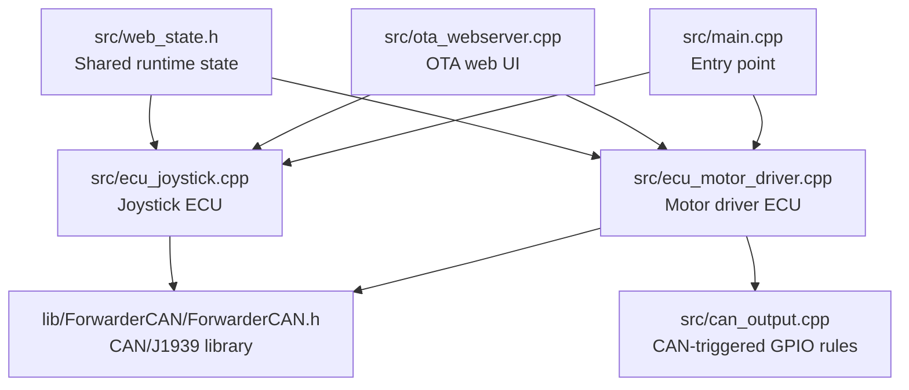
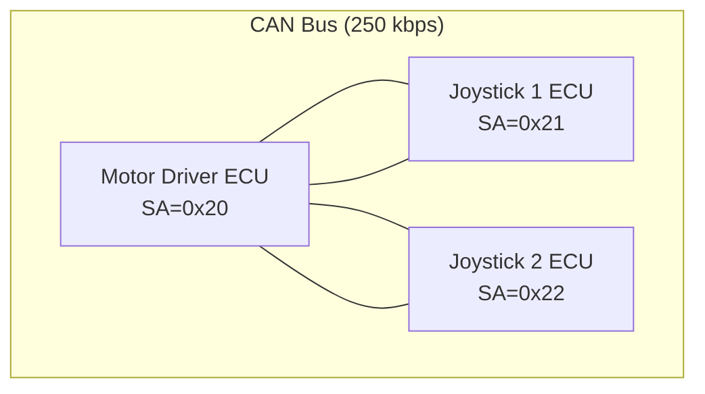
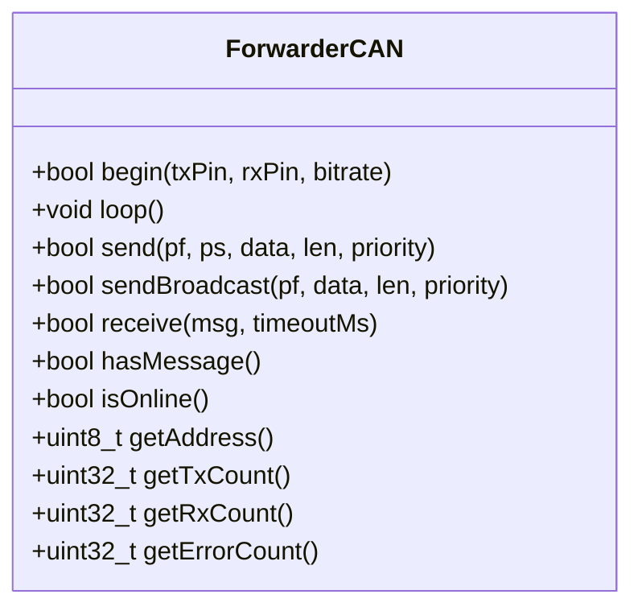
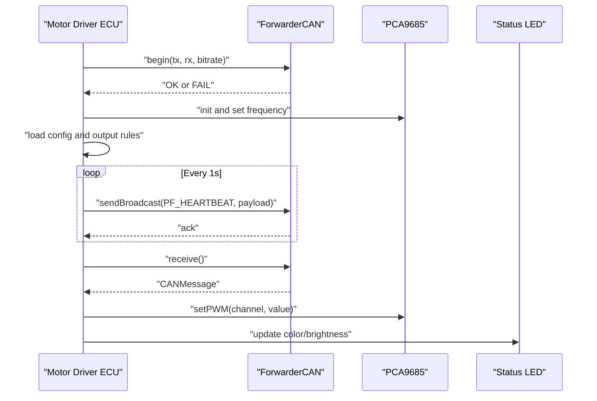
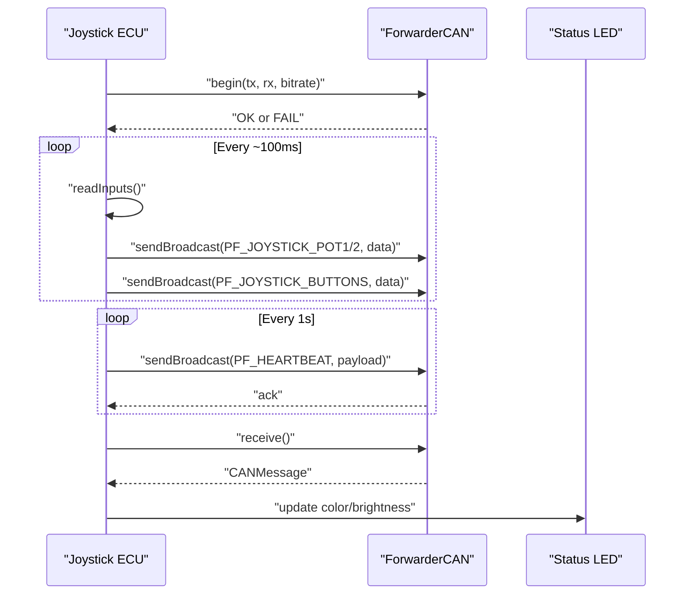
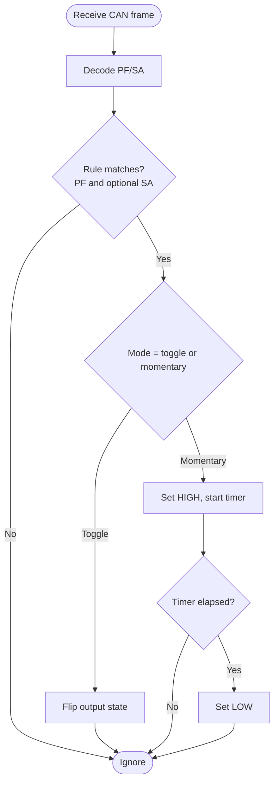
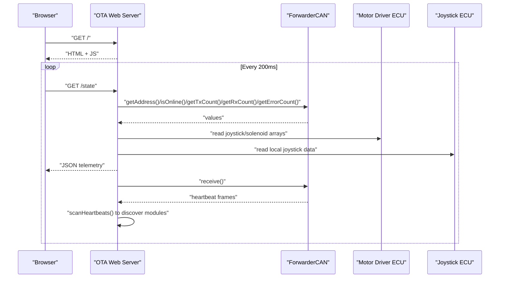
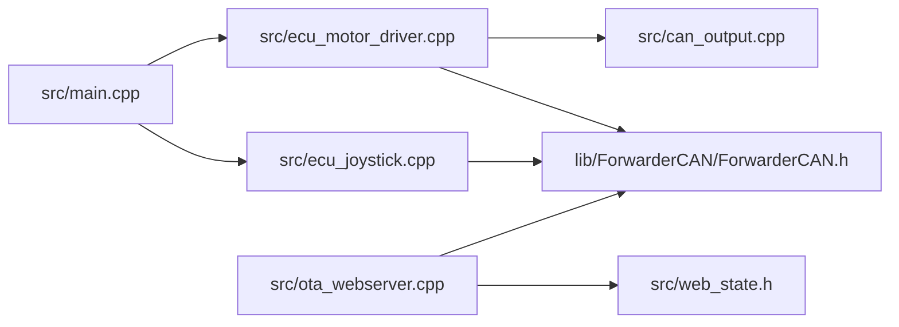

# Diagnostic Procedures

<cite>
**Referenced Files in This Document**
- [README.md](file://README.md)
- [platformio.ini](file://platformio.ini)
- [src/main.cpp](file://src/main.cpp)
- [src/ecu_motor_driver.cpp](file://src/ecu_motor_driver.cpp)
- [src/ecu_joystick.cpp](file://src/ecu_joystick.cpp)
- [src/can_output.cpp](file://src/can_output.cpp)
- [src/web_state.h](file://src/web_state.h)
- [src/ota_webserver.cpp](file://src/ota_webserver.cpp)
- [lib/ForwarderCAN/ForwarderCAN.h](file://lib/ForwarderCAN/ForwarderCAN.h)
</cite>

## Table of Contents
1. [Introduction](#introduction)
2. [Project Structure](#project-structure)
3. [Core Components](#core-components)
4. [Architecture Overview](#architecture-overview)
5. [Detailed Component Analysis](#detailed-component-analysis)
6. [Dependency Analysis](#dependency-analysis)
7. [Performance Considerations](#performance-considerations)
8. [Troubleshooting Guide](#troubleshooting-guide)
9. [Conclusion](#conclusion)
10. [Appendices](#appendices)

## Introduction
This document provides comprehensive diagnostic procedures for ForwarderKE, focusing on systematic troubleshooting methodologies and diagnostic tools. It covers CAN bus communication diagnostics using oscilloscope measurements, serial debug output interpretation, and heartbeat monitoring analysis. It also explains built-in diagnostic capabilities such as error counters, status reporting, and system health indicators, and outlines diagnostic workflows to identify hardware faults, software bugs, and configuration issues. Step-by-step procedures are included for measuring CAN bus signal integrity, analyzing message traffic patterns, and interpreting system status messages. Guidance is provided for using serial monitors for real-time debugging, log analysis techniques, and performance monitoring. Finally, diagnostic checklists are included for common failure scenarios and systematic approaches to isolate problems in multi-ECU CAN bus systems.

## Project Structure
ForwarderKE consists of:
- A shared CAN/J1939 library implementing ID layout, message parsing, and statistics.
- An application entry point selecting the ECU type at build time.
- Two ECU implementations:
  - Motor driver ECU controlling solenoids via PCA9685 and broadcasting heartbeat/status.
  - Joystick ECU reading analog inputs and buttons and publishing joystick data.
- Optional OTA web server exposing runtime telemetry and configuration.
- CAN output rules enabling GPIO toggling or momentary pulses based on incoming CAN messages.

**Diagram sources**
- [src/main.cpp:11-17](file://src/main.cpp#L11-L17)
- [src/ecu_motor_driver.cpp:290-325](file://src/ecu_motor_driver.cpp#L290-L325)
- [src/ecu_joystick.cpp:159-192](file://src/ecu_joystick.cpp#L159-L192)
- [lib/ForwarderCAN/ForwarderCAN.h:66-119](file://lib/ForwarderCAN/ForwarderCAN.h#L66-L119)
- [src/can_output.cpp:7-19](file://src/can_output.cpp#L7-L19)
- [src/ota_webserver.cpp:506-517](file://src/ota_webserver.cpp#L506-L517)
- [src/web_state.h:10-23](file://src/web_state.h#L10-L23)

**Section sources**
- [README.md:112-126](file://README.md#L112-L126)
- [platformio.ini:1-80](file://platformio.ini#L1-L80)
- [src/main.cpp:11-17](file://src/main.cpp#L11-L17)

## Core Components
- ForwarderCAN: Implements J1939-like 29-bit ID layout, address claiming, send/receive, and statistics (TX/RX/error counts).
- Motor Driver ECU: Initializes PCA9685, maps joystick inputs to solenoid outputs, handles LED status, broadcasts heartbeat, and applies safety timeout.
- Joystick ECU: Reads analog pots/buttons, publishes joystick data, handles LED status, and broadcasts heartbeat.
- CAN Output Rules: Enables GPIO actions in response to matched CAN frames.
- OTA Web Server: Exposes JSON telemetry including online status, TX/RX/error counts, joystick data, solenoid values, and module discovery via heartbeat scanning.

Key diagnostic capabilities:
- Error counters and statistics exposed by ForwarderCAN.
- Heartbeat/status messages broadcast by all ECUs.
- Web UI telemetry for live inspection and module discovery.
- Address claiming and conflict handling for collision avoidance.

**Section sources**
- [lib/ForwarderCAN/ForwarderCAN.h:66-119](file://lib/ForwarderCAN/ForwarderCAN.h#L66-L119)
- [src/ecu_motor_driver.cpp:277-288](file://src/ecu_motor_driver.cpp#L277-L288)
- [src/ecu_joystick.cpp:146-157](file://src/ecu_joystick.cpp#L146-L157)
- [src/ota_webserver.cpp:510-517](file://src/ota_webserver.cpp#L510-L517)
- [src/ota_webserver.cpp:740-761](file://src/ota_webserver.cpp#L740-L761)

## Architecture Overview
The system operates on a 250 kbps CAN bus with J1939-like extended IDs. Three ECUs coexist:
- Motor Driver (address 0x20): Controls solenoids and broadcasts heartbeat/status.
- Joystick 1 (address 0x21): Publishes joystick data and heartbeat.
- Joystick 2 (address 0x22): Publishes joystick data and heartbeat.

**Diagram sources**
- [README.md:8-14](file://README.md#L8-L14)
- [README.md:22-41](file://README.md#L22-L41)

## Detailed Component Analysis

### ForwarderCAN Diagnostics
- Address claiming state machine and online status.
- Statistics: TX count, RX count, error count.
- Bus-off recovery and automatic TWAI recovery are supported by the underlying driver.

**Diagram sources**
- [lib/ForwarderCAN/ForwarderCAN.h:66-119](file://lib/ForwarderCAN/ForwarderCAN.h#L66-L119)

**Section sources**
- [lib/ForwarderCAN/ForwarderCAN.h:94-96](file://lib/ForwarderCAN/ForwarderCAN.h#L94-L96)
- [README.md:105-110](file://README.md#L105-L110)

### Motor Driver ECU Diagnostics
- Initializes PCA9685, detects dual PCA9685, and maps joystick inputs to solenoid outputs.
- Safety timeout turns off solenoids if no commands are received within the configured interval.
- LED status indicates online/offline, heartbeat blink pattern, and identification mode.
- Heartbeat payload includes online flag, uptime, RX/TX counts, and device-specific flags.

**Diagram sources**
- [src/ecu_motor_driver.cpp:290-325](file://src/ecu_motor_driver.cpp#L290-L325)
- [src/ecu_motor_driver.cpp:327-352](file://src/ecu_motor_driver.cpp#L327-L352)
- [src/ecu_motor_driver.cpp:277-288](file://src/ecu_motor_driver.cpp#L277-L288)

**Section sources**
- [src/ecu_motor_driver.cpp:32-34](file://src/ecu_motor_driver.cpp#L32-L34)
- [src/ecu_motor_driver.cpp:78-83](file://src/ecu_motor_driver.cpp#L78-L83)
- [src/ecu_motor_driver.cpp:137-151](file://src/ecu_motor_driver.cpp#L137-L151)
- [src/ecu_motor_driver.cpp:332-337](file://src/ecu_motor_driver.cpp#L332-L337)
- [src/ecu_motor_driver.cpp:153-182](file://src/ecu_motor_driver.cpp#L153-L182)
- [src/ecu_motor_driver.cpp:277-288](file://src/ecu_motor_driver.cpp#L277-L288)

### Joystick ECU Diagnostics
- Reads analog pots/buttons with defined pins and thresholds.
- Publishes joystick data periodically or on change.
- LED status reflects online/offline and identification mode.
- Heartbeat payload includes online flag, uptime, and joystick identity.

**Diagram sources**
- [src/ecu_joystick.cpp:159-192](file://src/ecu_joystick.cpp#L159-L192)
- [src/ecu_joystick.cpp:194-236](file://src/ecu_joystick.cpp#L194-L236)
- [src/ecu_joystick.cpp:146-157](file://src/ecu_joystick.cpp#L146-L157)

**Section sources**
- [src/ecu_joystick.cpp:63-68](file://src/ecu_joystick.cpp#L63-L68)
- [src/ecu_joystick.cpp:198-225](file://src/ecu_joystick.cpp#L198-L225)
- [src/ecu_joystick.cpp:146-157](file://src/ecu_joystick.cpp#L146-L157)

### CAN Output Rules Diagnostics
- Configurable rules match PF/SA and trigger GPIO actions.
- Toggle mode flips output state per match.
- Momentary mode sets output HIGH then reverts after a timer.

**Diagram sources**
- [src/can_output.cpp:29-49](file://src/can_output.cpp#L29-L49)
- [src/can_output.cpp:51-61](file://src/can_output.cpp#L51-L61)

**Section sources**
- [src/can_output.cpp:7-19](file://src/can_output.cpp#L7-L19)
- [src/can_output.cpp:29-49](file://src/can_output.cpp#L29-L49)
- [src/can_output.cpp:51-61](file://src/can_output.cpp#L51-L61)

### OTA Web Server Diagnostics
- Exposes JSON telemetry including local address, online status, uptime, TX/RX/error counts, joystick data, solenoid values, and discovered modules via heartbeat scanning.
- Heartbeat scanner inspects heartbeat frames to infer module type and last-seen time.

**Diagram sources**
- [src/ota_webserver.cpp:510-517](file://src/ota_webserver.cpp#L510-L517)
- [src/ota_webserver.cpp:740-761](file://src/ota_webserver.cpp#L740-L761)

**Section sources**
- [src/ota_webserver.cpp:510-517](file://src/ota_webserver.cpp#L510-L517)
- [src/ota_webserver.cpp:740-761](file://src/ota_webserver.cpp#L740-L761)

## Dependency Analysis
- ECU selection is compile-time via build flags; main dispatches to the appropriate ECU implementation.
- Both ECUs depend on ForwarderCAN for transport and statistics.
- Motor driver depends on PCA9685 drivers and NeoPixel for LEDs.
- OTA web server depends on ForwarderCAN and shared runtime state.

**Diagram sources**
- [src/main.cpp:11-17](file://src/main.cpp#L11-L17)
- [src/ecu_motor_driver.cpp:1-12](file://src/ecu_motor_driver.cpp#L1-L12)
- [src/ecu_joystick.cpp:1-9](file://src/ecu_joystick.cpp#L1-L9)
- [src/can_output.cpp:1-5](file://src/can_output.cpp#L1-L5)
- [src/ota_webserver.cpp:1-10](file://src/ota_webserver.cpp#L1-L10)
- [src/web_state.h:1-6](file://src/web_state.h#L1-L6)

**Section sources**
- [src/main.cpp:11-17](file://src/main.cpp#L11-L17)
- [platformio.ini:12-15](file://platformio.ini#L12-L15)

## Performance Considerations
- CAN bitrate is fixed at 250 kbps; ensure bus termination and wiring meet ISO 11898 standards.
- Heartbeat broadcast occurs every 1 second; monitor RX/TX counts to detect anomalies.
- Safety timeout disables solenoids after inactivity; tune SAFETY_TIMEOUT_MS as needed.
- PCA9685 frequency and PWM resolution impact solenoid response; verify oscillator settings.

[No sources needed since this section provides general guidance]

## Troubleshooting Guide

### CAN Bus Communication Diagnostics
- Oscilloscope measurements:
  - Measure CAN_H and CAN_L differential voltage swing; typical J1939 at 250 kbps expects around 2.5 Vpp at the receiver input.
  - Verify signal integrity: eye diagram opening, rise/fall times, and jitter.
  - Check for bus terminations (120 Ω) at both ends of the bus.
  - Inspect for dominant and recessive signaling; confirm proper arbitration and ACK zones.
- Serial debug output interpretation:
  - Monitor initialization logs for CAN begin success or failure.
  - Watch for LED patterns indicating online/offline, fast blinks (recent activity), and identification mode.
  - Track error counters via web telemetry to detect bus errors or bus-off conditions.
- Heartbeat monitoring analysis:
  - Use the heartbeat scanner to discover modules and infer types from payload fields.
  - Validate uptime increments and RX/TX counts growth to confirm normal operation.

**Section sources**
- [src/ecu_motor_driver.cpp:306-316](file://src/ecu_motor_driver.cpp#L306-L316)
- [src/ecu_joystick.cpp:175-185](file://src/ecu_joystick.cpp#L175-L185)
- [src/ecu_motor_driver.cpp:153-182](file://src/ecu_motor_driver.cpp#L153-L182)
- [src/ecu_joystick.cpp:89-97](file://src/ecu_joystick.cpp#L89-L97)
- [src/ota_webserver.cpp:510-517](file://src/ota_webserver.cpp#L510-L517)
- [src/ota_webserver.cpp:740-761](file://src/ota_webserver.cpp#L740-L761)

### Built-in Diagnostic Capabilities
- Error counters and status reporting:
  - Access TX/RX/error counts via ForwarderCAN getters and web telemetry endpoints.
  - Use heartbeat payloads to inspect online status, uptime, and device-specific flags.
- System health indicators:
  - LED patterns reflect online/offline, recent activity, and identification mode.
  - Address claiming state transitions indicate collision handling.

**Section sources**
- [lib/ForwarderCAN/ForwarderCAN.h:94-96](file://lib/ForwarderCAN/ForwarderCAN.h#L94-L96)
- [src/ota_webserver.cpp:510-517](file://src/ota_webserver.cpp#L510-L517)
- [src/ecu_motor_driver.cpp:277-288](file://src/ecu_motor_driver.cpp#L277-L288)
- [src/ecu_joystick.cpp:146-157](file://src/ecu_joystick.cpp#L146-L157)

### Diagnostic Workflow
- Isolate hardware faults:
  - Verify power and ground connections to MCU and PCA9685.
  - Confirm CAN transceiver enable pin configuration and wiring continuity.
  - Check LED behavior during initialization and runtime.
- Identify software bugs:
  - Compare TX/RX/error counts over time; rising error counts suggest framing or bit errors.
  - Validate heartbeat presence and type inference via heartbeat scanner.
  - Inspect CAN output rule behavior against expected PF/SA matches.
- Resolve configuration issues:
  - Use address claiming and forced address settings to avoid conflicts.
  - Adjust axis mapping and deadband parameters via configuration requests and responses.

**Section sources**
- [src/ecu_motor_driver.cpp:234-245](file://src/ecu_motor_driver.cpp#L234-L245)
- [src/ecu_joystick.cpp:132-142](file://src/ecu_joystick.cpp#L132-L142)
- [src/ecu_motor_driver.cpp:257-267](file://src/ecu_motor_driver.cpp#L257-L267)
- [src/ecu_motor_driver.cpp:298-300](file://src/ecu_motor_driver.cpp#L298-L300)

### Measuring CAN Bus Signal Integrity
- Steps:
  - Connect oscilloscope probes across CAN_H/CAN_L.
  - Set bandwidth limit and measure peak-to-peak voltage.
  - Observe the waveform shape during dominant and recessive states.
  - Validate timing parameters (bit timing, sampling points).
  - Check for reflections and noise by inspecting overshoot/undershoot.

**Section sources**
- [README.md:16-21](file://README.md#L16-L21)
- [platformio.ini:12-15](file://platformio.ini#L12-L15)

### Analyzing Message Traffic Patterns
- Steps:
  - Capture heartbeats and joystick frames using the heartbeat scanner and serial logs.
  - Correlate joystick pot values with solenoid outputs to verify mapping.
  - Monitor error counters to detect malformed frames or bus off events.
  - Validate address claiming and conflict resolution behavior.

**Section sources**
- [src/ota_webserver.cpp:740-761](file://src/ota_webserver.cpp#L740-L761)
- [src/ecu_motor_driver.cpp:184-275](file://src/ecu_motor_driver.cpp#L184-L275)
- [src/ecu_joystick.cpp:114-144](file://src/ecu_joystick.cpp#L114-L144)

### Interpreting System Status Messages
- Steps:
  - Parse heartbeat payload fields to extract online flag, uptime, RX/TX counts, and device-specific flags.
  - Use web telemetry to correlate joystick ages and solenoid values with system health.
  - Cross-reference LED behavior with online/offline states and recent activity.

**Section sources**
- [src/ecu_motor_driver.cpp:277-288](file://src/ecu_motor_driver.cpp#L277-L288)
- [src/ecu_joystick.cpp:146-157](file://src/ecu_joystick.cpp#L146-L157)
- [src/ota_webserver.cpp:510-517](file://src/ota_webserver.cpp#L510-L517)

### Using Serial Monitors for Real-Time Debugging
- Steps:
  - Open serial monitor at 115200 baud.
  - Observe initialization logs for CAN begin success/failure and PCA9685 detection.
  - Watch for LED updates and periodic heartbeat transmissions.
  - Monitor error counters and address claiming state transitions.

**Section sources**
- [platformio.ini:8](file://platformio.ini#L8)
- [src/ecu_motor_driver.cpp:294-318](file://src/ecu_motor_driver.cpp#L294-L318)
- [src/ecu_joystick.cpp:163-186](file://src/ecu_joystick.cpp#L163-L186)

### Log Analysis Techniques
- Steps:
  - Export serial logs and parse initialization, error, and operational messages.
  - Track TX/RX/error counts over time to identify trends.
  - Correlate LED patterns with reported online/offline states.

**Section sources**
- [src/ecu_motor_driver.cpp:306-316](file://src/ecu_motor_driver.cpp#L306-L316)
- [src/ecu_joystick.cpp:175-185](file://src/ecu_joystick.cpp#L175-L185)

### Performance Monitoring Procedures
- Steps:
  - Monitor heartbeat intervals and uptime increments.
  - Track RX/TX counts growth to ensure normal traffic.
  - Observe LED behavior for quick health assessment.

**Section sources**
- [src/ecu_motor_driver.cpp:341-346](file://src/ecu_motor_driver.cpp#L341-L346)
- [src/ecu_joystick.cpp:226-231](file://src/ecu_joystick.cpp#L226-L231)

### Diagnostic Checklists for Common Failure Scenarios
- Address collision or claiming failure:
  - Verify preferred address and forced address settings.
  - Confirm address claiming state transitions and retries.
- Bus errors or bus-off:
  - Check error counters and heartbeat presence.
  - Inspect oscilloscope traces for signal integrity issues.
- Solenoid inactivity or timeout:
  - Validate joystick input mapping and axis configuration.
  - Confirm heartbeat presence and recent joystick updates.
- OTA update failures:
  - Verify Wi-Fi AP availability and web UI accessibility.
  - Confirm successful upload and reboot sequence.

**Section sources**
- [src/ecu_motor_driver.cpp:298-300](file://src/ecu_motor_driver.cpp#L298-L300)
- [src/ecu_motor_driver.cpp:332-337](file://src/ecu_motor_driver.cpp#L332-L337)
- [src/ota_webserver.cpp:766-777](file://src/ota_webserver.cpp#L766-L777)

## Conclusion
ForwarderKE provides robust built-in diagnostics through CAN statistics, heartbeat/status messages, LED indicators, and an optional OTA web UI. Systematic troubleshooting should combine oscilloscope measurements, serial log analysis, and heartbeat monitoring to quickly isolate hardware, software, and configuration issues. The provided workflows and checklists offer structured approaches to diagnosing multi-ECU CAN bus systems effectively.

[No sources needed since this section summarizes without analyzing specific files]

## Appendices

### CAN Protocol Reference
- J1939-like extended ID layout and PF definitions used by ForwarderKE.
- Message types for joystick data, LED control, solenoid commands, and heartbeat/status.

**Section sources**
- [README.md:22-41](file://README.md#L22-L41)

### Build and Flashing Context
- Build environments for motor driver, joystick variants, and OTA-enabled builds.
- Pin assignments and peripheral configurations per ECU type.

**Section sources**
- [platformio.ini:17-80](file://platformio.ini#L17-L80)
- [README.md:48-62](file://README.md#L48-L62)