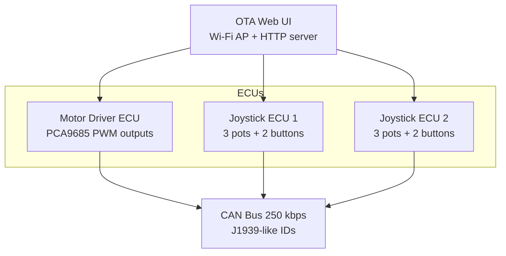
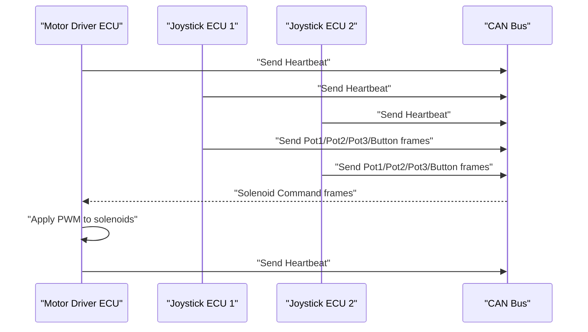
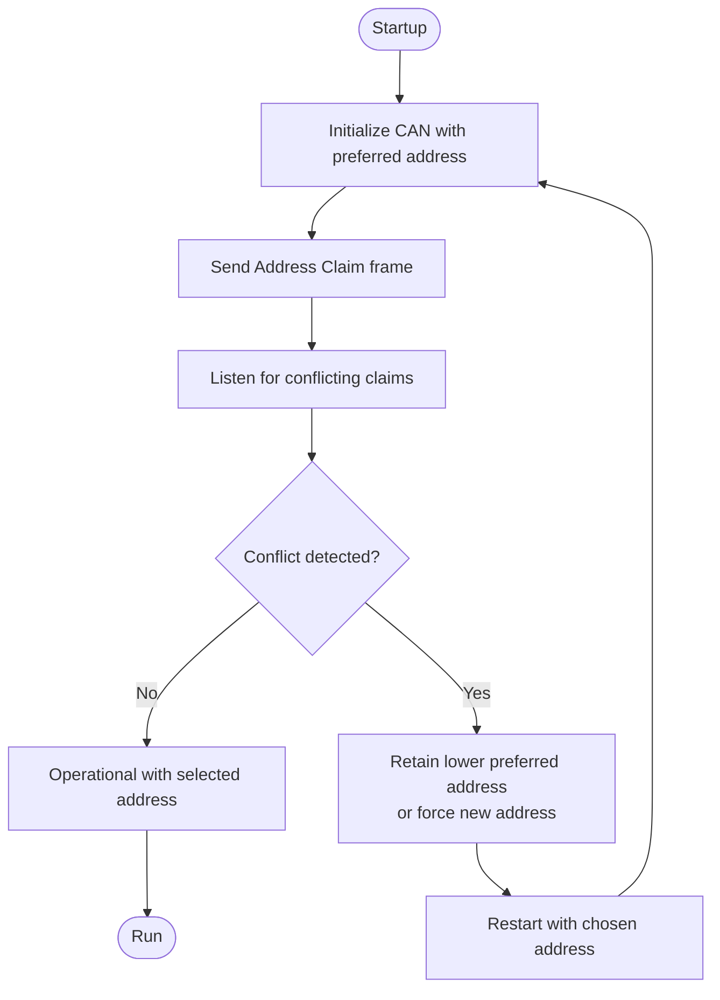
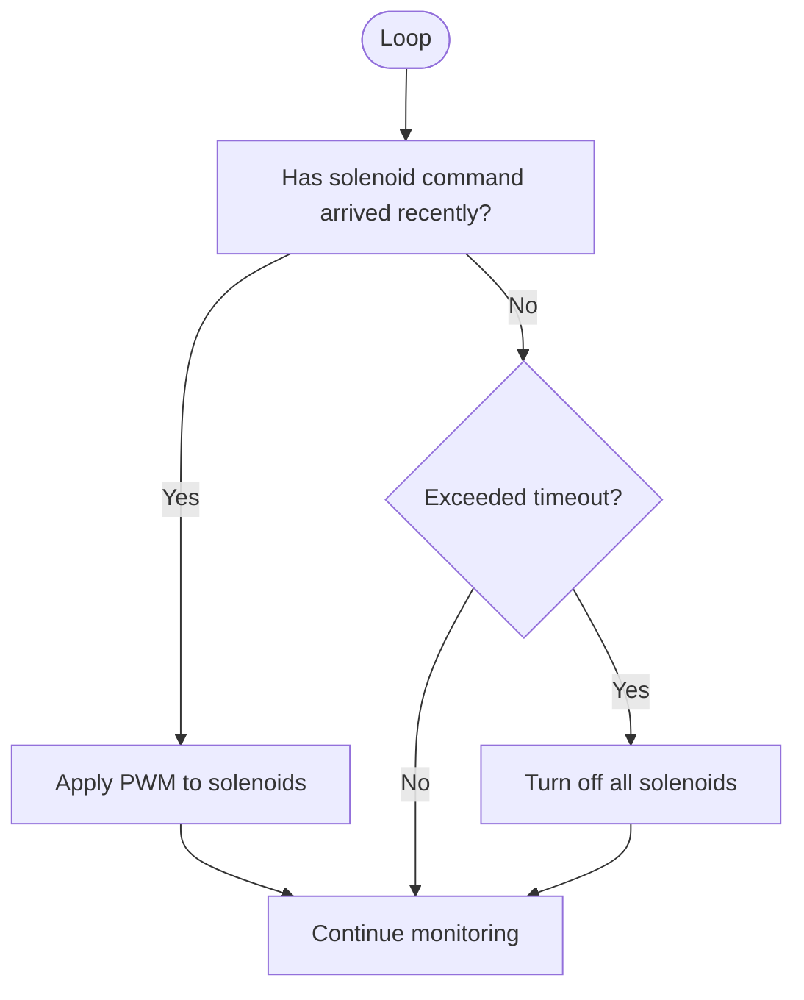
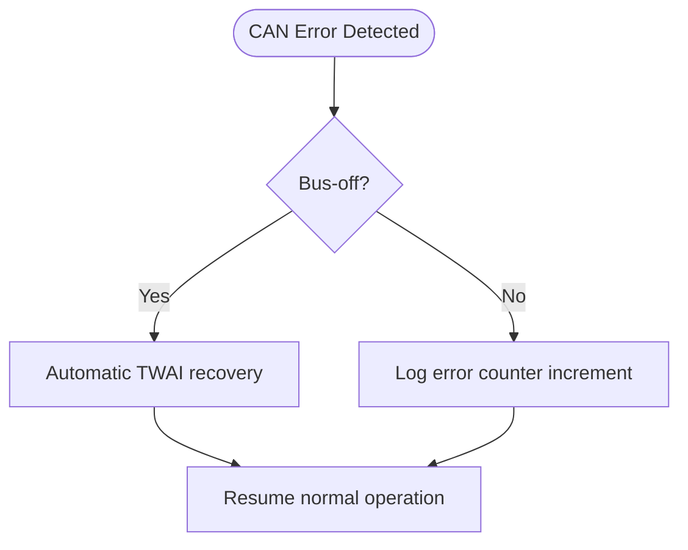
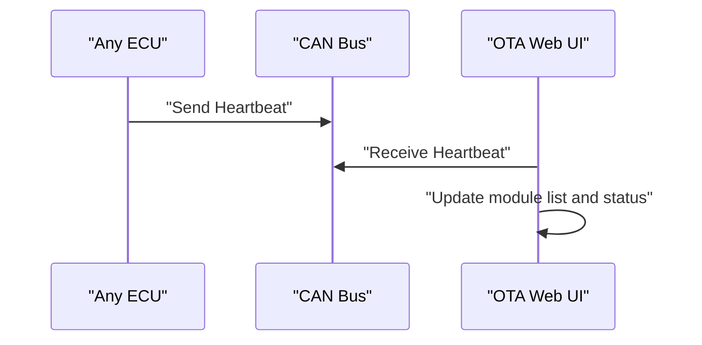
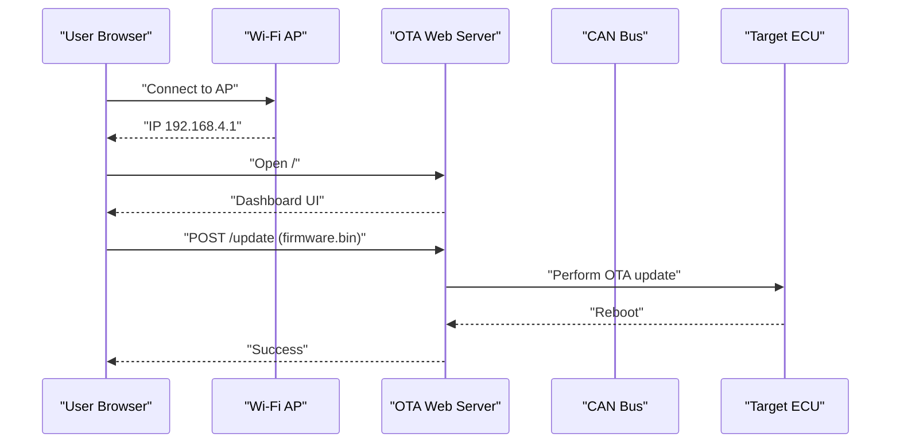
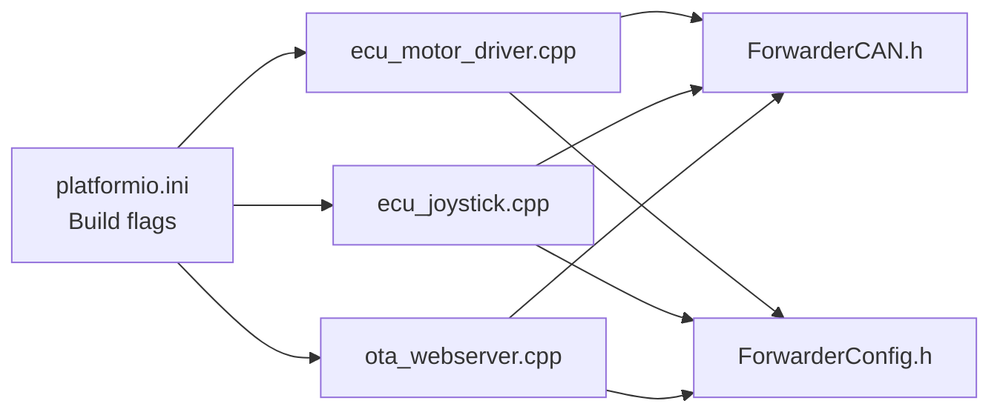

# Safety and Maintenance Practices

<cite>
**Referenced Files in This Document**
- [README.md](file://README.md)
- [platformio.ini](file://platformio.ini)
- [main.cpp](file://src/main.cpp)
- [ecu_motor_driver.cpp](file://src/ecu_motor_driver.cpp)
- [ecu_joystick.cpp](file://src/ecu_joystick.cpp)
- [ota_webserver.cpp](file://src/ota_webserver.cpp)
- [web_state.h](file://src/web_state.h)
- [can_output.h](file://src/can_output.h)
</cite>

## Table of Contents
1. [Introduction](#introduction)
2. [Project Structure](#project-structure)
3. [Core Components](#core-components)
4. [Architecture Overview](#architecture-overview)
5. [Detailed Component Analysis](#detailed-component-analysis)
6. [Dependency Analysis](#dependency-analysis)
7. [Performance Considerations](#performance-considerations)
8. [Troubleshooting Guide](#troubleshooting-guide)
9. [Conclusion](#conclusion)
10. [Appendices](#appendices)

## Introduction
This document provides comprehensive safety guidelines and maintenance practices for ForwarderKE systems. It consolidates the built-in safety features present in the codebase (address claiming arbitration, solenoid timeout protection, bus-off recovery, and heartbeat monitoring), outlines safe operational procedures for CAN bus systems and electrical hazards, and defines preventive maintenance schedules for field-deployed units. It also includes shutdown procedures, power cycling protocols, ESD precautions, grounding practices, environmental protection, and long-term storage recommendations. Finally, it provides safety checklists for installation, operation, and decommissioning.

## Project Structure
The ForwarderKE system consists of:
- An ESP32-S3-based MCU running either a motor driver ECU or a joystick ECU.
- A shared CAN/J1939-like protocol stack for inter-ECU communication.
- Optional Wi-Fi OTA update capability for firmware updates.
- A web UI for diagnostics, configuration, and OTA updates.

**Diagram sources**
- [README.md:8-14](file://README.md#L8-L14)
- [platformio.ini:17-61](file://platformio.ini#L17-L61)
- [ota_webserver.cpp:766-791](file://src/ota_webserver.cpp#L766-L791)

**Section sources**
- [README.md:6-14](file://README.md#L6-L14)
- [platformio.ini:17-61](file://platformio.ini#L17-L61)

## Core Components
- Address claiming and arbitration: Ensures unique addresses at startup using J1939-style ID fields.
- Solenoid timeout protection: Automatically turns off solenoids after a period without CAN commands.
- Bus-off recovery: Uses automatic TWAI recovery on CAN bus errors.
- Heartbeat monitoring: All ECUs broadcast periodic status messages.

These features are implemented across the motor driver and joystick ECUs and are complemented by the OTA web UI for diagnostics and updates.

**Section sources**
- [README.md:105-110](file://README.md#L105-L110)
- [ecu_motor_driver.cpp:332-337](file://src/ecu_motor_driver.cpp#L332-L337)
- [ecu_motor_driver.cpp:277-288](file://src/ecu_motor_driver.cpp#L277-L288)
- [ecu_joystick.cpp:146-157](file://src/ecu_joystick.cpp#L146-L157)

## Architecture Overview
The system uses a centralized CAN bus with three ECUs:
- Motor Driver ECU (address 0x20): Controls 8 solenoids via PCA9685 PWM channels.
- Joystick ECU 1 (address 0x21): Publishes joystick and button data.
- Joystick ECU 2 (address 0x22): Publishes joystick and button data.

Each ECU initializes its CAN interface, performs address claiming, and periodically broadcasts heartbeat/status frames. The OTA web UI provides diagnostics and firmware updates.

**Diagram sources**
- [README.md:29-41](file://README.md#L29-L41)
- [ecu_motor_driver.cpp:184-275](file://src/ecu_motor_driver.cpp#L184-L275)
- [ecu_joystick.cpp:114-144](file://src/ecu_joystick.cpp#L114-L144)

## Detailed Component Analysis

### Address Claiming Arbitration
- Purpose: Prevents address conflicts during startup.
- Mechanism: Each ECU publishes an address claim frame at startup and listens for others. If a conflict is detected, the ECU with the lower preferred address retains it; the other reverts to a safe state and restarts.
- Behavior: Address selection is compile-time via build flags; runtime enforcement occurs during CAN initialization.

**Diagram sources**
- [ecu_motor_driver.cpp:290-325](file://src/ecu_motor_driver.cpp#L290-L325)
- [ecu_joystick.cpp:159-192](file://src/ecu_joystick.cpp#L159-L192)
- [platformio.ini:18-30](file://platformio.ini#L18-L30)

**Section sources**
- [README.md:105-107](file://README.md#L105-L107)
- [platformio.ini:18-30](file://platformio.ini#L18-L30)

### Solenoid Timeout Protection
- Purpose: Prevent unintended actuation if communication fails.
- Mechanism: The motor driver ECU monitors the last solenoid update time. If no command is received within the configured timeout, it turns off all solenoids and resets the timer.
- Configuration: Timeout is defined per environment via build flags.

**Diagram sources**
- [ecu_motor_driver.cpp:327-352](file://src/ecu_motor_driver.cpp#L327-L352)
- [platformio.ini:29](file://platformio.ini#L29)

**Section sources**
- [README.md:108](file://README.md#L108)
- [platformio.ini:29](file://platformio.ini#L29)

### Bus-Off Recovery
- Purpose: Restore normal operation after bus-off conditions caused by excessive CAN errors.
- Mechanism: The underlying CAN driver automatically recovers from bus-off; the system continues normal operation after recovery.

**Diagram sources**
- [README.md:109](file://README.md#L109)

**Section sources**
- [README.md:109](file://README.md#L109)

### Heartbeat Monitoring
- Purpose: Provide health and status visibility across the network.
- Mechanism: Each ECU periodically sends a heartbeat frame containing online status, uptime, and counters. The OTA web UI scans heartbeats to discover and track modules.

**Diagram sources**
- [ecu_motor_driver.cpp:277-288](file://src/ecu_motor_driver.cpp#L277-L288)
- [ecu_joystick.cpp:146-157](file://src/ecu_joystick.cpp#L146-L157)
- [ota_webserver.cpp:742-761](file://src/ota_webserver.cpp#L742-L761)

**Section sources**
- [README.md:110](file://README.md#L110)
- [ota_webserver.cpp:506-563](file://src/ota_webserver.cpp#L506-L563)

### OTA Web UI and Diagnostics
- Purpose: Provide a browser-based interface for diagnostics, configuration, and firmware updates.
- Capabilities:
  - Real-time telemetry (joystick values, solenoid outputs, bus stats).
  - Module discovery and identification.
  - Remote configuration of axis mapping and CAN-triggered GPIO outputs.
  - Wi-Fi AP mode for OTA updates.

**Diagram sources**
- [README.md:84-103](file://README.md#L84-L103)
- [ota_webserver.cpp:766-791](file://src/ota_webserver.cpp#L766-L791)
- [ota_webserver.cpp:705-737](file://src/ota_webserver.cpp#L705-L737)

**Section sources**
- [README.md:84-103](file://README.md#L84-L103)
- [ota_webserver.cpp:506-563](file://src/ota_webserver.cpp#L506-L563)

## Dependency Analysis
- Build-time selection of ECU type and address via build flags.
- Runtime selection of CAN pins and peripherals via build flags.
- Shared CAN/J1939 protocol and configuration libraries used by both ECUs.
- Optional OTA web server adds Wi-Fi and HTTP dependencies.

**Diagram sources**
- [platformio.ini:12-15](file://platformio.ini#L12-L15)
- [platformio.ini:18-61](file://platformio.ini#L18-L61)
- [ecu_motor_driver.cpp:8-12](file://src/ecu_motor_driver.cpp#L8-L12)
- [ecu_joystick.cpp:6-9](file://src/ecu_joystick.cpp#L6-L9)
- [ota_webserver.cpp:5-11](file://src/ota_webserver.cpp#L5-L11)

**Section sources**
- [platformio.ini:12-15](file://platformio.ini#L12-L15)
- [platformio.ini:18-61](file://platformio.ini#L18-L61)

## Performance Considerations
- CAN bitrate is set to 250 kbps, balancing responsiveness and noise immunity.
- Heartbeat interval is 1 second, providing frequent health checks without heavy traffic.
- Watchdog timeout is configurable via build flags to balance responsiveness and stability.
- I2C bus speed and PCA9685 frequency are tuned for reliable PWM output.

[No sources needed since this section provides general guidance]

## Troubleshooting Guide
- CAN initialization failure: The system blinks an LED pattern and loops until fixed. Verify wiring, pins, and power.
- No joystick or solenoid activity: Confirm heartbeat reception and address claiming success.
- OTA update failures: Ensure correct .bin file, AP connectivity, and sufficient time for reboot after update.
- Bus errors: Monitor error counters and ensure proper termination and shielding.

**Section sources**
- [ecu_motor_driver.cpp:304-316](file://src/ecu_motor_driver.cpp#L304-L316)
- [ecu_joystick.cpp:174-185](file://src/ecu_joystick.cpp#L174-L185)
- [ota_webserver.cpp:705-737](file://src/ota_webserver.cpp#L705-L737)

## Conclusion
ForwarderKE incorporates robust built-in safety mechanisms—address arbitration, solenoid timeout protection, bus-off recovery, and heartbeat monitoring—alongside a practical OTA web UI for diagnostics and updates. Following the safety and maintenance practices outlined here will help ensure reliable operation, reduce risk, and prolong equipment life in field deployments.

[No sources needed since this section summarizes without analyzing specific files]

## Appendices

### Safety Protocols for CAN Bus Systems
- Never connect or disconnect CAN cables while powered on. Always power down the system before plugging/unplugging connectors.
- Use proper CAN termination resistors at both ends of the bus to minimize reflections and EMI.
- Keep CAN wires short and away from high-current cables to avoid noise coupling.
- Verify bus status via the web UI before powering up ECUs.

**Section sources**
- [ota_webserver.cpp:510-517](file://src/ota_webserver.cpp#L510-L517)

### Electrical Hazard Precautions
- Work only with de-energized circuits. Use lockout/tagout procedures when servicing.
- Use insulated tools and wear protective gloves.
- Avoid touching exposed pins or traces.

[No sources needed since this section provides general guidance]

### Proper Equipment Handling Procedures
- Transport units in anti-static bags.
- Avoid static discharge by touching grounded metal before handling boards.
- Handle only by edges; avoid touching connectors and ICs.

**Section sources**
- [README.md:18-20](file://README.md#L18-L20)

### Built-in Safety Features Summary
- Address claiming arbitration: Prevents address collisions at startup.
- Solenoid timeout protection: Shuts off outputs after inactivity.
- Bus-off recovery: Automatic recovery from bus-off errors.
- Heartbeat monitoring: Continuous health visibility.

**Section sources**
- [README.md:105-110](file://README.md#L105-L110)

### Preventive Maintenance Schedule
- Monthly
  - Visual inspection of housing, cable routing, and connector condition.
  - Verify LED indicators and web UI connectivity.
- Quarterly
  - Check and tighten terminal connections.
  - Inspect for dust, corrosion, or physical damage.
- Annually
  - Backup configuration and firmware images.
  - Validate heartbeat presence across all ECUs.
  - Perform a full power cycle test.

**Section sources**
- [ota_webserver.cpp:565-626](file://src/ota_webserver.cpp#L565-L626)

### Firmware Update Cycles
- Use OTA updates when necessary; ensure the device connects to its AP and upload a .bin file.
- After successful update, allow time for reboot and verify heartbeat.

**Section sources**
- [README.md:84-103](file://README.md#L84-L103)
- [ota_webserver.cpp:705-737](file://src/ota_webserver.cpp#L705-L737)

### Configuration Backups
- Retrieve and store configuration via the web UI’s configuration APIs.
- Store copies of axis mapping and CAN output rules.

**Section sources**
- [ota_webserver.cpp:565-626](file://src/ota_webserver.cpp#L565-L626)

### Hardware Inspection Procedures
- Check for cracks, burns, or discoloration on PCBs.
- Inspect solder joints for cold or cracked solder.
- Verify I2C and CAN connections are secure.

[No sources needed since this section provides general guidance]

### Shutdown Procedures and Power Cycling
- To shut down safely:
  - Stop operations and power off the machine.
  - Disconnect CAN bus connectors only after confirming power is off.
- To power cycle:
  - Power off, wait 10 seconds, reconnect CAN, then power on.
  - Observe LED patterns and heartbeat to confirm recovery.

**Section sources**
- [ecu_motor_driver.cpp:304-316](file://src/ecu_motor_driver.cpp#L304-L316)
- [ecu_joystick.cpp:174-185](file://src/ecu_joystick.cpp#L174-L185)

### Electrical Isolation and Grounding
- Maintain a single-point ground in the machine to avoid ground loops.
- Ensure the ESP32 CAN transceiver is properly powered and referenced to the same ground as actuators.
- Use shielded CAN cables and ensure the shield is grounded at one end only.

[No sources needed since this section provides general guidance]

### ESD Protection Guidelines
- Wear an approved ESD strap and connect to a grounded point.
- Work on an ESD-safe mat.
- Minimize handling of sensitive components; avoid static-prone materials near electronics.

[No sources needed since this section provides general guidance]

### Environmental Factors, Dust Protection, and Long-Term Storage
- Dust protection:
  - Enclose units in IP-rated housings.
  - Use gaskets and seals around connectors.
- Vibration:
  - Secure cables and harnesses to prevent strain.
- Temperature extremes:
  - Avoid prolonged exposure to heat or cold; store in climate-controlled environments.
- Long-term storage:
  - Power off and store in anti-static packaging.
  - Periodically power on briefly to verify functionality.

[No sources needed since this section provides general guidance]

### Safety Checklists

- Installation Checklist
  - Verify correct ECU type and address flags.
  - Check CAN wiring and termination.
  - Confirm power supply and ground connections.
  - Test LED indicators and heartbeat via web UI.

- Operation Checklist
  - Confirm all ECUs are present in heartbeat list.
  - Validate joystick and solenoid behavior.
  - Monitor error counters and bus status.

- Decommissioning Checklist
  - Power down the system.
  - Disconnect CAN bus connectors.
  - Store units in anti-static packaging.

**Section sources**
- [ota_webserver.cpp:506-563](file://src/ota_webserver.cpp#L506-L563)