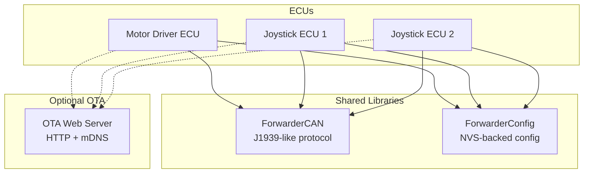
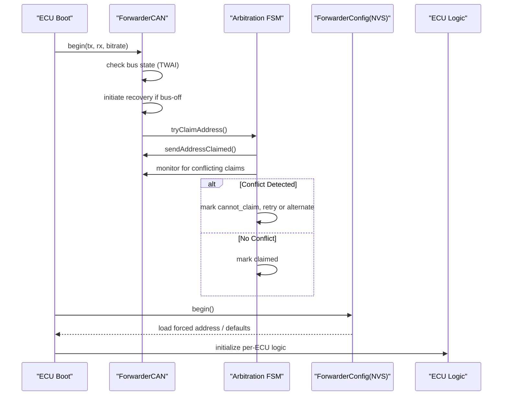
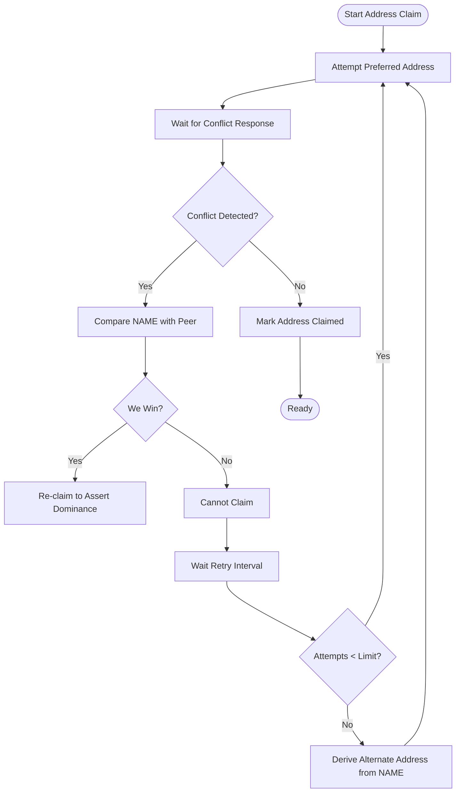
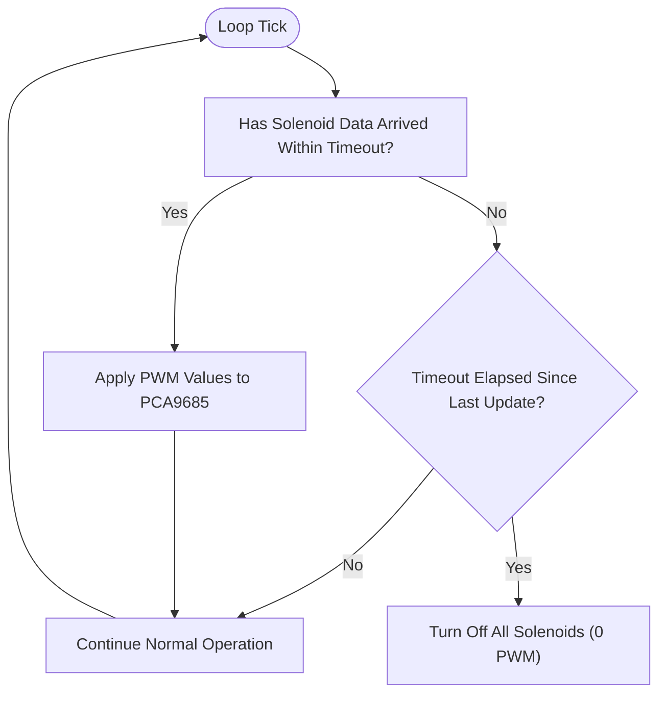
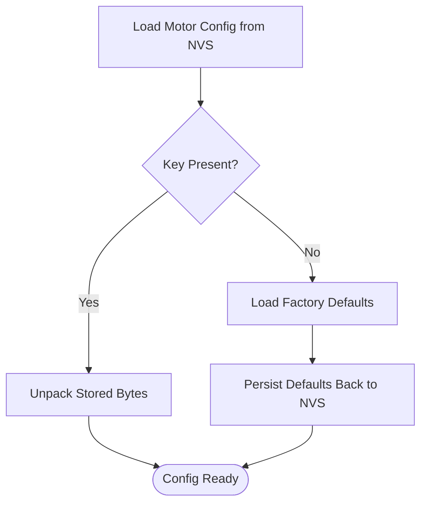
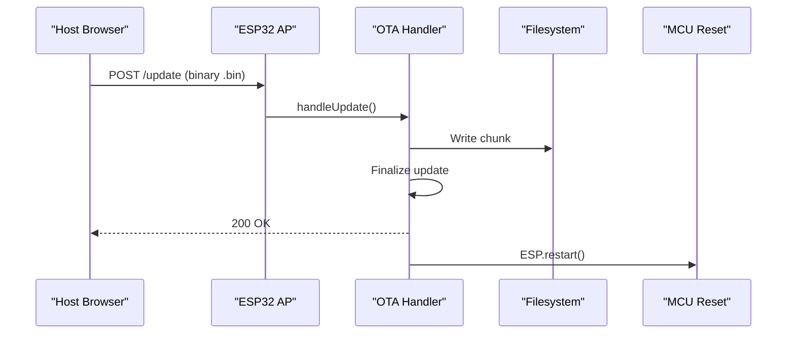
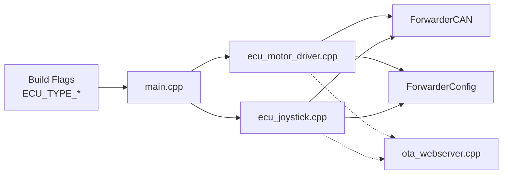

# System Recovery Procedures

<cite>
**Referenced Files in This Document**
- [README.md](file://README.md)
- [platformio.ini](file://platformio.ini)
- [main.cpp](file://src/main.cpp)
- [ecu_motor_driver.cpp](file://src/ecu_motor_driver.cpp)
- [ecu_joystick.cpp](file://src/ecu_joystick.cpp)
- [ota_webserver.cpp](file://src/ota_webserver.cpp)
- [ForwarderCAN.h](file://lib/ForwarderCAN/ForwarderCAN.h)
- [ForwarderCAN.cpp](file://lib/ForwarderCAN/ForwarderCAN.cpp)
- [ForwarderConfig.h](file://lib/ForwarderConfig/ForwarderConfig.h)
- [ForwarderConfig.cpp](file://lib/ForwarderConfig/ForwarderConfig.cpp)
- [web_state.cpp](file://src/web_state.cpp)
</cite>

## Table of Contents
1. [Introduction](#introduction)
2. [Project Structure](#project-structure)
3. [Core Components](#core-components)
4. [Architecture Overview](#architecture-overview)
5. [Detailed Component Analysis](#detailed-component-analysis)
6. [Dependency Analysis](#dependency-analysis)
7. [Performance Considerations](#performance-considerations)
8. [Troubleshooting Guide](#troubleshooting-guide)
9. [Conclusion](#conclusion)
10. [Appendices](#appendices)

## Introduction
This document defines comprehensive system recovery procedures for ForwarderKE, covering recovery from system crashes, data corruption, configuration loss, hardware faults, failed firmware updates, CAN bus arbitration failures, address claiming conflicts, stuck solenoid states, timeout conditions, power loss, CAN bus off conditions, and web interface failures. It also documents backup and restore procedures for configuration data, firmware recovery using Over-The-Air (OTA) methods, and emergency reset procedures. Step-by-step workflows and escalation procedures are included to return systems to operational status.

## Project Structure
ForwarderKE consists of:
- A shared CAN/J1939 library implementing address arbitration and message framing
- A configuration manager storing persistent settings in NVS
- Two ECU variants: motor driver and joystick
- An optional OTA web server for firmware updates and configuration management

**Diagram sources**
- [platformio.ini:17-80](file://platformio.ini#L17-L80)
- [main.cpp:11-17](file://src/main.cpp#L11-L17)
- [ecu_motor_driver.cpp:45](file://src/ecu_motor_driver.cpp#L45)
- [ecu_joystick.cpp:41](file://src/ecu_joystick.cpp#L41)
- [ota_webserver.cpp:766-791](file://src/ota_webserver.cpp#L766-L791)
- [ForwarderCAN.h:66-120](file://lib/ForwarderCAN/ForwarderCAN.h#L66-L120)
- [ForwarderConfig.h:64-92](file://lib/ForwarderConfig/ForwarderConfig.h#L64-L92)

**Section sources**
- [README.md:112-126](file://README.md#L112-L126)
- [platformio.ini:1-80](file://platformio.ini#L1-L80)
- [main.cpp:11-17](file://src/main.cpp#L11-L17)

## Core Components
- Address arbitration and bus management: Implements J1939-like address claiming with conflict resolution and bus-off recovery
- Configuration persistence: Stores mapping and CAN output rules in NVS with defaults on missing keys
- ECU-specific logic: Motor driver controls solenoids via PCA9685; joystick reads analog inputs and broadcasts telemetry
- OTA web server: Provides AP mode, web UI, and firmware update endpoint for recovery and maintenance

Key recovery-relevant behaviors:
- Address claiming conflict resolution and fallback to alternate address
- Automatic bus-off recovery via TWAI
- Safety timeout to turn off solenoids after inactivity
- Forced address override persisted in NVS
- Web UI for identifying modules, setting addresses, and updating firmware

**Section sources**
- [ForwarderCAN.h:66-120](file://lib/ForwarderCAN/ForwarderCAN.h#L66-L120)
- [ForwarderCAN.cpp:54-142](file://lib/ForwarderCAN/ForwarderCAN.cpp#L54-L142)
- [ForwarderConfig.h:64-92](file://lib/ForwarderConfig/ForwarderConfig.h#L64-L92)
- [ForwarderConfig.cpp:61-74](file://lib/ForwarderConfig/ForwarderConfig.cpp#L61-L74)
- [ecu_motor_driver.cpp:32-35](file://src/ecu_motor_driver.cpp#L32-L35)
- [ecu_motor_driver.cpp:332-337](file://src/ecu_motor_driver.cpp#L332-L337)
- [ecu_joystick.cpp:132-142](file://src/ecu_joystick.cpp#L132-L142)
- [ota_webserver.cpp:766-791](file://src/ota_webserver.cpp#L766-L791)

## Architecture Overview
The system uses a deterministic address arbitration protocol and NVS-backed configuration. On boot, each ECU attempts to claim its preferred address. If a conflict occurs, arbitration resolves it deterministically. NVS stores persistent settings and an override address. The motor driver enforces safety timeouts and controls solenoids. The OTA web server enables remote recovery and configuration.

**Diagram sources**
- [ForwarderCAN.cpp:13-52](file://lib/ForwarderCAN/ForwarderCAN.cpp#L13-L52)
- [ForwarderCAN.cpp:54-119](file://lib/ForwarderCAN/ForwarderCAN.cpp#L54-L119)
- [ForwarderCAN.cpp:121-142](file://lib/ForwarderCAN/ForwarderCAN.cpp#L121-L142)
- [ForwarderConfig.cpp:56-74](file://lib/ForwarderConfig/ForwarderConfig.cpp#L56-L74)

## Detailed Component Analysis

### Address Arbitration and Conflict Resolution
- Preferred address is attempted; if another device claims it, arbitration compares NAME fields and resolves deterministically
- On conflict, the module retries up to a limit or switches to an alternate derived from the NAME field
- Bus-off state triggers automatic recovery via TWAI

**Diagram sources**
- [ForwarderCAN.cpp:54-119](file://lib/ForwarderCAN/ForwarderCAN.cpp#L54-L119)
- [ForwarderCAN.cpp:121-142](file://lib/ForwarderCAN/ForwarderCAN.cpp#L121-L142)

**Section sources**
- [ForwarderCAN.h:74-83](file://lib/ForwarderCAN/ForwarderCAN.h#L74-L83)
- [ForwarderCAN.cpp:42-47](file://lib/ForwarderCAN/ForwarderCAN.cpp#L42-L47)
- [ForwarderCAN.cpp:82-89](file://lib/ForwarderCAN/ForwarderCAN.cpp#L82-L89)

### Safety Timeout and Solenoid Control
- The motor driver shuts off all solenoids if no CAN command is received within the safety timeout period
- This prevents stuck solenoid states during communication loss or CPU stalls

**Diagram sources**
- [ecu_motor_driver.cpp:327-352](file://src/ecu_motor_driver.cpp#L327-L352)
- [ecu_motor_driver.cpp:332-337](file://src/ecu_motor_driver.cpp#L332-L337)

**Section sources**
- [ecu_motor_driver.cpp:32-35](file://src/ecu_motor_driver.cpp#L32-L35)
- [ecu_motor_driver.cpp:332-337](file://src/ecu_motor_driver.cpp#L332-L337)

### Configuration Persistence and Defaults
- NVS-backed storage persists forced address, axis mapping, and CAN output rules
- On missing keys, defaults are loaded to ensure safe operation
- Factory defaults are available for full reset

**Diagram sources**
- [ForwarderConfig.cpp:76-104](file://lib/ForwarderConfig/ForwarderConfig.cpp#L76-L104)
- [ForwarderConfig.cpp:171-183](file://lib/ForwarderConfig/ForwarderConfig.cpp#L171-L183)

**Section sources**
- [ForwarderConfig.h:64-92](file://lib/ForwarderConfig/ForwarderConfig.h#L64-L92)
- [ForwarderConfig.cpp:61-74](file://lib/ForwarderConfig/ForwarderConfig.cpp#L61-L74)
- [ForwarderConfig.cpp:171-183](file://lib/ForwarderConfig/ForwarderConfig.cpp#L171-L183)

### OTA Firmware Update and Web Interface
- OTA builds enable AP mode, mDNS, and a web UI for firmware uploads and configuration
- Firmware updates are applied via HTTP POST to the update endpoint and trigger a restart

**Diagram sources**
- [ota_webserver.cpp:705-737](file://src/ota_webserver.cpp#L705-L737)
- [ota_webserver.cpp:766-791](file://src/ota_webserver.cpp#L766-L791)

**Section sources**
- [README.md:84-103](file://README.md#L84-L103)
- [platformio.ini:63-79](file://platformio.ini#L63-L79)
- [ota_webserver.cpp:766-791](file://src/ota_webserver.cpp#L766-L791)

## Dependency Analysis
- ECU selection is compile-time via build flags; runtime behavior branches accordingly
- Both ECUs depend on ForwarderCAN for bus arbitration and messaging
- Both ECUs depend on ForwarderConfig for persistent settings
- OTA web server depends on ForwarderCAN for module discovery and address changes

**Diagram sources**
- [platformio.ini:17-80](file://platformio.ini#L17-L80)
- [main.cpp:11-17](file://src/main.cpp#L11-L17)
- [ecu_motor_driver.cpp:45](file://src/ecu_motor_driver.cpp#L45)
- [ecu_joystick.cpp:41](file://src/ecu_joystick.cpp#L41)
- [ota_webserver.cpp:766-791](file://src/ota_webserver.cpp#L766-L791)

**Section sources**
- [platformio.ini:12-15](file://platformio.ini#L12-L15)
- [main.cpp:11-17](file://src/main.cpp#L11-L17)

## Performance Considerations
- TWAI bus-off recovery is automatic; frequent bus-off events indicate wiring or termination issues
- Address arbitration retries are bounded; repeated conflicts suggest incorrect preferred addresses or duplicate builds
- Safety timeout ensures solenoids are not stuck; tune timeout to balance responsiveness and safety

[No sources needed since this section provides general guidance]

## Troubleshooting Guide

### Recovery from System Crashes
- If the device becomes unresponsive, power cycle the unit. The motor driver will reinitialize PCA9685 and CAN, and the joystick will reinitialize inputs and CAN.
- If the device fails to claim an address, it will retry up to a limit or derive an alternate address; observe logs for claim attempts.

**Section sources**
- [ecu_motor_driver.cpp:290-325](file://src/ecu_motor_driver.cpp#L290-L325)
- [ecu_joystick.cpp:159-192](file://src/ecu_joystick.cpp#L159-L192)
- [ForwarderCAN.cpp:54-119](file://lib/ForwarderCAN/ForwarderCAN.cpp#L54-L119)

### Recovery from Data Corruption
- NVS corruption can cause missing keys; the configuration loader falls back to factory defaults. After restoring defaults, reconfigure mappings and CAN output rules via the web UI.
- To force a clean slate, clear the stored configuration namespace and reboot.

**Section sources**
- [ForwarderConfig.cpp:76-104](file://lib/ForwarderConfig/ForwarderConfig.cpp#L76-L104)
- [ForwarderConfig.cpp:171-183](file://lib/ForwarderConfig/ForwarderConfig.cpp#L171-L183)
- [web_state.cpp:6-19](file://src/web_state.cpp#L6-L19)

### Recovery from Configuration Loss
- If configuration is lost, reapply settings through the web UI:
  - Axis mapping: Configure source address, pots, channels, deadbands, and PWM ranges
  - CAN output rules: Define PF/SA filters and GPIO actions
- Save mappings and rules to persist them in NVS.

**Section sources**
- [ota_webserver.cpp:565-626](file://src/ota_webserver.cpp#L565-L626)
- [ota_webserver.cpp:659-703](file://src/ota_webserver.cpp#L659-L703)
- [ForwarderConfig.cpp:106-127](file://lib/ForwarderConfig/ForwarderConfig.cpp#L106-L127)
- [ForwarderConfig.cpp:159-169](file://lib/ForwarderConfig/ForwarderConfig.cpp#L159-L169)

### Recovery from Hardware Faults
- If PCA9685 is not detected, the motor driver initializes with a single PCA and adjusts channel counts accordingly. Replace or reseat the PCA to restore full channels.
- If CAN transceiver is not responding, verify wiring and supply; the driver checks bus state and initiates recovery automatically.

**Section sources**
- [ecu_motor_driver.cpp:85-99](file://src/ecu_motor_driver.cpp#L85-L99)
- [ForwarderCAN.cpp:42-47](file://lib/ForwarderCAN/ForwarderCAN.cpp#L42-L47)
- [ForwarderCAN.cpp:82-89](file://lib/ForwarderCAN/ForwarderCAN.cpp#L82-L89)

### Rollback Procedures for Failed Firmware Updates
- If OTA fails, the device remains in the previous working firmware. Use the OTA web UI to retry the update with a verified binary.
- If the device does not restart after a successful upload, power cycle to force a restart and re-apply the update.

**Section sources**
- [ota_webserver.cpp:705-737](file://src/ota_webserver.cpp#L705-L737)
- [README.md:84-103](file://README.md#L84-L103)

### Recovery from CAN Bus Arbitration Failures
- If address claiming fails repeatedly, verify preferred addresses in build flags and ensure only one device uses each address.
- If arbitration fails due to NAME mismatch, rebuild with correct ECU type and preferred address.

**Section sources**
- [platformio.ini:17-62](file://platformio.ini#L17-L62)
- [ForwarderCAN.cpp:121-142](file://lib/ForwarderCAN/ForwarderCAN.cpp#L121-L142)

### Restoration of Default Configurations
- Use the web UI to request configuration reset or clear NVS keys and reboot to reload factory defaults.
- After reset, reconfigure mappings and CAN output rules.

**Section sources**
- [ForwarderConfig.cpp:171-183](file://lib/ForwarderConfig/ForwarderConfig.cpp#L171-L183)
- [ota_webserver.cpp:565-626](file://src/ota_webserver.cpp#L565-L626)

### Recovering from Address Claiming Conflicts
- If a conflict occurs, the system retries up to a limit or switches to an alternate address derived from the NAME field.
- Manually override the address via the web UI to resolve persistent conflicts.

**Section sources**
- [ForwarderCAN.cpp:98-109](file://lib/ForwarderCAN/ForwarderCAN.cpp#L98-L109)
- [ForwarderCAN.cpp:104-107](file://lib/ForwarderCAN/ForwarderCAN.cpp#L104-L107)
- [ecu_motor_driver.cpp:234-244](file://src/ecu_motor_driver.cpp#L234-L244)
- [ecu_joystick.cpp:132-142](file://src/ecu_joystick.cpp#L132-L142)

### Resolving Stuck Solenoid States
- If solenoids remain on unexpectedly, verify CAN commands are arriving and the safety timeout is not exceeded.
- If timeout occurs, the motor driver will turn off all solenoids; restore communication to resume normal operation.

**Section sources**
- [ecu_motor_driver.cpp:332-337](file://src/ecu_motor_driver.cpp#L332-L337)

### Restoring Normal Operation After Timeout Conditions
- Ensure CAN bus is healthy and messages are being transmitted.
- Confirm heartbeat messages are received; the motor driver sends periodic status.

**Section sources**
- [ecu_motor_driver.cpp:277-288](file://src/ecu_motor_driver.cpp#L277-L288)
- [ecu_joystick.cpp:146-157](file://src/ecu_joystick.cpp#L146-L157)

### Backup and Restore Procedures for Configuration Data
- Backup: Use the web UI to export current configuration (axis mapping and CAN output rules).
- Restore: Re-import configuration or re-enter settings; confirm persistence in NVS.

**Section sources**
- [ota_webserver.cpp:565-626](file://src/ota_webserver.cpp#L565-L626)
- [ota_webserver.cpp:659-703](file://src/ota_webserver.cpp#L659-L703)

### Firmware Recovery Using OTA Methods
- Build an OTA-enabled environment and flash the device.
- Connect to the AP, open the web UI, and upload a verified firmware binary.
- Observe progress and allow the device to restart automatically.

**Section sources**
- [README.md:84-103](file://README.md#L84-L103)
- [platformio.ini:63-79](file://platformio.ini#L63-L79)
- [ota_webserver.cpp:705-737](file://src/ota_webserver.cpp#L705-L737)

### Emergency System Reset Procedures
- Power cycle the device to reset CAN and peripherals.
- Clear forced address in NVS to revert to preferred address.
- If the device fails to claim an address, rebuild with corrected flags and flash again.

**Section sources**
- [ecu_motor_driver.cpp:290-325](file://src/ecu_motor_driver.cpp#L290-L325)
- [ecu_joystick.cpp:159-192](file://src/ecu_joystick.cpp#L159-L192)
- [ForwarderConfig.cpp:71-74](file://lib/ForwarderConfig/ForwarderConfig.cpp#L71-L74)
- [platformio.ini:17-62](file://platformio.ini#L17-L62)

### Escalation Procedures for Unrecoverable Faults
- If repeated arbitration failures persist, replace the device or reflash with a unique preferred address.
- If OTA updates fail consistently, use a known-good binary and inspect host-side network connectivity.
- If NVS corruption is suspected, erase NVS partition and reflash with a fresh configuration.

**Section sources**
- [ForwarderCAN.cpp:98-109](file://lib/ForwarderCAN/ForwarderCAN.cpp#L98-L109)
- [ota_webserver.cpp:705-737](file://src/ota_webserver.cpp#L705-L737)
- [web_state.cpp:6-19](file://src/web_state.cpp#L6-L19)

### Recovery from Power Loss Situations
- On power-up, the device reinitializes CAN and peripherals; address arbitration resumes automatically.
- If the device does not claim an address, verify wiring and preferred address configuration.

**Section sources**
- [ForwarderCAN.cpp:13-52](file://lib/ForwarderCAN/ForwarderCAN.cpp#L13-L52)
- [ecu_motor_driver.cpp:290-325](file://src/ecu_motor_driver.cpp#L290-L325)
- [ecu_joystick.cpp:159-192](file://src/ecu_joystick.cpp#L159-L192)

### Recovery from CAN Bus Off Conditions
- The driver detects bus-off and initiates recovery automatically; persistent bus-off indicates wiring or termination issues requiring physical inspection.

**Section sources**
- [ForwarderCAN.cpp:42-47](file://lib/ForwarderCAN/ForwarderCAN.cpp#L42-L47)
- [ForwarderCAN.cpp:82-89](file://lib/ForwarderCAN/ForwarderCAN.cpp#L82-L89)

### Recovery from Web Interface Failures
- If the web UI is unreachable, verify AP mode is active and mDNS registration succeeded.
- Use the serial console to diagnose initialization issues; reflash OTA-enabled firmware if necessary.

**Section sources**
- [ota_webserver.cpp:766-791](file://src/ota_webserver.cpp#L766-L791)
- [README.md:84-103](file://README.md#L84-L103)

## Conclusion
ForwarderKE provides robust recovery mechanisms through automatic address arbitration, bus-off recovery, safety timeouts, NVS-backed configuration, and OTA firmware updates. By following the procedures outlined here—covering crashes, configuration loss, hardware faults, arbitration conflicts, timeout conditions, power loss, and web interface failures—you can reliably restore systems to operational status and escalate unresolved issues effectively.

[No sources needed since this section summarizes without analyzing specific files]

## Appendices

### Step-by-Step Recovery Workflows

- Address Claiming Conflict
  1. Observe logs for claim attempts and alternates
  2. Adjust preferred address in build flags or via web UI
  3. Rebuild and flash the device
  4. Verify address is claimed and heartbeat is visible

- Stuck Solenoid States
  1. Confirm CAN commands are arriving
  2. Check for timeout conditions and restore communication
  3. Verify solenoid outputs return to zero after timeout

- OTA Firmware Update Failure
  1. Re-attempt upload with a verified binary
  2. Power cycle if the device does not restart automatically
  3. Inspect host-side network and firewall settings

- Configuration Loss
  1. Reconfigure axis mapping and CAN output rules via web UI
  2. Save settings to persist in NVS
  3. Validate operation and confirm persistence

- Power Loss
  1. Power cycle the device
  2. Verify CAN initialization and address arbitration
  3. Confirm heartbeat and module discovery

- CAN Bus Off
  1. Inspect wiring and termination
  2. Verify bus state recovers automatically
  3. Investigate intermittent faults causing repeated bus-off

**Section sources**
- [ForwarderCAN.cpp:54-119](file://lib/ForwarderCAN/ForwarderCAN.cpp#L54-L119)
- [ecu_motor_driver.cpp:332-337](file://src/ecu_motor_driver.cpp#L332-L337)
- [ota_webserver.cpp:705-737](file://src/ota_webserver.cpp#L705-L737)
- [ForwarderConfig.cpp:106-127](file://lib/ForwarderConfig/ForwarderConfig.cpp#L106-L127)
- [platformio.ini:17-62](file://platformio.ini#L17-L62)