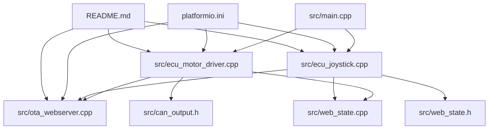
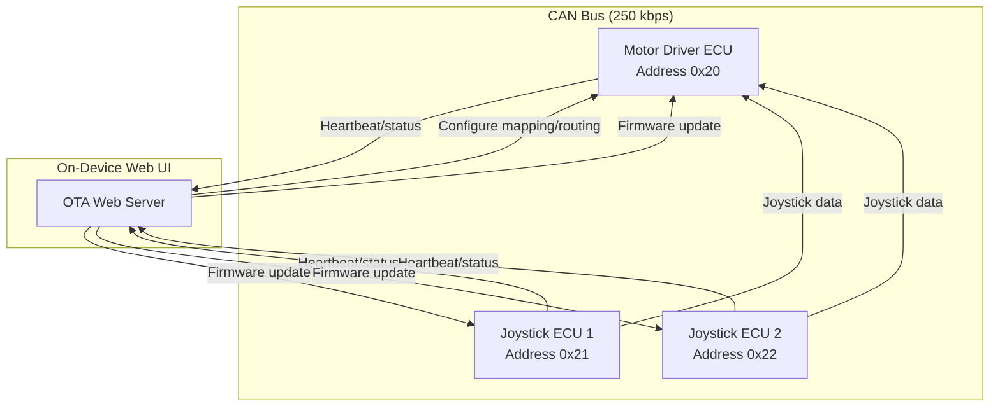
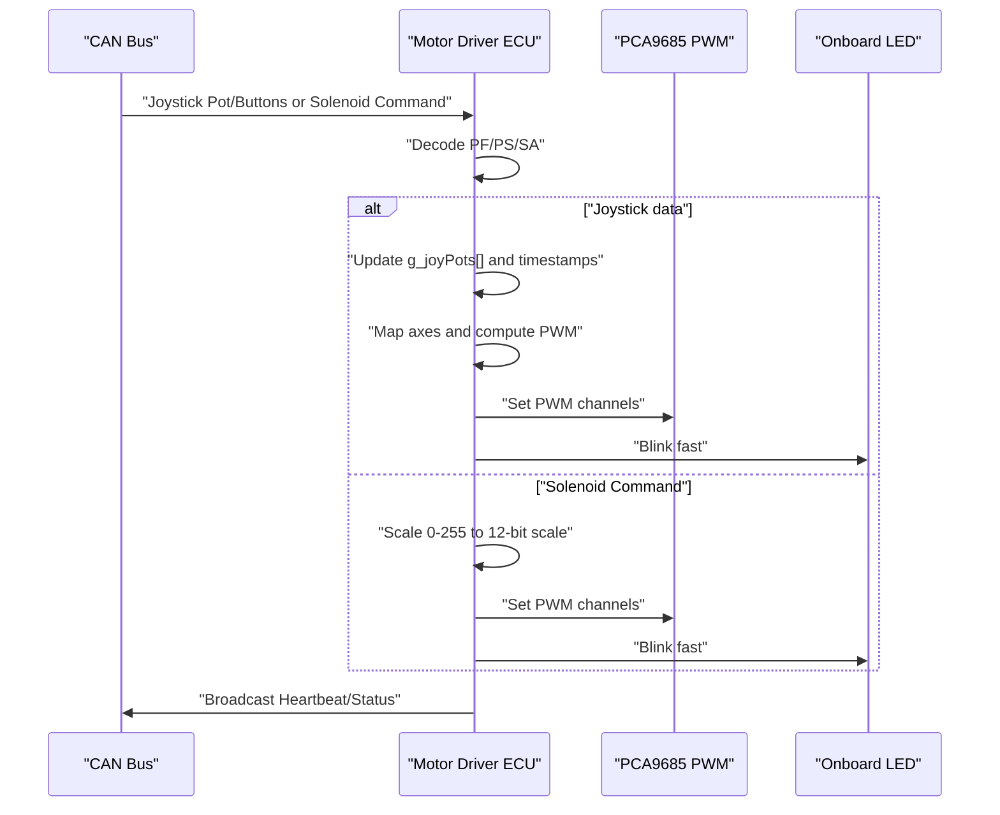
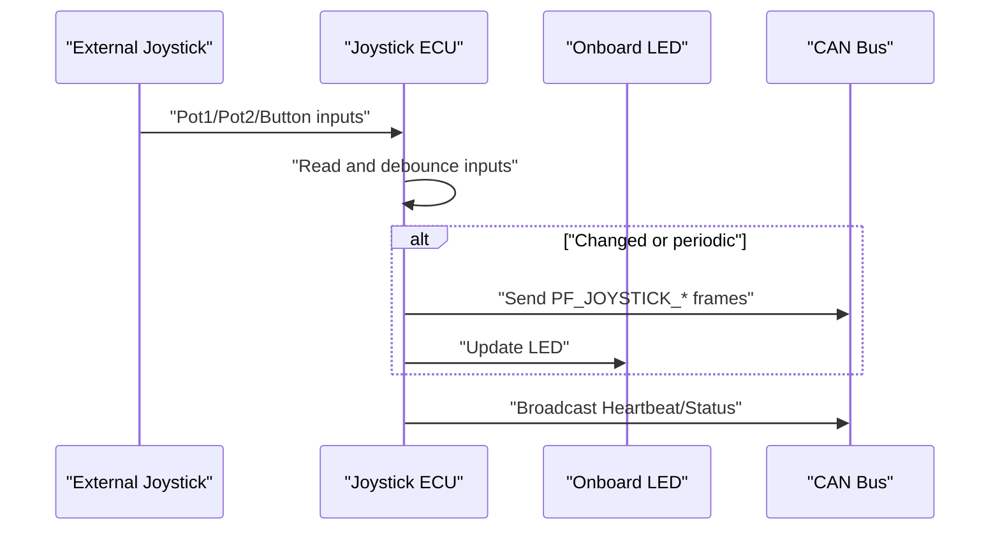
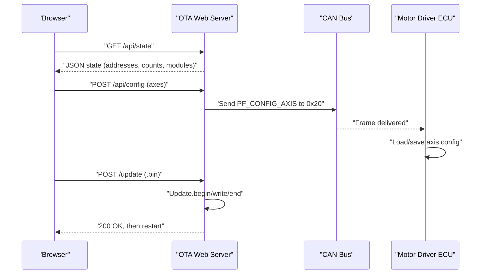
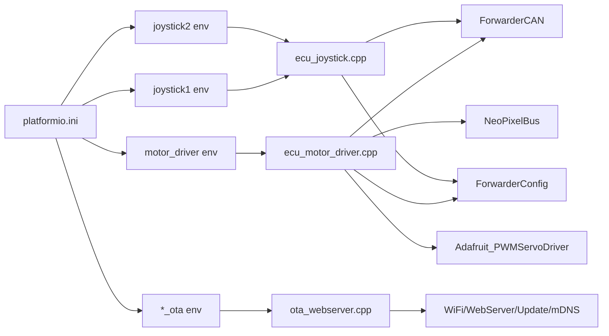
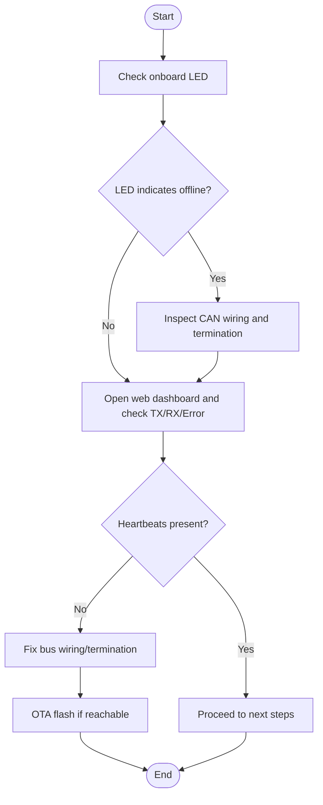
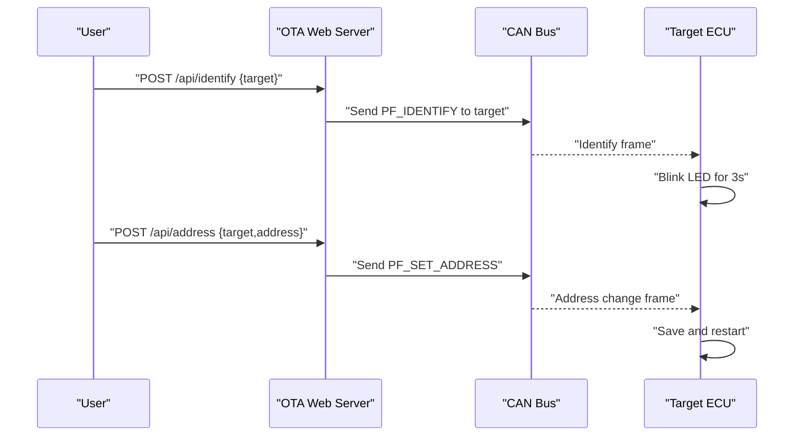
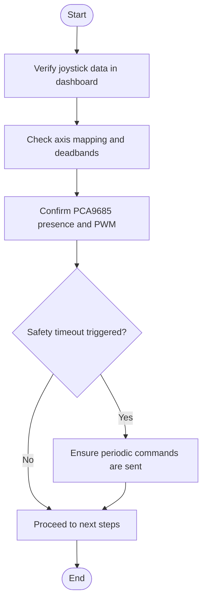
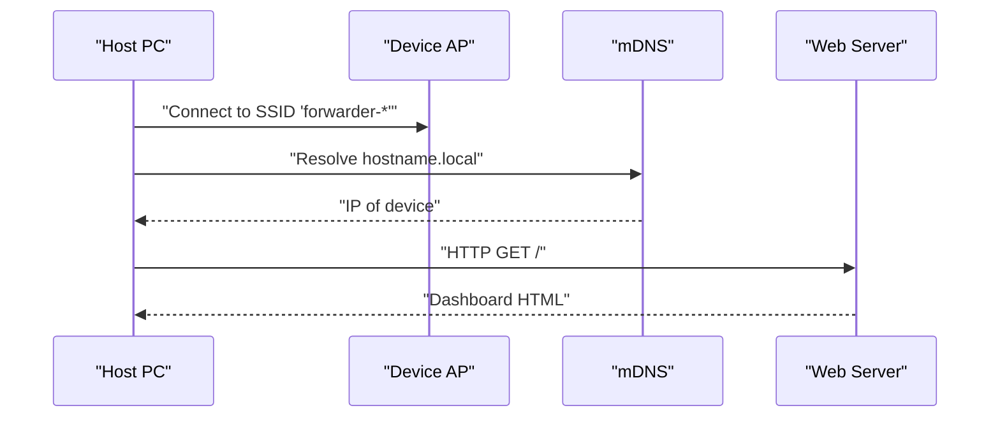

# Troubleshooting and Maintenance

<cite>
**Referenced Files in This Document**
- [README.md](file://README.md)
- [platformio.ini](file://platformio.ini)
- [src/main.cpp](file://src/main.cpp)
- [src/ecu_motor_driver.cpp](file://src/ecu_motor_driver.cpp)
- [src/ecu_joystick.cpp](file://src/ecu_joystick.cpp)
- [src/ota_webserver.cpp](file://src/ota_webserver.cpp)
- [src/web_state.cpp](file://src/web_state.cpp)
- [src/can_output.h](file://src/can_output.h)
- [src/web_state.h](file://src/web_state.h)
</cite>

## Table of Contents
1. [Introduction](#introduction)
2. [Project Structure](#project-structure)
3. [Core Components](#core-components)
4. [Architecture Overview](#architecture-overview)
5. [Detailed Component Analysis](#detailed-component-analysis)
6. [Dependency Analysis](#dependency-analysis)
7. [Performance Considerations](#performance-considerations)
8. [Troubleshooting Guide](#troubleshooting-guide)
9. [Maintenance Procedures](#maintenance-procedures)
10. [Safety Guidelines](#safety-guidelines)
11. [Conclusion](#conclusion)
12. [Appendices](#appendices)

## Introduction
This document provides comprehensive troubleshooting and maintenance guidance for ForwarderKE, an ESP32-S3-based CAN bus control system for a forwarder’s hydraulic valve block. It focuses on diagnosing and resolving common issues such as CAN bus communication failures, address claiming conflicts, solenoid control problems, and web interface connectivity issues. It also documents built-in diagnostics (heartbeat monitoring, error counters, status reporting), maintenance procedures (OTA updates, configuration backups, preventive schedules), performance tuning, and recovery procedures for system failures.

## Project Structure
ForwarderKE is organized around a small set of source files implementing either a motor driver ECU or a joystick ECU, with optional OTA web server support. Build environments define compile-time flags that select the ECU type, preferred address, and hardware pin mappings.

**Diagram sources**
- [src/main.cpp:1-32](file://src/main.cpp#L1-L32)
- [src/ecu_motor_driver.cpp:1-355](file://src/ecu_motor_driver.cpp#L1-L355)
- [src/ecu_joystick.cpp:1-239](file://src/ecu_joystick.cpp#L1-L239)
- [src/ota_webserver.cpp:1-809](file://src/ota_webserver.cpp#L1-L809)
- [src/web_state.cpp:1-20](file://src/web_state.cpp#L1-L20)
- [src/can_output.h:1-11](file://src/can_output.h#L1-L11)
- [src/web_state.h:1-23](file://src/web_state.h#L1-L23)
- [platformio.ini:1-80](file://platformio.ini#L1-L80)
- [README.md:1-131](file://README.md#L1-L131)

**Section sources**
- [README.md:112-126](file://README.md#L112-L126)
- [platformio.ini:1-80](file://platformio.ini#L1-L80)

## Core Components
- ECU selection and entry point:
  - The application entry point conditionally includes either the motor driver or joystick ECU implementation based on build flags.
- Motor Driver ECU:
  - Controls up to 16 solenoids via PCA9685 PWM drivers, reads joystick inputs, manages LEDs, broadcasts heartbeat/status, and supports OTA web UI.
- Joystick ECU:
  - Reads three potentiometers and two buttons, publishes joystick data, manages LED, and supports OTA web UI.
- OTA Web Server:
  - Provides a browser-based dashboard for diagnostics, module discovery, axis mapping, CAN output rules, and firmware updates.
- Shared state and CAN output:
  - Exposes runtime state for the web UI and defines CAN output rule structures for GPIO reactions.

Key runtime behaviors:
- Heartbeat/status broadcast every 1 second.
- Solenoid timeout: shuts off outputs after a period without CAN commands.
- Address claiming and conflict resolution via J1939-style startup arbitration.
- Automatic CAN bus recovery on errors.

**Section sources**
- [src/main.cpp:11-17](file://src/main.cpp#L11-L17)
- [src/ecu_motor_driver.cpp:290-325](file://src/ecu_motor_driver.cpp#L290-L325)
- [src/ecu_joystick.cpp:159-192](file://src/ecu_joystick.cpp#L159-L192)
- [src/ota_webserver.cpp:766-791](file://src/ota_webserver.cpp#L766-L791)
- [README.md:105-111](file://README.md#L105-L111)

## Architecture Overview
The system comprises three ECUs on a single 250 kbps CAN bus using J1939-like extended IDs. The motor driver ECU controls solenoids; joystick ECUs publish analog and button data. The OTA web server runs on-device to provide diagnostics and configuration.

**Diagram sources**
- [README.md:8-41](file://README.md#L8-L41)
- [src/ota_webserver.cpp:506-563](file://src/ota_webserver.cpp#L506-L563)
- [src/ecu_motor_driver.cpp:277-288](file://src/ecu_motor_driver.cpp#L277-L288)
- [src/ecu_joystick.cpp:146-157](file://src/ecu_joystick.cpp#L146-L157)

## Detailed Component Analysis

### Motor Driver ECU Diagnostics and Control
- Solenoid control:
  - Uses PCA9685 PWM drivers to set solenoid duty cycles from joystick inputs or direct CAN commands.
  - Implements a safety timeout to turn off outputs if no commands are received within a configured interval.
- LED status:
  - Onboard LED indicates bus status, fast blinking during activity, and special modes for identification and offline conditions.
- Address claiming and configuration:
  - Supports setting a forced address via CAN and saving it to persistent storage.
  - Supports requesting and applying axis mapping configurations from the web UI.
- Heartbeat/status:
  - Broadcasts online/offline state, uptime, TX/RX counts, and device-specific info.

**Diagram sources**
- [src/ecu_motor_driver.cpp:184-275](file://src/ecu_motor_driver.cpp#L184-L275)
- [src/ecu_motor_driver.cpp:137-151](file://src/ecu_motor_driver.cpp#L137-L151)
- [src/ecu_motor_driver.cpp:277-288](file://src/ecu_motor_driver.cpp#L277-L288)

**Section sources**
- [src/ecu_motor_driver.cpp:69-83](file://src/ecu_motor_driver.cpp#L69-L83)
- [src/ecu_motor_driver.cpp:184-275](file://src/ecu_motor_driver.cpp#L184-L275)
- [src/ecu_motor_driver.cpp:277-288](file://src/ecu_motor_driver.cpp#L277-L288)
- [README.md:108-110](file://README.md#L108-L110)

### Joystick ECU Diagnostics and Inputs
- Input acquisition:
  - Reads two analog joysticks and two buttons with debounced logic.
- LED status:
  - Onboard LED reflects bus status and identification requests.
- Heartbeat/status:
  - Broadcasts online/offline state, uptime, and joystick identity.

**Diagram sources**
- [src/ecu_joystick.cpp:63-68](file://src/ecu_joystick.cpp#L63-L68)
- [src/ecu_joystick.cpp:194-236](file://src/ecu_joystick.cpp#L194-L236)
- [src/ecu_joystick.cpp:146-157](file://src/ecu_joystick.cpp#L146-L157)

**Section sources**
- [src/ecu_joystick.cpp:63-68](file://src/ecu_joystick.cpp#L63-L68)
- [src/ecu_joystick.cpp:194-236](file://src/ecu_joystick.cpp#L194-L236)

### OTA Web Server Diagnostics and Configuration
- Dashboard:
  - Shows real-time joystick pots/buttons, solenoid outputs, CAN stats, and discovered modules.
- Module discovery:
  - Tracks modules by parsing heartbeat frames and inferring type from payload fields.
- Remote configuration:
  - Allows sending identify/address-change commands and pushing axis/CAN-output rules to the motor driver.
- OTA update:
  - Provides a simple web UI to upload firmware binaries and reboots after successful update.

**Diagram sources**
- [src/ota_webserver.cpp:510-563](file://src/ota_webserver.cpp#L510-L563)
- [src/ota_webserver.cpp:587-626](file://src/ota_webserver.cpp#L587-L626)
- [src/ota_webserver.cpp:705-737](file://src/ota_webserver.cpp#L705-L737)
- [src/ecu_motor_driver.cpp:246-267](file://src/ecu_motor_driver.cpp#L246-L267)

**Section sources**
- [src/ota_webserver.cpp:506-563](file://src/ota_webserver.cpp#L506-L563)
- [src/ota_webserver.cpp:742-761](file://src/ota_webserver.cpp#L742-L761)
- [src/ota_webserver.cpp:766-791](file://src/ota_webserver.cpp#L766-L791)

## Dependency Analysis
- Build-time dependencies:
  - PlatformIO environments define MCU/board/framework, CAN bitrate, watchdog timeout, and per-ECU pin mappings and flags.
- Runtime dependencies:
  - ECU implementations depend on ForwarderCAN and ForwarderConfig libraries for CAN transport and persistent storage.
  - Motor driver depends on PCA9685 driver and NeoPixelBus for LEDs.
  - OTA web server depends on ESP32 WiFi/WebServer/Update and mDNS.

**Diagram sources**
- [platformio.ini:17-30](file://platformio.ini#L17-L30)
- [platformio.ini:31-46](file://platformio.ini#L31-L46)
- [platformio.ini:47-62](file://platformio.ini#L47-L62)
- [platformio.ini:63-80](file://platformio.ini#L63-L80)
- [src/ecu_motor_driver.cpp:5-12](file://src/ecu_motor_driver.cpp#L5-L12)
- [src/ecu_joystick.cpp:5-9](file://src/ecu_joystick.cpp#L5-L9)
- [src/ota_webserver.cpp:5-11](file://src/ota_webserver.cpp#L5-L11)

**Section sources**
- [platformio.ini:1-80](file://platformio.ini#L1-L80)
- [src/ecu_motor_driver.cpp:5-12](file://src/ecu_motor_driver.cpp#L5-L12)
- [src/ecu_joystick.cpp:5-9](file://src/ecu_joystick.cpp#L5-L9)
- [src/ota_webserver.cpp:5-11](file://src/ota_webserver.cpp#L5-L11)

## Performance Considerations
- CAN bus utilization:
  - Monitor TX/RX counts and error counters via the web dashboard to detect excessive traffic or bus errors.
- Solenoid responsiveness:
  - Adjust axis mapping deadbands and PWM ranges to minimize latency and improve control feel.
- Watchdog and timeouts:
  - Ensure watchdog timeout and solenoid safety timeout align with operational requirements to avoid unintended shutdowns.
- OTA bandwidth:
  - Prefer quiet periods for OTA updates to reduce risk of CAN interference.

[No sources needed since this section provides general guidance]

## Troubleshooting Guide

### Systematic Troubleshooting Workflows

#### Workflow 1: CAN Bus Communication Failure
- Initial checks:
  - Verify onboard LED patterns indicating bus offline or error conditions.
  - Confirm build flags and pin mappings match hardware.
- Diagnostic steps:
  - Use the web dashboard to confirm heartbeat frames from all ECUs and inspect TX/RX/error counters.
  - If heartbeat scanning shows no modules, check CAN wiring and termination.
- Recovery:
  - Re-flash firmware using OTA if the device remains reachable via AP.
  - Replace faulty transceiver or wiring if errors persist.

**Diagram sources**
- [src/ecu_motor_driver.cpp:153-182](file://src/ecu_motor_driver.cpp#L153-L182)
- [src/ecu_joystick.cpp:70-97](file://src/ecu_joystick.cpp#L70-L97)
- [src/ota_webserver.cpp:510-563](file://src/ota_webserver.cpp#L510-L563)

**Section sources**
- [src/ecu_motor_driver.cpp:153-182](file://src/ecu_motor_driver.cpp#L153-L182)
- [src/ecu_joystick.cpp:70-97](file://src/ecu_joystick.cpp#L70-L97)
- [src/ota_webserver.cpp:510-563](file://src/ota_webserver.cpp#L510-L563)

#### Workflow 2: Address Claiming Conflicts
- Symptoms:
  - Frequent reboots after address change or inconsistent behavior.
- Steps:
  - Use the web dashboard to send an identify command to suspected conflicting addresses.
  - Send a set-address command to force a new address and observe reboot.
  - Verify the new address appears in the dashboard and modules list.
- Prevention:
  - Use compile-time flags to pre-set preferred addresses and avoid collisions.

**Diagram sources**
- [src/ota_webserver.cpp:639-657](file://src/ota_webserver.cpp#L639-L657)
- [src/ecu_motor_driver.cpp:234-245](file://src/ecu_motor_driver.cpp#L234-L245)
- [src/ecu_joystick.cpp:132-142](file://src/ecu_joystick.cpp#L132-L142)

**Section sources**
- [src/ota_webserver.cpp:639-657](file://src/ota_webserver.cpp#L639-L657)
- [src/ecu_motor_driver.cpp:234-245](file://src/ecu_motor_driver.cpp#L234-L245)
- [src/ecu_joystick.cpp:132-142](file://src/ecu_joystick.cpp#L132-L142)

#### Workflow 3: Solenoid Control Problems
- Symptoms:
  - Solenoids do not respond to joystick inputs or commands.
- Steps:
  - Confirm joystick data is visible in the dashboard.
  - Check axis mapping configuration and deadband settings.
  - Verify PCA9685 presence and PWM updates.
  - If no recent commands, confirm safety timeout is not triggering.
- Recovery:
  - Recalculate axis mapping and save via web UI.
  - Power-cycle or reset the motor driver ECU if stuck.

**Diagram sources**
- [src/ota_webserver.cpp:510-563](file://src/ota_webserver.cpp#L510-L563)
- [src/ecu_motor_driver.cpp:137-151](file://src/ecu_motor_driver.cpp#L137-L151)
- [src/ecu_motor_driver.cpp:332-337](file://src/ecu_motor_driver.cpp#L332-L337)

**Section sources**
- [src/ota_webserver.cpp:510-563](file://src/ota_webserver.cpp#L510-L563)
- [src/ecu_motor_driver.cpp:137-151](file://src/ecu_motor_driver.cpp#L137-L151)
- [src/ecu_motor_driver.cpp:332-337](file://src/ecu_motor_driver.cpp#L332-L337)

#### Workflow 4: Web Interface Connectivity Issues
- Symptoms:
  - Cannot reach the web UI or OTA page.
- Steps:
  - Confirm the device created an access point and connect to it.
  - Verify mDNS service and hostname resolution.
  - Check firewall and network settings.
- Recovery:
  - Reboot the device and retry connection.
  - Use the OTA update path to recover if the device is otherwise unreachable.

**Diagram sources**
- [src/ota_webserver.cpp:766-791](file://src/ota_webserver.cpp#L766-L791)

**Section sources**
- [src/ota_webserver.cpp:766-791](file://src/ota_webserver.cpp#L766-L791)

### Built-in Diagnostic Capabilities
- Heartbeat/Status:
  - All ECUs broadcast heartbeat frames containing online state, uptime, TX/RX counts, and device-specific fields.
- Error counters:
  - The web dashboard exposes error counts for the CAN interface.
- Module discovery:
  - The OTA web server scans heartbeat frames to discover and track modules.

**Section sources**
- [src/ecu_motor_driver.cpp:277-288](file://src/ecu_motor_driver.cpp#L277-L288)
- [src/ecu_joystick.cpp:146-157](file://src/ecu_joystick.cpp#L146-L157)
- [src/ota_webserver.cpp:510-563](file://src/ota_webserver.cpp#L510-L563)
- [src/ota_webserver.cpp:742-761](file://src/ota_webserver.cpp#L742-L761)

### Escalation Procedures for Complex Issues
- If OTA is unavailable:
  - Use a serial console to interpret debug output and confirm initialization stages.
- If address claiming fails repeatedly:
  - Force a new address via CAN and verify persistence.
- If solenoid control is intermittent:
  - Inspect power delivery to PCA9685 and wiring continuity.

**Section sources**
- [src/ecu_motor_driver.cpp:290-325](file://src/ecu_motor_driver.cpp#L290-L325)
- [src/ecu_joystick.cpp:159-192](file://src/ecu_joystick.cpp#L159-L192)

## Maintenance Procedures

### Firmware Update Cycles (OTA)
- Prepare:
  - Build the appropriate environment and produce a binary.
- Execute:
  - Connect to the device AP, navigate to the OTA page, and upload the binary.
  - The device reboots automatically upon success.
- Validate:
  - Confirm heartbeat and state in the dashboard after reboot.

**Section sources**
- [README.md:84-103](file://README.md#L84-L103)
- [src/ota_webserver.cpp:705-737](file://src/ota_webserver.cpp#L705-L737)

### Configuration Backups and Restores
- Axis mapping and CAN output rules are stored in persistent configuration and can be requested and applied via CAN or web UI.
- Backup strategy:
  - Periodically export configuration from the web UI and store separately.
  - Apply configuration remotely to avoid physical access.

**Section sources**
- [src/ecu_motor_driver.cpp:257-267](file://src/ecu_motor_driver.cpp#L257-L267)
- [src/ota_webserver.cpp:565-626](file://src/ota_webserver.cpp#L565-L626)

### Preventive Maintenance Schedules
- Monthly:
  - Inspect CAN wiring and terminations.
  - Verify LED status and heartbeat presence.
- Quarterly:
  - Review error counters and adjust mapping/deadband settings.
  - Validate OTA update procedure in controlled conditions.

[No sources needed since this section provides general guidance]

## Safety Guidelines
- CAN bus safety:
  - Address claiming prevents collisions; ensure only one ECU attempts to claim an address at a time.
  - Automatic bus-off recovery helps recover from errors.
- Electrical hazards:
  - Observe voltage limits for PCA9685 and solenoid loads.
  - Use appropriate fusing and wiring gauge for the installed solenoids.
- Equipment handling:
  - Power down devices before connecting/disconnecting wiring.
  - Use clean, dry hands and avoid working near wet surfaces.

**Section sources**
- [README.md:105-111](file://README.md#L105-L111)

## Performance Tuning and Monitoring Best Practices
- Optimize axis mapping:
  - Adjust deadbands to minimize noise and improve responsiveness.
  - Tune PWM ranges to match actuator characteristics.
- Monitor bus health:
  - Track TX/RX/error counters; rising errors indicate bus stress or wiring issues.
- Reduce contention:
  - Limit unnecessary broadcast frames and ensure periodic command rates meet safety timeouts.

[No sources needed since this section provides general guidance]

## Conclusion
ForwarderKE offers robust built-in diagnostics and a practical OTA web interface for field maintenance. By leveraging heartbeat/status reporting, error counters, and remote configuration, most issues can be diagnosed and resolved quickly. Adhering to the troubleshooting workflows, safety guidelines, and maintenance schedules will keep the system reliable in demanding field conditions.

[No sources needed since this section summarizes without analyzing specific files]

## Appendices

### Diagnostic Checklist
- CAN bus:
  - LED status, heartbeat presence, TX/RX/error counters.
- Addressing:
  - Identify and set address via web UI; verify reboot and new address.
- Solenoids:
  - Confirm joystick data, axis mapping, PCA9685 presence, and safety timeout behavior.
- Web UI:
  - Access AP, resolve hostname, and validate dashboard.

**Section sources**
- [src/ota_webserver.cpp:510-563](file://src/ota_webserver.cpp#L510-L563)
- [src/ota_webserver.cpp:639-657](file://src/ota_webserver.cpp#L639-L657)
- [src/ecu_motor_driver.cpp:277-288](file://src/ecu_motor_driver.cpp#L277-L288)