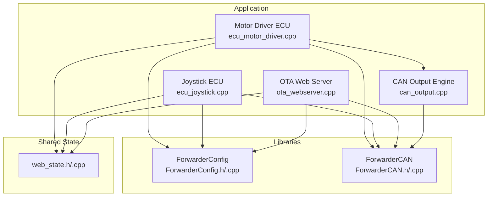
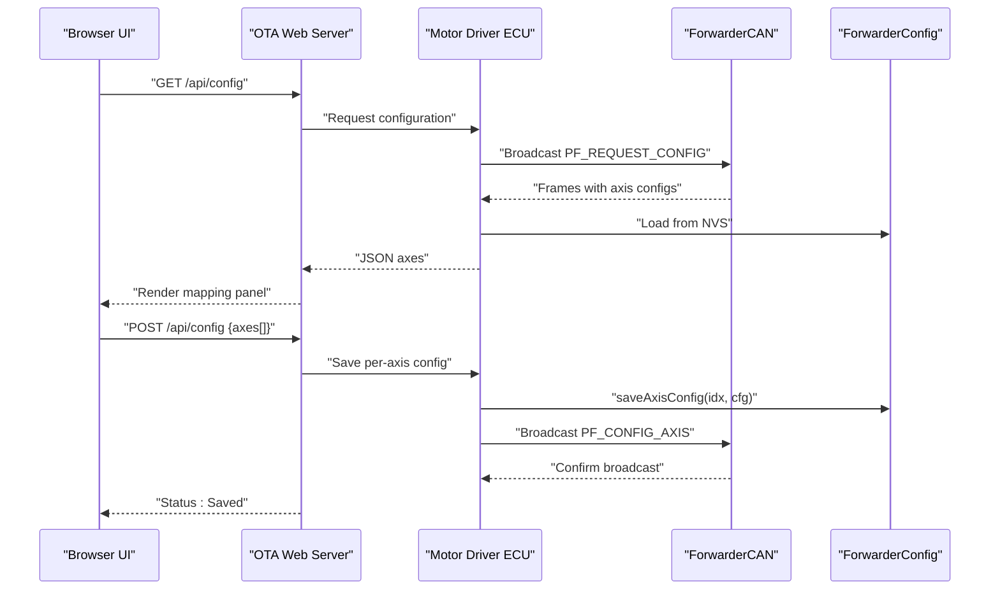
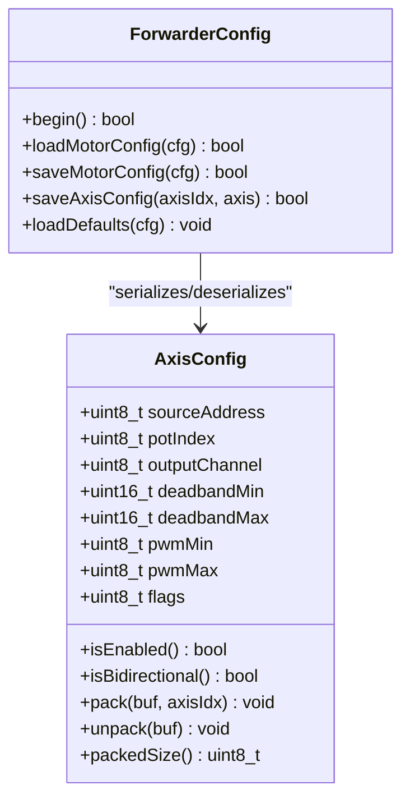
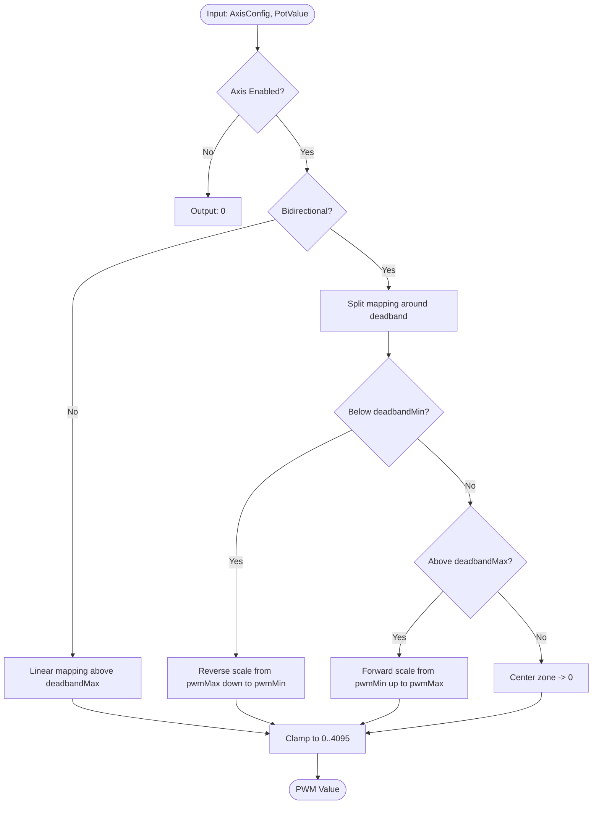
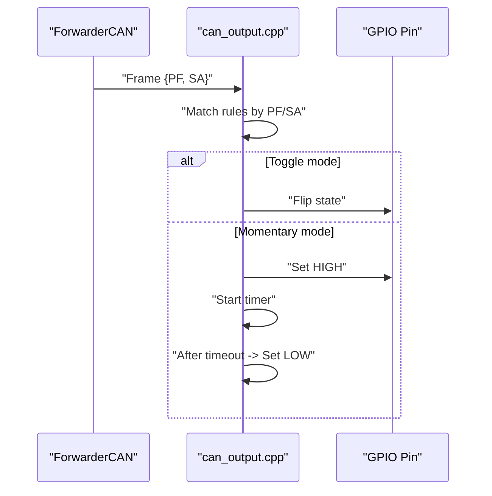
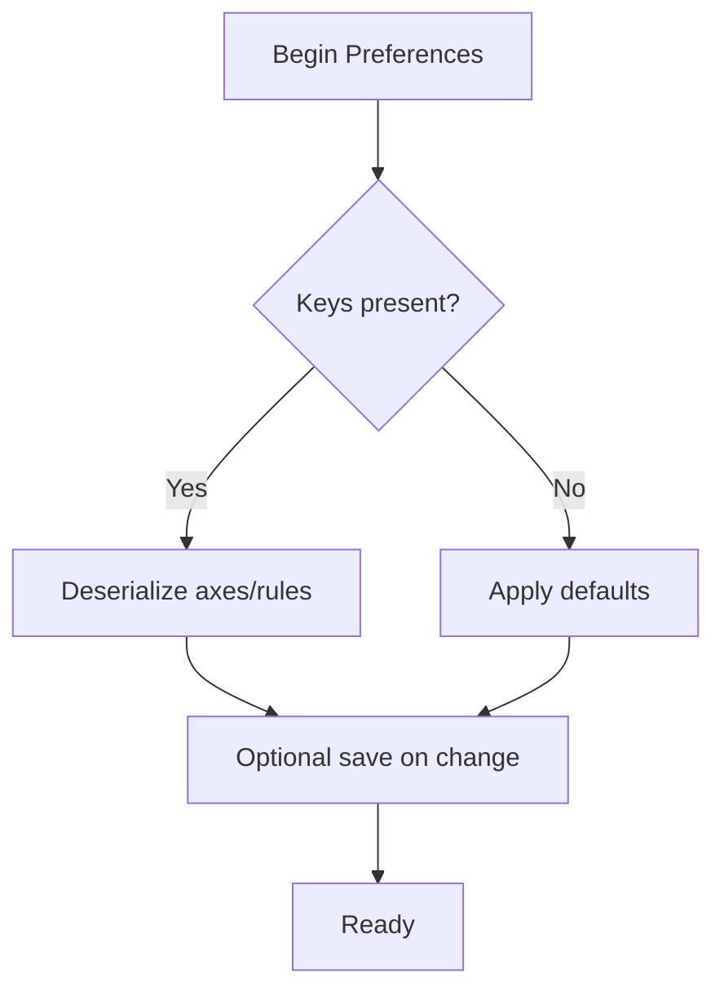
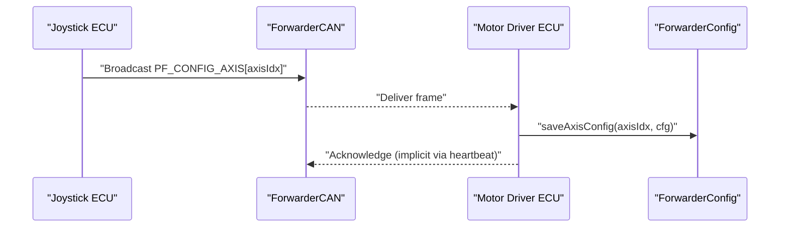
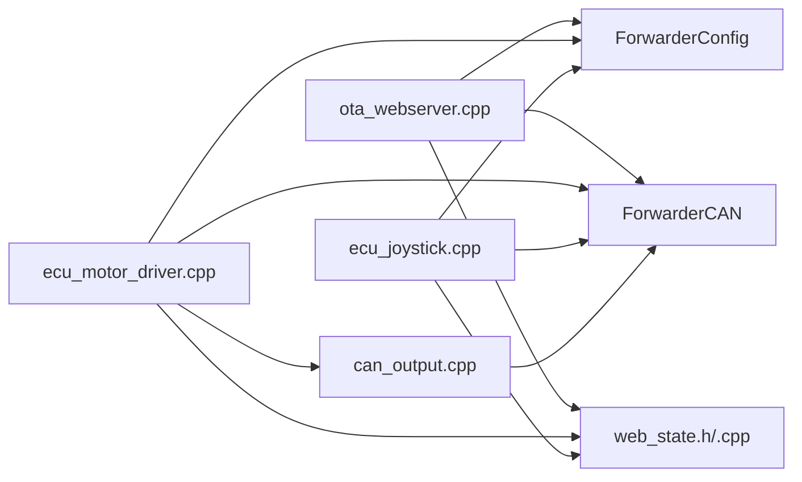

# Configuration Management

<cite>
**Referenced Files in This Document**
- [main.cpp](file://src/main.cpp)
- [ecu_motor_driver.cpp](file://src/ecu_motor_driver.cpp)
- [ecu_motor_driver.h](file://src/ecu_motor_driver.h)
- [ecu_joystick.cpp](file://src/ecu_joystick.cpp)
- [ecu_joystick.h](file://src/ecu_joystick.h)
- [ForwarderConfig.h](file://lib/ForwarderConfig/ForwarderConfig.h)
- [ForwarderConfig.cpp](file://lib/ForwarderConfig/ForwarderConfig.cpp)
- [ForwarderCAN.h](file://lib/ForwarderCAN/ForwarderCAN.h)
- [ForwarderCAN.cpp](file://lib/ForwarderCAN/ForwarderCAN.cpp)
- [can_output.h](file://src/can_output.h)
- [can_output.cpp](file://src/can_output.cpp)
- [ota_webserver.cpp](file://src/ota_webserver.cpp)
- [ota_webserver.h](file://src/ota_webserver.h)
- [web_state.h](file://src/web_state.h)
- [web_state.cpp](file://src/web_state.cpp)
</cite>

## Table of Contents
1. [Introduction](#introduction)
2. [Project Structure](#project-structure)
3. [Core Components](#core-components)
4. [Architecture Overview](#architecture-overview)
5. [Detailed Component Analysis](#detailed-component-analysis)
6. [Dependency Analysis](#dependency-analysis)
7. [Performance Considerations](#performance-considerations)
8. [Troubleshooting Guide](#troubleshooting-guide)
9. [Conclusion](#conclusion)
10. [Appendices](#appendices)

## Introduction
This document describes the configuration management system for the Forwarder CAN Controller, focusing on:
- Axis mapping interface for 16-channel joystick-to-solenoid mapping with source selection, deadband adjustment, PWM range configuration, and bidirectional operation
- Real-time validation and persistence of axis configurations
- CAN output rule configuration for GPIO triggering with pattern matching, target address filtering, output modes (toggle/momentary), and pulse duration
- Configuration backup and restore, default value management, and cross-ECU synchronization
- Practical examples and troubleshooting guidance for agricultural applications

## Project Structure
The system comprises two ECU types (motor driver and joystick), a shared configuration library, a CAN transport library, and a web-based configuration interface.

**Diagram sources**
- [ecu_motor_driver.cpp:1-355](file://src/ecu_motor_driver.cpp#L1-L355)
- [ecu_joystick.cpp:1-239](file://src/ecu_joystick.cpp#L1-L239)
- [ota_webserver.cpp:1-809](file://src/ota_webserver.cpp#L1-L809)
- [ForwarderConfig.h:1-92](file://lib/ForwarderConfig/ForwarderConfig.h#L1-L92)
- [ForwarderConfig.cpp:1-184](file://lib/ForwarderConfig/ForwarderConfig.cpp#L1-L184)
- [ForwarderCAN.h:1-120](file://lib/ForwarderCAN/ForwarderCAN.h#L1-L120)
- [ForwarderCAN.cpp:1-198](file://lib/ForwarderCAN/ForwarderCAN.cpp#L1-L198)
- [can_output.cpp:1-66](file://src/can_output.cpp#L1-L66)
- [web_state.h:1-23](file://src/web_state.h#L1-L23)

**Section sources**
- [main.cpp:1-32](file://src/main.cpp#L1-L32)
- [ecu_motor_driver.cpp:1-355](file://src/ecu_motor_driver.cpp#L1-L355)
- [ecu_joystick.cpp:1-239](file://src/ecu_joystick.cpp#L1-L239)
- [ota_webserver.cpp:1-809](file://src/ota_webserver.cpp#L1-L809)
- [ForwarderConfig.h:1-92](file://lib/ForwarderConfig/ForwarderConfig.h#L1-L92)
- [ForwarderConfig.cpp:1-184](file://lib/ForwarderConfig/ForwarderConfig.cpp#L1-L184)
- [ForwarderCAN.h:1-120](file://lib/ForwarderCAN/ForwarderCAN.h#L1-L120)
- [ForwarderCAN.cpp:1-198](file://lib/ForwarderCAN/ForwarderCAN.cpp#L1-L198)
- [can_output.cpp:1-66](file://src/can_output.cpp#L1-L66)
- [web_state.h:1-23](file://src/web_state.h#L1-L23)

## Core Components
- ForwarderConfig: Provides persistent storage for axis mappings, CAN output rules, and address overrides using NVS. It serializes/deserializes structures to/from Preferences for JSON-like transport over CAN and web APIs.
- ForwarderCAN: Implements J1939-like 29-bit ID layout, address claiming, and transport for configuration and operational messages.
- Motor Driver ECU: Receives joystick inputs, applies axis mapping, drives PCA9685 solenoid channels, and exposes configuration APIs.
- Joystick ECU: Reads analog pots/buttons, broadcasts inputs, and supports remote address assignment and identification.
- OTA Web Server: Hosts a browser UI for real-time configuration, validation, and synchronization of axis and CAN output rules.
- CAN Output Engine: Matches incoming CAN frames and toggles or pulses GPIO pins according to configured rules.

**Section sources**
- [ForwarderConfig.h:64-92](file://lib/ForwarderConfig/ForwarderConfig.h#L64-L92)
- [ForwarderConfig.cpp:76-184](file://lib/ForwarderConfig/ForwarderConfig.cpp#L76-L184)
- [ForwarderCAN.h:38-64](file://lib/ForwarderCAN/ForwarderCAN.h#L38-L64)
- [ForwarderCAN.cpp:13-198](file://lib/ForwarderCAN/ForwarderCAN.cpp#L13-L198)
- [ecu_motor_driver.cpp:1-355](file://src/ecu_motor_driver.cpp#L1-L355)
- [ecu_joystick.cpp:1-239](file://src/ecu_joystick.cpp#L1-L239)
- [ota_webserver.cpp:1-809](file://src/ota_webserver.cpp#L1-L809)
- [can_output.cpp:1-66](file://src/can_output.cpp#L1-L66)

## Architecture Overview
The configuration system centers on a JSON-like payload transported over CAN and served via a web UI. The motor driver loads persisted configuration, applies mappings, and exposes APIs for updates. The joystick can push per-axis configuration to the motor driver, which persists it.

**Diagram sources**
- [ota_webserver.cpp:565-626](file://src/ota_webserver.cpp#L565-L626)
- [ecu_motor_driver.cpp:257-267](file://src/ecu_motor_driver.cpp#L257-L267)
- [ForwarderCAN.h:38-50](file://lib/ForwarderCAN/ForwarderCAN.h#L38-L50)
- [ForwarderConfig.cpp:119-127](file://lib/ForwarderConfig/ForwarderConfig.cpp#L119-L127)

**Section sources**
- [ota_webserver.cpp:565-626](file://src/ota_webserver.cpp#L565-L626)
- [ecu_motor_driver.cpp:246-267](file://src/ecu_motor_driver.cpp#L246-L267)
- [ForwarderCAN.h:38-50](file://lib/ForwarderCAN/ForwarderCAN.h#L38-L50)
- [ForwarderConfig.cpp:119-127](file://lib/ForwarderConfig/ForwarderConfig.cpp#L119-L127)

## Detailed Component Analysis

### Axis Mapping Panel (16-channel joystick-to-solenoid)
The axis configuration panel allows:
- Source selection: joystick source address (e.g., 0x21, 0x22)
- Potentiometer selection: Pot1/Pot2/Pot3
- Output channel: 0–15 mapped to PCA channels
- Deadband: Min/Mac range aligned to ADC 0–1023
- PWM range: Min/Max scaled to 12-bit output (0–4095)
- Bidirectional operation: Signaled by a flag enabling reverse mapping
- Enable/disable flag for each axis

Persistence and transport:
- Each axis is serialized into an 8-byte buffer for CAN transport and stored as a Preferences byte array under keys like "axis_0" through "axis_15".
- Defaults are loaded when preferences are missing or uninitialized.

Real-time validation:
- The web UI validates ranges client-side (e.g., sliders and number inputs) and sends only valid values.
- The motor driver applies mapping with safety checks and clamps values to supported ranges.

Cross-ECU synchronization:
- The joystick can broadcast PF_CONFIG_AXIS frames to update the motor driver’s in-memory configuration, which is then persisted.

**Diagram sources**
- [ForwarderConfig.h:41-57](file://lib/ForwarderConfig/ForwarderConfig.h#L41-L57)
- [ForwarderConfig.cpp:6-26](file://lib/ForwarderConfig/ForwarderConfig.cpp#L6-L26)
- [ForwarderConfig.cpp:76-127](file://lib/ForwarderConfig/ForwarderConfig.cpp#L76-L127)

**Section sources**
- [ota_webserver.cpp:337-358](file://src/ota_webserver.cpp#L337-L358)
- [ForwarderConfig.h:41-57](file://lib/ForwarderConfig/ForwarderConfig.h#L41-L57)
- [ForwarderConfig.cpp:76-127](file://lib/ForwarderConfig/ForwarderConfig.cpp#L76-L127)
- [ecu_motor_driver.cpp:101-151](file://src/ecu_motor_driver.cpp#L101-L151)

### PWM Mapping Algorithm
The motor driver maps joystick pot values to solenoid PWM with optional bidirectional support and deadband shaping.

**Diagram sources**
- [ecu_motor_driver.cpp:101-135](file://src/ecu_motor_driver.cpp#L101-L135)

**Section sources**
- [ecu_motor_driver.cpp:101-135](file://src/ecu_motor_driver.cpp#L101-L135)

### CAN Output Rule Configuration Interface
The CAN output engine reacts to incoming CAN frames and toggles or pulses GPIO pins:
- Pattern matching: PDU Format (PF) required; Source Address (SA) optional (0 means any)
- Output modes: Toggle (flip current state) or Momentary (pulse HIGH then LOW after timeout)
- Pulse duration: Configurable millisecond timeout for momentary mode
- Persistence: Stored per-rule under keys like "canout_0" through "canout_3"

**Diagram sources**
- [can_output.cpp:29-61](file://src/can_output.cpp#L29-L61)
- [ForwarderCAN.h:38-50](file://lib/ForwarderCAN/ForwarderCAN.h#L38-L50)

**Section sources**
- [can_output.h:1-11](file://src/can_output.h#L1-L11)
- [can_output.cpp:1-66](file://src/can_output.cpp#L1-L66)
- [ForwarderConfig.cpp:129-169](file://lib/ForwarderConfig/ForwarderConfig.cpp#L129-L169)

### Configuration Persistence and Defaults
- Motor mapping: Stored as separate Preferences entries per axis and a PCA count setting. Defaults initialize missing keys with safe values.
- CAN output rules: Stored per-rule with default values when missing.
- Address override: Optional forced address persisted separately for address claiming.

**Diagram sources**
- [ForwarderConfig.cpp:76-127](file://lib/ForwarderConfig/ForwarderConfig.cpp#L76-L127)
- [ForwarderConfig.cpp:129-169](file://lib/ForwarderConfig/ForwarderConfig.cpp#L129-L169)
- [ForwarderConfig.cpp:171-183](file://lib/ForwarderConfig/ForwarderConfig.cpp#L171-L183)

**Section sources**
- [ForwarderConfig.cpp:76-184](file://lib/ForwarderConfig/ForwarderConfig.cpp#L76-L184)

### Cross-ECU Configuration Synchronization
- Joystick can push per-axis configuration to the motor driver via PF_CONFIG_AXIS frames; the motor driver persists and acknowledges.
- The motor driver can also broadcast its current configuration upon request.

**Diagram sources**
- [ecu_joystick.cpp:614-621](file://src/ecu_joystick.cpp#L614-L621)
- [ecu_motor_driver.cpp:246-255](file://src/ecu_motor_driver.cpp#L246-L255)
- [ForwarderCAN.h:38-50](file://lib/ForwarderCAN/ForwarderCAN.h#L38-L50)
- [ForwarderConfig.cpp:119-127](file://lib/ForwarderConfig/ForwarderConfig.cpp#L119-L127)

**Section sources**
- [ecu_joystick.cpp:614-621](file://src/ecu_joystick.cpp#L614-L621)
- [ecu_motor_driver.cpp:246-255](file://src/ecu_motor_driver.cpp#L246-L255)
- [ForwarderConfig.cpp:119-127](file://lib/ForwarderConfig/ForwarderConfig.cpp#L119-L127)

### Practical Examples and Scenarios
- Basic steering mapping: Map joystick Pot1 from 0x21 to solenoid channel 0 with a small deadband near center and forward-only PWM range.
- Bidirectional implement: Enable bidirectional on channel 1 to allow both forward and reverse solenoid travel using the same joystick axis.
- Multi-joystick setup: Assign different source addresses (0x21, 0x22) to separate joysticks and map their pots to distinct channels.
- Relay triggering: Configure CAN output rules to toggle or pulse GPIO pins in response to specific PF/SA patterns (e.g., actuation commands).

[No sources needed since this section provides general guidance]

### Troubleshooting Misconfigured Mappings
- Symptoms: No output despite joystick movement
  - Verify axis is enabled and source address matches the transmitting joystick
  - Check deadband encompasses the expected operating region
  - Confirm output channel is within PCA limits
- Symptoms: Unexpected reverse travel
  - Disable bidirectional mode or adjust deadband boundaries
- Symptoms: Intermittent or noisy output
  - Increase deadband thresholds
  - Adjust PWM min/max to avoid very low duty cycles

[No sources needed since this section provides general guidance]

### Optimizing Joystick-to-Solenoid Relationships
- Agricultural tillage: Use small deadband and moderate PWM range for precise implement positioning
- Planting/seeding: Employ wider deadband to reduce chatter during steady operation
- Guidance systems: Prefer bidirectional mapping for smoother control in both directions

[No sources needed since this section provides general guidance]

## Dependency Analysis
The configuration system exhibits layered dependencies: application ECUs depend on CAN and configuration libraries; the web server depends on both to serve and persist configuration.

**Diagram sources**
- [ota_webserver.cpp:1-809](file://src/ota_webserver.cpp#L1-L809)
- [ecu_motor_driver.cpp:1-355](file://src/ecu_motor_driver.cpp#L1-L355)
- [ecu_joystick.cpp:1-239](file://src/ecu_joystick.cpp#L1-L239)
- [ForwarderConfig.h:1-92](file://lib/ForwarderConfig/ForwarderConfig.h#L1-L92)
- [ForwarderCAN.h:1-120](file://lib/ForwarderCAN/ForwarderCAN.h#L1-L120)
- [can_output.cpp:1-66](file://src/can_output.cpp#L1-L66)
- [web_state.h:1-23](file://src/web_state.h#L1-L23)

**Section sources**
- [ota_webserver.cpp:1-809](file://src/ota_webserver.cpp#L1-L809)
- [ecu_motor_driver.cpp:1-355](file://src/ecu_motor_driver.cpp#L1-L355)
- [ecu_joystick.cpp:1-239](file://src/ecu_joystick.cpp#L1-L239)
- [ForwarderConfig.h:1-92](file://lib/ForwarderConfig/ForwarderConfig.h#L1-L92)
- [ForwarderCAN.h:1-120](file://lib/ForwarderCAN/ForwarderCAN.h#L1-L120)
- [can_output.cpp:1-66](file://src/can_output.cpp#L1-L66)
- [web_state.h:1-23](file://src/web_state.h#L1-L23)

## Performance Considerations
- CAN bandwidth: Configuration updates are infrequent; keep payload sizes small (8 bytes per axis/rule).
- PWM update rate: Motor driver updates solenoid values when joystick data ages beyond a safety timeout; avoid excessive polling.
- Web UI refresh: State and configuration are polled periodically; tune intervals to balance responsiveness and traffic.

[No sources needed since this section provides general guidance]

## Troubleshooting Guide
- Address conflicts during startup: The CAN stack retries claiming with alternative addresses derived from the device name; verify network topology and address ranges.
- OTA update failures: Ensure the firmware file is valid and the device remains powered during the update process.
- Configuration not persisting: Confirm Preferences namespace initialization and that NVS has sufficient free space.

**Section sources**
- [ForwarderCAN.cpp:54-109](file://lib/ForwarderCAN/ForwarderCAN.cpp#L54-L109)
- [ota_webserver.cpp:705-733](file://src/ota_webserver.cpp#L705-L733)
- [ForwarderConfig.cpp:56-74](file://lib/ForwarderConfig/ForwarderConfig.cpp#L56-L74)

## Conclusion
The configuration management system provides a robust, web-accessible interface for mapping joystick inputs to solenoid outputs and configuring CAN-triggered GPIO actions. It leverages NVS-backed persistence, J1939-like transport, and real-time validation to enable reliable operation across agricultural automation tasks.

[No sources needed since this section summarizes without analyzing specific files]

## Appendices

### API Surface for Configuration
- GET /api/config → Returns current axes configuration
- POST /api/config → Applies new axes configuration
- GET /api/canoutput → Returns CAN output rules
- POST /api/canoutput → Applies new CAN output rules
- POST /api/identify → Requests LED identify sequence on target address
- POST /api/address → Requests address change on target module

**Section sources**
- [ota_webserver.cpp:565-703](file://src/ota_webserver.cpp#L565-L703)