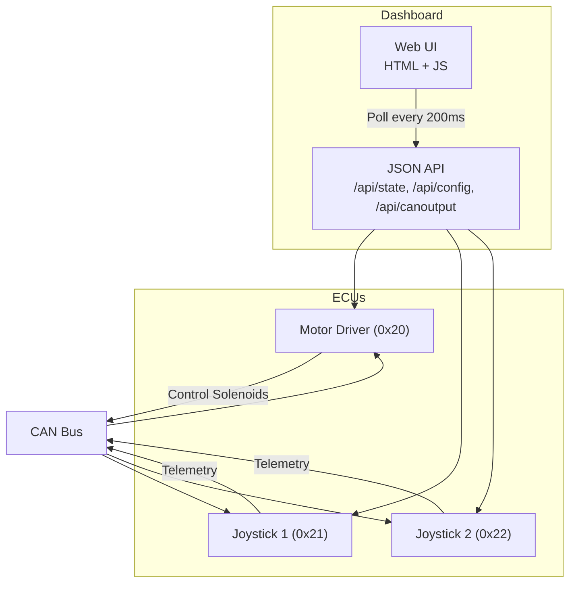
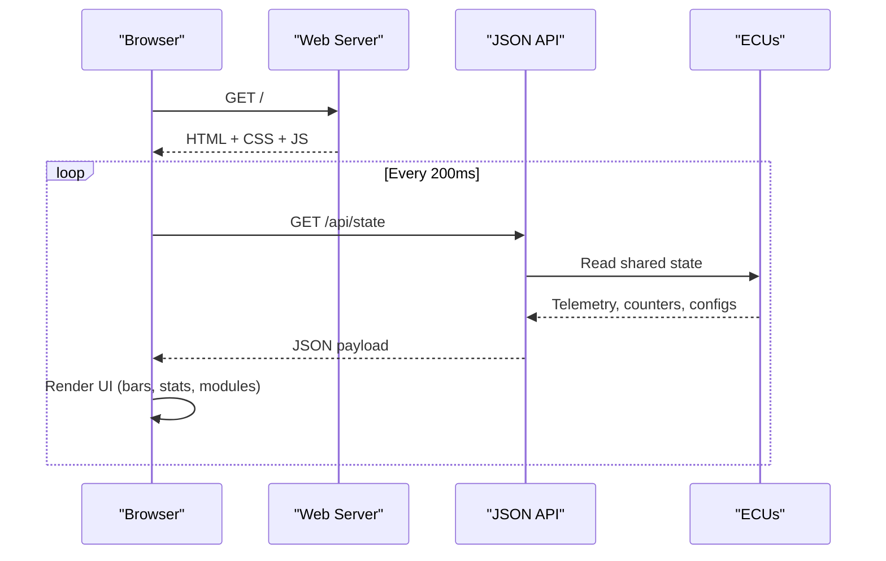
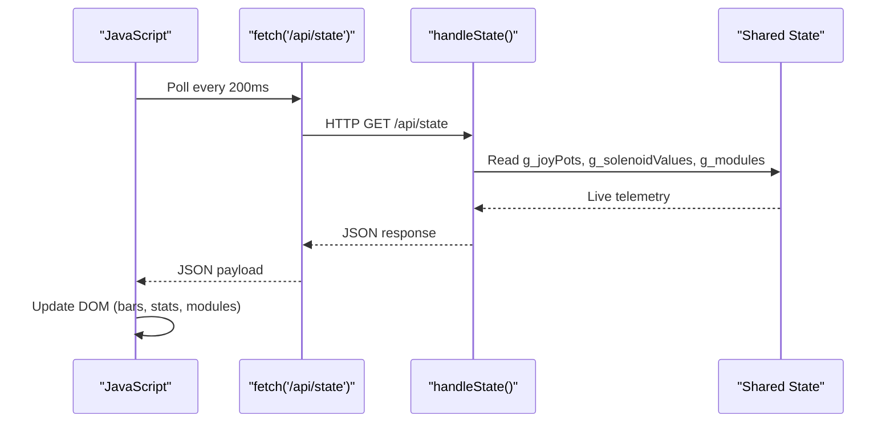
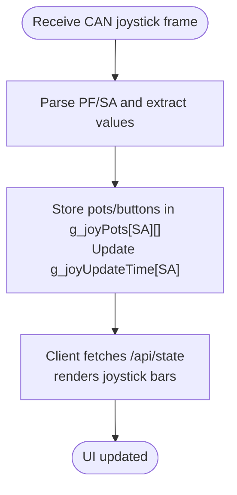
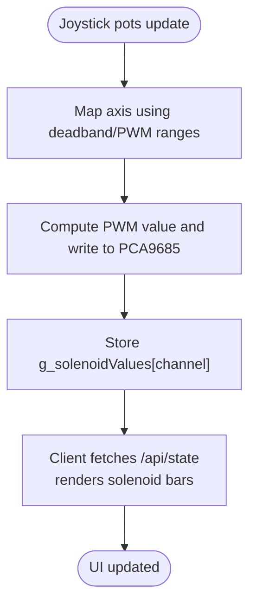
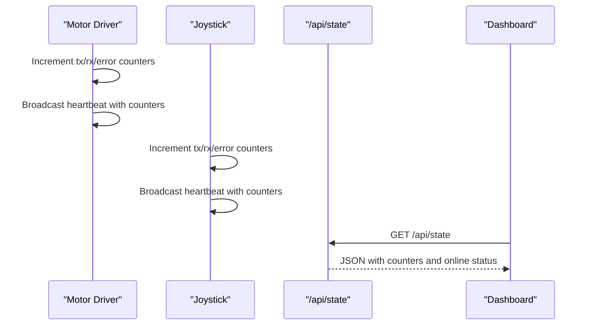
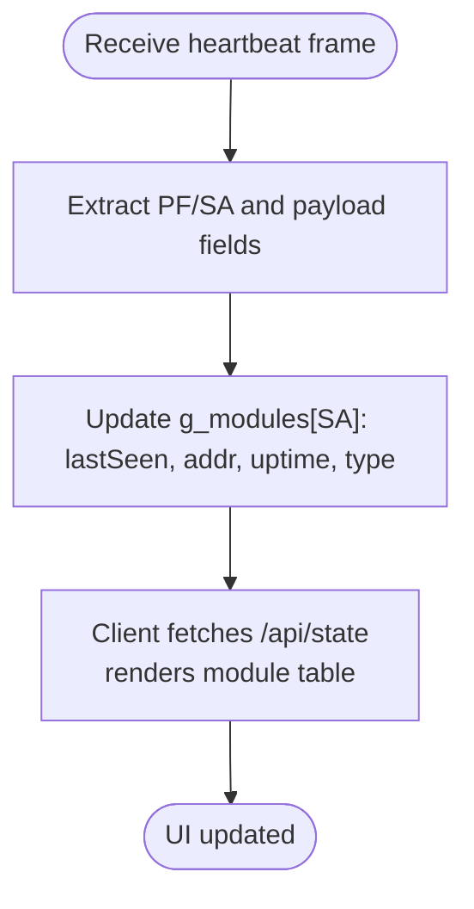
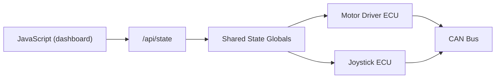

# Dashboard and Monitoring

<cite>
**Referenced Files in This Document**
- [main.cpp](file://src/main.cpp)
- [ecu_motor_driver.cpp](file://src/ecu_motor_driver.cpp)
- [ecu_motor_driver.h](file://src/ecu_motor_driver.h)
- [ecu_joystick.cpp](file://src/ecu_joystick.cpp)
- [ecu_joystick.h](file://src/ecu_joystick.h)
- [ota_webserver.cpp](file://src/ota_webserver.cpp)
- [ota_webserver.h](file://src/ota_webserver.h)
- [web_state.h](file://src/web_state.h)
- [web_state.cpp](file://src/web_state.cpp)
- [can_output.cpp](file://src/can_output.cpp)
- [can_output.h](file://src/can_output.h)
- [README.md](file://README.md)
</cite>

## Table of Contents
1. [Introduction](#introduction)
2. [Project Structure](#project-structure)
3. [Core Components](#core-components)
4. [Architecture Overview](#architecture-overview)
5. [Detailed Component Analysis](#detailed-component-analysis)
6. [Dependency Analysis](#dependency-analysis)
7. [Performance Considerations](#performance-considerations)
8. [Troubleshooting Guide](#troubleshooting-guide)
9. [Conclusion](#conclusion)
10. [Appendices](#appendices)

## Introduction
This document describes the real-time dashboard and monitoring system for the Forwarder CAN Controller. It focuses on the interactive web interface that displays system status and device telemetry, including joystick monitoring panels, solenoid output visualization, and CAN bus statistics. The dashboard uses JavaScript polling every 200 milliseconds to fetch live data from a JSON API, rendering dynamic UI elements such as SVG-based progress bars. It also covers module detection, uptime tracking, and last-seen timestamps, along with practical examples for customization, data interpretation, and troubleshooting.

## Project Structure
The system comprises three main ECUs on a 250 kbps CAN bus:
- Motor Driver (address 0x20): Controls 8 solenoids via PCA9685 PWM and receives commands from joysticks.
- Joystick 1 (address 0x21): Reads 3 potentiometers and 2 buttons, publishing telemetry on the bus.
- Joystick 2 (address 0x22): Identical to joystick 1.

The dashboard is delivered via an embedded web server that serves an HTML page and exposes JSON endpoints for live state, configuration, and control actions.

**Diagram sources**
- [README.md:8-15](file://README.md#L8-L15)
- [ota_webserver.cpp:506-501](file://src/ota_webserver.cpp#L506-L501)

**Section sources**
- [README.md:8-15](file://README.md#L8-L15)
- [README.md:112-126](file://README.md#L112-L126)

## Core Components
- Real-time dashboard and web server: Provides the HTML UI, CSS styling, and JavaScript polling to render live telemetry and controls.
- JSON API handlers: Serve state, configuration, and control endpoints for the dashboard.
- ECU-specific logic:
  - Joystick ECU reads potentiometer and button inputs and broadcasts telemetry.
  - Motor Driver ECU maps joystick inputs to solenoid PWM outputs and tracks CAN statistics.
- Shared state: Exposed via global variables for the web UI to consume.

Key responsibilities:
- Dashboard: Polls /api/state every 200 ms, renders joystick bars, solenoid channels, and CAN stats; supports tabs for modules, mapping, CAN output, and OTA.
- API: Aggregates state from ECUs, formats JSON, and handles configuration and control requests.
- ECUs: Produce telemetry and react to CAN commands; maintain heartbeat and safety timeouts.

**Section sources**
- [ota_webserver.cpp:32-501](file://src/ota_webserver.cpp#L32-L501)
- [ota_webserver.cpp:510-563](file://src/ota_webserver.cpp#L510-L563)
- [ecu_motor_driver.cpp:137-151](file://src/ecu_motor_driver.cpp#L137-L151)
- [ecu_joystick.cpp:194-236](file://src/ecu_joystick.cpp#L194-L236)

## Architecture Overview
The dashboard architecture centers on a lightweight embedded web server that serves static HTML and dynamic JSON. The JavaScript client polls the /api/state endpoint at a fixed interval, updating the DOM with real-time telemetry. The server aggregates data from the ECUs and maintains a module registry from heartbeat messages.

**Diagram sources**
- [ota_webserver.cpp:506-501](file://src/ota_webserver.cpp#L506-L501)
- [ota_webserver.cpp:510-563](file://src/ota_webserver.cpp#L510-L563)
- [ota_webserver.cpp:494-498](file://src/ota_webserver.cpp#L494-L498)

**Section sources**
- [ota_webserver.cpp:506-501](file://src/ota_webserver.cpp#L506-L501)
- [ota_webserver.cpp:510-563](file://src/ota_webserver.cpp#L510-L563)
- [ota_webserver.cpp:494-498](file://src/ota_webserver.cpp#L494-L498)

## Detailed Component Analysis

### Dashboard Layout and Rendering
The dashboard is composed of:
- Tabs: Dashboard, Modules, Motor Mapping, CAN Output, OTA Update.
- Dashboard panel:
  - Joystick panels (Joystick 1 and Joystick 2) showing potentiometer bars and button states.
  - Solenoid outputs grid with channel-by-channel PWM bars.
  - CAN Bus Stats: TX count, RX count, error count, and uptime.
- Modules panel: Detected modules table with type, uptime, last seen, and actions (Identify, Set Address).
- Motor Mapping panel: Axis configuration editor with enable, source, pot index, output channel, deadband, PWM range, and bidirectional flag.
- CAN Output panel: Rules to toggle or momentary pulse GPIO pins based on matched CAN frames.
- OTA panel: Firmware upload UI with progress bar.

Rendering logic:
- Joystick visualization uses SVG-like bar elements with gradient fills and percentage widths.
- Solenoid visualization uses a responsive grid of vertical bars representing PWM values per channel.
- Module table dynamically lists entries based on heartbeat scans and last-seen timestamps.
- Polling interval is set to 200 ms to balance responsiveness and bandwidth.

**Section sources**
- [ota_webserver.cpp:191-215](file://src/ota_webserver.cpp#L191-L215)
- [ota_webserver.cpp:217-225](file://src/ota_webserver.cpp#L217-L225)
- [ota_webserver.cpp:227-236](file://src/ota_webserver.cpp#L227-L236)
- [ota_webserver.cpp:238-248](file://src/ota_webserver.cpp#L238-L248)
- [ota_webserver.cpp:250-258](file://src/ota_webserver.cpp#L250-L258)
- [ota_webserver.cpp:280-313](file://src/ota_webserver.cpp#L280-L313)
- [ota_webserver.cpp:315-335](file://src/ota_webserver.cpp#L315-L335)
- [ota_webserver.cpp:337-358](file://src/ota_webserver.cpp#L337-L358)
- [ota_webserver.cpp:425-444](file://src/ota_webserver.cpp#L425-L444)
- [ota_webserver.cpp:494-498](file://src/ota_webserver.cpp#L494-L498)

### Real-time Data Refresh Mechanism
- JavaScript polling: The client invokes fetch('/api/state') every 200 ms and updates the UI immediately upon receiving JSON.
- JSON API: The server constructs a JSON payload containing:
  - Local address, online status, uptime, TX/RX/error counts.
  - Joystick telemetry keyed by source address with pot values and ages.
  - Solenoid values array.
  - Module registry keyed by address with type, uptime, and last-seen age.
- Dynamic UI rendering: The client generates HTML for bars and grids, applying width percentages and gradient styles to reflect live values.

**Diagram sources**
- [ota_webserver.cpp:510-563](file://src/ota_webserver.cpp#L510-L563)
- [ota_webserver.cpp:360-374](file://src/ota_webserver.cpp#L360-L374)
- [ota_webserver.cpp:494-498](file://src/ota_webserver.cpp#L494-L498)

**Section sources**
- [ota_webserver.cpp:510-563](file://src/ota_webserver.cpp#L510-L563)
- [ota_webserver.cpp:360-374](file://src/ota_webserver.cpp#L360-L374)
- [ota_webserver.cpp:494-498](file://src/ota_webserver.cpp#L494-L498)

### Joystick Input Visualization
- Data source: Each joystick publishes up to three potentiometer values and button states periodically. The motor driver stores the latest values per source address and the last update timestamp.
- Visualization:
  - Three horizontal bars per joystick represent Pot1, Pot2, and Pot3 with a maximum of 1023.
  - Button states are shown as textual indicators (Btn1, Btn2) or “None”.
  - Bars use gradient backgrounds and percentage-based widths for smooth rendering.

**Diagram sources**
- [ecu_motor_driver.cpp:192-205](file://src/ecu_motor_driver.cpp#L192-L205)
- [ota_webserver.cpp:286-295](file://src/ota_webserver.cpp#L286-L295)

**Section sources**
- [ecu_motor_driver.cpp:192-205](file://src/ecu_motor_driver.cpp#L192-L205)
- [ota_webserver.cpp:286-295](file://src/ota_webserver.cpp#L286-L295)

### Solenoid Output Monitoring
- Data source: The motor driver computes PWM values per axis from joystick inputs and writes them to PCA9685 channels. These values are stored in a global array and served via /api/state.
- Visualization:
  - A grid of 8–16 channels (depending on PCA presence) shows vertical bars reflecting PWM values on a 0–4095 scale.
  - Channel labels (CH0–CHn) and numeric values aid quick interpretation.

**Diagram sources**
- [ecu_motor_driver.cpp:101-135](file://src/ecu_motor_driver.cpp#L101-L135)
- [ecu_motor_driver.cpp:137-151](file://src/ecu_motor_driver.cpp#L137-L151)
- [ota_webserver.cpp:297-313](file://src/ota_webserver.cpp#L297-L313)

**Section sources**
- [ecu_motor_driver.cpp:101-135](file://src/ecu_motor_driver.cpp#L101-L135)
- [ecu_motor_driver.cpp:137-151](file://src/ecu_motor_driver.cpp#L137-L151)
- [ota_webserver.cpp:297-313](file://src/ota_webserver.cpp#L297-L313)

### CAN Bus Statistics Display
- Data source: The motor driver and joystick ECUs expose TX/RX/error counts and uptime via heartbeat frames and local counters.
- Visualization:
  - TX Count, RX Count, Error Count, and Uptime are displayed as labeled rows.
  - Bus status reflects online/offline state derived from CAN status.

**Diagram sources**
- [ecu_motor_driver.cpp:277-288](file://src/ecu_motor_driver.cpp#L277-L288)
- [ecu_joystick.cpp:146-157](file://src/ecu_joystick.cpp#L146-L157)
- [ota_webserver.cpp:510-563](file://src/ota_webserver.cpp#L510-L563)

**Section sources**
- [ecu_motor_driver.cpp:277-288](file://src/ecu_motor_driver.cpp#L277-L288)
- [ecu_joystick.cpp:146-157](file://src/ecu_joystick.cpp#L146-L157)
- [ota_webserver.cpp:510-563](file://src/ota_webserver.cpp#L510-L563)

### Module Detection System
- Discovery: The server scans incoming heartbeat frames to populate a module registry keyed by address.
- Type identification: Heuristics infer module type from heartbeat payload fields (e.g., device ID or PCA count).
- Tracking: Each entry records address, type, uptime, and last-seen age.
- UI: The Modules tab lists discovered modules with action buttons to identify and set addresses.

**Diagram sources**
- [ota_webserver.cpp:742-761](file://src/ota_webserver.cpp#L742-L761)
- [ota_webserver.cpp:315-335](file://src/ota_webserver.cpp#L315-L335)

**Section sources**
- [ota_webserver.cpp:742-761](file://src/ota_webserver.cpp#L742-L761)
- [ota_webserver.cpp:315-335](file://src/ota_webserver.cpp#L315-L335)

### Practical Examples
- Customizing dashboard tabs: Add or remove panels by editing the HTML template and ensuring corresponding JavaScript rendering functions exist.
- Interpreting joystick data: Use the pot values to confirm physical movement; button states indicate active inputs. Age indicates freshness of data.
- Interpreting solenoid data: PWM values near zero mean no flow; higher values correspond to proportional flow. Compare across channels to detect imbalances.
- Interpreting CAN stats: Rising TX/RX counters indicate normal operation; persistent errors may suggest wiring or bus-off conditions.
- Troubleshooting display issues:
  - If bars do not update, verify the polling interval and network connectivity.
  - If modules do not appear, check heartbeat frames and address assignment.
  - If solenoid bars show unexpected values, review axis mapping and deadband settings.

[No sources needed since this section provides general guidance]

## Dependency Analysis
The dashboard depends on:
- Embedded web server for serving HTML and handling API routes.
- Shared state globals exported by ECUs for telemetry and configuration.
- CAN bus for telemetry and control frames.

**Diagram sources**
- [ota_webserver.cpp:510-563](file://src/ota_webserver.cpp#L510-L563)
- [web_state.h:10-23](file://src/web_state.h#L10-L23)

**Section sources**
- [ota_webserver.cpp:510-563](file://src/ota_webserver.cpp#L510-L563)
- [web_state.h:10-23](file://src/web_state.h#L10-L23)

## Performance Considerations
- Polling interval: 200 ms strikes a balance between responsiveness and network overhead. Lower intervals increase CPU and bandwidth usage.
- Data volume: JSON payloads are compact, focusing on recent telemetry and counters. Avoid unnecessary re-renders by updating only changed elements.
- UI rendering: SVG-like bars are lightweight; ensure efficient DOM updates and avoid excessive reflows.
- CAN bus utilization: Telemetry frames are periodic; monitor TX/RX counts to detect saturation or anomalies.

[No sources needed since this section provides general guidance]

## Troubleshooting Guide
Common issues and resolutions:
- Dashboard not loading:
  - Verify the device’s Wi-Fi AP is reachable and the web UI is accessible at the expected IP or mDNS hostname.
- No joystick data:
  - Confirm joysticks are powered and connected; check that heartbeat frames are visible in the Modules tab.
- Solenoid outputs not responding:
  - Ensure axis mapping is configured and deadband settings are appropriate; verify PCA presence and PWM writes.
- CAN bus errors:
  - Inspect TX/RX/error counters; check for bus-off recovery and wiring integrity.
- OTA update failures:
  - Ensure the correct .bin file is selected and the device remains connected during the update process.

**Section sources**
- [README.md:84-103](file://README.md#L84-L103)
- [ota_webserver.cpp:705-737](file://src/ota_webserver.cpp#L705-L737)

## Conclusion
The dashboard provides a comprehensive, real-time view of the Forwarder CAN system. Its modular design, driven by a simple polling mechanism and JSON API, enables clear visualization of joystick inputs, solenoid outputs, and CAN statistics. The module detection system simplifies device management, while the configuration panels offer fine-grained control over axis mapping and CAN-triggered outputs. With straightforward customization and robust troubleshooting practices, the dashboard supports reliable operation and maintenance of the hydraulic control system.

[No sources needed since this section summarizes without analyzing specific files]

## Appendices

### API Endpoints
- GET /api/state: Returns local address, online status, uptime, TX/RX/error counts, joystick telemetry, solenoid values, and module registry.
- GET /api/config: Returns motor mapping configuration.
- POST /api/config: Updates motor mapping configuration and broadcasts to joysticks if applicable.
- POST /api/identify: Sends an identify command to a target address.
- POST /api/address: Requests a target module to change its address.
- GET /api/canoutput: Returns CAN output rules.
- POST /api/canoutput: Updates CAN output rules and reinitializes outputs.
- POST /update: Handles OTA firmware uploads.

**Section sources**
- [ota_webserver.cpp:510-563](file://src/ota_webserver.cpp#L510-L563)
- [ota_webserver.cpp:565-626](file://src/ota_webserver.cpp#L565-L626)
- [ota_webserver.cpp:639-657](file://src/ota_webserver.cpp#L639-L657)
- [ota_webserver.cpp:648-657](file://src/ota_webserver.cpp#L648-L657)
- [ota_webserver.cpp:659-703](file://src/ota_webserver.cpp#L659-L703)
- [ota_webserver.cpp:705-737](file://src/ota_webserver.cpp#L705-L737)

### Entry Point and ECU Selection
The application entry point selects the ECU type at compile time, enabling either the motor driver or joystick logic.

**Section sources**
- [main.cpp:11-17](file://src/main.cpp#L11-L17)
- [main.cpp:26-31](file://src/main.cpp#L26-L31)

### Shared State Exposure
Globals are declared in a shared header and defined conditionally to avoid linker conflicts across ECU builds.

**Section sources**
- [web_state.h:10-23](file://src/web_state.h#L10-L23)
- [web_state.cpp:6-19](file://src/web_state.cpp#L6-L19)

### CAN Output Rules
Rules define how incoming CAN frames trigger GPIO outputs, supporting toggle or momentary modes with configurable pulse duration.

**Section sources**
- [can_output.cpp:7-66](file://src/can_output.cpp#L7-L66)
- [can_output.h:7-11](file://src/can_output.h#L7-L11)