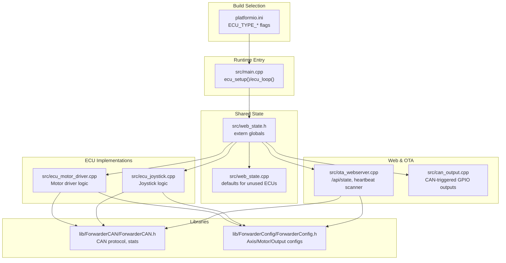
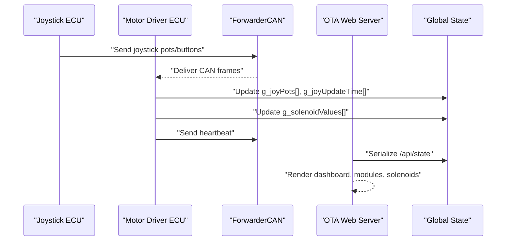
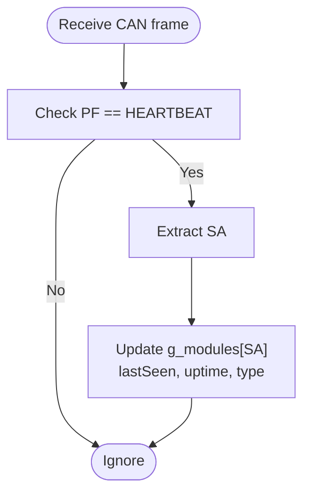
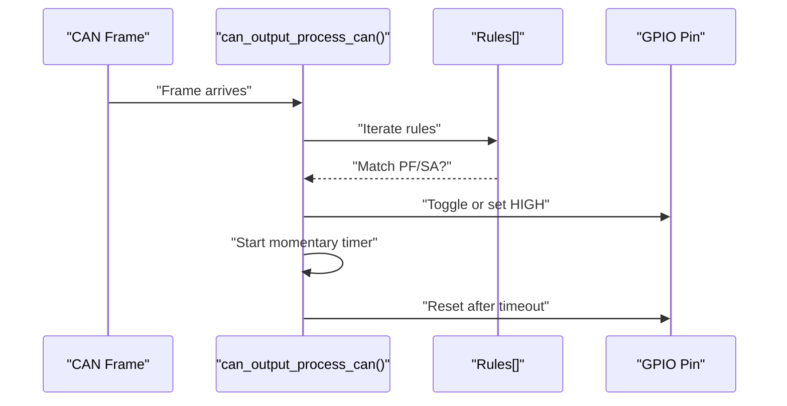
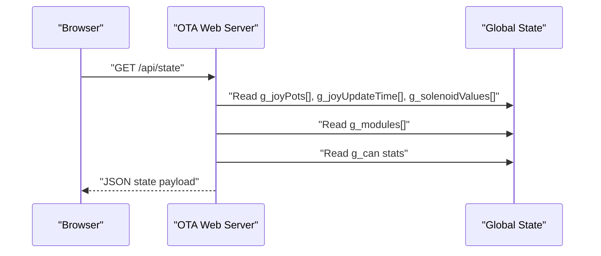
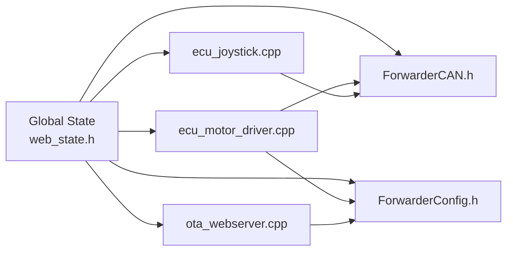

# Global State Management

<cite>
**Referenced Files in This Document**
- [README.md](file://README.md)
- [platformio.ini](file://platformio.ini)
- [src/main.cpp](file://src/main.cpp)
- [src/web_state.h](file://src/web_state.h)
- [src/web_state.cpp](file://src/web_state.cpp)
- [src/ecu_joystick.h](file://src/ecu_joystick.h)
- [src/ecu_joystick.cpp](file://src/ecu_joystick.cpp)
- [src/ecu_motor_driver.h](file://src/ecu_motor_driver.h)
- [src/ecu_motor_driver.cpp](file://src/ecu_motor_driver.cpp)
- [src/ota_webserver.h](file://src/ota_webserver.h)
- [src/ota_webserver.cpp](file://src/ota_webserver.cpp)
- [src/can_output.h](file://src/can_output.h)
- [src/can_output.cpp](file://src/can_output.cpp)
- [lib/ForwarderCAN/ForwarderCAN.h](file://lib/ForwarderCAN/ForwarderCAN.h)
- [lib/ForwarderConfig/ForwarderConfig.h](file://lib/ForwarderConfig/ForwarderConfig.h)
</cite>

## Table of Contents
1. [Introduction](#introduction)
2. [Project Structure](#project-structure)
3. [Core Components](#core-components)
4. [Architecture Overview](#architecture-overview)
5. [Detailed Component Analysis](#detailed-component-analysis)
6. [Dependency Analysis](#dependency-analysis)
7. [Performance Considerations](#performance-considerations)
8. [Troubleshooting Guide](#troubleshooting-guide)
9. [Conclusion](#conclusion)
10. [Appendices](#appendices)

## Introduction
This document describes the global state management system that enables cross-ECU data sharing and real-time state synchronization across a 250 kbps CAN bus. It focuses on:
- Global state variables for joystick data arrays, solenoid value tracking, module discovery, and CAN bus statistics
- State update mechanisms originating from different ECU types
- Data serialization for web API responses
- State consistency across multiple components
- Heartbeat scanning for module detection
- State aging and stale data handling
- Real-time data aggregation from CAN messages
- Persistence requirements, memory management, and thread-safe access patterns
- Practical examples of state data structures, API response formatting, and debugging synchronization issues
- Relationship between global state and individual ECU implementations, initialization sequences, and cleanup procedures

## Project Structure
The system is organized around a shared global state exposed to the web UI and consumed by ECU implementations. The build flags select which ECU runs at runtime, while shared headers define the global variables used across components.

**Diagram sources**
- [platformio.ini](file://platformio.ini)
- [src/main.cpp](file://src/main.cpp)
- [src/web_state.h](file://src/web_state.h)
- [src/web_state.cpp](file://src/web_state.cpp)
- [src/ecu_motor_driver.cpp](file://src/ecu_motor_driver.cpp)
- [src/ecu_joystick.cpp](file://src/ecu_joystick.cpp)
- [src/ota_webserver.cpp](file://src/ota_webserver.cpp)
- [src/can_output.cpp](file://src/can_output.cpp)
- [lib/ForwarderCAN/ForwarderCAN.h](file://lib/ForwarderCAN/ForwarderCAN.h)
- [lib/ForwarderConfig/ForwarderConfig.h](file://lib/ForwarderConfig/ForwarderConfig.h)

**Section sources**
- [README.md](file://README.md)
- [platformio.ini](file://platformio.ini)
- [src/main.cpp](file://src/main.cpp)
- [src/web_state.h](file://src/web_state.h)
- [src/web_state.cpp](file://src/web_state.cpp)

## Core Components
This section documents the global state variables and their roles in cross-ECU synchronization.

- Joystick data arrays and timestamps
  - Array of joystick measurements indexed by source address (SA)
  - Per-SA update timestamps for aging and staleness checks
  - Used by motor driver to map joystick inputs to solenoid outputs

- Solenoid value tracking
  - Current PWM values for each output channel
  - Updated from joystick CAN frames or direct solenoid commands

- Motor configuration and PCA presence
  - Axis mapping configuration for translating joystick channels to solenoid outputs
  - PCA count indicator for hardware capability

- CAN output rules
  - Rules to trigger GPIO outputs based on incoming CAN frames

- Local joystick state (when running on joystick ECU)
  - Local potentiometer readings and button states
  - Joystick identity for heartbeat payload

- CAN bus statistics
  - TX/RX/error counts and online status
  - Exposed via web API for diagnostics

- Module discovery and heartbeat scanning
  - Per-address module metadata (type, uptime, last seen)
  - Heartbeat payload parsing for type detection

**Section sources**
- [src/web_state.h](file://src/web_state.h)
- [src/web_state.cpp](file://src/web_state.cpp)
- [src/ecu_motor_driver.cpp](file://src/ecu_motor_driver.cpp)
- [src/ecu_joystick.cpp](file://src/ecu_joystick.cpp)
- [src/ota_webserver.cpp](file://src/ota_webserver.cpp)
- [lib/ForwarderCAN/ForwarderCAN.h](file://lib/ForwarderCAN/ForwarderCAN.h)
- [lib/ForwarderConfig/ForwarderConfig.h](file://lib/ForwarderConfig/ForwarderConfig.h)

## Architecture Overview
The global state is shared across ECU implementations and the web server. The motor driver aggregates joystick inputs and updates solenoid outputs, while joysticks publish their inputs. The web server exposes a JSON API that serializes the global state for visualization and configuration.

**Diagram sources**
- [src/ecu_joystick.cpp](file://src/ecu_joystick.cpp)
- [src/ecu_motor_driver.cpp](file://src/ecu_motor_driver.cpp)
- [src/ota_webserver.cpp](file://src/ota_webserver.cpp)
- [lib/ForwarderCAN/ForwarderCAN.h](file://lib/ForwarderCAN/ForwarderCAN.h)

## Detailed Component Analysis

### Global State Variables and Initialization
- Shared extern declarations define the global state surface used by both ECUs and the web server.
- Default definitions ensure unused ECUs compile cleanly by providing zero-initialized placeholders.

Key global variables:
- g_joyPots[256][3]: 10-bit joystick measurements per SA
- g_joyUpdateTime[256]: last update timestamp per SA
- g_solenoidValues[MAX_AXIS_COUNT]: current PWM values for outputs
- g_motorCfg: motor mapping configuration
- g_pca2Present: PCA expansion detection
- g_can: pointer to CAN bus instance
- g_canOutputRules[MAX_CAN_OUTPUT_RULES]: CAN-triggered GPIO rules
- g_localPot1/g_localPot2, g_localBtn1/g_localBtn2, g_ecuJoystickId: local joystick state

Initialization and defaults:
- Defaults are provided for non-selected ECUs to satisfy linker requirements.
- ECU-specific initialization sets up CAN, PCA, and LED status.

**Section sources**
- [src/web_state.h](file://src/web_state.h)
- [src/web_state.cpp](file://src/web_state.cpp)
- [src/ecu_motor_driver.cpp](file://src/ecu_motor_driver.cpp)
- [src/ecu_joystick.cpp](file://src/ecu_joystick.cpp)

### Joystick ECU State Updates and Heartbeats
- Reads analog inputs and buttons, sends periodic joystick frames and buttons.
- Processes LED color, identify, and address change requests.
- Sends heartbeat containing online status, uptime, and counters.

State update mechanism:
- Input sampling with hysteresis thresholds
- Broadcasts pots/buttons at intervals or on change
- Heartbeat every second with bus counters

**Section sources**
- [src/ecu_joystick.cpp](file://src/ecu_joystick.cpp)
- [lib/ForwarderCAN/ForwarderCAN.h](file://lib/ForwarderCAN/ForwarderCAN.h)

### Motor Driver State Updates and Aging
- Receives joystick pots/buttons and updates solenoid values via configured axes.
- Applies deadband and direction mapping for bidirectional axes.
- Implements safety timeout to turn off outputs if no updates for a period.
- Processes LED color, identify, and address change requests.
- Sends heartbeat with bus counters and PCA capability.

State aging and staleness:
- Uses per-SA timestamps to detect stale joystick data
- Axes mapping considers lastUpdate age before applying changes

**Section sources**
- [src/ecu_motor_driver.cpp](file://src/ecu_motor_driver.cpp)
- [lib/ForwarderConfig/ForwarderConfig.h](file://lib/ForwarderConfig/ForwarderConfig.h)
- [lib/ForwarderCAN/ForwarderCAN.h](file://lib/ForwarderCAN/ForwarderCAN.h)

### Heartbeat Scanning and Module Discovery
- The web server scans incoming heartbeat frames to discover modules.
- Type detection heuristics infer motor vs joystick from heartbeat payload fields.
- Maintains per-address metadata: lastSeen, uptime, type.

**Diagram sources**
- [src/ota_webserver.cpp](file://src/ota_webserver.cpp)
- [lib/ForwarderCAN/ForwarderCAN.h](file://lib/ForwarderCAN/ForwarderCAN.h)

**Section sources**
- [src/ota_webserver.cpp](file://src/ota_webserver.cpp)

### CAN Output Rules and Real-Time GPIO Triggering
- Configurable rules to toggle or momentary-pulse GPIO pins based on matched PF/SA.
- Runtime loop handles momentary timers to reset outputs.

**Diagram sources**
- [src/can_output.cpp](file://src/can_output.cpp)
- [lib/ForwarderConfig/ForwarderConfig.h](file://lib/ForwarderConfig/ForwarderConfig.h)

**Section sources**
- [src/can_output.cpp](file://src/can_output.cpp)
- [lib/ForwarderConfig/ForwarderConfig.h](file://lib/ForwarderConfig/ForwarderConfig.h)

### Web API Serialization and State Exposure
- The web server constructs JSON for:
  - Local CAN status (address, online, uptime, TX/RX/errors)
  - Joystick data per SA with age
  - Local joystick data (if running on joystick ECU)
  - Solenoid outputs array
  - Discovered modules with type, uptime, and age

**Diagram sources**
- [src/ota_webserver.cpp](file://src/ota_webserver.cpp)
- [src/web_state.h](file://src/web_state.h)

**Section sources**
- [src/ota_webserver.cpp](file://src/ota_webserver.cpp)

### State Consistency Across Components
- Shared externs ensure all components access the same global arrays and structs.
- Defaults in web_state.cpp prevent missing symbol errors when compiling for a different ECU type.
- CAN protocol and J1939-like addressing guarantees frame routing and uniqueness.

**Section sources**
- [src/web_state.h](file://src/web_state.h)
- [src/web_state.cpp](file://src/web_state.cpp)
- [lib/ForwarderCAN/ForwarderCAN.h](file://lib/ForwarderCAN/ForwarderCAN.h)

### Memory Management and Thread Safety
- Large arrays (joystick data per SA) consume RAM; ensure sufficient heap for 256 SAs.
- No explicit locking is used; state updates occur in ECU loops and web handlers are single-threaded in this implementation.
- Recommendations:
  - Prefer read-mostly access patterns
  - Avoid frequent large allocations in ISR-equivalent contexts
  - Consider partitioning state by ECU to reduce contention

**Section sources**
- [src/web_state.h](file://src/web_state.h)
- [src/ota_webserver.cpp](file://src/ota_webserver.cpp)

## Dependency Analysis
The global state depends on CAN protocol definitions and configuration structures. The motor driver consumes joystick state and produces solenoid outputs. The web server consumes all global state for visualization and configuration.

**Diagram sources**
- [src/web_state.h](file://src/web_state.h)
- [src/ecu_joystick.cpp](file://src/ecu_joystick.cpp)
- [src/ecu_motor_driver.cpp](file://src/ecu_motor_driver.cpp)
- [src/ota_webserver.cpp](file://src/ota_webserver.cpp)
- [lib/ForwarderCAN/ForwarderCAN.h](file://lib/ForwarderCAN/ForwarderCAN.h)
- [lib/ForwarderConfig/ForwarderConfig.h](file://lib/ForwarderConfig/ForwarderConfig.h)

**Section sources**
- [src/web_state.h](file://src/web_state.h)
- [src/ecu_motor_driver.cpp](file://src/ecu_motor_driver.cpp)
- [src/ecu_joystick.cpp](file://src/ecu_joystick.cpp)
- [src/ota_webserver.cpp](file://src/ota_webserver.cpp)
- [lib/ForwarderCAN/ForwarderCAN.h](file://lib/ForwarderCAN/ForwarderCAN.h)
- [lib/ForwarderConfig/ForwarderConfig.h](file://lib/ForwarderConfig/ForwarderConfig.h)

## Performance Considerations
- Joystick polling and CAN throughput:
  - Joystick ECU sends pots/buttons periodically and on change; tune thresholds to balance responsiveness and bus load.
  - Motor driver applies mapping and PWM updates; ensure loop timing does not starve CAN receive processing.
- Aging and timeouts:
  - Stale joystick data detection prevents stuck outputs; adjust thresholds based on expected update rates.
  - Safety timeout disables solenoids after inactivity to prevent unintended operation.
- Web API:
  - JSON serialization iterates arrays; keep polling intervals reasonable to avoid blocking the loop.
- Memory:
  - 256 SAs × 3 pots × 2 bytes + timestamps = significant RAM footprint; monitor heap usage.

[No sources needed since this section provides general guidance]

## Troubleshooting Guide
Common issues and debugging steps:
- No joystick data in dashboard:
  - Verify joysticks are broadcasting pots/buttons and addresses are within range.
  - Check heartbeat scanning; ensure web server is running and receiving frames.
- Stuck solenoids:
  - Confirm motor driver receives joystick frames and axes mapping is configured.
  - Check safety timeout; ensure continuous updates are occurring.
- Module not detected:
  - Confirm heartbeat frames are present and type detection heuristics match expected payloads.
  - Verify web server is scanning heartbeats continuously.
- Address conflicts:
  - Review address claiming behavior and forced address settings.
- OTA update failures:
  - Ensure correct .bin file and AP connectivity; check serial logs for errors.

**Section sources**
- [src/ota_webserver.cpp](file://src/ota_webserver.cpp)
- [src/ecu_motor_driver.cpp](file://src/ecu_motor_driver.cpp)
- [src/ecu_joystick.cpp](file://src/ecu_joystick.cpp)
- [lib/ForwarderCAN/ForwarderCAN.h](file://lib/ForwarderCAN/ForwarderCAN.h)

## Conclusion
The global state management system provides a unified, cross-ECU view of joystick inputs, solenoid outputs, module discovery, and CAN statistics. Through careful state updates, aging mechanisms, and heartbeat-driven discovery, it enables reliable real-time control and diagnostics. Proper configuration of axes, CAN output rules, and OTA capabilities completes the operational picture for field deployment.

[No sources needed since this section summarizes without analyzing specific files]

## Appendices

### API Response Formatting Example
The web server constructs a JSON payload with:
- localAddr, online, uptime, txCount, rxCount, errCount
- joy: object keyed by SA with pots and age
- sol: array of solenoid values
- modules: object keyed by address with addr, type, uptime, age

**Section sources**
- [src/ota_webserver.cpp](file://src/ota_webserver.cpp)

### State Initialization Sequences
- Motor driver:
  - Initialize configuration manager, PCA9685, CAN, load motor config and CAN output rules, then start OTA if enabled.
- Joystick:
  - Initialize LED, ADC resolution, buttons, CAN, then start OTA if enabled.

**Section sources**
- [src/ecu_motor_driver.cpp](file://src/ecu_motor_driver.cpp)
- [src/ecu_joystick.cpp](file://src/ecu_joystick.cpp)

### Cleanup Procedures
- On safety timeout, motor driver turns off all solenoids and resets update timestamps.
- OTA web server maintains module metadata in RAM; clearing occurs implicitly by restart or reinitialization.

**Section sources**
- [src/ecu_motor_driver.cpp](file://src/ecu_motor_driver.cpp)
- [src/ota_webserver.cpp](file://src/ota_webserver.cpp)