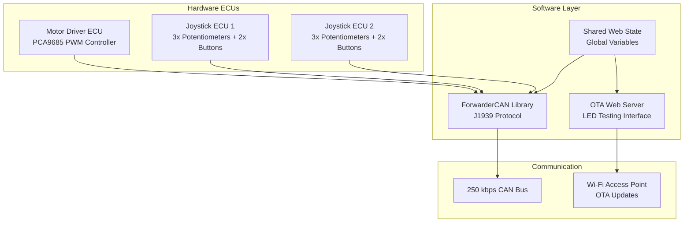
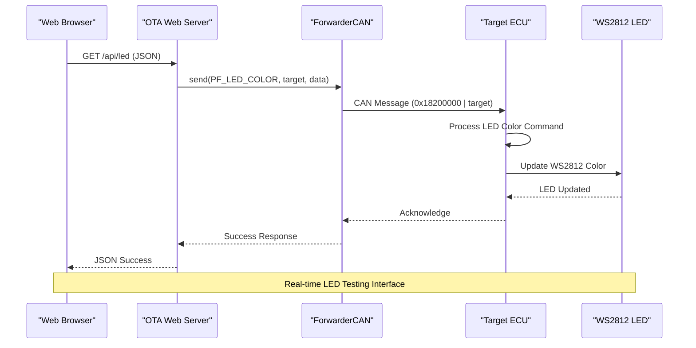
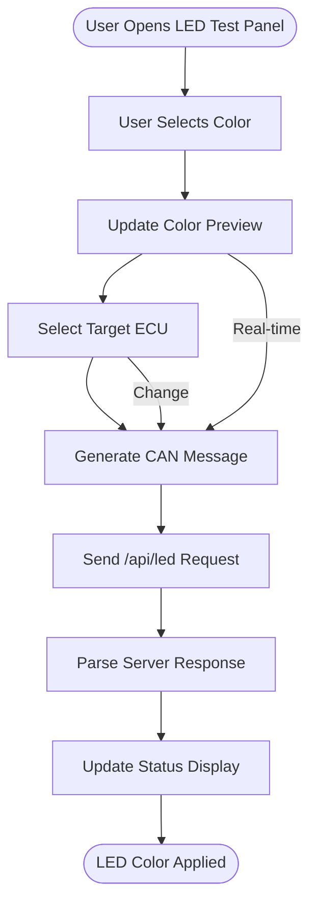
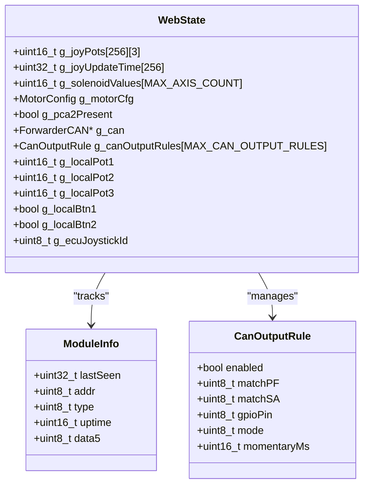
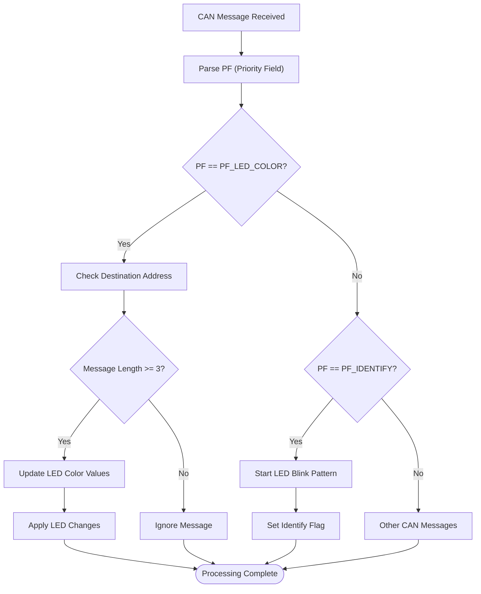
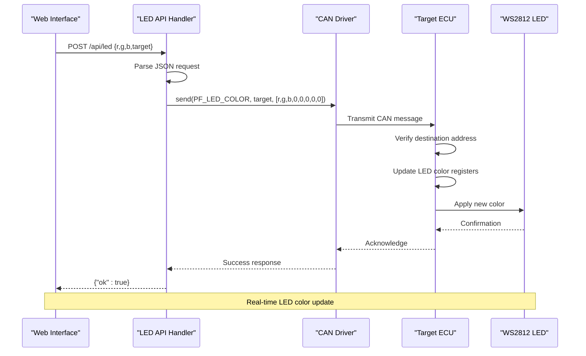

# LED Testing Web Interface

<cite>
**Referenced Files in This Document**
- [README.md](file://README.md)
- [main.cpp](file://src/main.cpp)
- [ota_webserver.h](file://src/ota_webserver.h)
- [ota_webserver.cpp](file://src/ota_webserver.cpp)
- [web_state.h](file://src/web_state.h)
- [web_state.cpp](file://src/web_state.cpp)
- [ecu_motor_driver.cpp](file://src/ecu_motor_driver.cpp)
- [ecu_joystick.cpp](file://src/ecu_joystick.cpp)
- [can_output.cpp](file://src/can_output.cpp)
- [platformio.ini](file://platformio.ini)
</cite>

## Table of Contents
1. [Introduction](#introduction)
2. [Project Structure](#project-structure)
3. [Core Components](#core-components)
4. [Architecture Overview](#architecture-overview)
5. [LED Testing Web Interface](#led-testing-web-interface)
6. [Detailed Component Analysis](#detailed-component-analysis)
7. [API Endpoints](#api-endpoints)
8. [CAN Protocol Integration](#can-protocol-integration)
9. [Performance Considerations](#performance-considerations)
10. [Troubleshooting Guide](#troubleshooting-guide)
11. [Conclusion](#conclusion)

## Introduction

The Forwarder CAN Controller is an ESP32-based system designed to replace a factory hydraulic valve block controller with a robust, open-source solution. This system implements J1939-like addressing over a 250 kbps CAN bus, controlling 8 solenoids via PCA9685 PWM drivers and managing two joystick ECUs with potentiometer and button inputs.

The LED Testing Web Interface is a crucial component that allows users to remotely test and control the WS2812 status LEDs on all ECUs in the network. This interface provides real-time visualization of joystick inputs, solenoid outputs, and CAN bus statistics, along with dedicated LED testing capabilities.

## Project Structure

The project follows a modular architecture with separate ECUs for motor control and joystick input, unified CAN communication protocols, and optional OTA web server functionality.

**Diagram sources**
- [platformio.ini:17-114](file://platformio.ini#L17-L114)
- [README.md:8-15](file://README.md#L8-L15)

**Section sources**
- [README.md:175-189](file://README.md#L175-L189)
- [platformio.ini:1-114](file://platformio.ini#L1-L114)

## Core Components

The system consists of several key components working together to provide comprehensive control and monitoring capabilities:

### Main Application Entry Point
The application uses a build-flag driven architecture where the main.cpp file conditionally includes either the motor driver or joystick ECU implementation based on compilation flags.

### CAN Communication Layer
The ForwarderCAN library implements J1939-like protocol with 29-bit extended IDs, supporting priority-based message routing and standardized message formats for different ECU types.

### Web Interface System
The OTA web server provides a comprehensive dashboard with real-time monitoring, configuration management, and LED testing capabilities across all ECUs in the network.

### Hardware Abstraction
Each ECU type has specific hardware configurations for CAN transceiver control, input sensors, and status LEDs, optimized for their respective roles in the hydraulic control system.

**Section sources**
- [main.cpp:11-17](file://src/main.cpp#L11-L17)
- [README.md:31-125](file://README.md#L31-L125)

## Architecture Overview

The system implements a distributed CAN bus architecture with centralized web monitoring and control capabilities.

**Diagram sources**
- [ota_webserver.cpp:741-753](file://src/ota_webserver.cpp#L741-L753)
- [ecu_motor_driver.cpp:219-225](file://src/ecu_motor_driver.cpp#L219-L225)
- [ecu_joystick.cpp:138-145](file://src/ecu_joystick.cpp#L138-L145)

## LED Testing Web Interface

The LED Testing Web Interface is a comprehensive feature that allows users to remotely control and test the WS2812 status LEDs across all ECUs in the network. This interface provides both manual color selection and preset color options.

### Interface Components

The LED testing panel includes several key interactive elements:

#### Color Selection Controls
- **Color Picker**: HTML5 color picker allowing precise RGB color selection
- **Real-time Preview**: Live preview of selected color displayed as a colored square
- **RGB Value Display**: Numeric display of Red, Green, and Blue component values
- **Preset Colors**: Quick-access buttons for common colors (Red, Green, Blue, White, Off)

#### Target Selection
Users can specify which ECU should receive the LED command:
- **Broadcast Mode**: Send to all ECUs (0xFF)
- **Individual ECUs**: Target specific joystick units (0x21, 0x22)

#### CAN Message Visualization
The interface displays the actual CAN message that will be transmitted:
- **CAN ID**: Shows the complete 29-bit ID in hexadecimal format
- **Data Payload**: Displays the 8-byte data array with color values

### Implementation Details

The LED testing functionality is implemented through a sophisticated JavaScript frontend that communicates with the embedded web server via RESTful API calls.

**Diagram sources**
- [ota_webserver.cpp:431-475](file://src/ota_webserver.cpp#L431-L475)
- [ota_webserver.cpp:741-753](file://src/ota_webserver.cpp#L741-L753)

### API Integration

The web interface communicates with the embedded system through well-defined API endpoints:

#### LED Control Endpoint
The `/api/led` endpoint accepts JSON requests containing color values and target specifications, then translates these into appropriate CAN messages for the target ECU.

#### Real-time State Updates
The interface periodically polls the `/api/state` endpoint to receive real-time updates about joystick positions, solenoid states, and module detection, ensuring the LED testing interface remains synchronized with the overall system status.

**Section sources**
- [ota_webserver.cpp:251-288](file://src/ota_webserver.cpp#L251-L288)
- [ota_webserver.cpp:431-475](file://src/ota_webserver.cpp#L431-L475)
- [ota_webserver.cpp:741-753](file://src/ota_webserver.cpp#L741-L753)

## Detailed Component Analysis

### Web State Management

The web state system provides a centralized mechanism for sharing data between different ECUs and the web interface. It maintains global variables that track joystick positions, solenoid states, and configuration parameters across the entire network.

**Diagram sources**
- [web_state.h:10-23](file://src/web_state.h#L10-L23)
- [ota_webserver.cpp:16-25](file://src/ota_webserver.cpp#L16-L25)

### CAN Message Processing

Both motor driver and joystick ECUs implement comprehensive CAN message processing to handle LED control commands and system identification requests.

**Diagram sources**
- [ecu_motor_driver.cpp:219-233](file://src/ecu_motor_driver.cpp#L219-L233)
- [ecu_joystick.cpp:138-162](file://src/ecu_joystick.cpp#L138-L162)

### LED Control Implementation

The LED control system implements sophisticated timing and pattern generation for different operational states.

#### Normal Operation States
- **Solid Green**: System online and operational
- **Flashing Yellow**: Recent activity detected on CAN bus
- **Solid Red**: System offline or error condition

#### Special Operation States
- **Blink Pattern**: Used for device identification requests
- **Fast Flash**: Indicates high-priority events or warnings
- **Dim Blue**: Standby or initialization state

**Section sources**
- [ecu_motor_driver.cpp:153-182](file://src/ecu_motor_driver.cpp#L153-L182)
- [ecu_joystick.cpp:89-116](file://src/ecu_joystick.cpp#L89-L116)

## API Endpoints

The web interface exposes several RESTful API endpoints for comprehensive system control and monitoring:

### LED Control Endpoints

| Endpoint | Method | Purpose | Request Body | Response |
|----------|--------|---------|--------------|----------|
| `/api/led` | POST | Set LED color on target ECU | `{r: 0-255, g: 0-255, b: 0-255, target: 0x21/0x22/0xFF}` | `{"ok": true}` |
| `/api/state` | GET | Get system state and telemetry | None | Comprehensive system status JSON |
| `/api/config` | GET/POST | Get/set motor mapping configuration | Axis configuration data | Configuration JSON |

### Additional Control Endpoints

| Endpoint | Method | Purpose | Request Body | Response |
|----------|--------|---------|--------------|----------|
| `/api/identify` | POST | Trigger LED identification pattern | `{target: address}` | `{"ok": true}` |
| `/api/address` | POST | Change ECU address dynamically | `{target: address, address: newAddress}` | `{"ok": true}` |
| `/api/canoutput` | GET/POST | Manage CAN-triggered GPIO outputs | CAN output rules | Rules configuration JSON |

**Section sources**
- [ota_webserver.cpp:603-764](file://src/ota_webserver.cpp#L603-L764)

## CAN Protocol Integration

The LED testing interface seamlessly integrates with the underlying CAN protocol, utilizing J1939-style addressing for reliable multi-ECU communication.

### CAN Message Structure for LED Control

The LED color command follows the established CAN protocol with specific field layouts:

| Field | Size (bits) | Description | Example Value |
|-------|-------------|-------------|---------------|
| Priority | 3 | Message priority level | 6 |
| Extended Data Page | 1 | J1939 compatibility | 0 |
| Data Page | 1 | J1939 compatibility | 0 |
| PDU Format (PF) | 8 | Function identifier | 0x20 (LED Color) |
| PDU Specific (PS) | 8 | Destination address | 0xFF (Broadcast) |
| Source Address (SA) | 8 | Originating ECU address | 0x21/0x22 |

### Message Processing Flow

**Diagram sources**
- [ota_webserver.cpp:741-753](file://src/ota_webserver.cpp#L741-L753)
- [ecu_motor_driver.cpp:219-225](file://src/ecu_motor_driver.cpp#L219-L225)

**Section sources**
- [README.md:36-90](file://README.md#L36-L90)
- [ota_webserver.cpp:741-753](file://src/ota_webserver.cpp#L741-L753)

## Performance Considerations

The LED testing interface is designed for optimal performance in resource-constrained embedded environments:

### Memory Management
- Static allocation for LED state arrays to minimize heap fragmentation
- Efficient JSON parsing with minimal memory overhead
- Optimized CAN message handling with pre-allocated buffers

### Timing Constraints
- LED update intervals limited to 50ms to prevent flickering artifacts
- CAN message transmission throttled to 25Hz for joystick inputs
- Web interface polling optimized to 200ms intervals for dashboard updates

### Power Efficiency
- LED brightness controlled through PWM dimming
- Sleep modes during idle periods
- Efficient CAN bus utilization with minimal message overhead

## Troubleshooting Guide

### Common Issues and Solutions

#### LED Not Responding to Commands
1. **Verify CAN Bus Connectivity**: Check physical connections and termination resistors
2. **Confirm ECU Address**: Ensure target ECU is properly addressed on the network
3. **Check LED Hardware**: Verify WS2812 installation and power supply
4. **Monitor CAN Traffic**: Use serial monitor to observe LED command transmission

#### Web Interface Unavailable
1. **Access Point Mode**: Connect to ESP32 Wi-Fi AP for OTA updates
2. **IP Configuration**: Default IP 192.168.4.1 for web interface access
3. **Port Conflicts**: Ensure port 80 is available on the ESP32
4. **Memory Issues**: Restart ESP32 if memory becomes fragmented

#### CAN Communication Problems
1. **Bit Rate Mismatch**: Verify all ECUs configured for 250 kbps
2. **Ground Connections**: Ensure proper grounding between all devices
3. **Termination Resistors**: Install 120Ω termination resistors at both ends
4. **Message Filtering**: Check PF/SA filtering rules for LED commands

**Section sources**
- [ecu_motor_driver.cpp:305-316](file://src/ecu_motor_driver.cpp#L305-L316)
- [ecu_joystick.cpp:201-212](file://src/ecu_joystick.cpp#L201-L212)

## Conclusion

The LED Testing Web Interface represents a sophisticated integration of embedded systems programming, web technologies, and industrial automation protocols. By providing remote LED control capabilities across multiple ECUs in a CAN bus network, it significantly enhances the diagnostic and maintenance capabilities of the Forwarder CAN Controller system.

The modular architecture ensures scalability and maintainability, while the real-time web interface provides immediate feedback and control over the physical hardware. The implementation demonstrates best practices in embedded web server development, CAN protocol compliance, and user interface design for industrial applications.

This system serves as an excellent foundation for further enhancements, including expanded monitoring capabilities, advanced configuration options, and integration with larger agricultural automation networks.