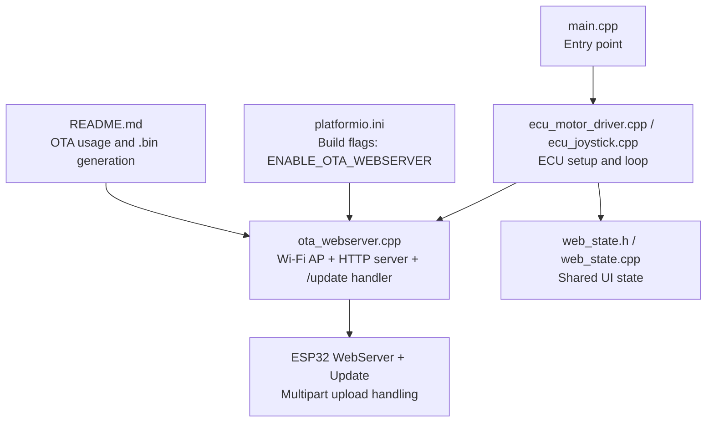
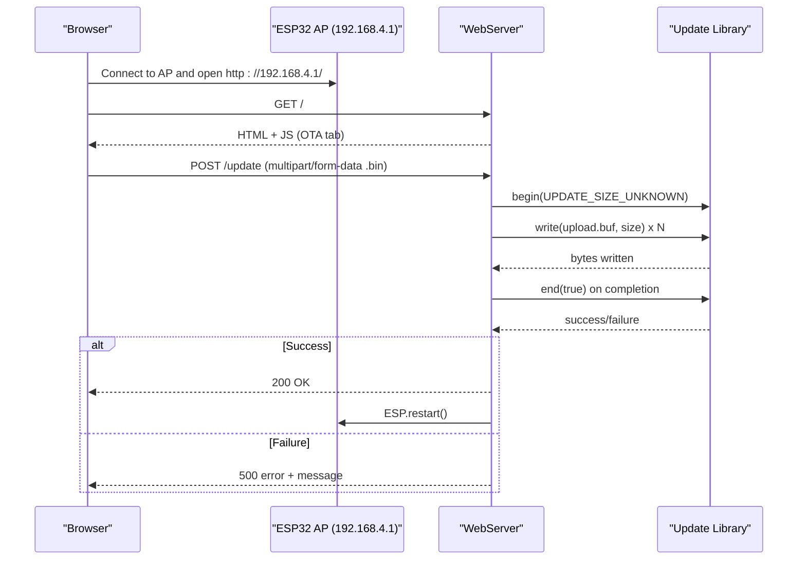
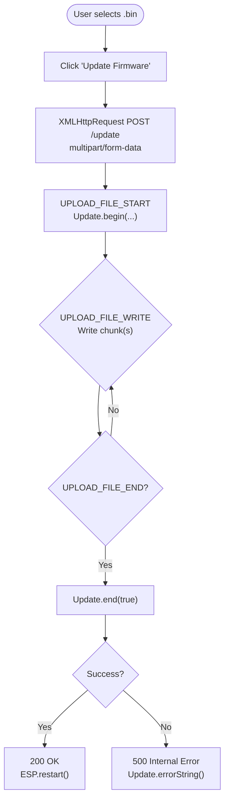
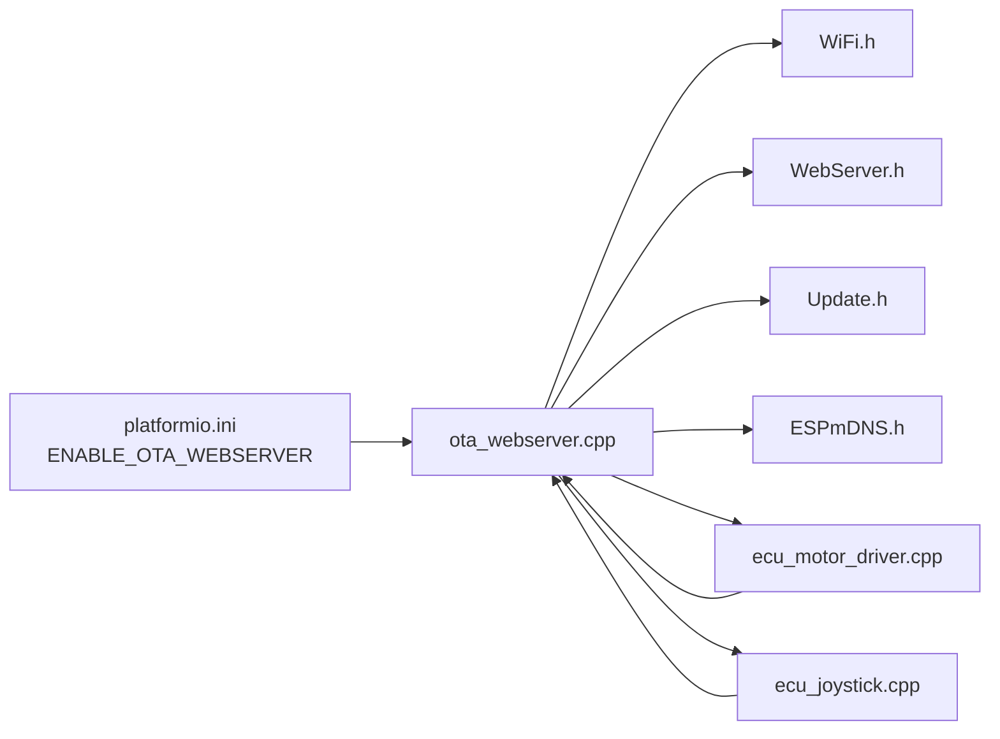

# OTA Firmware Updates

<cite>
**Referenced Files in This Document**
- [README.md](file://README.md)
- [platformio.ini](file://platformio.ini)
- [main.cpp](file://src/main.cpp)
- [ota_webserver.h](file://src/ota_webserver.h)
- [ota_webserver.cpp](file://src/ota_webserver.cpp)
- [ecu_motor_driver.cpp](file://src/ecu_motor_driver.cpp)
- [ecu_joystick.cpp](file://src/ecu_joystick.cpp)
- [web_state.h](file://src/web_state.h)
- [web_state.cpp](file://src/web_state.cpp)
</cite>

## Table of Contents
1. [Introduction](#introduction)
2. [Project Structure](#project-structure)
3. [Core Components](#core-components)
4. [Architecture Overview](#architecture-overview)
5. [Detailed Component Analysis](#detailed-component-analysis)
6. [Dependency Analysis](#dependency-analysis)
7. [Performance Considerations](#performance-considerations)
8. [Troubleshooting Guide](#troubleshooting-guide)
9. [Conclusion](#conclusion)
10. [Appendices](#appendices)

## Introduction
This document explains the Over-The-Air (OTA) firmware update system for the Forwarder CAN Controller. It focuses on the web-based update interface, secure deployment, and the complete update workflow from file selection to device restart. It covers multipart file upload handling, progress tracking, update validation, integration with the Update library, memory allocation for firmware storage, and safety considerations such as rollback protection and error handling for interrupted transfers. Practical examples and best practices for field deployments are included, along with the initial setup via Wi-Fi access point mode and mDNS hostname resolution for device discovery.

## Project Structure
The OTA functionality is implemented as an optional web server module that is conditionally compiled into builds. The system integrates with the main application via build flags and runtime initialization.

**Diagram sources**
- [main.cpp:19-31](file://src/main.cpp#L19-L31)
- [ecu_motor_driver.cpp:320-324](file://src/ecu_motor_driver.cpp#L320-L324)
- [ecu_joystick.cpp:187-191](file://src/ecu_joystick.cpp#L187-L191)
- [ota_webserver.cpp:766-791](file://src/ota_webserver.cpp#L766-L791)
- [platformio.ini:63-79](file://platformio.ini#L63-L79)
- [README.md:84-103](file://README.md#L84-L103)

**Section sources**
- [platformio.ini:63-79](file://platformio.ini#L63-L79)
- [README.md:84-103](file://README.md#L84-L103)
- [main.cpp:19-31](file://src/main.cpp#L19-L31)

## Core Components
- OTA Web Server: Provides a Wi-Fi access point, HTTP server, and a web UI with a firmware upload form. Implements multipart file upload handling and progress reporting.
- Update Library Integration: Uses the ESP32 Update library to write uploaded firmware to flash and trigger a restart upon success.
- Memory Allocation: Firmware is streamed directly to the Update library without buffering the entire image in RAM.
- Device Discovery: Creates a Wi-Fi AP with a hostname-derived SSID and registers an mDNS service for easy discovery.
- UI Progress Tracking: JavaScript updates a visual progress bar during upload and displays success/error messages.

Key responsibilities:
- Initialize Wi-Fi AP and HTTP server
- Serve the OTA page and API endpoints
- Handle multipart upload lifecycle events
- Validate and commit firmware updates
- Restart device after successful update
- Provide status and error feedback

**Section sources**
- [ota_webserver.cpp:705-733](file://src/ota_webserver.cpp#L705-L733)
- [ota_webserver.cpp:766-791](file://src/ota_webserver.cpp#L766-L791)
- [ota_webserver.cpp:473-492](file://src/ota_webserver.cpp#L473-L492)
- [README.md:84-103](file://README.md#L84-L103)

## Architecture Overview
The OTA system runs only when the ENABLE_OTA_WEBSERVER build flag is defined. It creates a local Wi-Fi AP, starts an HTTP server, and exposes a single endpoint for firmware uploads. The update flow is handled by the Update library, which writes the firmware image to flash and triggers a restart.

**Diagram sources**
- [ota_webserver.cpp:705-733](file://src/ota_webserver.cpp#L705-L733)
- [ota_webserver.cpp:788](file://src/ota_webserver.cpp#L788)
- [README.md:93-98](file://README.md#L93-L98)

## Detailed Component Analysis

### OTA Web Server Initialization and Device Discovery
- Wi-Fi Access Point Mode: The system sets up an AP with a hostname-derived SSID and a default password. The AP IP is 192.168.4.1.
- mDNS Registration: An HTTP service is registered so the device can be reached via hostname.local.
- HTTP Server Routing: Routes include the root page, API endpoints, and the /update endpoint for firmware uploads.

Operational behavior:
- On successful AP start, logs the AP SSID and IP.
- Registers mDNS service for HTTP on port 80.
- Starts the HTTP server and listens for requests.

**Section sources**
- [ota_webserver.cpp:766-791](file://src/ota_webserver.cpp#L766-L791)
- [README.md:93-98](file://README.md#L93-L98)

### Firmware Upload Workflow (Web UI to Update Library)
- HTML Form: The OTA panel includes a file input restricted to .bin files and a progress bar.
- JavaScript Upload: Uses XMLHttpRequest to send a multipart/form-data POST to /update. Progress events update the visual indicator.
- Server Handler: Implements the multipart upload lifecycle:
  - UPLOAD_FILE_START: Initializes the Update session.
  - UPLOAD_FILE_WRITE: Writes chunks to flash.
  - UPLOAD_FILE_END: Commits the update and restarts the device.
  - UPLOAD_FILE_ABORTED: Cancels the update and resets state.
- Status Feedback: Returns 200 on success and 500 with an error message on failure.

**Diagram sources**
- [ota_webserver.cpp:473-492](file://src/ota_webserver.cpp#L473-L492)
- [ota_webserver.cpp:705-733](file://src/ota_webserver.cpp#L705-L733)

**Section sources**
- [ota_webserver.cpp:253-257](file://src/ota_webserver.cpp#L253-L257)
- [ota_webserver.cpp:473-492](file://src/ota_webserver.cpp#L473-L492)
- [ota_webserver.cpp:705-733](file://src/ota_webserver.cpp#L705-L733)

### Update Library Integration and Memory Allocation
- Update.begin(UPDATE_SIZE_UNKNOWN): Prepares the Update library to receive firmware. The size is unknown for OTA uploads.
- Streaming Writes: Each UPLOAD_FILE_WRITE event writes the received buffer to flash. The number of bytes written is validated against the expected size.
- Commit and Restart: On UPLOAD_FILE_END, Update.end(true) writes the finalization and triggers a restart. On failure, the error string is returned to the client.
- Memory Considerations: Firmware is streamed directly to flash; there is no in-RAM buffer for the entire image.

Safety and validation:
- The Update library performs basic checks during commit. The system surfaces errors to the client for visibility.
- Interrupted transfers are handled by UPLOAD_FILE_ABORTED, which cancels the session and clears state.

**Section sources**
- [ota_webserver.cpp:705-733](file://src/ota_webserver.cpp#L705-L733)

### Device Discovery and Initial Setup
- Access Point Credentials: Connect to the AP using the SSID derived from the hostname and the default password.
- Device Access: Open http://192.168.4.1 or http://<hostname>.local in a browser.
- Hostname Resolution: mDNS resolves the hostname to the AP IP, simplifying discovery.

**Section sources**
- [README.md:93-98](file://README.md#L93-L98)
- [ota_webserver.cpp:766-791](file://src/ota_webserver.cpp#L766-L791)

### UI State and Shared Data
- Shared State Exposed to Web UI: The web server reads shared state (joystick data, solenoid values, module info) to populate the dashboard and OTA page.
- Conditional Compilation: The web state provides default definitions when building without the corresponding ECU type, ensuring compilation compatibility.

**Section sources**
- [web_state.h:10-23](file://src/web_state.h#L10-L23)
- [web_state.cpp:6-19](file://src/web_state.cpp#L6-L19)

## Dependency Analysis
The OTA module depends on ESP-IDF components and is integrated into the ECU-specific setup and loop routines.

**Diagram sources**
- [platformio.ini:63-79](file://platformio.ini#L63-L79)
- [ota_webserver.cpp:5-11](file://src/ota_webserver.cpp#L5-L11)
- [ecu_motor_driver.cpp:320-324](file://src/ecu_motor_driver.cpp#L320-L324)
- [ecu_joystick.cpp:187-191](file://src/ecu_joystick.cpp#L187-L191)

**Section sources**
- [platformio.ini:63-79](file://platformio.ini#L63-L79)
- [ota_webserver.cpp:5-11](file://src/ota_webserver.cpp#L5-L11)

## Performance Considerations
- Streaming Upload: Firmware is written in chunks, minimizing RAM usage and enabling reliable updates over potentially unstable networks.
- Progress Reporting: The UI updates the progress bar incrementally, reflecting the fraction of bytes transferred.
- Restart Timing: After a successful commit, the server delays briefly before restarting to allow the response to complete.

[No sources needed since this section provides general guidance]

## Troubleshooting Guide
Common issues and resolutions:
- Upload fails immediately:
  - Verify the selected file is a .bin generated by the build system.
  - Confirm the device is connected to the correct AP and reachable at 192.168.4.1 or <hostname>.local.
  - Check browser console/network tab for upload errors.
- Upload progress stalls:
  - Network instability can cause partial writes. Retry the upload.
  - Ensure the device remains powered and connected during the transfer.
- Update completes but device does not restart:
  - The server triggers a restart after a short delay. Wait for the device to reboot.
  - If the device does not come back online, power-cycle it manually.
- Error message on completion:
  - The server returns Update.errorString() on failure. Review the message and retry with a valid .bin file.
- Interrupted transfer:
  - If the connection drops mid-upload, the UPLOAD_FILE_ABORTED handler cancels the session. Start a new upload.

Practical steps:
- Generate a .bin using the appropriate environment and upload it via the OTA UI.
- Monitor the progress bar and status messages.
- After success, allow the device to restart automatically.

**Section sources**
- [README.md:99-103](file://README.md#L99-L103)
- [ota_webserver.cpp:705-733](file://src/ota_webserver.cpp#L705-L733)

## Conclusion
The OTA firmware update system provides a straightforward, web-based mechanism for deploying firmware updates to Forwarder ECU devices. It leverages the ESP32 Update library for secure, streaming writes, integrates with mDNS for easy discovery, and offers clear progress feedback. By following the documented workflow and best practices, field deployments can be performed reliably with minimal risk.

[No sources needed since this section summarizes without analyzing specific files]

## Appendices

### Build Flags and Environments
- OTA-enabled environments are defined in platformio.ini with ENABLE_OTA_WEBSERVER.
- Typical OTA environments: motor_driver_ota, joystick1_ota, joystick2_ota.

**Section sources**
- [platformio.ini:63-79](file://platformio.ini#L63-L79)

### Complete Update Process Example
- Build a .bin for the target ECU type.
- Flash the OTA environment to the device.
- Connect to the AP and open the OTA page.
- Select the .bin file and click “Update Firmware”.
- Observe the progress bar until completion.
- On success, the device restarts automatically; reconnect to verify operation.

**Section sources**
- [README.md:84-103](file://README.md#L84-L103)
- [ota_webserver.cpp:473-492](file://src/ota_webserver.cpp#L473-L492)