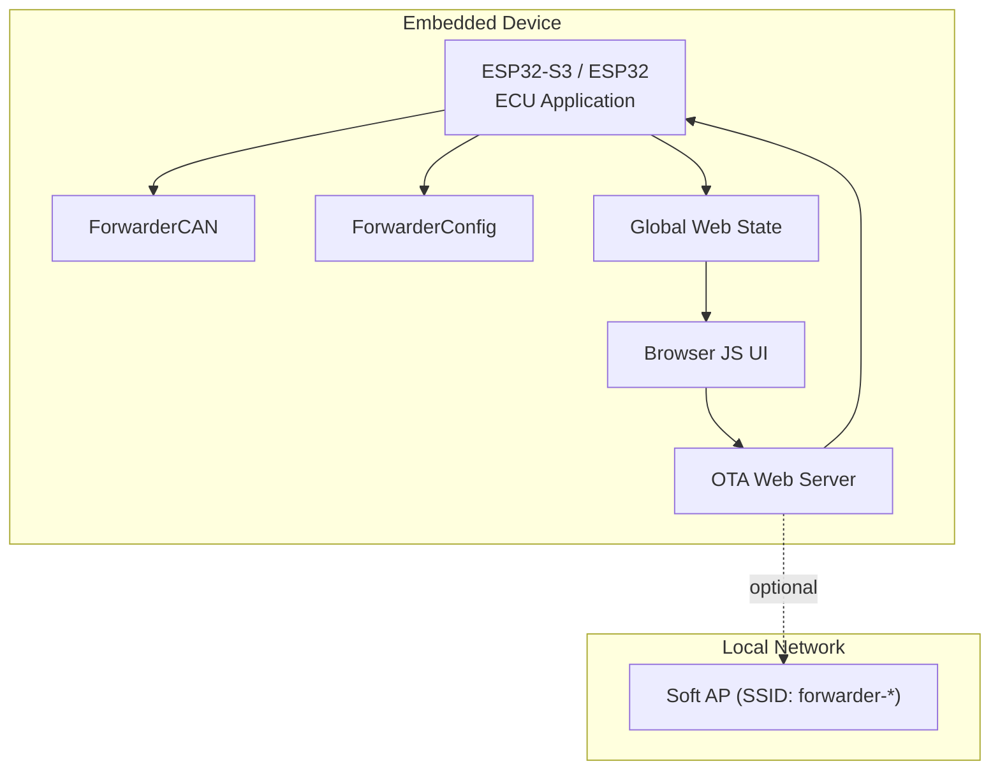
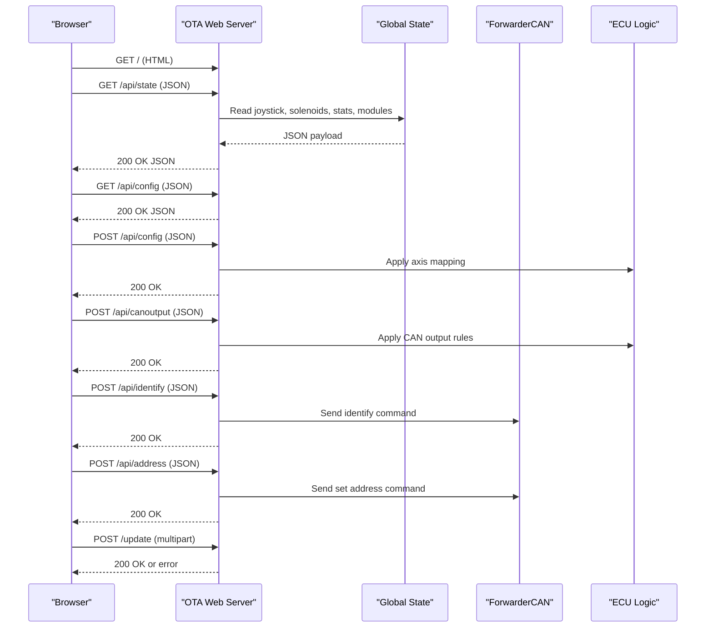
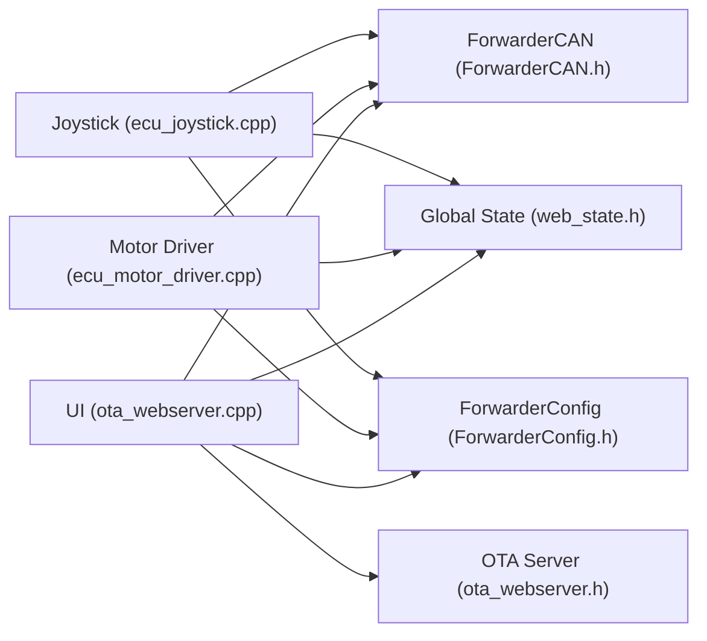

# Web Interface

<cite>
**Referenced Files in This Document**
- [main.cpp](file://src/main.cpp)
- [ota_webserver.cpp](file://src/ota_webserver.cpp)
- [ota_webserver.h](file://src/ota_webserver.h)
- [web_state.cpp](file://src/web_state.cpp)
- [web_state.h](file://src/web_state.h)
- [ecu_motor_driver.cpp](file://src/ecu_motor_driver.cpp)
- [ecu_motor_driver.h](file://src/ecu_motor_driver.h)
- [ecu_joystick.cpp](file://src/ecu_joystick.cpp)
- [ecu_joystick.h](file://src/ecu_joystick.h)
- [ForwarderCAN.h](file://lib/ForwarderCAN/ForwarderCAN.h)
- [ForwarderConfig.h](file://lib/ForwarderConfig/ForwarderConfig.h)
- [can_output.cpp](file://src/can_output.cpp)
- [can_output.h](file://src/can_output.h)
- [platformio.ini](file://platformio.ini)
</cite>

## Table of Contents
1. [Introduction](#introduction)
2. [Project Structure](#project-structure)
3. [Core Components](#core-components)
4. [Architecture Overview](#architecture-overview)
5. [Detailed Component Analysis](#detailed-component-analysis)
6. [Dependency Analysis](#dependency-analysis)
7. [Performance Considerations](#performance-considerations)
8. [Troubleshooting Guide](#troubleshooting-guide)
9. [Conclusion](#conclusion)
10. [Appendices](#appendices)

## Introduction
This document describes the web interface for ForwarderKE, focusing on the real-time monitoring dashboard and configuration management system. It explains the HTTP server implementation, REST API endpoints for device control and monitoring, and the WebSocket-like real-time state updates. It also documents the dashboard interface showing CAN bus statistics, ECU status, joystick positions, and solenoid states; configuration management features including device address assignment, axis mapping adjustments, and operational parameter tuning; the OTA firmware update interface; WiFi access point functionality; and remote device management capabilities. Finally, it covers the global state management system, cross-ECU data sharing mechanisms, real-time data synchronization, security considerations, access control, and practical usage examples.

## Project Structure
The web interface is implemented as part of the ECU applications and is conditionally compiled when the OTA web server is enabled. The system consists of:
- An embedded HTTP server that serves a single-page HTML application and exposes REST endpoints.
- Real-time state aggregation from ECU-specific logic and shared global state.
- Cross-ECU communication via a J1939-like protocol over CAN.
- Persistent configuration storage for axis mapping and CAN output rules.

**Diagram sources**
- [ota_webserver.cpp:766-796](file://src/ota_webserver.cpp#L766-L796)
- [ecu_motor_driver.cpp:290-323](file://src/ecu_motor_driver.cpp#L290-L323)
- [ecu_joystick.cpp:159-191](file://src/ecu_joystick.cpp#L159-L191)
- [ForwarderCAN.h:66-119](file://lib/ForwarderCAN/ForwarderCAN.h#L66-L119)
- [ForwarderConfig.h:64-91](file://lib/ForwarderConfig/ForwarderConfig.h#L64-L91)
- [web_state.h:8-23](file://src/web_state.h#L8-L23)

**Section sources**
- [platformio.ini:17-80](file://platformio.ini#L17-L80)
- [main.cpp:11-31](file://src/main.cpp#L11-L31)

## Core Components
- HTTP server and routes: Serves the dashboard HTML and exposes REST endpoints for state, configuration, CAN output rules, device identification, address assignment, and OTA firmware update.
- Global state exposure: Exposes joystick data, solenoid outputs, CAN statistics, and discovered modules to the UI.
- ECU-specific logic:
  - Motor driver ECU: Reads joystick inputs, maps axes to solenoid outputs via PCA9685, manages LEDs, and handles CAN messages.
  - Joystick ECU: Reads analog pots and buttons, broadcasts joystick data, manages LEDs, and handles CAN messages.
- CAN output rules: React to incoming CAN messages by toggling or pulsing GPIO pins.
- OTA access point: Creates a WiFi network for local device management and firmware updates.

**Section sources**
- [ota_webserver.cpp:506-796](file://src/ota_webserver.cpp#L506-L796)
- [web_state.h:8-23](file://src/web_state.h#L8-L23)
- [ecu_motor_driver.cpp:137-151](file://src/ecu_motor_driver.cpp#L137-L151)
- [ecu_joystick.cpp:194-236](file://src/ecu_joystick.cpp#L194-L236)
- [can_output.cpp:7-66](file://src/can_output.cpp#L7-L66)

## Architecture Overview
The web interface architecture integrates the ECU applications with a lightweight HTTP server and a browser-based UI. The UI polls the /api/state endpoint every 200 ms and renders real-time dashboards. It also interacts with configuration endpoints to adjust axis mapping and CAN output rules, and supports OTA firmware updates.

**Diagram sources**
- [ota_webserver.cpp:506-796](file://src/ota_webserver.cpp#L506-L796)
- [web_state.h:8-23](file://src/web_state.h#L8-L23)
- [ForwarderCAN.h:66-119](file://lib/ForwarderCAN/ForwarderCAN.h#L66-L119)
- [ecu_motor_driver.cpp:290-323](file://src/ecu_motor_driver.cpp#L290-L323)
- [ecu_joystick.cpp:159-191](file://src/ecu_joystick.cpp#L159-L191)

## Detailed Component Analysis

### HTTP Server and Routes
The server runs on port 80 and exposes:
- GET /: Returns the dashboard HTML page.
- GET /api/state: Returns a JSON object containing local address, online status, uptime, TX/RX/error counts, joystick data, solenoid values, and module discovery info.
- GET /api/config: Returns current axis mapping configuration.
- POST /api/config: Applies axis mapping configuration and broadcasts updates to motor driver ECUs.
- POST /api/identify: Sends an identify command to a target device.
- POST /api/address: Requests a device to change its address.
- GET /api/canoutput: Returns CAN-triggered GPIO output rules.
- POST /api/canoutput: Applies CAN output rules and reinitializes GPIO outputs.
- POST /update: Handles OTA firmware update via multipart upload.

Real-time updates are achieved by the browser polling /api/state every 200 ms and rendering dashboards for joysticks, solenoids, and CAN bus statistics.

**Section sources**
- [ota_webserver.cpp:506-796](file://src/ota_webserver.cpp#L506-L796)

### Dashboard Interface
The dashboard presents:
- Joystick panels for up to two devices (addresses 0x21 and 0x22) with three potentiometer bars and button indicators.
- Solenoid outputs grid showing 8 or 16 channels depending on PCA expansion.
- CAN bus statistics: TX count, RX count, error count, and uptime.
- Module discovery table with address, type, uptime, last seen, and actions to identify and set addresses.

The UI renders these views by fetching /api/state and periodically refreshing.

**Section sources**
- [ota_webserver.cpp:32-501](file://src/ota_webserver.cpp#L32-L501)
- [ota_webserver.cpp:510-563](file://src/ota_webserver.cpp#L510-L563)

### Configuration Management
Axis mapping:
- The UI displays 16 axis slots with enable flag, source joystick address, pot index, output channel, deadband min/max, PWM min/max, and bidirectional flag.
- Saving writes the configuration to NVS on the motor driver ECU and broadcasts CAN messages to propagate settings to other motor driver ECUs.

CAN output rules:
- The UI allows configuring up to four rules to react to incoming CAN frames by toggling or momentary GPIO pulses.
- Saving persists rules to NVS and reinitializes GPIO outputs.

Device address assignment:
- The UI lists discovered modules and allows changing their address. The motor driver ECU saves the new address and reboots.

Remote device management:
- Identify command triggers LED blinking on target devices.

**Section sources**
- [ota_webserver.cpp:565-703](file://src/ota_webserver.cpp#L565-L703)
- [ForwarderConfig.h:41-62](file://lib/ForwarderConfig/ForwarderConfig.h#L41-L62)
- [can_output.cpp:7-66](file://src/can_output.cpp#L7-L66)

### OTA Firmware Update Interface
The server supports firmware updates via a multipart form post to /update. The update progress is visible in the UI, and on success, the device restarts automatically.

Security note: The access point is open (no password) to simplify setup. Consider securing the access point and adding authentication for production deployments.

**Section sources**
- [ota_webserver.cpp:705-737](file://src/ota_webserver.cpp#L705-L737)
- [ota_webserver.cpp:766-791](file://src/ota_webserver.cpp#L766-L791)

### WiFi Access Point Functionality
When enabled, the device starts a Soft AP with SSID prefix "forwarder-*" and a fixed password. mDNS service "http" is advertised on port 80. The device prints the AP IP to serial for connection.

**Section sources**
- [ota_webserver.cpp:766-791](file://src/ota_webserver.cpp#L766-L791)

### Global State Management and Real-Time Data Synchronization
Global state is exposed via shared variables:
- Joystick pots and timestamps for up to 256 source addresses.
- Solenoid values per axis.
- Motor configuration and CAN output rules.
- Module discovery tracking with last-seen timestamps.

ECU logic updates state:
- Motor driver ECU reads joystick data, maps axes to solenoids, and updates state arrays.
- Joystick ECU reads local pots/buttons and updates local state.

Heartbeat scanning populates module discovery data from incoming heartbeat frames.

**Section sources**
- [web_state.h:8-23](file://src/web_state.h#L8-L23)
- [web_state.cpp:6-19](file://src/web_state.cpp#L6-L19)
- [ecu_motor_driver.cpp:59-61](file://src/ecu_motor_driver.cpp#L59-L61)
- [ecu_motor_driver.cpp:184-275](file://src/ecu_motor_driver.cpp#L184-L275)
- [ecu_joystick.cpp:43-45](file://src/ecu_joystick.cpp#L43-L45)
- [ota_webserver.cpp:742-761](file://src/ota_webserver.cpp#L742-L761)

### Cross-ECU Data Sharing Mechanisms
- Joystick data: Motor driver ECU receives joystick potentiometer frames and updates solenoid outputs accordingly.
- Axis configuration: Motor driver ECU can receive axis configuration frames and save them to NVS.
- Heartbeats: Devices broadcast periodic heartbeat frames; the server tracks uptime and type heuristics.
- LED control: Broadcast LED color commands update device LEDs.
- Identify: Broadcast identify commands trigger LED blinking sequences.

**Section sources**
- [ecu_motor_driver.cpp:184-275](file://src/ecu_motor_driver.cpp#L184-L275)
- [ecu_joystick.cpp:114-144](file://src/ecu_joystick.cpp#L114-L144)
- [ota_webserver.cpp:742-761](file://src/ota_webserver.cpp#L742-L761)
- [ForwarderCAN.h:38-57](file://lib/ForwarderCAN/ForwarderCAN.h#L38-L57)

### REST API Reference

- GET /
  - Description: Serve the dashboard HTML page.
  - Response: 200 OK with HTML content.

- GET /api/state
  - Description: Retrieve real-time state including local address, online status, uptime, CAN counters, joystick data, solenoid values, and module discovery.
  - Response: 200 OK with JSON object.

- GET /api/config
  - Description: Retrieve current axis mapping configuration.
  - Response: 200 OK with JSON object.

- POST /api/config
  - Description: Apply axis mapping configuration. Motor driver saves to NVS; joystick broadcasts to motor driver.
  - Request: JSON array of axis configurations.
  - Response: 200 OK with JSON object.

- POST /api/identify
  - Description: Send identify command to a target device.
  - Request: JSON with target address.
  - Response: 200 OK with JSON object.

- POST /api/address
  - Description: Request a device to change its address.
  - Request: JSON with target and new address.
  - Response: 200 OK with JSON object.

- GET /api/canoutput
  - Description: Retrieve CAN-triggered GPIO output rules.
  - Response: 200 OK with JSON object.

- POST /api/canoutput
  - Description: Apply CAN output rules and reinitialize GPIO outputs.
  - Request: JSON array of rules.
  - Response: 200 OK with JSON object.

- POST /update
  - Description: Upload firmware binary for OTA update.
  - Request: multipart/form-data with firmware file.
  - Response: 200 OK on success, error on failure.

**Section sources**
- [ota_webserver.cpp:506-796](file://src/ota_webserver.cpp#L506-L796)

### Practical Usage Examples

- Accessing the dashboard:
  - Connect to the device's Soft AP ("forwarder-*"), open http://192.168.4.1 in a browser, and navigate to the Dashboard tab.

- Monitoring joysticks and solenoids:
  - Observe real-time joystick pot bars and button indicators under the Joystick panels.
  - View solenoid output levels in the Solenoid Outputs card.

- Adjusting axis mapping:
  - Go to the Motor Mapping tab, modify axis parameters, and click Save to Motor Driver.

- Configuring CAN output rules:
  - Open the CAN Output tab, configure rules, and click Save.

- Changing device address:
  - In the Modules tab, select a device, enter a new address, and click Set Address.

- Performing OTA update:
  - Navigate to the OTA Update tab, select a .bin file, and click Update Firmware.

- Testing endpoints:
  - Use curl to test endpoints:
    - curl http://192.168.4.1/api/state
    - curl -X POST http://192.168.4.1/api/identify -H "Content-Type: application/json" -d '{"target":33}'
    - curl -X POST http://192.168.4.1/api/address -H "Content-Type: application/json" -d '{"target":33,"address":34}'
    - curl -X POST http://192.168.4.1/api/config -H "Content-Type: application/json" -d '{"axes":[{"axisIdx":0,"sourceAddress":33,"potIndex":0,"outputChannel":0,"deadbandMin":492,"deadbandMax":532,"pwmMin":64,"pwmMax":128,"flags":1}]}'
    - curl -X POST http://192.168.4.1/api/canoutput -H "Content-Type: application/json" -d '{"rules":[{"ruleIdx":0,"enabled":true,"matchPF":16,"matchSA":33,"gpioPin":2,"mode":0,"momentaryMs":500}]}'

**Section sources**
- [ota_webserver.cpp:506-796](file://src/ota_webserver.cpp#L506-L796)

## Dependency Analysis
The web interface depends on:
- ForwarderCAN for CAN messaging and statistics.
- ForwarderConfig for persistent storage of axis mapping and CAN output rules.
- ECU-specific modules for updating global state and responding to commands.
- Optional OTA web server for serving the UI and handling updates.

**Diagram sources**
- [ota_webserver.cpp:506-796](file://src/ota_webserver.cpp#L506-L796)
- [ForwarderCAN.h:66-119](file://lib/ForwarderCAN/ForwarderCAN.h#L66-L119)
- [ForwarderConfig.h:64-91](file://lib/ForwarderConfig/ForwarderConfig.h#L64-L91)
- [web_state.h:8-23](file://src/web_state.h#L8-L23)
- [ecu_motor_driver.cpp:290-323](file://src/ecu_motor_driver.cpp#L290-L323)
- [ecu_joystick.cpp:159-191](file://src/ecu_joystick.cpp#L159-L191)

**Section sources**
- [ota_webserver.cpp:506-796](file://src/ota_webserver.cpp#L506-L796)
- [ForwarderCAN.h:66-119](file://lib/ForwarderCAN/ForwarderCAN.h#L66-L119)
- [ForwarderConfig.h:64-91](file://lib/ForwarderConfig/ForwarderConfig.h#L64-L91)
- [web_state.h:8-23](file://src/web_state.h#L8-L23)
- [ecu_motor_driver.cpp:290-323](file://src/ecu_motor_driver.cpp#L290-L323)
- [ecu_joystick.cpp:159-191](file://src/ecu_joystick.cpp#L159-L191)

## Performance Considerations
- Polling interval: The UI polls /api/state every 200 ms. This balances responsiveness with network overhead.
- CAN throughput: The server reads CAN messages during each loop iteration and scans for heartbeats to keep module discovery fresh.
- Memory usage: JSON payloads are constructed dynamically; avoid excessive allocations by keeping payloads concise.
- OTA updates: Large firmware images can take time; ensure stable power and network conditions during updates.

[No sources needed since this section provides general guidance]

## Troubleshooting Guide
- Cannot connect to Soft AP:
  - Verify the device started the access point and check the serial console for AP IP and SSID.
  - Confirm the password matches the documented value.

- Dashboard shows offline:
  - Ensure CAN transceiver is powered and wired correctly.
  - Check that another device is broadcasting heartbeats on the bus.

- Axis mapping not applied:
  - Confirm the motor driver ECU is reachable and that the joystick ECU is sending axis configuration frames.
  - Verify NVS storage on the motor driver ECU.

- OTA update fails:
  - Ensure the selected file is a valid .bin image.
  - Retry after confirming stable power and network conditions.

- Address change not taking effect:
  - The target device must support address setting and be within broadcast range.
  - Confirm the new address is within the allowed range.

**Section sources**
- [ota_webserver.cpp:766-791](file://src/ota_webserver.cpp#L766-L791)
- [ecu_motor_driver.cpp:234-244](file://src/ecu_motor_driver.cpp#L234-L244)
- [ecu_joystick.cpp:132-142](file://src/ecu_joystick.cpp#L132-L142)

## Conclusion
The ForwarderKE web interface provides a comprehensive, real-time dashboard and configuration management system for motor driver and joystick ECUs. It leverages a lightweight HTTP server, persistent configuration storage, and a J1939-like CAN protocol to deliver responsive monitoring and control. While the access point is intentionally open for simplicity, production deployments should consider additional security measures. The modular design enables easy extension of features such as additional CAN output rules, advanced diagnostics, and enhanced access control.

[No sources needed since this section summarizes without analyzing specific files]

## Appendices

### Security Considerations
- Access control: The Soft AP is open by default. Consider implementing WPA2 or adding a captive portal with credentials.
- Transport security: The server does not enforce HTTPS. Use the access point only on trusted networks.
- Authentication: Add basic authentication or token-based access for sensitive endpoints.
- Network isolation: Keep the device on a separate VLAN or network segment.

[No sources needed since this section provides general guidance]

### Network Connectivity Requirements
- Hardware: ESP32-S3 or compatible board with CAN transceiver.
- Software: Arduino framework with ESP-IDF CAN stack.
- Wiring: Proper CAN termination and signal integrity.
- Environment: Stable power supply and minimal electromagnetic interference.

[No sources needed since this section provides general guidance]