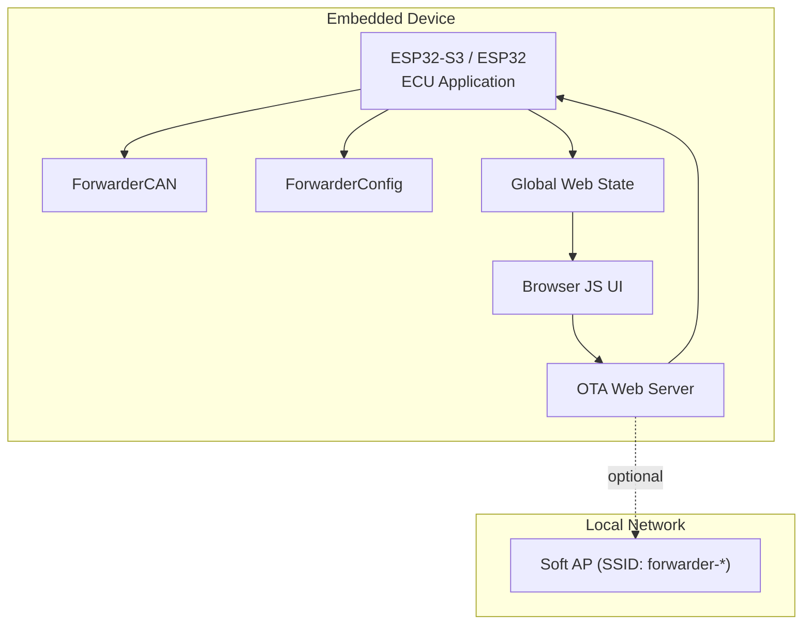
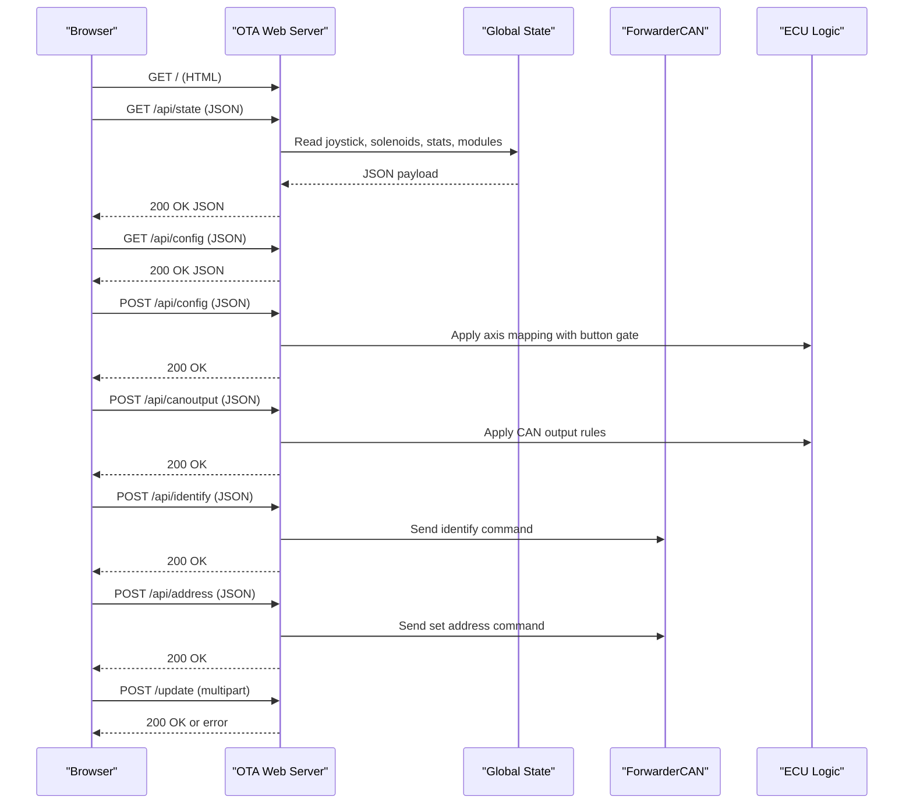
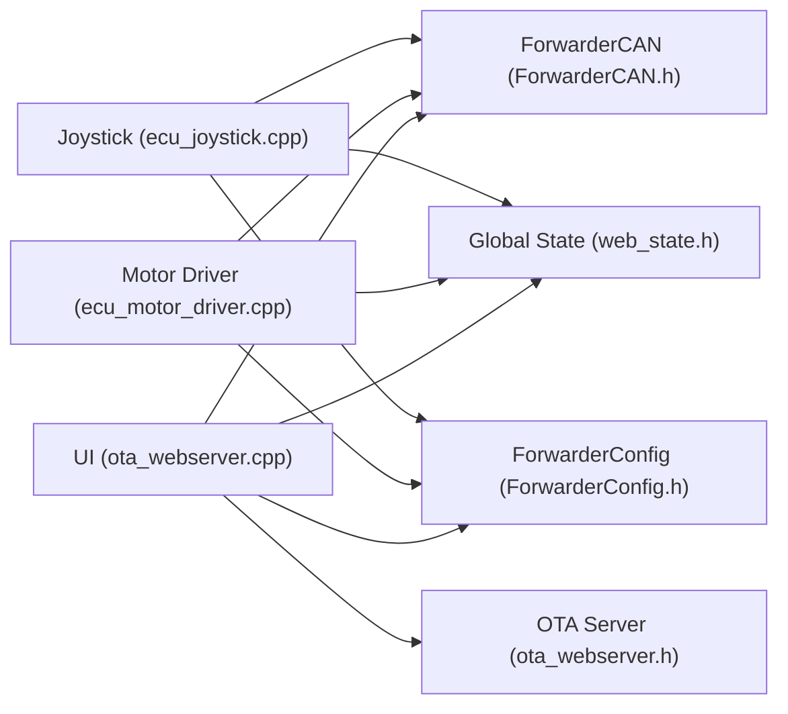

# Web Interface

<cite>
**Referenced Files in This Document**
- [main.cpp](file://src/main.cpp)
- [ota_webserver.cpp](file://src/ota_webserver.cpp)
- [ota_webserver.h](file://src/ota_webserver.h)
- [web_state.cpp](file://src/web_state.cpp)
- [web_state.h](file://src/web_state.h)
- [ecu_motor_driver.cpp](file://src/ecu_motor_driver.cpp)
- [ecu_motor_driver.h](file://src/ecu_motor_driver.h)
- [ecu_joystick.cpp](file://src/ecu_joystick.cpp)
- [ecu_joystick.h](file://src/ecu_joystick.h)
- [ForwarderCAN.h](file://lib/ForwarderCAN/ForwarderCAN.h)
- [ForwarderConfig.h](file://lib/ForwarderConfig/ForwarderConfig.h)
- [ForwarderConfig.cpp](file://lib/ForwarderConfig/ForwarderConfig.cpp)
- [can_output.cpp](file://src/can_output.cpp)
- [can_output.h](file://src/can_output.h)
- [platformio.ini](file://platformio.ini)
</cite>

## Update Summary
**Changes Made**
- Enhanced deadband tuning capabilities with live joystick state display and automatic unmapped pot detection
- Added real-time channel conflict warnings in motor mapping configuration
- Improved output numbering scheme conversion between PCA9685 channels and labeled hardware outputs
- Updated CSS styling for enhanced visual indicators including deadband zones and pointer indicators
- Enhanced dashboard layout for improved mobile compatibility and real-time state visualization

## Table of Contents
1. [Introduction](#introduction)
2. [Project Structure](#project-structure)
3. [Core Components](#core-components)
4. [Architecture Overview](#architecture-overview)
5. [Detailed Component Analysis](#detailed-component-analysis)
6. [Dependency Analysis](#dependency-analysis)
7. [Performance Considerations](#performance-considerations)
8. [Troubleshooting Guide](#troubleshooting-guide)
9. [Conclusion](#conclusion)
10. [Appendices](#appendices)

## Introduction
This document describes the web interface for ForwarderKE, focusing on the real-time monitoring dashboard and configuration management system. It explains the HTTP server implementation, REST API endpoints for device control and monitoring, and the WebSocket-like real-time state updates. It also documents the dashboard interface showing CAN bus statistics, ECU status, joystick positions, and solenoid states; configuration management features including device address assignment, axis mapping adjustments, and operational parameter tuning; the OTA firmware update interface; WiFi access point functionality; and remote device management capabilities. Finally, it covers the global state management system, cross-ECU data sharing mechanisms, real-time data synchronization, security considerations, access control, and practical usage examples.

## Project Structure
The web interface is implemented as part of the ECU applications and is conditionally compiled when the OTA web server is enabled. The system consists of:
- An embedded HTTP server that serves a single-page HTML application and exposes REST endpoints.
- Real-time state aggregation from ECU-specific logic and shared global state.
- Cross-ECU communication via a J1939-like protocol over CAN.
- Persistent configuration storage for axis mapping and CAN output rules.

**Diagram sources**
- [ota_webserver.cpp:1359-1387](file://src/ota_webserver.cpp#L1359-L1387)
- [ecu_motor_driver.cpp:465-533](file://src/ecu_motor_driver.cpp#L465-L533)
- [ecu_joystick.cpp:218-264](file://src/ecu_joystick.cpp#L218-L264)
- [ForwarderCAN.h:66-119](file://lib/ForwarderCAN/ForwarderCAN.h#L66-L119)
- [ForwarderConfig.h:64-91](file://lib/ForwarderConfig/ForwarderConfig.h#L64-L91)
- [web_state.h:8-26](file://src/web_state.h#L8-L26)

**Section sources**
- [platformio.ini:17-80](file://platformio.ini#L17-L80)
- [main.cpp:11-31](file://src/main.cpp#L11-L31)

## Core Components
- HTTP server and routes: Serves the dashboard HTML and exposes REST endpoints for state, configuration, CAN output rules, device identification, address assignment, and OTA firmware update.
- Global state exposure: Exposes joystick data, solenoid outputs, CAN statistics, and discovered modules to the UI.
- ECU-specific logic:
  - Motor driver ECU: Reads joystick inputs, maps axes to solenoid outputs via PCA9685, manages LEDs, and handles CAN messages including button gate evaluation.
  - Joystick ECU: Reads analog pots and buttons, broadcasts joystick data, manages LEDs, and handles CAN messages.
- CAN output rules: React to incoming CAN messages by toggling or pulsing GPIO pins.
- OTA access point: Creates a WiFi network for local device management and firmware updates.

**Section sources**
- [ota_webserver.cpp:979-1387](file://src/ota_webserver.cpp#L979-L1387)
- [web_state.h:8-26](file://src/web_state.h#L8-L26)
- [ecu_motor_driver.cpp:137-151](file://src/ecu_motor_driver.cpp#L137-L151)
- [ecu_joystick.cpp:194-236](file://src/ecu_joystick.cpp#L194-L236)
- [can_output.cpp:7-66](file://src/can_output.cpp#L7-L66)

## Architecture Overview
The web interface architecture integrates the ECU applications with a lightweight HTTP server and a browser-based UI. The UI polls the /api/state endpoint every 1000 ms and renders real-time dashboards. It also interacts with configuration endpoints to adjust axis mapping and CAN output rules, and supports OTA firmware updates.

**Diagram sources**
- [ota_webserver.cpp:979-1387](file://src/ota_webserver.cpp#L979-L1387)
- [web_state.h:8-26](file://src/web_state.h#L8-L26)
- [ForwarderCAN.h:66-119](file://lib/ForwarderCAN/ForwarderCAN.h#L66-L119)
- [ecu_motor_driver.cpp:290-323](file://src/ecu_motor_driver.cpp#L290-L323)
- [ecu_joystick.cpp:159-191](file://src/ecu_joystick.cpp#L159-L191)

## Detailed Component Analysis

### HTTP Server and Routes
The server runs on port 80 and exposes:
- GET /: Returns the dashboard HTML page.
- GET /api/state: Returns a JSON object containing local address, online status, uptime, TX/RX/error counts, joystick data, solenoid values, and module discovery info.
- GET /api/config: Returns current axis mapping configuration including button gate settings.
- POST /api/config: Applies axis mapping configuration with button gate support and broadcasts updates to motor driver ECUs.
- POST /api/identify: Sends an identify command to a target device.
- POST /api/address: Requests a device to change its address.
- GET /api/canoutput: Returns CAN-triggered GPIO output rules.
- POST /api/canoutput: Applies CAN output rules and reinitializes GPIO outputs.
- POST /update: Handles OTA firmware update via multipart upload.

Real-time updates are achieved by the browser polling /api/state every 1000 ms and rendering dashboards for joysticks, solenoids, and CAN bus statistics.

**Section sources**
- [ota_webserver.cpp:979-1387](file://src/ota_webserver.cpp#L979-L1387)

### Dashboard Interface
The dashboard presents:
- Joystick panels for up to two devices (addresses 0x21 and 0x22) with three potentiometer bars and button indicators showing real-time button states.
- Solenoid outputs grid showing 8 or 16 channels depending on PCA expansion.
- CAN bus statistics: TX count, RX count, error count, and uptime.
- Module discovery table with address, type, uptime, last seen, and actions to identify and set addresses.
- **Enhanced Deadband Tuning tab**: Interactive real-time deadband adjustment with visual indicators showing deadband zones and live joystick positions, including automatic unmapped pot detection and assignment.

The UI renders these views by fetching /api/state and periodically refreshing.

**Updated** Enhanced Deadband Tuning tab with interactive real-time deadband adjustment, automatic unmapped pot detection, and improved visual indicators.

**Section sources**
- [ota_webserver.cpp:35-974](file://src/ota_webserver.cpp#L35-L974)
- [ota_webserver.cpp:668-683](file://src/ota_webserver.cpp#L668-L683)

### Enhanced Deadband Tuning System
**Enhanced Feature**: The Deadband Tuning tab provides interactive real-time deadband adjustment for joystick potentiometers with automatic unmapped pot detection and assignment.

#### Visual Indicators
- **Deadband Zone**: Yellow dashed zone showing the current deadband range (deadbandMin to deadbandMax)
- **Position Pointer**: Green vertical indicator showing the current joystick position
- **Direction Indicator**: Color-coded status showing whether the joystick is in REV, FWD, or DEAD zone
- **Offset Indicator**: Percentage showing how far the deadband center is from neutral (0%)

#### Interactive Controls
- **Step Adjustment Buttons**: +/-1 and +/-10 increment buttons for precise deadband tuning
- **Live Preview**: Real-time visual feedback as adjustments are made
- **Automatic Unmapped Pot Detection**: Automatically detects connected joysticks and their potentiometer assignments
- **Unmapped Pot Support**: Allows tuning of joystick pots even when not currently mapped to axes
- **Conflict Warnings**: Visual indicators for channel conflicts and output assignments

#### Status Indicators
- **Online Status**: Green indicates live data, red indicates missing data
- **Direction Status**: Blue for reverse, green for forward, yellow for dead zone
- **Offset Warning**: Color-coded offset percentage (green for optimal, yellow for acceptable, red for problematic)
- **Stale Data Indicator**: Visual feedback for disconnected or stale joystick connections

#### Automatic Unmapped Pot Detection and Assignment
The system now automatically detects joystick pots that are not currently mapped to axes and allows users to assign them to unused axis slots. This feature includes:
- Scanning live joystick state for unmapped pots
- Finding unused axis slots (sourceAddress=0 or disabled)
- Automatic assignment with deadband inheritance from existing mappings
- Visual indication of unmapped pots in the deadband tuning interface

**Section sources**
- [ota_webserver.cpp:402-553](file://src/ota_webserver.cpp#L402-L553)
- [ota_webserver.cpp:565-703](file://src/ota_webserver.cpp#L565-L703)

### Enhanced Configuration Management
**Enhanced Feature**: Improved motor mapping configuration with real-time channel conflict warnings and output numbering scheme conversion.

#### Channel Conflict Detection
The system now provides real-time warnings for channel conflicts in the motor mapping configuration:
- **Duplicate Output Usage**: Detects when multiple active axes use the same output number
- **Visual Warnings**: Color-coded warning messages with detailed explanations
- **Preventive Measures**: Blocks saving when conflicts are detected until resolved

#### Output Numbering Scheme Conversion
The system provides seamless conversion between PCA9685 channels and labeled hardware outputs:
- **Output Numbers**: 1-8 as labeled on the development board
- **Channel Mapping**: Each output uses 2 PCA9685 channels (fwd+rev)
- **Automatic Conversion**: Converts between output numbers and PCA9685 channels
- **Bidirectional Support**: Properly handles paired channels for forward and reverse operation

#### Axis Configuration Enhancements
- The UI displays 16 axis slots with enable flag, source joystick address, pot index, output channel, deadband min/max, PWM min/max, bidirectional flag, inversion flag, and button gate settings.
- Button gate modes include: None (always active), BTN1 Pressed (active only when BTN1 is pressed), and BTN1 Released (active only when BTN1 is not pressed).
- Inversion flag swaps forward and reverse channels for proper directional control.
- Saving writes the configuration to NVS on the motor driver ECU and broadcasts CAN messages to propagate settings to other motor driver ECUs.

**Section sources**
- [ota_webserver.cpp:565-703](file://src/ota_webserver.cpp#L565-L703)
- [ForwarderConfig.h:41-62](file://lib/ForwarderConfig/ForwarderConfig.h#L41-L62)
- [ForwarderConfig.h:20-27](file://lib/ForwarderConfig/ForwarderConfig.h#L20-L27)
- [ForwarderConfig.cpp:104](file://lib/ForwarderConfig/ForwarderConfig.cpp#L104)
- [ForwarderConfig.cpp:188](file://lib/ForwarderConfig/ForwarderConfig.cpp#L188)
- [can_output.cpp:7-66](file://src/can_output.cpp#L7-L66)

### OTA Firmware Update Interface
The server supports firmware updates via a multipart form post to /update. The update progress is visible in the UI, and on success, the device restarts automatically.

Security note: The access point is open (no password) to simplify setup. Consider securing the access point and adding authentication for production deployments.

**Section sources**
- [ota_webserver.cpp:1285-1317](file://src/ota_webserver.cpp#L1285-L1317)
- [ota_webserver.cpp:1359-1387](file://src/ota_webserver.cpp#L1359-L1387)

### WiFi Access Point Functionality
When enabled, the device starts a Soft AP with SSID prefix "forwarder-*" and a fixed password. mDNS service "http" is advertised on port 80. The device prints the AP IP to serial for connection.

**Section sources**
- [ota_webserver.cpp:1359-1387](file://src/ota_webserver.cpp#L1359-L1387)

### Global State Management and Real-Time Data Synchronization
Global state is exposed via shared variables:
- Joystick pots and timestamps for up to 256 source addresses.
- Button states for up to 256 source addresses.
- Solenoid values per axis.
- Motor configuration and CAN output rules.
- Module discovery tracking with last-seen timestamps.

ECU logic updates state:
- Motor driver ECU reads joystick data, evaluates button gates, maps axes to solenoids, and updates state arrays.
- Joystick ECU reads local pots/buttons and updates local state.

Heartbeat scanning populates module discovery data from incoming heartbeat frames.

**Section sources**
- [web_state.h:8-26](file://src/web_state.h#L8-L26)
- [web_state.cpp:6-19](file://src/web_state.cpp#L6-L19)
- [ecu_motor_driver.cpp:59-61](file://src/ecu_motor_driver.cpp#L59-L61)
- [ecu_motor_driver.cpp:184-275](file://src/ecu_motor_driver.cpp#L184-L275)
- [ecu_joystick.cpp:43-45](file://src/ecu_joystick.cpp#L43-L45)
- [ota_webserver.cpp:1322-1341](file://src/ota_webserver.cpp#L1322-L1341)

### Cross-ECU Data Sharing Mechanisms
- Joystick data: Motor driver ECU receives joystick potentiometer and button frames and updates solenoid outputs accordingly.
- Axis configuration: Motor driver ECU can receive axis configuration frames including button gate settings and save them to NVS.
- Heartbeats: Devices broadcast periodic heartbeat frames; the server tracks uptime and type heuristics.
- LED control: Broadcast LED color commands update device LEDs.
- Identify: Broadcast identify commands trigger LED blinking sequences.

**Section sources**
- [ecu_motor_driver.cpp:184-275](file://src/ecu_motor_driver.cpp#L184-L275)
- [ecu_joystick.cpp:114-144](file://src/ecu_joystick.cpp#L114-L144)
- [ota_webserver.cpp:1322-1341](file://src/ota_webserver.cpp#L1322-L1341)
- [ForwarderCAN.h:38-57](file://lib/ForwarderCAN/ForwarderCAN.h#L38-L57)

### REST API Reference

- GET /
  - Description: Serve the dashboard HTML page.
  - Response: 200 OK with HTML content.

- GET /api/state
  - Description: Retrieve real-time state including local address, online status, uptime, CAN counters, joystick data with button states, solenoid values, and module discovery.
  - Response: 200 OK with JSON object.

- GET /api/config
  - Description: Retrieve current axis mapping configuration including button gate settings.
  - Response: 200 OK with JSON object.

- POST /api/config
  - Description: Apply axis mapping configuration with button gate support. Motor driver saves to NVS; joystick broadcasts to motor driver.
  - Request: JSON array of axis configurations with button gate settings.
  - Response: 200 OK with JSON object.

- POST /api/identify
  - Description: Send identify command to a target device.
  - Request: JSON with target address.
  - Response: 200 OK with JSON object.

- POST /api/address
  - Description: Request a device to change its address.
  - Request: JSON with target and new address.
  - Response: 200 OK with JSON object.

- GET /api/canoutput
  - Description: Retrieve CAN-triggered GPIO output rules.
  - Response: 200 OK with JSON object.

- POST /api/canoutput
  - Description: Apply CAN output rules and reinitialize GPIO outputs.
  - Request: JSON array of rules.
  - Response: 200 OK with JSON object.

- POST /update
  - Description: Upload firmware binary for OTA update.
  - Request: multipart/form-data with firmware file.
  - Response: 200 OK on success, error on failure.

**Section sources**
- [ota_webserver.cpp:979-1387](file://src/ota_webserver.cpp#L979-L1387)

### Practical Usage Examples

- Accessing the dashboard:
  - Connect to the device's Soft AP ("forwarder-*"), open http://192.168.4.1 in a browser, and navigate to the Dashboard tab.

- Monitoring joysticks and solenoids:
  - Observe real-time joystick pot bars and button indicators under the Joystick panels.
  - View solenoid output levels in the Solenoid Outputs card.

- Adjusting axis mapping with button gate:
  - Go to the Motor Mapping tab, modify axis parameters including button gate settings, and click Save to Motor Driver.

- **Using the Enhanced Deadband Tuning tab**:
  - Navigate to the Deadband tab to view all connected joystick pots.
  - Use +/-1 and +/-10 buttons to adjust deadbandMin and deadbandMax values.
  - Watch the visual indicators show real-time feedback on deadband zone and joystick position.
  - The system automatically detects unmapped pots and allows assignment to unused axis slots.
  - Click Save All to apply changes to the configuration.

- **Using the Enhanced Motor Mapping tab**:
  - Configure axis parameters including output numbers (1-8) as labeled on the board.
  - The system automatically converts output numbers to PCA9685 channels (0,2,4,6,8,10,12,14).
  - Receive real-time warnings for channel conflicts and resolve them before saving.
  - Use the Bidirectional checkbox to enable paired channel operation.

- Configuring CAN output rules:
  - Open the CAN Output tab, configure rules, and click Save.

- Changing device address:
  - In the Modules tab, select a device, enter a new address, and click Set Address.

- Performing OTA update:
  - Navigate to the OTA Update tab, select a .bin file, and click Update Firmware.

- Testing endpoints:
  - Use curl to test endpoints:
    - curl http://192.168.4.1/api/state
    - curl -X POST http://192.168.4.1/api/identify -H "Content-Type: application/json" -d '{"target":33}'
    - curl -X POST http://192.168.4.1/api/address -H "Content-Type: application/json" -d '{"target":33,"address":34}'
    - curl -X POST http://192.168.4.1/api/config -H "Content-Type: application/json" -d '{"axes":[{"axisIdx":0,"sourceAddress":33,"potIndex":0,"outputChannel":0,"deadbandMin":492,"deadbandMax":532,"pwmMin":64,"pwmMax":128,"flags":5,"buttonGate":1}]}'
    - curl -X POST http://192.168.4.1/api/canoutput -H "Content-Type: application/json" -d '{"rules":[{"ruleIdx":0,"enabled":true,"matchPF":16,"matchSA":33,"gpioPin":2,"mode":0,"momentaryMs":500}]}'

**Section sources**
- [ota_webserver.cpp:979-1387](file://src/ota_webserver.cpp#L979-L1387)

## Dependency Analysis
The web interface depends on:
- ForwarderCAN for CAN messaging and statistics.
- ForwarderConfig for persistent storage of axis mapping and CAN output rules.
- ECU-specific modules for updating global state and responding to commands.
- Optional OTA web server for serving the UI and handling updates.

**Diagram sources**
- [ota_webserver.cpp:979-1387](file://src/ota_webserver.cpp#L979-L1387)
- [ForwarderCAN.h:66-119](file://lib/ForwarderCAN/ForwarderCAN.h#L66-L119)
- [ForwarderConfig.h:64-91](file://lib/ForwarderConfig/ForwarderConfig.h#L64-L91)
- [web_state.h:8-26](file://src/web_state.h#L8-L26)
- [ecu_motor_driver.cpp:290-323](file://src/ecu_motor_driver.cpp#L290-L323)
- [ecu_joystick.cpp:159-191](file://src/ecu_joystick.cpp#L159-L191)

**Section sources**
- [ota_webserver.cpp:979-1387](file://src/ota_webserver.cpp#L979-L1387)
- [ForwarderCAN.h:66-119](file://lib/ForwarderCAN/ForwarderCAN.h#L66-L119)
- [ForwarderConfig.h:64-91](file://lib/ForwarderConfig/ForwarderConfig.h#L64-L91)
- [web_state.h:8-26](file://src/web_state.h#L8-L26)
- [ecu_motor_driver.cpp:290-323](file://src/ecu_motor_driver.cpp#L290-L323)
- [ecu_joystick.cpp:159-191](file://src/ecu_joystick.cpp#L159-L191)

## Performance Considerations
- Polling interval: The UI polls /api/state every 1000 ms. This balances responsiveness with network overhead.
- CAN throughput: The server reads CAN messages during each loop iteration and scans for heartbeats to keep module discovery fresh.
- Memory usage: JSON payloads are constructed dynamically; avoid excessive allocations by keeping payloads concise.
- OTA updates: Large firmware images can take time; ensure stable power and network conditions during updates.
- **Enhanced Deadband Tuning Performance**: The interactive deadband adjustment uses client-side calculations and only sends configuration updates when Save All is clicked. Automatic unmapped pot detection adds minimal overhead to the state polling cycle.
- **Channel Conflict Detection**: Real-time conflict warnings are computed efficiently using simple array operations and do not significantly impact performance.

**Section sources**
- [ota_webserver.cpp:966-971](file://src/ota_webserver.cpp#L966-L971)
- [ota_webserver.cpp:630-666](file://src/ota_webserver.cpp#L630-L666)

## Troubleshooting Guide
- Cannot connect to Soft AP:
  - Verify the device started the access point and check the serial console for AP IP and SSID.
  - Confirm the password matches the documented value.

- Dashboard shows offline:
  - Ensure CAN transceiver is powered and wired correctly.
  - Check that another device is broadcasting heartbeats on the bus.

- Axis mapping not applied:
  - Confirm the motor driver ECU is reachable and that the joystick ECU is sending axis configuration frames.
  - Verify NVS storage on the motor driver ECU.

- Button gate not working:
  - Ensure the joystick device is broadcasting button states via CAN protocol.
  - Verify the button gate configuration matches the intended behavior (BTN1 Pressed/Released/None).

- **Enhanced Deadband Tuning issues**:
  - Ensure joysticks are properly connected and sending data.
  - Check that the Deadband tab shows "No pots detected" message when no joysticks are connected.
  - Verify that the Save All button applies changes to the configuration.
  - Use the automatic unmapped pot detection feature to assign unused joystick pots to axis slots.
  - Monitor for conflict warnings when assigning outputs to ensure proper channel allocation.

- **Channel Conflict Issues**:
  - Review the real-time warnings in the Motor Mapping tab for conflicting output assignments.
  - Resolve conflicts by changing output numbers or disabling conflicting axes.
  - Ensure each output number (1-8) is used by only one active axis.

- OTA update fails:
  - Ensure the selected file is a valid .bin image.
  - Retry after confirming stable power and network conditions.

- Address change not taking effect:
  - The target device must support address setting and be within broadcast range.
  - Confirm the new address is within the allowed range.

**Section sources**
- [ota_webserver.cpp:1359-1387](file://src/ota_webserver.cpp#L1359-L1387)
- [ecu_motor_driver.cpp:234-244](file://src/ecu_motor_driver.cpp#L234-L244)
- [ecu_joystick.cpp:132-142](file://src/ecu_joystick.cpp#L132-L142)

## Conclusion
The ForwarderKE web interface provides a comprehensive, real-time dashboard and configuration management system for motor driver and joystick ECUs. It leverages a lightweight HTTP server, persistent configuration storage, and a J1939-like CAN protocol to deliver responsive monitoring and control. The recent enhancements to the deadband tuning system, including automatic unmapped pot detection, real-time channel conflict warnings, and improved output numbering scheme conversion, significantly improve the precision, safety, and usability of vehicle control operations. The new Deadband Tuning tab with interactive real-time adjustment provides intuitive deadband calibration with visual feedback, while enhanced CSS styling and mobile compatibility improve the user experience across different devices. The real-time channel conflict detection ensures proper hardware configuration and prevents operational errors. While the access point is intentionally open for simplicity, production deployments should consider additional security measures. The modular design enables easy extension of features such as additional CAN output rules, advanced diagnostics, and enhanced access control.

## Appendices

### Security Considerations
- Access control: The Soft AP is open by default. Consider implementing WPA2 or adding a captive portal with credentials.
- Transport security: The server does not enforce HTTPS. Use the access point only on trusted networks.
- Authentication: Add basic authentication or token-based access for sensitive endpoints.
- Network isolation: Keep the device on a separate VLAN or network segment.

### Network Connectivity Requirements
- Hardware: ESP32-S3 or compatible board with CAN transceiver.
- Software: Arduino framework with ESP-IDF CAN stack.
- Wiring: Proper CAN termination and signal integrity.
- Environment: Stable power supply and minimal electromagnetic interference.

### CSS Styling and Visual Indicators
**Enhanced Features**:
- **Deadband Visualization**: Dedicated CSS classes for visual deadband representation
- **Responsive Design**: Enhanced mobile compatibility with media queries
- **Visual Feedback**: Color-coded status indicators for different operational states
- **Interactive Elements**: Styled buttons and sliders for better user interaction
- **Conflict Warnings**: Visual indicators for channel conflicts and configuration errors
- **Stale Data Indicators**: Visual feedback for disconnected or outdated device connections

**CSS Classes**:
- `.db-bar`: Container for deadband visualization
- `.db-zone`: Yellow dashed zone representing deadband range
- `.db-ptr`: Green pointer showing current joystick position
- `.db-step-row`: Row for step adjustment controls
- `.db-btn`: Styled buttons for +/- adjustments
- `.db-stale`: Visual indicator for disconnected devices
- `.axis-row`: Grid layout for axis configuration entries
- `.canout-row`: Grid layout for CAN output rule entries
- `.danger`: Error state styling for warnings and conflicts
- `.warning`: Warning state styling for non-critical issues

**Section sources**
- [ota_webserver.cpp:172-189](file://src/ota_webserver.cpp#L172-L189)
- [ota_webserver.cpp:598-628](file://src/ota_webserver.cpp#L598-L628)
- [ota_webserver.cpp:812-831](file://src/ota_webserver.cpp#L812-L831)