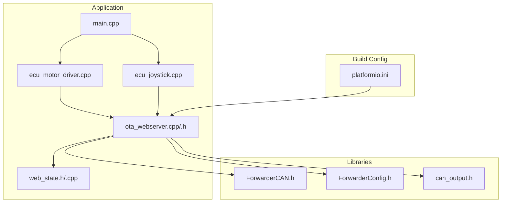
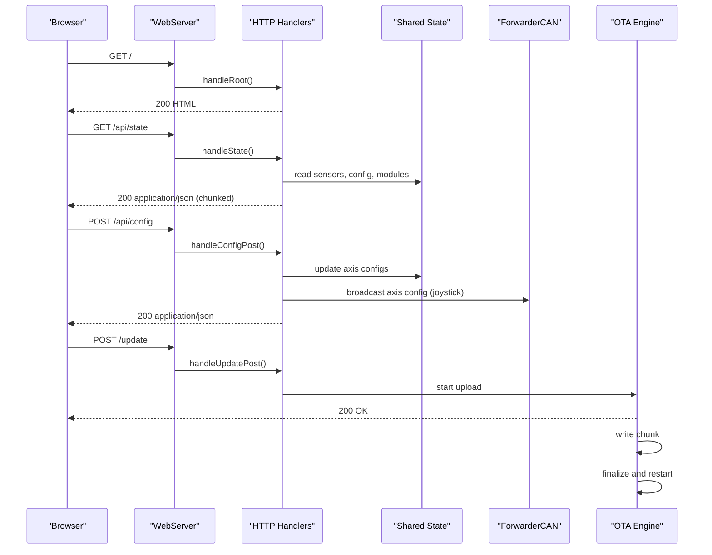
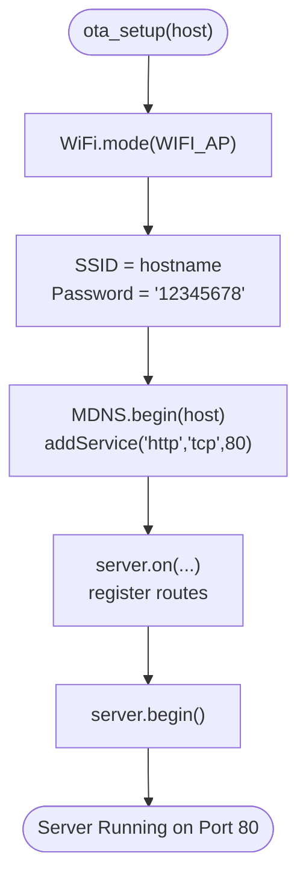
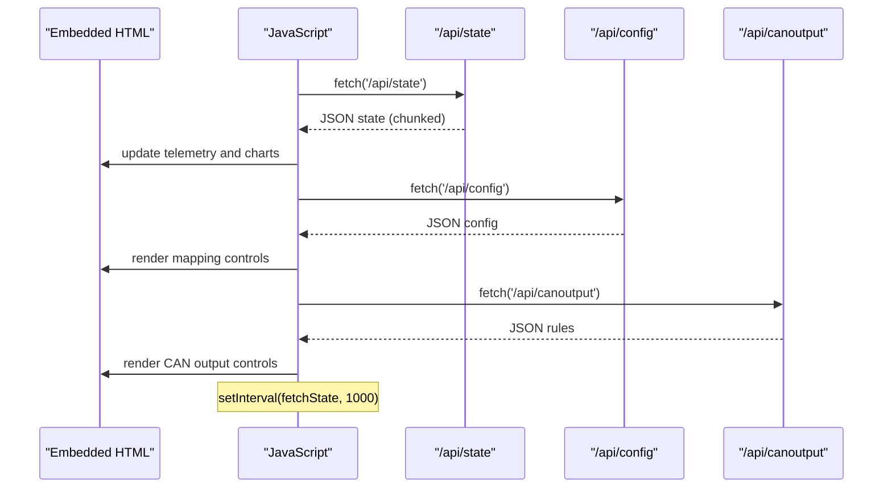
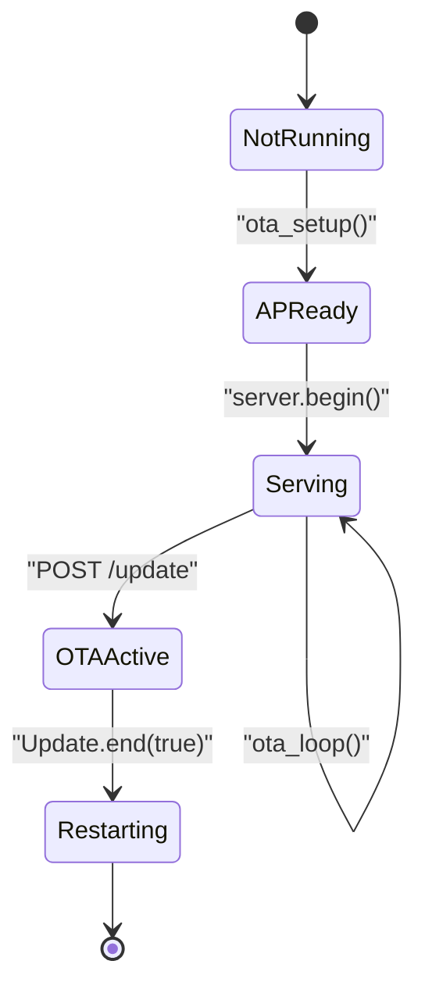
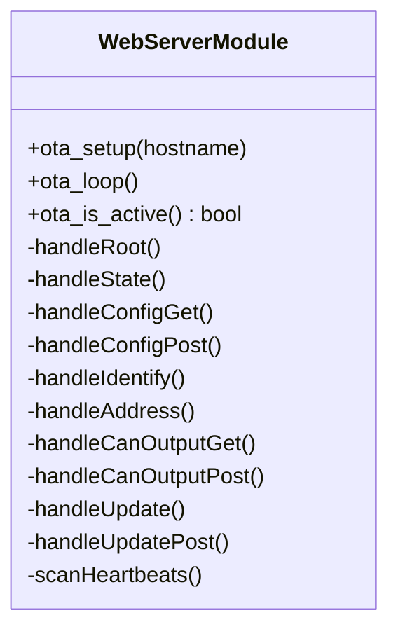
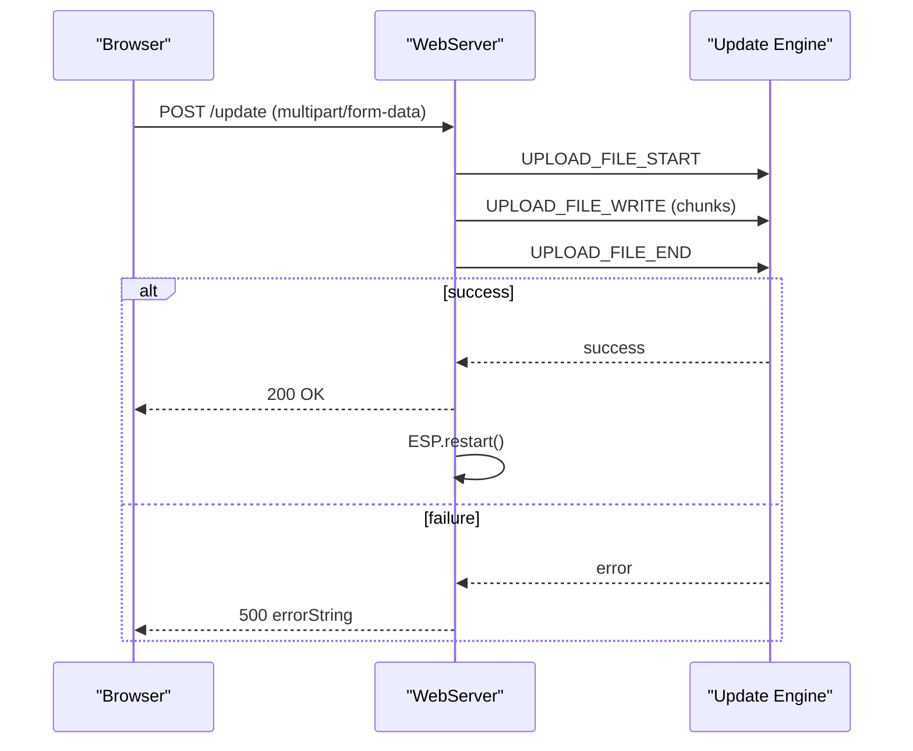
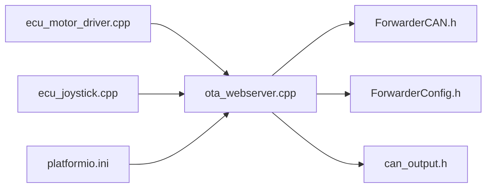

# Web Server Architecture

<cite>
**Referenced Files in This Document**
- [main.cpp](file://src/main.cpp)
- [ota_webserver.cpp](file://src/ota_webserver.cpp)
- [ota_webserver.h](file://src/ota_webserver.h)
- [web_state.cpp](file://src/web_state.cpp)
- [web_state.h](file://src/web_state.h)
- [ecu_motor_driver.cpp](file://src/ecu_motor_driver.cpp)
- [ecu_joystick.cpp](file://src/ecu_joystick.cpp)
- [platformio.ini](file://platformio.ini)
- [ForwarderCAN.h](file://lib/ForwarderCAN/ForwarderCAN.h)
- [ForwarderConfig.h](file://lib/ForwarderConfig/ForwarderConfig.h)
- [can_output.h](file://src/can_output.h)
- [README.md](file://README.md)
</cite>

## Update Summary
**Changes Made**
- Updated polling interval documentation from 200ms to 1000ms for reduced server load
- Added documentation for chunked transfer encoding and fixed-size buffer improvements
- Updated performance considerations section with memory efficiency enhancements
- Revised troubleshooting guidance for new polling interval

## Table of Contents
1. [Introduction](#introduction)
2. [Project Structure](#project-structure)
3. [Core Components](#core-components)
4. [Architecture Overview](#architecture-overview)
5. [Detailed Component Analysis](#detailed-component-analysis)
6. [Dependency Analysis](#dependency-analysis)
7. [Performance Considerations](#performance-considerations)
8. [Troubleshooting Guide](#troubleshooting-guide)
9. [Conclusion](#conclusion)
10. [Appendices](#appendices)

## Introduction
This document describes the web server architecture for the ESP32-based Forwarder CAN Controller. It focuses on the optional Wi-Fi access point-based HTTP server implemented with the ESP32 WebServer library. The server provides:
- A static HTML dashboard for real-time monitoring and configuration
- REST-like endpoints for state, configuration, and CAN output rules
- Over-The-Air (OTA) firmware update capability via multipart/form-data uploads
- mDNS service advertisement for easy discovery

The server is conditionally compiled and activated only when the build flag ENABLE_OTA_WEBSERVER is defined. It runs on port 80 and serves a single-page application implemented in embedded HTML and JavaScript.

## Project Structure
The web server implementation is encapsulated in a dedicated module with clear separation of concerns:
- Entry point and lifecycle: main.cpp delegates to ECU-specific setup/loop
- Web server module: ota_webserver.cpp/.h implement Wi-Fi AP, mDNS, routing, handlers, and OTA
- Shared state: web_state.h/.cpp expose runtime data to the UI and handlers
- ECU integration: ecu_motor_driver.cpp and ecu_joystick.cpp integrate the web server into their loops and initialize the AP with device-specific hostnames
- Build configuration: platformio.ini defines environments with and without OTA support

**Diagram sources**
- [main.cpp:19-31](file://src/main.cpp#L19-L31)
- [ecu_motor_driver.cpp:320-324](file://src/ecu_motor_driver.cpp#L320-L324)
- [ecu_joystick.cpp:187-190](file://src/ecu_joystick.cpp#L187-L190)
- [ota_webserver.cpp:766-791](file://src/ota_webserver.cpp#L766-L791)
- [web_state.h:10-23](file://src/web_state.h#L10-L23)
- [ForwarderCAN.h:66-120](file://lib/ForwarderCAN/ForwarderCAN.h#L66-L120)
- [ForwarderConfig.h:64-92](file://lib/ForwarderConfig/ForwarderConfig.h#L64-L92)
- [can_output.h:7-11](file://src/can_output.h#L7-L11)
- [platformio.ini:63-79](file://platformio.ini#L63-L79)

**Section sources**
- [main.cpp:19-31](file://src/main.cpp#L19-L31)
- [platformio.ini:63-79](file://platformio.ini#L63-L79)

## Core Components
- Web server module
  - Initializes Wi-Fi access point mode, sets up mDNS, registers HTTP routes, starts the server, and handles client requests.
  - Provides handlers for:
    - GET /: serves the static HTML page
    - GET /api/state: returns live telemetry and state using chunked transfer encoding with fixed-size buffers
    - GET /api/config: returns motor mapping configuration
    - POST /api/config: updates motor mapping configuration
    - POST /api/identify: sends an identify command to a target module
    - POST /api/address: requests a module to change its address
    - GET /api/canoutput: returns CAN-triggered GPIO output rules
    - POST /api/canoutput: updates CAN-triggered GPIO output rules
    - POST /update: handles firmware upload and triggers OTA
  - Implements a heartbeat scanner to track connected modules.
- Shared state
  - Exposes arrays and structures containing joystick sensor data, solenoid values, motor configuration, and CAN output rules to the web handlers.
- ECU integration
  - Motor driver and joystick ECUs initialize the web server during setup with device-specific hostnames derived from their CAN address.
- Build configuration
  - OTA-enabled environments define ENABLE_OTA_WEBSERVER and enable the web server module.

**Section sources**
- [ota_webserver.cpp:13-25](file://src/ota_webserver.cpp#L13-L25)
- [ota_webserver.cpp:506-737](file://src/ota_webserver.cpp#L506-L737)
- [web_state.h:10-23](file://src/web_state.h#L10-L23)
- [ecu_motor_driver.cpp:320-324](file://src/ecu_motor_driver.cpp#L320-L324)
- [ecu_joystick.cpp:187-190](file://src/ecu_joystick.cpp#L187-L190)
- [platformio.ini:63-79](file://platformio.ini#L63-L79)

## Architecture Overview
The web server architecture follows a modular design:
- Initialization
  - ECU setup initializes CAN, loads persistent configuration, and starts the web server with a hostname derived from the device's CAN address.
  - The web server sets up Wi-Fi AP mode, creates an access point, and advertises an HTTP service via mDNS.
- Routing and Handlers
  - Routes are registered for the root page and API endpoints. Each handler reads shared state and returns JSON or HTML responses.
- Client Interaction
  - The embedded HTML page uses JavaScript to poll /api/state and other endpoints at 1-second intervals, updating the UI dynamically.
  - Configuration changes are posted back to the server, which persists them and applies them immediately where applicable.
- OTA Update
  - The /update endpoint accepts multipart/form-data firmware uploads and performs the update sequence, restarting the device upon success.

**Diagram sources**
- [ota_webserver.cpp:780-789](file://src/ota_webserver.cpp#L780-L789)
- [ota_webserver.cpp:506-563](file://src/ota_webserver.cpp#L506-L563)
- [ota_webserver.cpp:587-626](file://src/ota_webserver.cpp#L587-L626)
- [ota_webserver.cpp:705-733](file://src/ota_webserver.cpp#L705-L733)
- [ecu_motor_driver.cpp:320-324](file://src/ecu_motor_driver.cpp#L320-L324)
- [ecu_joystick.cpp:187-190](file://src/ecu_joystick.cpp#L187-L190)

## Detailed Component Analysis

### Web Server Module
- Responsibilities
  - Initialize Wi-Fi AP and mDNS
  - Register HTTP routes and handlers
  - Serve static HTML and JSON APIs
  - Manage OTA firmware updates
  - Scan CAN heartbeats and maintain module registry
- Key functions
  - ota_setup(const char* hostname): configures AP, mDNS, routes, and starts server
  - ota_loop(): calls server.handleClient() and periodic tasks
  - ota_is_active(): indicates OTA transfer state
- Route registration
  - Root: GET /
  - State: GET /api/state
  - Config: GET /api/config, POST /api/config
  - Control: POST /api/identify, POST /api/address
  - CAN output: GET /api/canoutput, POST /api/canoutput
  - OTA: POST /update (multipart upload)
- Handler behaviors
  - handleRoot: returns embedded HTML
  - handleState: aggregates telemetry and module info using chunked transfer encoding with fixed-size buffers
  - handleConfigGet/handleConfigPost: serialize/deserialize motor mapping
  - handleIdentify/handleAddress: send commands to target modules
  - handleCanOutputGet/handleCanOutputPost: manage CAN-triggered GPIO rules
  - handleUpdate/handleUpdatePost: perform OTA update and restart

**Diagram sources**
- [ota_webserver.cpp:766-791](file://src/ota_webserver.cpp#L766-L791)

**Section sources**
- [ota_webserver.cpp:766-791](file://src/ota_webserver.cpp#L766-L791)
- [ota_webserver.cpp:506-737](file://src/ota_webserver.cpp#L506-L737)
- [ota_webserver.h:3-6](file://src/ota_webserver.h#L3-L6)

### Static HTML and Real-Time UI
- The embedded HTML page includes:
  - A responsive dashboard with tabs for Dashboard, Modules, Motor Mapping, CAN Output, and OTA Update
  - Real-time telemetry displays for joysticks, solenoids, and CAN statistics
  - Interactive forms for saving motor mapping and CAN output rules
  - A firmware upload form for OTA updates
- JavaScript-driven updates
  - Uses fetch() to poll /api/state, /api/config, and /api/canoutput
  - **Updated**: Polling interval is now 1000ms (1 second) to reduce server load and bandwidth usage
  - Updates DOM elements with telemetry and configuration data
  - Handles OTA progress via XMLHttpRequest onprogress

**Diagram sources**
- [ota_webserver.cpp:32-501](file://src/ota_webserver.cpp#L32-L501)
- [ota_webserver.cpp:360-497](file://src/ota_webserver.cpp#L360-L497)

**Section sources**
- [ota_webserver.cpp:32-501](file://src/ota_webserver.cpp#L32-L501)
- [ota_webserver.cpp:360-497](file://src/ota_webserver.cpp#L360-L497)

### Server Lifecycle Management
- Startup sequence
  - ECU setup initializes CAN and loads configuration
  - ota_setup(host) is called with a hostname derived from the device's CAN address
  - Wi-Fi AP is created, mDNS service is advertised, routes are registered, and server begins
- Loop integration
  - ECU loop calls ota_loop() to process HTTP requests and periodic tasks
  - OTA state is tracked to prevent conflicting operations
- Shutdown/restart
  - OTA update completion triggers ESP.restart()

**Diagram sources**
- [ecu_motor_driver.cpp:320-324](file://src/ecu_motor_driver.cpp#L320-L324)
- [ecu_joystick.cpp:187-190](file://src/ecu_joystick.cpp#L187-L190)
- [ota_webserver.cpp:766-791](file://src/ota_webserver.cpp#L766-L791)
- [ota_webserver.cpp:705-733](file://src/ota_webserver.cpp#L705-L733)

**Section sources**
- [ecu_motor_driver.cpp:320-324](file://src/ecu_motor_driver.cpp#L320-L324)
- [ecu_joystick.cpp:187-190](file://src/ecu_joystick.cpp#L187-L190)
- [ota_webserver.cpp:766-791](file://src/ota_webserver.cpp#L766-L791)
- [ota_webserver.cpp:705-733](file://src/ota_webserver.cpp#L705-L733)

### Route Registration and Handler Functions
- Route registration
  - Root: GET /
  - State: GET /api/state
  - Config: GET /api/config, POST /api/config
  - Control: POST /api/identify, POST /api/address
  - CAN output: GET /api/canoutput, POST /api/canoutput
  - OTA: POST /update (multipart upload)
- Handler responsibilities
  - handleRoot: serve embedded HTML
  - handleState: assemble telemetry and module info using chunked transfer encoding
  - handleConfigGet/handleConfigPost: serialize/deserialize motor mapping
  - handleIdentify/handleAddress: send commands to target modules
  - handleCanOutputGet/handleCanOutputPost: manage CAN-triggered GPIO rules
  - handleUpdate/handleUpdatePost: perform OTA update and restart

**Diagram sources**
- [ota_webserver.h:3-6](file://src/ota_webserver.h#L3-L6)
- [ota_webserver.cpp:506-796](file://src/ota_webserver.cpp#L506-L796)

**Section sources**
- [ota_webserver.cpp:780-789](file://src/ota_webserver.cpp#L780-L789)
- [ota_webserver.cpp:506-737](file://src/ota_webserver.cpp#L506-L737)

### Client-Server Communication Patterns
- Polling model
  - **Updated**: The UI polls /api/state every 1000ms (1 second) to keep the dashboard fresh, reducing server load and bandwidth usage
  - Additional endpoints are polled for configuration and CAN output rules
- Request/response
  - GET requests return JSON for state and configuration
  - POST requests accept JSON bodies for updates and return JSON acknowledgments
- OTA upload
  - Client sends multipart/form-data to /update
  - Server streams chunks to the Update engine and responds when complete

**Diagram sources**
- [ota_webserver.cpp:705-733](file://src/ota_webserver.cpp#L705-L733)

**Section sources**
- [ota_webserver.cpp:360-497](file://src/ota_webserver.cpp#L360-L497)
- [ota_webserver.cpp:705-733](file://src/ota_webserver.cpp#L705-L733)

## Dependency Analysis
- Internal dependencies
  - ota_webserver.cpp depends on ForwarderCAN, ForwarderConfig, and can_output for state and persistence
  - ECU modules depend on ota_webserver.h for integration
- External dependencies
  - ESP32 Arduino framework: WiFi.h, WebServer.h, Update.h, ESPmDNS.h
- Build-time selection
  - ENABLE_OTA_WEBSERVER controls compilation of the web server module
  - OTA-enabled environments extend base environments and add the flag

**Diagram sources**
- [ota_webserver.cpp:5-11](file://src/ota_webserver.cpp#L5-L11)
- [ecu_motor_driver.cpp:10-12](file://src/ecu_motor_driver.cpp#L10-L12)
- [ecu_joystick.cpp:8-9](file://src/ecu_joystick.cpp#L8-L9)
- [platformio.ini:63-79](file://platformio.ini#L63-L79)

**Section sources**
- [ota_webserver.cpp:5-11](file://src/ota_webserver.cpp#L5-L11)
- [platformio.ini:63-79](file://platformio.ini#L63-L79)

## Performance Considerations
- **Updated**: Polling interval optimization
  - The UI polls /api/state every 1000ms (1 second) instead of 200ms. This significant reduction in polling frequency dramatically reduces CPU usage and network traffic while maintaining acceptable UI responsiveness.
- **Updated**: Memory-efficient state handling
  - The handleState() function now uses chunked transfer encoding with a fixed 1024-byte buffer and snprintf() for building JSON responses, avoiding massive heap allocations and improving memory efficiency.
- Handler complexity
  - handleState iterates over potential joystick addresses and modules. Keeping the iteration bounds reasonable helps maintain responsiveness.
- OTA throughput
  - Multipart upload bandwidth is limited by Wi-Fi AP throughput. Large firmware images may take several minutes.
- Memory usage
  - The embedded HTML is stored as a static string. Consider external storage or compression for larger pages.

## Troubleshooting Guide
- Access point not appearing
  - Verify ENABLE_OTA_WEBSERVER is defined in the build environment
  - Confirm ota_setup() is called during ECU setup
- Cannot connect to AP
  - Default password is "12345678"
  - Ensure the device is powered and booted
- mDNS resolution fails
  - Confirm MDNS.begin() succeeded and service is added
  - Try connecting via IP address (192.168.4.1) if hostname resolution fails
- OTA update fails
  - Check serial output for error messages from Update.printError()
  - Ensure the uploaded file is a valid .bin
  - Retry after clearing any partial transfers
- UI does not update
  - **Updated**: Verify /api/state is reachable and returns JSON. With the 1-second polling interval, expect updates every second rather than every 200ms
  - Check browser console for fetch errors
- Configuration not persisting
  - Motor mapping and CAN output rules are saved to NVS on the device
  - Ensure POST requests to /api/config and /api/canoutput succeed

**Section sources**
- [platformio.ini:63-79](file://platformio.ini#L63-L79)
- [ota_webserver.cpp:766-791](file://src/ota_webserver.cpp#L766-L791)
- [ota_webserver.cpp:705-733](file://src/ota_webserver.cpp#L705-L733)
- [ota_webserver.cpp:506-563](file://src/ota_webserver.cpp#L506-L563)

## Conclusion
The web server module provides a lightweight, embedded HTTP interface for the Forwarder CAN Controller. It integrates seamlessly with the ECU applications, enabling real-time monitoring, configuration, and OTA updates. The design emphasizes modularity and build-time selection, allowing deployment in constrained environments without the web stack when not needed. Recent optimizations include reduced polling frequency for better resource utilization and memory-efficient state handling for improved reliability.

## Appendices

### Practical Examples

- Server startup sequence
  - ECU setup initializes CAN and loads configuration
  - ota_setup(host) is invoked with a hostname derived from the device's CAN address
  - Wi-Fi AP is created, mDNS service is advertised, routes are registered, and server begins
  - ECU loop calls ota_loop() continuously

- Route registration
  - Root: GET /
  - State: GET /api/state
  - Config: GET /api/config, POST /api/config
  - Control: POST /api/identify, POST /api/address
  - CAN output: GET /api/canoutput, POST /api/canoutput
  - OTA: POST /update (multipart upload)

- Client-server communication
  - **Updated**: The UI polls /api/state every 1000ms (1 second) instead of 200ms
  - Configuration changes are posted to /api/config and /api/canoutput
  - OTA firmware is uploaded to /update

**Section sources**
- [ecu_motor_driver.cpp:320-324](file://src/ecu_motor_driver.cpp#L320-L324)
- [ecu_joystick.cpp:187-190](file://src/ecu_joystick.cpp#L187-L190)
- [ota_webserver.cpp:780-789](file://src/ota_webserver.cpp#L780-L789)
- [ota_webserver.cpp:360-497](file://src/ota_webserver.cpp#L360-L497)
- [ota_webserver.cpp:705-733](file://src/ota_webserver.cpp#L705-L733)

### Security Considerations
- Access point credentials
  - Default Wi-Fi password is "12345678". Change this in production deployments by modifying the password passed to WiFi.softAP().
- Network isolation
  - The AP operates independently of external networks. Consider disabling OTA in production or adding authentication at the application level.
- OTA security
  - No signature verification is performed. Ensure the upload process occurs in a trusted environment.
- Hostname and mDNS
  - Hostnames are derived from device addresses. Ensure uniqueness to avoid conflicts.

**Section sources**
- [ota_webserver.cpp:768-769](file://src/ota_webserver.cpp#L768-L769)
- [ota_webserver.cpp:771-775](file://src/ota_webserver.cpp#L771-L775)

### Network Connectivity Requirements
- Wi-Fi AP mode
  - Requires ESP32 Wi-Fi capabilities
- mDNS
  - Requires ESPmDNS library and a compatible DNS responder
- OTA upload
  - Requires sufficient free flash space and a valid firmware image

**Section sources**
- [ota_webserver.cpp:5-8](file://src/ota_webserver.cpp#L5-L8)
- [platformio.ini:63-79](file://platformio.ini#L63-L79)