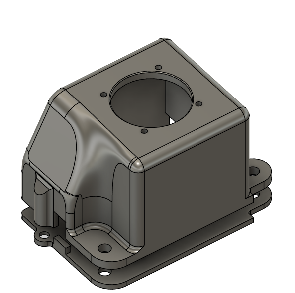
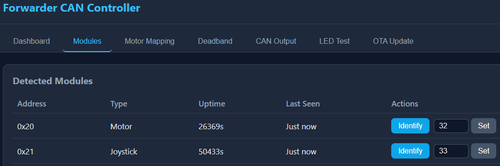
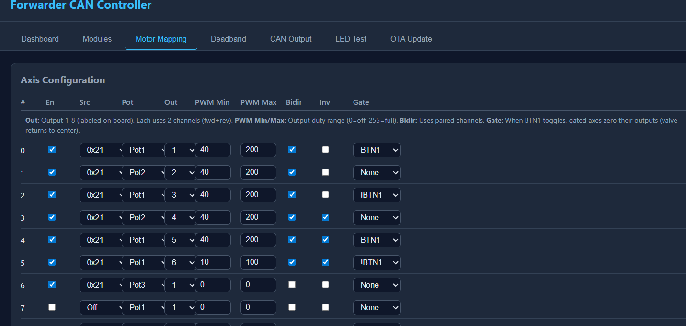
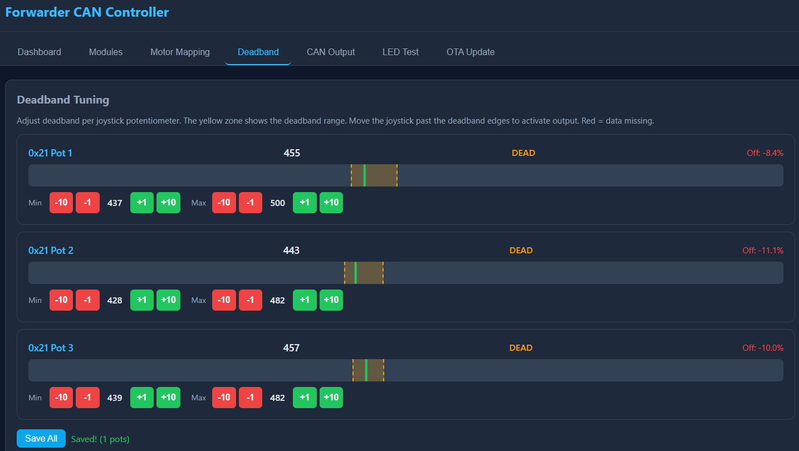
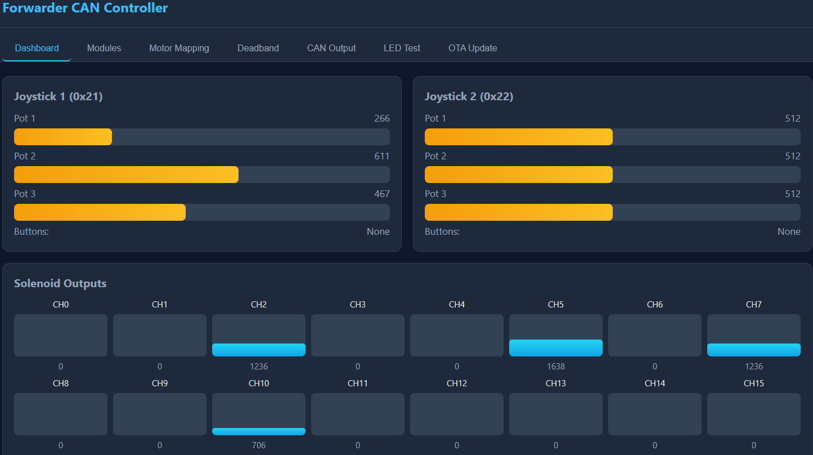

# Forwarder CAN Controller

ESP32-based CAN bus control system for a forwarder (logging machine) hydraulic valve block.
Replaces a failed factory controller with a robust, open-source solution using J1939-like addressing over 250 kbps CAN.

## Architecture

3 ECUs on a single 250 kbps CAN bus:

| ECU | Address | Role |
|-----|---------|------|
| Motor Driver | `0x20` | Controls 8 solenoids via PCA9685 PWM driver |
| Joystick 1 | `0x21` | Reads 3 pots + 2 buttons, publishes on CAN |
| Joystick 2 | `0x22` | Reads 3 pots + 2 buttons, publishes on CAN |

## Hardware

### T-CAN485 (LilyGO) - Joystick ECU

- **MCU**: ESP32 (regular, not S3) with built-in TJA1050 CAN transceiver
- **CAN pins**: TX=GPIO27, RX=GPIO26
- **Transceiver control**: GPIO16 (ME2107_EN, must be HIGH), GPIO23 (SPEED_MODE, LOW = high-speed)
- **Joystick inputs**: 3x potentiometers (GPIO32, 33, 34) + 2x buttons (GPIO12, 5)
- **Status LED**: WS2812B on GPIO18

### Motor Driver ECU

- **MCU**: LilyGO T-CAN board (ESP32 with built-in CAN transceiver)
- **Motor driver PCB**: PCA9685 I2C PWM controller with 8 MOSFET outputs

### Joystick used in this project

The joystick used for this project is this model:

- AliExpress listing: https://www.aliexpress.com/item/1005001844154962.html

#### 3rd axis wiring

For the 3rd axis on the joystick:

- **2x yellow wires**: button
- **White + red**: GND + power
- **Black**: signal

> The signal wire being black is a bit unintuitive, but that is how this joystick is wired.

### 3D printable joystick case

There is also a 3D-printable case for the joystick available in this repository.



## CAN Protocol

- **Bitrate**: 250 kbps
- **Frame format**: 29-bit extended IDs, J1939-style layout

### ID Structure

```
Bits 28-26: Priority (3 bits)
Bit 25:     Extended Data Page (0)
Bit 24:     Data Page (0)
Bits 23-16: PDU Format (PF)
Bits 15-8:  PDU Specific (PS) = Destination Address when PF < 240
Bits 7-0:   Source Address (SA)
```

### Joystick ECU Transmitted Messages (25Hz)

All messages are broadcast (PS = `0xFF`) with priority 6.

| PF | Name | Rate | Data Bytes | Description |
|----|------|------|------------|-------------|
| `0x10` | `PF_JOYSTICK_POT1` | 25Hz | 2 | Potentiometer 1 value, little-endian (10-bit, 0-1023) |
| `0x11` | `PF_JOYSTICK_POT2` | 25Hz | 2 | Potentiometer 2 value, little-endian (10-bit, 0-1023) |
| `0x12` | `PF_JOYSTICK_POT3` | 25Hz | 2 | Potentiometer 3 value, little-endian (10-bit, 0-1023) |
| `0x13` | `PF_JOYSTICK_BUTTONS` | 25Hz | 1 | Button bitmask: bit0=BTN1, bit1=BTN2 |
| `0x30` | `PF_HEARTBEAT` | 1Hz | 8 | Status/heartbeat (see below) |

#### Potentiometer Data Format

```
Byte 0: value & 0xFF        (low byte)
Byte 1: (value >> 8) & 0xFF (high byte)
```

Example: value 512 → `data[0]=0x00, data[1]=0x02`

#### Button Data Format

```
Byte 0: bitmask
  bit 0: Button 1 (0x01) - active when pressed
  bit 1: Button 2 (0x02) - active when pressed
  bits 2-7: reserved (0)
```

Example: both buttons pressed → `data[0]=0x03`

#### Heartbeat Data Format (PF `0x30`)

```
Byte 0: online flag (0x01 = address claimed, 0x00 = not claimed)
Byte 1: uptime seconds (low byte)
Byte 2: uptime seconds (high byte)
Byte 3: ECU joystick ID (1 or 2)
Byte 4: RX message count (low byte)
Byte 5: TX message count (low byte)
Byte 6-7: reserved (0)
```

### Network Management Messages

| PF | PS | Direction | Description | Payload |
|----|----|-----------|-------------|---------|
| `0xEE` | `0xFF` | Broadcast | Address Claimed | 8-byte NAME (unique ECU identifier) |
| `0xEA` | `0xFF` | Broadcast | Request Address Claimed | - |

### Messages Received by Joystick ECU

| PF | PS | Source | Description | Payload |
|----|----|--------|-------------|---------|
| `0x20` | DA or `0xFF` | Any | Set LED Color | `R, G, B` (3 bytes) |
| `0x22` | DA or `0xFF` | Any | Identify (blink LED) | `duration` (1 byte, seconds) |

### Motor Driver Messages

| PF | PS | Direction | Description | Payload |
|----|----|-----------|-------------|---------|
| `0x21` | DA | Any -> Motor | Solenoid Command | `duty0..duty7` (8 bytes, 0-255 each) |

## Pinout (T-CAN485 Joystick)

| Signal | GPIO | Notes |
|--------|------|-------|
| CAN TX | 27 | Built-in TJA1050 transceiver |
| CAN RX | 26 | Built-in TJA1050 transceiver |
| ME2107_EN | 16 | Transceiver power enable (HIGH) |
| SPEED_MODE | 23 | TJA1050 speed mode (LOW = high-speed) |
| WS2812 | 4 | Status LED |
| Pot 1 | 32 | Joystick X (analog input) |
| Pot 2 | 33 | Joystick Y (analog input) |
| Pot 3 | 34 | Joystick Z (analog input) |
| Button 1 | 12 | Active low, internal pullup |
| Button 2 | 5 | Active low, internal pullup |

## Joystick ECU LED Status Indicators

The WS2812B RGB LED on the joystick ECU provides visual status feedback:

| LED Pattern | Meaning | Condition |
|-------------|---------|----------|
| **Solid GREEN** (full brightness) | Normal operation | CAN bus online, motor ECU responding |
| **Solid RED** | Motor ECU offline | No CAN messages from motor ECU (`0x20`) for 1+ second |
| **Blinking RED** (500ms) | CAN bus broken | No CAN messages from other devices for 2+ seconds |
| **Flashing WHITE** | Identify mode | `PF_IDENTIFY` message received, lasts 3 seconds |
| **Custom RGB** | Remote command | `PF_LED_COLOR` message overrides default color |

### Detection Logic

**Priority order** (highest to lowest):
1. Identify (white flash, 3 seconds)
2. CAN bus broken (blinking red) — message timeout + TWAI hardware check
3. Motor ECU offline (solid red) — message timeout
4. Custom LED color from `PF_LED_COLOR` command
5. Default green (0, 255, 0)

**CAN Bus Broken** is detected when any of:
- No CAN messages from **other devices** for 2+ seconds (own messages filtered to avoid loopback false negatives in `TWAI_MODE_NO_ACK`)
- `TWAI_STATE_STOPPED` — TWAI driver stopped
- `TWAI_STATE_BUS_OFF` — Bus-off due to errors
- `tx_error_counter >= 127` — High transmit error count

> **Note:** In `TWAI_MODE_NO_ACK`, the ESP32 may receive its own transmitted messages (loopback). The detection filters these out by checking `sa != g_can->getAddress()` so that a disconnected CAN bus is still correctly detected.

**Motor ECU Offline** is detected when:
- No CAN messages received from source address `0x20` for more than 1 second
- Only triggers if CAN bus is NOT broken (bus check has priority)

## Building & Flashing

Install [PlatformIO](https://platformio.org/) (VS Code extension or CLI).

```bash
# Build motor driver
pio run -e motor_driver

# Build joystick 1
pio run -e joystick1

# Build joystick 2
pio run -e joystick2

# Flash motor driver
pio run -e motor_driver --target upload

# Flash joystick 1
pio run -e joystick1 --target upload
```

### OTA Updates

OTA builds include a Wi-Fi access point and web upload interface.

```bash
# Build & upload joystick 1 with OTA support
pio run -e joystick1_ota --target upload
```

After booting:
1. Connect to the AP named `forwarder-joy1-21` (or `forwarder-joy2-22`)
2. Password: `12345678`
3. Open http://192.168.4.1
4. Upload a `.bin` firmware file

### Dashboard screenshots

#### Modules overview



#### Outputs view



#### Deadband setup



#### Dashboard



To produce a `.bin` for OTA:
```bash
pio run -e joystick1
# The .bin will be in .pio/build/joystick1/firmware.bin
```

## Safety Features

- **Address claiming**: J1939-style startup arbitration ensures no address collisions
- **Solenoid timeout**: Motor driver shuts off all solenoids if no CAN command received within 500 ms
- **Bus-off recovery**: Automatic TWAI recovery on CAN errors
- **Heartbeat**: All ECUs broadcast status every 1 second

## Project Structure

```
forwarderke/
├── lib/
│   └── ForwarderCAN/         # Shared CAN/J1939 library
├── src/
│   ├── main.cpp              # Entry point (build flag selects ECU type)
│   ├── ecu_motor_driver.cpp  # Motor driver logic
│   ├── ecu_joystick.cpp      # Joystick logic
│   ├── ota_webserver.cpp     # Optional Wi-Fi OTA web UI
│   └── *.h                   # Headers
├── platformio.ini            # Build environments
└── README.md                 # This file
```

## License

MIT
